# Tutorial Completo de Git para Físicos Programadores

## Tabla de Contenidos
- [Nivel Básico](#nivel-básico)
- [Nivel Intermedio](#nivel-intermedio)
- [Nivel Avanzado](#nivel-avanzado)

---

# Nivel Básico

## ¿Qué es Git?

Git es un sistema de control de versiones distribuido. Piensa en él como un sistema que registra "snapshots" del estado de tu proyecto en el tiempo, similar a cómo en física registramos el estado de un sistema en diferentes instantes t₀, t₁, t₂...

```mermaid
graph LR
    subgraph "Línea temporal del proyecto"
        C1((t₀)) --> C2((t₁)) --> C3((t₂)) --> C4((t₃))
    end
    
    C1 -.- S1[Estado inicial]
    C2 -.- S2[Añadido módulo SSH]
    C3 -.- S3[Fix bug conexión]
    C4 -.- S4[Nueva feature API]
```



## Arquitectura de Git: Las Tres Áreas

Git maneja tres áreas principales que debes entender:

```mermaid
graph LR
    subgraph "Tu Máquina Local"
        WD[Working Directory<br/>Directorio de Trabajo] -->|git add| SA[Staging Area<br/>Área de Preparación]
        SA -->|git commit| LR[Local Repository<br/>Repositorio Local]
    end
    
    LR -->|git push| RR[Remote Repository<br/>Repositorio Remoto]
    RR -->|git pull/fetch| LR
    
    style WD fill:#e1f5fe
    style SA fill:#fff9c4
    style LR fill:#c8e6c9
    style RR fill:#ffccbc
```



| Área | Descripción | Analogía Física |
|------|-------------|-----------------|
| Working Directory | Donde editas archivos | Sistema en estado presente |
| Staging Area | Preparas cambios para commit | Selección de observables a medir |
| Local Repository | Historial completo local | Registro de mediciones |
| Remote Repository | Repositorio en servidor | Publicación de resultados |

## Configuración Inicial

```bash
# Configurar identidad (obligatorio)
git config --global user.name "Flou"
git config --global user.email "flou@hitss.com"

# Configuraciones útiles
git config --global init.defaultBranch main
git config --global core.editor "code --wait"  # VS Code como editor
git config --global color.ui auto

# Ver configuración
git config --list
```

## Comandos Básicos

### Inicializar un Repositorio

```bash
# Crear nuevo repositorio
mkdir netcli-project
cd netcli-project
git init

# O clonar uno existente
git clone https://github.com/usuario/network-automation.git
```

### Flujo de Trabajo Básico


### Comandos del Flujo Básico

```bash
# Ver estado actual
git status

# Añadir archivos al staging
git add archivo.py                 # Un archivo específico
git add src/                       # Un directorio completo
git add .                          # Todo el directorio actual
git add -A                         # Todos los cambios del repo
git add *.py                       # Todos los .py

# Hacer commit
git commit -m "feat: añadir parser de configuración Nokia"

# Ver historial
git log                            # Historial completo
git log --oneline                  # Versión compacta
git log --oneline --graph          # Con visualización de ramas
git log -n 5                       # Últimos 5 commits

# Subir cambios al remoto
git push origin main
```

### Estados de los Archivos


### Ver Diferencias

```bash
# Diferencias en working directory (no staged)
git diff

# Diferencias en staging area
git diff --staged

# Diferencias entre commits
git diff abc123 def456

# Diferencias de un archivo específico
git diff HEAD~2 -- nornir_config.py
```

## Ejemplo Práctico Básico: Proyecto de Automatización

```bash
# Crear estructura del proyecto
mkdir network-validator && cd network-validator
git init

# Crear archivos iniciales
cat > main.py << 'EOF'
#!/usr/bin/env python3
"""Network Validator - CLI para validación de red."""
from nornir import InitNornir

def main():
    nr = InitNornir(config_file="config.yaml")
    print(f"Hosts cargados: {len(nr.inventory.hosts)}")

if __name__ == "__main__":
    main()
EOF

cat > .gitignore << 'EOF'
__pycache__/
*.pyc
.env
venv/
*.log
.nornir.log
EOF

# Primer commit
git add .
git status
git commit -m "init: estructura inicial del proyecto network-validator"

# Verificar
git log --oneline
```

---

# Nivel Intermedio

## Branching (Ramificación)

Las ramas son como universos paralelos de tu código. Cada rama es una línea temporal independiente.


### Comandos de Branching

```bash
# Listar ramas
git branch                    # Ramas locales
git branch -r                 # Ramas remotas
git branch -a                 # Todas las ramas

# Crear rama
git branch feature/mpls-validation

# Cambiar de rama
git checkout feature/mpls-validation
# O en versiones modernas:
git switch feature/mpls-validation

# Crear y cambiar en un solo comando
git checkout -b feature/nokia-srlinux
# O:
git switch -c feature/nokia-srlinux

# Eliminar rama
git branch -d feature/completed      # Solo si está mergeada
git branch -D feature/abandoned      # Forzar eliminación
```

## Merging (Fusión)

### Tipos de Merge

```mermaid
graph TB
    subgraph "Fast-Forward Merge"
        A1((A)) --> B1((B)) --> C1((C))
        C1 -.->|main antes| X1[ ]
        C1 -->|main después| D1((D))
    end
    
    subgraph "3-Way Merge"
        A2((A)) --> B2((B))
        B2 --> C2((C))
        B2 --> D2((D))
        C2 --> E2((E))
        D2 --> E2
        E2 -.- M2[Merge Commit]
    end
```



### Fast-Forward Merge

Ocurre cuando la rama destino no ha avanzado desde que se creó la rama feature.

```bash
# En main, sin nuevos commits desde que se creó feature
git checkout main
git merge feature/simple-fix
# Resultado: main simplemente avanza al último commit de feature
```

### 3-Way Merge

Cuando ambas ramas tienen commits nuevos.

```bash
git checkout main
git merge feature/nokia-parser

# Si hay conflictos:
# 1. Git marca los archivos en conflicto
# 2. Editas manualmente para resolver
# 3. git add <archivos-resueltos>
# 4. git commit
```

## Resolución de Conflictos

```mermaid
flowchart TD
    A[git merge feature] --> B{¿Conflictos?}
    B -->|No| C[Merge automático ✓]
    B -->|Sí| D[Git marca archivos]
    D --> E[Editar archivos manualmente]
    E --> F[git add archivos-resueltos]
    F --> G[git commit]
    G --> H[Merge completado ✓]
    
    D --> I[git merge --abort]
    I --> J[Cancelar merge]
```



### Anatomía de un Conflicto

```python
# Archivo con conflicto
def get_device_info(host):
<<<<<<< HEAD
    """Obtiene info usando NETCONF."""
    return netconf_get(host)
=======
    """Obtiene info usando SSH con Nornir."""
    return nr.run(task=netmiko_send_command, command="show version")
>>>>>>> feature/nornir-integration
```

```bash
# Resolver conflicto editando el archivo
def get_device_info(host, method="netconf"):
    """Obtiene info del dispositivo."""
    if method == "netconf":
        return netconf_get(host)
    return nr.run(task=netmiko_send_command, command="show version")

# Marcar como resuelto
git add device_utils.py
git commit -m "merge: integrar nornir manteniendo soporte netconf"
```

## Working with Remotes


### Comandos de Remotos

```bash
# Ver remotos configurados
git remote -v

# Añadir remoto
git remote add origin https://github.com/hitss/netcli.git
git remote add upstream https://github.com/original/netcli.git

# Obtener cambios sin merge
git fetch origin
git fetch --all

# Obtener y mergear
git pull origin main

# Enviar cambios
git push origin feature/nueva-validacion

# Enviar nueva rama
git push -u origin feature/nokia-support  # -u establece tracking
```

## Stashing (Guardado Temporal)

Útil cuando necesitas cambiar de rama pero tienes cambios sin commitear.


```bash
# Guardar cambios temporalmente
git stash
git stash push -m "WIP: parser nokia incompleto"

# Ver stashes guardados
git stash list

# Recuperar último stash
git stash pop                    # Aplica y elimina
git stash apply                  # Aplica sin eliminar

# Recuperar stash específico
git stash apply stash@{2}

# Eliminar stash
git stash drop stash@{0}
git stash clear                  # Eliminar todos
```

## Tags (Etiquetas)

Para marcar versiones o releases.

```bash
# Crear tag ligero
git tag v1.0.0

# Crear tag anotado (recomendado)
git tag -a v1.0.0 -m "Release 1.0.0: Soporte Nokia SR Linux"

# Tag en commit específico
git tag -a v0.9.0 abc1234 -m "Beta release"

# Listar tags
git tag
git tag -l "v1.*"

# Ver info de tag
git show v1.0.0

# Subir tags al remoto
git push origin v1.0.0
git push origin --tags           # Todos los tags
```

## Ejemplo Práctico Intermedio: Feature Branch Workflow

```bash
# 1. Actualizar main
git checkout main
git pull origin main

# 2. Crear rama para nueva feature
git checkout -b feature/claro-inventory-plugin

# 3. Desarrollar
cat > inventory_plugin.py << 'EOF'
"""Custom inventory plugin para red Claro."""
from nornir.core.inventory import Inventory

class ClaroInventoryPlugin:
    def load(self):
        # Cargar desde CMDB interna
        hosts = self._fetch_from_cmdb()
        return Inventory(hosts=hosts)
    
    def _fetch_from_cmdb(self):
        # Implementación
        pass
EOF

git add inventory_plugin.py
git commit -m "feat(inventory): plugin base para CMDB Claro"

# 4. Más desarrollo...
cat > tests/test_inventory.py << 'EOF'
import pytest
from inventory_plugin import ClaroInventoryPlugin

def test_plugin_loads():
    plugin = ClaroInventoryPlugin()
    assert plugin is not None
EOF

git add tests/
git commit -m "test(inventory): tests unitarios del plugin"

# 5. Mientras tanto, surge un hotfix urgente
git stash push -m "WIP: inventory plugin incompleto"
git checkout main
git checkout -b hotfix/connection-timeout

# 6. Aplicar hotfix
echo "CONNECTION_TIMEOUT = 60" >> config.py
git add config.py
git commit -m "fix: aumentar timeout de conexión a 60s"
git checkout main
git merge hotfix/connection-timeout
git push origin main
git branch -d hotfix/connection-timeout

# 7. Volver a feature
git checkout feature/claro-inventory-plugin
git stash pop

# 8. Continuar desarrollo y finalizar
git add .
git commit -m "feat(inventory): implementación completa del plugin"

# 9. Merge a main
git checkout main
git merge feature/claro-inventory-plugin
git push origin main
git branch -d feature/claro-inventory-plugin
```

---

# Nivel Avanzado

## Rebasing

Rebase reescribe la historia moviendo commits a una nueva base. Es como "trasplantar" tus commits.


Después de `git rebase main` en feature:


### Rebase vs Merge


### Comandos de Rebase

```bash
# Rebase básico
git checkout feature/parser
git rebase main

# Si hay conflictos durante rebase
git status                       # Ver archivos en conflicto
# Resolver conflictos...
git add <archivos>
git rebase --continue

# Abortar rebase
git rebase --abort

# Rebase interactivo (potente!)
git rebase -i HEAD~4             # Últimos 4 commits
git rebase -i main               # Desde que divergió de main
```

### Rebase Interactivo

```bash
git rebase -i HEAD~4

# Se abre editor con:
pick abc1234 feat: añadir conexión SSH
pick def5678 fix: typo en conexión
pick ghi9012 feat: añadir conexión NETCONF
pick jkl3456 docs: actualizar README

# Opciones:
# pick   = usar commit tal cual
# reword = usar commit, editar mensaje
# edit   = usar commit, pausar para editar
# squash = fusionar con commit anterior
# fixup  = como squash, descartando mensaje
# drop   = eliminar commit

# Ejemplo: combinar fix con feat anterior
pick abc1234 feat: añadir conexión SSH
fixup def5678 fix: typo en conexión
pick ghi9012 feat: añadir conexión NETCONF
pick jkl3456 docs: actualizar README
```

## Cherry-Pick

Aplicar commits específicos de otra rama.

```mermaid
gitGraph
    commit id: "A"
    commit id: "B"
    branch feature
    checkout feature
    commit id: "C" type: HIGHLIGHT
    commit id: "D"
    checkout main
    commit id: "E"
    cherry-pick id: "C'"
```

```bash
# Aplicar un commit específico
git cherry-pick abc1234

# Aplicar varios commits
git cherry-pick abc1234 def5678

# Aplicar rango de commits
git cherry-pick abc1234^..def5678

# Cherry-pick sin commit automático
git cherry-pick -n abc1234

# Si hay conflictos
git cherry-pick --continue
git cherry-pick --abort
```

## Reset vs Revert


### Reset (Modifica historia - usar con cuidado)

```bash
# Tipos de reset
git reset --soft HEAD~1      # Mueve HEAD, mantiene staging y working
git reset --mixed HEAD~1     # Mueve HEAD, limpia staging, mantiene working
git reset --hard HEAD~1      # Mueve HEAD, limpia todo (¡PELIGROSO!)

# Reset de archivo específico
git reset HEAD -- archivo.py
```

### Revert (Seguro para historia compartida)

```bash
# Revertir último commit
git revert HEAD

# Revertir commit específico
git revert abc1234

# Revertir sin commit automático
git revert -n abc1234

# Revertir rango
git revert HEAD~3..HEAD
```

## Reflog (Tu red de seguridad)

Git guarda un log de todas las operaciones que mueven HEAD.

```bash
# Ver reflog
git reflog

# Ejemplo de output:
# abc1234 HEAD@{0}: commit: feat: nuevo parser
# def5678 HEAD@{1}: checkout: moving from main to feature
# ghi9012 HEAD@{2}: reset: moving to HEAD~2
# jkl3456 HEAD@{3}: commit: feat: código que "perdí"

# Recuperar commit "perdido"
git checkout jkl3456
# O crear rama desde él
git branch recovered-feature jkl3456
```

## Git Hooks

Scripts que se ejecutan automáticamente en eventos de Git.


### Configurar Hooks

```bash
# Los hooks están en .git/hooks/
ls .git/hooks/

# Crear pre-commit hook
cat > .git/hooks/pre-commit << 'EOF'
#!/bin/bash
# Pre-commit hook: Ejecutar linters antes de commit

echo "🔍 Ejecutando validaciones pre-commit..."

# Verificar sintaxis Python
python -m py_compile $(git diff --cached --name-only --diff-filter=ACM | grep '\.py$')
if [ $? -ne 0 ]; then
    echo "❌ Error de sintaxis Python"
    exit 1
fi

# Ejecutar black (formatter)
black --check $(git diff --cached --name-only --diff-filter=ACM | grep '\.py$')
if [ $? -ne 0 ]; then
    echo "❌ Código no formateado. Ejecuta: black ."
    exit 1
fi

# Ejecutar pylint
pylint --fail-under=8.0 $(git diff --cached --name-only --diff-filter=ACM | grep '\.py$')
if [ $? -ne 0 ]; then
    echo "❌ Score de pylint menor a 8.0"
    exit 1
fi

echo "✅ Todas las validaciones pasaron"
exit 0
EOF

chmod +x .git/hooks/pre-commit
```

### Commit-msg Hook para Conventional Commits

```bash
cat > .git/hooks/commit-msg << 'EOF'
#!/bin/bash
# Validar formato de Conventional Commits

commit_msg=$(cat "$1")
pattern="^(feat|fix|docs|style|refactor|test|chore|perf|ci|build|revert)(\(.+\))?: .{1,50}"

if ! [[ $commit_msg =~ $pattern ]]; then
    echo "❌ Mensaje de commit inválido"
    echo ""
    echo "Formato requerido: <type>(<scope>): <description>"
    echo ""
    echo "Tipos válidos: feat, fix, docs, style, refactor, test, chore, perf, ci, build, revert"
    echo ""
    echo "Ejemplos:"
    echo "  feat(parser): añadir soporte Nokia SR Linux"
    echo "  fix(connection): resolver timeout en SSH"
    echo "  docs: actualizar README con ejemplos"
    exit 1
fi

exit 0
EOF

chmod +x .git/hooks/commit-msg
```

## Git Worktrees

Múltiples working directories del mismo repositorio.


```bash
# Crear worktree para otra rama
git worktree add ../netcli-nokia feature/nokia-support

# Crear worktree con nueva rama
git worktree add -b hotfix/urgent ../netcli-hotfix main

# Listar worktrees
git worktree list

# Eliminar worktree
git worktree remove ../netcli-hotfix

# Útil para:
# - Trabajar en hotfix mientras tienes cambios en feature
# - Comparar comportamiento entre ramas
# - Ejecutar tests en una rama mientras desarrollas en otra
```

## Bisect (Búsqueda Binaria de Bugs)

Encuentra qué commit introdujo un bug usando búsqueda binaria.

```mermaid
graph LR
    A((A)) --> B((B)) --> C((C)) --> D((D)) --> E((E)) --> F((F)) --> G((G)) --> H((H))
    
    A -.- OK1[✓ Good]
    H -.- BAD1[✗ Bad]
    
    D -.- T1[Test 1]
    
    style A fill:#c8e6c9
    style H fill:#ffcdd2
    style D fill:#fff9c4
```



```bash
# Iniciar bisect
git bisect start

# Marcar commit actual como malo (tiene el bug)
git bisect bad

# Marcar commit bueno conocido
git bisect good v1.0.0

# Git checkout al punto medio
# Probar si el bug existe...

# Si tiene bug:
git bisect bad

# Si no tiene bug:
git bisect good

# Git continúa hasta encontrar el commit culpable
# Bisecting: X revisions left to test after this

# Al terminar
git bisect reset

# Bisect automatizado con script
git bisect start HEAD v1.0.0
git bisect run python -m pytest tests/test_connection.py
```

## Workflows Avanzados

### Git Flow


### Trunk-Based Development


## Aliases Útiles

```bash
# Configurar aliases
git config --global alias.st "status -sb"
git config --global alias.co "checkout"
git config --global alias.br "branch"
git config --global alias.ci "commit"
git config --global alias.unstage "reset HEAD --"
git config --global alias.last "log -1 HEAD"
git config --global alias.visual "log --oneline --graph --all"
git config --global alias.amend "commit --amend --no-edit"

# Alias para log bonito
git config --global alias.lg "log --color --graph --pretty=format:'%Cred%h%Creset -%C(yellow)%d%Creset %s %Cgreen(%cr) %C(bold blue)<%an>%Creset' --abbrev-commit"

# Alias para diff de staging
git config --global alias.staged "diff --cached"

# Uso
git st
git lg
git visual
```

## Ejemplo Práctico Avanzado: Release con Git Flow

```bash
# 1. Setup inicial
git checkout main
git checkout -b develop

# 2. Desarrollar feature
git checkout -b feature/mpls-l3vpn develop

# Desarrollo completo...
cat > mpls_validator.py << 'EOF'
"""Validador MPLS L3VPN para equipos Nokia y Cisco."""

class MPLSL3VPNValidator:
    def validate_vrf(self, device, vrf_name):
        """Valida configuración VRF."""
        pass
    
    def validate_bgp_peering(self, device):
        """Valida peering BGP para L3VPN."""
        pass
    
    def validate_mpls_labels(self, device):
        """Valida distribución de labels MPLS."""
        pass
EOF

git add .
git commit -m "feat(mpls): validador L3VPN completo"

# Más commits...
git commit -m "test(mpls): tests unitarios validador L3VPN"
git commit -m "docs(mpls): documentación del módulo"

# 3. Limpiar historia antes de merge
git rebase -i develop
# Squash commits de documentación menor, reword si es necesario

# 4. Merge a develop
git checkout develop
git merge --no-ff feature/mpls-l3vpn -m "feat: integrar validador MPLS L3VPN (#123)"
git branch -d feature/mpls-l3vpn

# 5. Preparar release
git checkout -b release/2.0.0 develop

# Actualizar versión
echo '__version__ = "2.0.0"' > __version__.py
git add __version__.py
git commit -m "chore: bump version to 2.0.0"

# Testing final, fix de último momento
git commit -m "fix: ajustar timeout para equipos legacy"

# 6. Finalizar release
git checkout main
git merge --no-ff release/2.0.0 -m "release: v2.0.0"
git tag -a v2.0.0 -m "Release 2.0.0: Soporte MPLS L3VPN"

git checkout develop
git merge --no-ff release/2.0.0 -m "chore: merge release 2.0.0 back to develop"

git branch -d release/2.0.0

# 7. Push todo
git push origin main develop --tags

# 8. Hotfix urgente (si surge)
git checkout -b hotfix/2.0.1 main
git commit -m "fix: critical bug en validación VRF"
echo '__version__ = "2.0.1"' > __version__.py
git commit -am "chore: bump version to 2.0.1"

git checkout main
git merge --no-ff hotfix/2.0.1 -m "hotfix: v2.0.1"
git tag -a v2.0.1 -m "Hotfix 2.0.1: Fix validación VRF"

git checkout develop
git merge --no-ff hotfix/2.0.1

git branch -d hotfix/2.0.1
git push origin main develop --tags
```

## Comandos de Emergencia (Rescue Commands)

```bash
# "Perdí mis commits después de un reset"
git reflog
git checkout <hash-del-commit-perdido>
git branch recovered <hash>

# "Necesito deshacer el último commit pero mantener cambios"
git reset --soft HEAD~1

# "Commit en la rama equivocada"
git checkout rama-correcta
git cherry-pick <hash-del-commit>
git checkout rama-equivocada
git reset --hard HEAD~1

# "Necesito cambiar el mensaje del último commit"
git commit --amend -m "nuevo mensaje"

# "Olvidé añadir un archivo al último commit"
git add archivo-olvidado.py
git commit --amend --no-edit

# "Merge fue un desastre, quiero volver atrás"
git merge --abort          # Durante merge
git reset --hard ORIG_HEAD # Después de merge

# "Rebase salió mal"
git rebase --abort

# "Quiero ver qué tenía un archivo hace 5 commits"
git show HEAD~5:path/to/file.py

# "Quiero recuperar un archivo específico de otro commit"
git checkout abc1234 -- path/to/file.py
```

---

## Resumen Visual Completo

```mermaid
mindmap
    root((Git))
        Básico
            init/clone
            add/commit
            status/log
            push/pull
        Intermedio
            Branching
                branch
                checkout/switch
                merge
            Remotes
                remote
                fetch
                pull
            Stash
            Tags
        Avanzado
            Rebase
                Interactive
                Onto
            Cherry-pick
            Reset/Revert
            Reflog
            Bisect
            Hooks
            Worktrees
            Workflows
                Git Flow
                Trunk-based
```



---

## Referencias Útiles

- [Pro Git Book](https://git-scm.com/book/en/v2) - Libro oficial gratuito
- [Git Cheat Sheet](https://education.github.com/git-cheat-sheet-education.pdf)
- [Conventional Commits](https://www.conventionalcommits.org/)
- [Git Flow](https://nvie.com/posts/a-successful-git-branching-model/)
- [Learn Git Branching](https://learngitbranching.js.org/) - Tutorial interactivo

---

*Tutorial creado para el equipo NETCLI - Hitss Perú*
