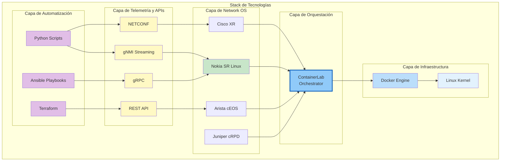
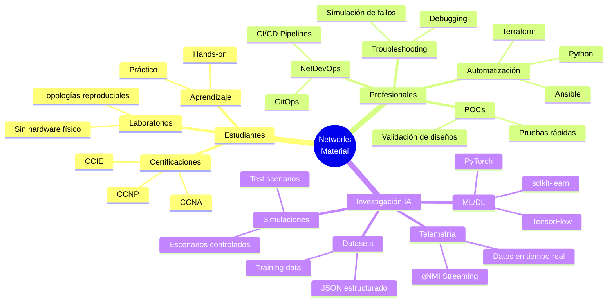

# Networks - Guía Completa de Redes

## Descripción General

Este directorio contiene material completo de networking, desde conceptos fundamentales hasta implementaciones avanzadas con MPLS y VPNs. El contenido está diseñado para estudiantes y profesionales que buscan dominar tecnologías de redes modernas, con énfasis especial en automatización e integración con IA.

## Estructura del Directorio

```
networks/
├── README.md                    # Este archivo
├── containerlab.md              # Tutorial completo de Containerlab
├── layer_2_3_v1.md             # Fundamentos Layer 2 y 3
├── layer_2_3_v2.md             # Topologías Layer 2/3 avanzadas
├── layer_3_v1.md               # Routing Layer 3
├── mpls_vpn_v1.md              # MPLS L3VPN con VRF
└── labs/                        # Laboratorios prácticos
    ├── README.md                # Guía de laboratorios
    ├── basic/                   # Lab básico 2 routers
    └── r1-r2-r3/               # Lab 3 routers en serie
```

## Contenido de Materiales

### 📘 [containerlab.md](containerlab.md)
**Tutorial Completo de Containerlab - De Básico a Avanzado**

Tutorial exhaustivo sobre Containerlab para simulación de redes con contenedores Docker.

**Contenido:**
- **Nivel Básico:**
  - Introducción y conceptos fundamentales
  - Instalación y configuración
  - Primera topología
  - Comandos esenciales
  - Configuración por CLI

- **Nivel Intermedio:**
  - Topologías complejas
  - Tipos de nodos (Nokia, Arista, Cisco, Juniper)
  - Startup configs
  - Routing protocols (OSPF, BGP)
  - Troubleshooting básico

- **Nivel Avanzado:**
  - MPLS L3VPN
  - Telemetría y monitoreo (gNMI, gRPC)
  - Integración con Python
  - Automation y APIs
  - Escenarios para demo de IA

**Ideal para:** Ingenieros que quieren implementar laboratorios de red sin hardware físico.

---

### 📗 [layer_2_3_v1.md](layer_2_3_v1.md)
**Topología de Red - Router Inter-VLAN con Segmentación Departamental**

Implementación de diseño básico de dos segmentos LAN conectados mediante router Layer 3.

**Contenido:**
- Componentes principales (Router L3, PCs)
- Arquitectura de segmentación de red
- Protocolos Layer 2 (Ethernet II, ARP)
- Protocolos Layer 3 (IPv4, ICMP, routing estático)
- Configuración de gateway centralizado
- Flujo de tráfico inter-red

**Tecnologías cubiertas:**
- Routing inter-red básico
- Gateway predeterminado
- Subnetting y direccionamiento IPv4 privado (RFC 1918)

**Ideal para:** Preparación para certificaciones CCNA, fundamentos de routing.

---

### 📗 [layer_2_3_v2.md](layer_2_3_v2.md)
**Topologías Layer 2/3 Avanzadas**

Versión avanzada con conceptos adicionales de diseño de redes.

**Ideal para:** Expandir conocimientos más allá de topologías básicas.

---

### 📙 [layer_3_v1.md](layer_3_v1.md)
**Routing Layer 3**

Enfoque dedicado a routing de Capa 3, protocolos de enrutamiento y diseño de red.

**Contenido:**
- Routing estático vs dinámico
- Protocolos de enrutamiento (RIP, OSPF, EIGRP, BGP)
- Métricas de routing
- Tablas de enrutamiento

**Ideal para:** Dominar conceptos de routing IP.

---

### 📕 [mpls_vpn_v1.md](mpls_vpn_v1.md)
**MPLS L3VPN con VRF (Virtual Routing and Forwarding)**

Arquitectura completa de Service Provider con MPLS VPNs.

**Contenido:**
- **Componentes:**
  - CPE (Customer Premises Equipment)
  - PE (Provider Edge Routers)
  - P (Provider Core Router)
  - VRF (Virtual Routing and Forwarding)

- **Protocolos:**
  - MPLS label switching
  - MP-BGP (Multiprotocol BGP) con VPNv4
  - OSPF como IGP del core
  - Route Distinguishers (RD)
  - Route Targets (RT)

- **Características clave:**
  - Separación lógica de clientes con VRFs
  - IPs superpuestas (overlapping IPs)
  - Aislamiento de tráfico
  - Escalabilidad para múltiples clientes

**Ideal para:** Ingenieros de Service Providers, preparación para CCNP/CCIE Service Provider.

---

## Laboratorios Prácticos

Los laboratorios utilizan **ContainerLab** con **Nokia SR Linux** para crear topologías reproducibles y eficientes.

Consulta [labs/README.md](labs/README.md) para la guía completa de laboratorios.

### Laboratorios Disponibles

| Lab | Descripción | Complejidad | Tecnologías |
|-----|-------------|-------------|-------------|
| [basic](labs/basic/) | 2 routers punto a punto | Básico | IPv4, conectividad L3, SR Linux |
| [r1-r2-r3](labs/r1-r2-r3/) | 3 routers en serie | Intermedio | Routing estático, loopbacks, JSON config |

---

## Tecnologías y Plataformas



### ContainerLab
- **Orquestador de laboratorios** de red basado en contenedores
- **Deploy ultrarrápido:** Segundos vs minutos con VMs
- **Soporte multivendor:** Nokia, Arista, Cisco, Juniper, FRRouting
- **Infraestructura como código:** Definición de topologías en YAML
- **Reproducible:** Mismo lab en cualquier máquina

### Nokia SR Linux
- **Network OS moderno** basado en Linux
- **APIs programáticas nativas:** REST, NETCONF, gNMI, gRPC
- **Modelo de datos YANG** estándar y bien documentado
- **Telemetría streaming:** gRPC con subscripciones
- **Ideal para automatización:** Python, Ansible, Terraform
- **Gratuito para labs:** Sin restricciones de licencia

---

## Roadmap de Aprendizaje Recomendado

```mermaid
graph TB
    START[Inicio] --> WEEK1

    subgraph "Fase 1: Fundamentos<br/>(Semanas 1-2)"
        WEEK1[📚 Leer layer_2_3_v1.md]
        WEEK2[🔧 Entender routing básico]
        WEEK3[🧪 Completar lab basic/]
        WEEK1 --> WEEK2
        WEEK2 --> WEEK3
    end

    subgraph "Fase 2: ContainerLab<br/>(Semanas 3-4)"
        WEEK4[📚 Leer containerlab.md<br/>Nivel Básico + Intermedio]
        WEEK5[🧪 Completar lab r1-r2-r3/]
        WEEK6[🔨 Experimentar con topologías<br/>personalizadas]
        WEEK4 --> WEEK5
        WEEK5 --> WEEK6
    end

    subgraph "Fase 3: Routing Avanzado<br/>(Semanas 5-6)"
        WEEK7[📚 Leer layer_3_v1.md]
        WEEK8[🔧 Configurar OSPF]
        WEEK9[🔧 Configurar BGP básico]
        WEEK10[🧪 Crear topologías 5+ routers]
        WEEK7 --> WEEK8
        WEEK8 --> WEEK9
        WEEK9 --> WEEK10
    end

    subgraph "Fase 4: MPLS y VPNs<br/>(Semanas 7-8)"
        WEEK11[📚 Leer mpls_vpn_v1.md]
        WEEK12[🔧 Implementar MPLS L3VPN]
        WEEK13[🔧 Configurar MP-BGP]
        WEEK14[🧪 Crear múltiples VRFs]
        WEEK11 --> WEEK12
        WEEK12 --> WEEK13
        WEEK13 --> WEEK14
    end

    subgraph "Fase 5: Automatización e IA<br/>(Semanas 9-10)"
        WEEK15[📚 Leer containerlab.md<br/>Nivel Avanzado]
        WEEK16[🐍 Integración con Python]
        WEEK17[📊 Configurar telemetría<br/>gNMI, gRPC]
        WEEK18[🤖 Recolectar datos para<br/>modelos de IA]
        WEEK15 --> WEEK16
        WEEK16 --> WEEK17
        WEEK17 --> WEEK18
    end

    WEEK3 --> WEEK4
    WEEK6 --> WEEK7
    WEEK10 --> WEEK11
    WEEK14 --> WEEK15
    WEEK18 --> FINISH[🎓 Experto en<br/>Redes Modernas]

    style WEEK1 fill:#e1f5ff
    style WEEK4 fill:#c8e6c9
    style WEEK7 fill:#fff9c4
    style WEEK11 fill:#ffccbc
    style WEEK15 fill:#e1bee7
    style FINISH fill:#81c784,stroke:#2e7d32,stroke-width:3px
    style START fill:#90caf9,stroke:#1565c0,stroke-width:3px
```



### Detalles por Fase

### 1️⃣ Fundamentos (Semanas 1-2)
- 📚 Leer [layer_2_3_v1.md](layer_2_3_v1.md)
- 🔧 Entender conceptos de routing básico
- 🧪 Completar [lab basic/](labs/basic/)

### 2️⃣ Containerlab (Semanas 3-4)
- 📚 Leer [containerlab.md](containerlab.md) (Nivel Básico + Intermedio)
- 🧪 Completar [lab r1-r2-r3/](labs/r1-r2-r3/)
- 🔨 Experimentar con topologías personalizadas

### 3️⃣ Routing Avanzado (Semanas 5-6)
- 📚 Leer [layer_3_v1.md](layer_3_v1.md)
- 🔧 Configurar OSPF entre routers
- 🔧 Configurar BGP básico
- 🧪 Crear topologías con 5+ routers

### 4️⃣ MPLS y VPNs (Semanas 7-8)
- 📚 Leer [mpls_vpn_v1.md](mpls_vpn_v1.md)
- 🔧 Implementar MPLS L3VPN en Containerlab
- 🔧 Configurar MP-BGP
- 🧪 Crear múltiples VRFs para clientes

### 5️⃣ Automatización e IA (Semanas 9-10)
- 📚 Leer [containerlab.md](containerlab.md) (Nivel Avanzado)
- 🐍 Integración con Python
- 📊 Configurar telemetría (gNMI, gRPC)
- 🤖 Recolectar datos para modelos de IA

---

## Casos de Uso



### Para Estudiantes
- **Certificaciones:** Preparación para CCNA, CCNP, CCIE
- **Laboratorios:** Práctica sin necesidad de hardware físico
- **Aprendizaje:** Topologías reproducibles y compartibles
- **Experimentación:** Probar configuraciones sin riesgo

### Para Profesionales
- **DevOps de Redes (NetDevOps):** Integración con CI/CD
- **Automatización:** Python, Ansible, Terraform
- **Troubleshooting:** Simulación de escenarios de falla
- **POCs:** Pruebas de concepto rápidas
- **Documentación:** Topologías como código

### Para Investigación en IA
- **Telemetría:** Recolección de datos de red en tiempo real
- **Datasets:** Generación de datos estructurados (JSON)
- **Simulaciones:** Escenarios controlados para entrenar modelos
- **APIs:** Integración con frameworks de ML/DL
- **Anomaly Detection:** Detectar patrones anormales en tráfico

---

## Herramientas y Requisitos

### Requisitos de Software
```bash
# Docker (motor de contenedores)
docker --version

# ContainerLab
containerlab version

# Git (para clonar repositorios)
git --version

# SSH client
ssh -V
```

### Requisitos de Hardware (Recomendados)
- **CPU:** 4+ cores
- **RAM:** 8GB+ (16GB recomendado para labs grandes)
- **Disco:** 20GB+ espacio libre
- **OS:** Linux (Ubuntu 20.04+, Debian, RHEL) o macOS

### Instalación Rápida de ContainerLab
```bash
# Linux
bash -c "$(curl -sL https://get.containerlab.dev)"

# macOS
brew install containerlab
```

---

## Comandos Útiles

### ContainerLab
```bash
# Desplegar laboratorio
sudo containerlab deploy -t topologia.yml

# Listar labs corriendo
sudo containerlab inspect --all

# Destruir laboratorio
sudo containerlab destroy -t topologia.yml

# Ver detalles de un lab específico
sudo containerlab inspect -t topologia.yml
```

### Nokia SR Linux
```bash
# Conectarse vía SSH
ssh admin@<nombre-contenedor>

# Conectarse vía Docker
docker exec -it <nombre-contenedor> sr_cli

# Ver interfaces
show interface brief

# Ver rutas
show network-instance default route-table

# Ver configuración
info
```

---

## Próximos Pasos

Después de completar este material, puedes continuar con:

1. **Automatización Avanzada:**
   - Ansible playbooks para configuración masiva
   - Terraform para infraestructura como código
   - CI/CD pipelines para NetDevOps

2. **Telemetría y Observabilidad:**
   - Prometheus + Grafana para monitoreo
   - ELK Stack para logging
   - gNMI collectors para telemetría streaming

3. **Seguridad:**
   - ACLs y filtros de tráfico
   - IPsec VPNs
   - Segmentación de red con microsegmentación

4. **SD-WAN y SDN:**
   - Software-Defined Networking
   - Controladores SDN (OpenDaylight, ONOS)
   - Overlays de red

---

## Recursos Adicionales

### Documentación Oficial
- [Nokia SR Linux Documentation](https://documentation.nokia.com/srlinux/)
- [ContainerLab Documentation](https://containerlab.dev/)
- [Nokia SR Linux Learn](https://learn.srlinux.dev/)

### Repositorios GitHub
- [SR Labs - Ejemplos de Topologías](https://github.com/srl-labs)
- [ContainerLab Examples](https://github.com/srl-labs/containerlab-examples)

### Comunidades
- [NetworkToCode Slack](https://networktocode.slack.com/)
- [r/networking (Reddit)](https://reddit.com/r/networking)
- [NANOG (North American Network Operators Group)](https://www.nanog.org/)

### Libros Recomendados
- "MPLS Fundamentals" - Luc De Ghein
- "Routing TCP/IP Volume I & II" - Jeff Doyle
- "Network Programmability and Automation" - Jason Edelman et al.

---

## Contribuciones

Este material está en constante evolución. Si encuentras errores, tienes sugerencias o quieres contribuir con nuevos laboratorios, por favor:

1. Documenta el issue o mejora
2. Prueba tus cambios en un entorno de laboratorio
3. Mantén el formato consistente con los documentos existentes
4. Incluye diagramas mermaid cuando sea posible

---

## Licencia

Este material educativo está disponible para uso personal y académico.

---

## Contacto y Soporte

Para preguntas técnicas o soporte:
- Consulta la documentación oficial de las tecnologías
- Busca en las comunidades listadas arriba
- Revisa los logs de ContainerLab: `docker logs <container-name>`

---

**Última actualización:** 2025-11-15
**Versión:** 1.0

---

## Notas Finales

Este repositorio representa una aproximación moderna al aprendizaje de redes, combinando:
- ✅ **Teoría sólida** con fundamentos de networking
- ✅ **Práctica hands-on** con laboratorios reales
- ✅ **Tecnologías modernas** (contenedores, APIs, telemetría)
- ✅ **Preparación para el futuro** (automatización, IA/ML)

**¡Feliz aprendizaje y disfruta construyendo redes! 🚀**
