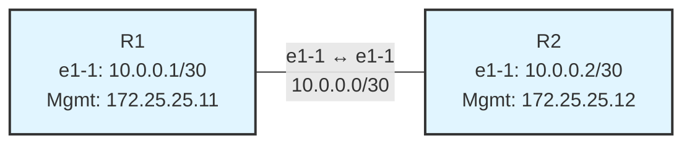
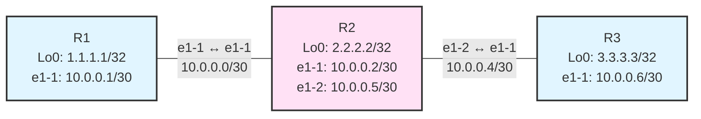
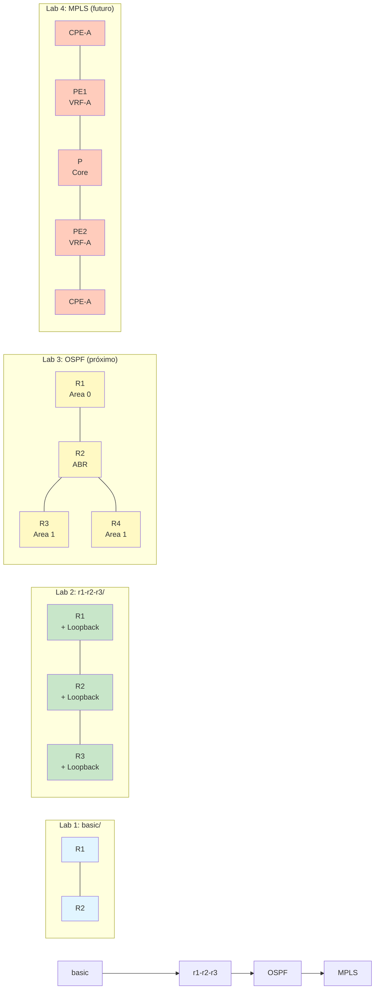
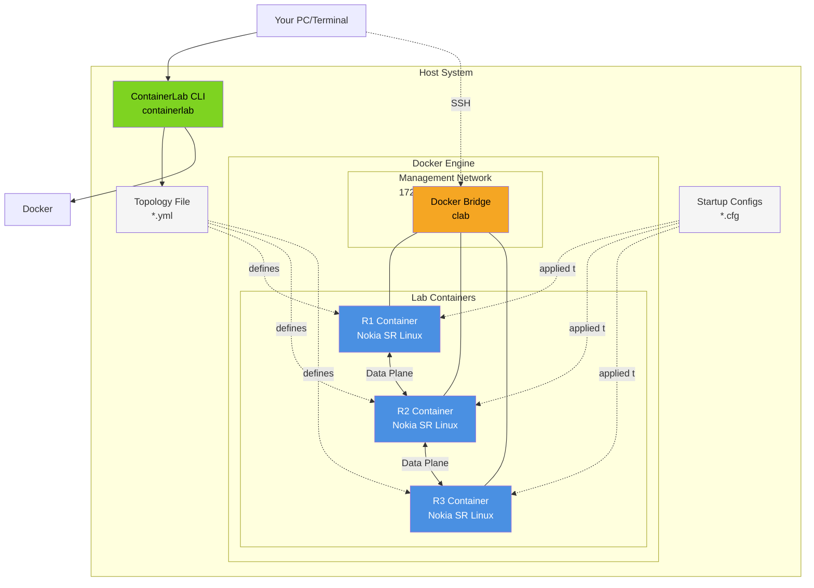
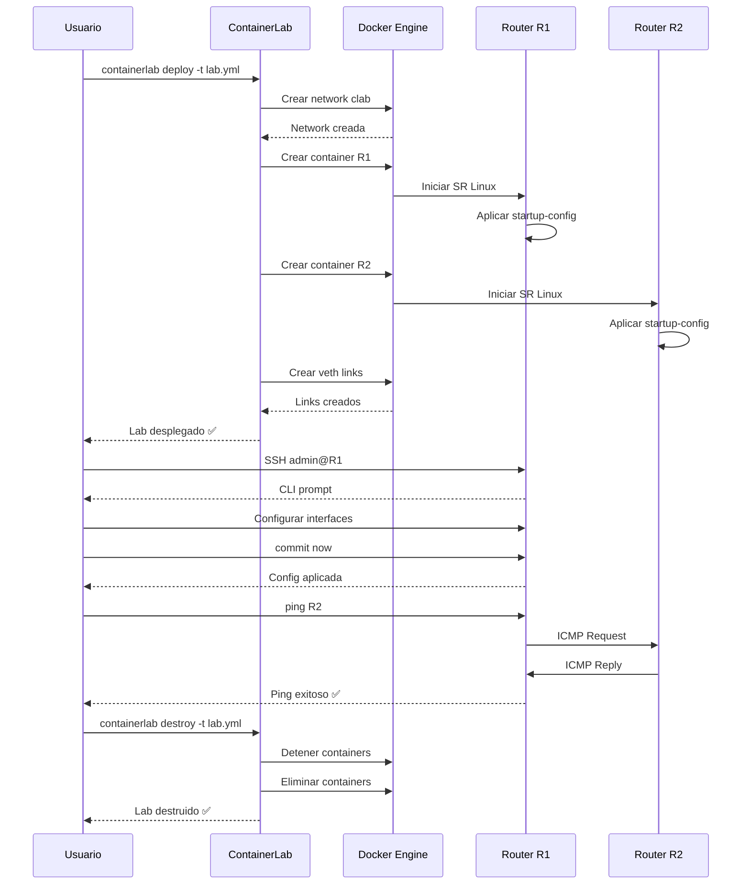
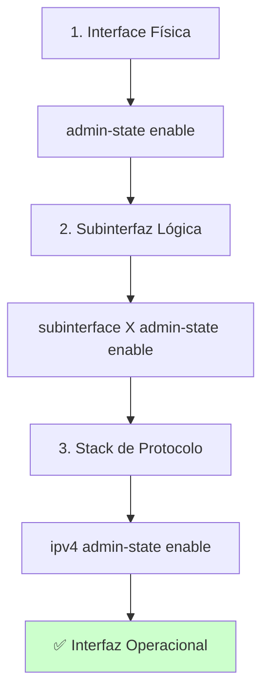
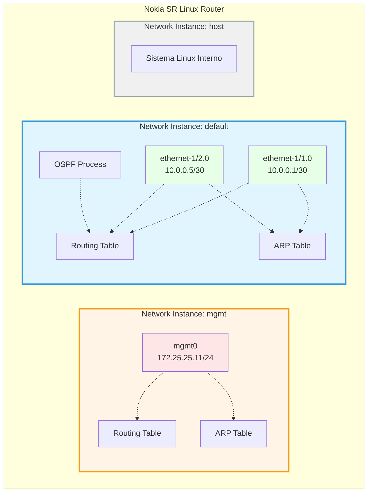
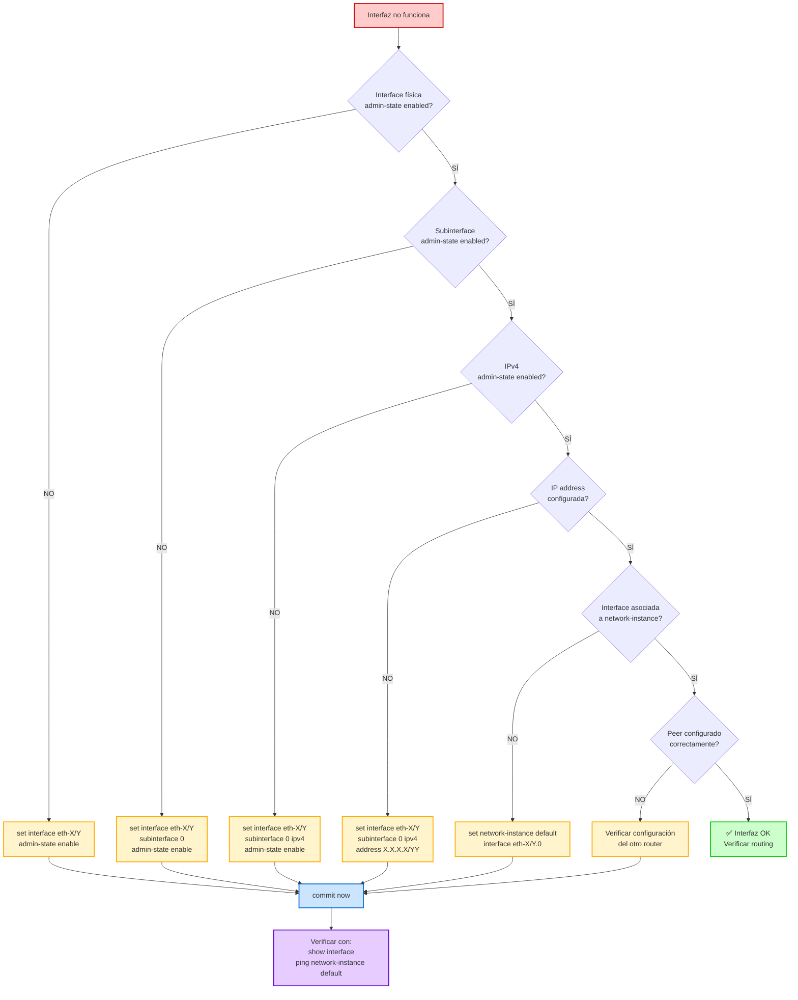

# Laboratorios de Redes con ContainerLab

## Descripción General

Este directorio contiene laboratorios prácticos de redes utilizando **ContainerLab** con routers **Nokia SR Linux**. Cada laboratorio está diseñado para enseñar conceptos específicos de networking de forma progresiva, desde conectividad básica hasta configuraciones avanzadas.

---

## Estructura de Laboratorios

```
labs/
├── README.md                    # Este archivo
├── basic/                       # Laboratorio básico (2 routers)
│   ├── README.md               # Documentación del lab
│   └── lab1-basic.yml          # Archivo de topología
└── r1-r2-r3/                   # Laboratorio intermedio (3 routers)
    ├── README.md               # Documentación del lab
    ├── basic_r1-r2-r3.yml     # Archivo de topología
    └── configs/                # Configuraciones de inicio
        ├── r1.cfg
        ├── r2.cfg
        └── r3.cfg
```

---

## Laboratorios Disponibles

### 📁 [basic/](basic/) - Laboratorio Básico
**Nivel:** Principiante
**Duración estimada:** 30-45 minutos
**Objetivo:** Aprender los fundamentos de ContainerLab y SR Linux

#### Topología


#### Características
- **2 routers** Nokia SR Linux (tipo ixrd2)
- **1 enlace** punto a punto
- **Red de management:** 172.25.25.0/24
- **Configuración manual** vía CLI

#### Conceptos que aprenderás
- ✅ Desplegar topologías con ContainerLab
- ✅ Conectarse a routers SR Linux vía SSH
- ✅ Los 3 niveles de `admin-state` (concepto clave de SR Linux)
- ✅ Configurar interfaces físicas y subinterfaces
- ✅ Asignar direcciones IPv4
- ✅ Asociar interfaces a network-instances (VRFs)
- ✅ Verificar conectividad con ping
- ✅ Troubleshooting básico

#### Comandos clave
```bash
# Desplegar
sudo containerlab deploy -t lab1-basic.yml

# Conectarse
ssh admin@clab-lab1-basic-r1

# Destruir
sudo containerlab destroy -t lab1-basic.yml
```

#### Requisitos previos
- Conocimientos básicos de TCP/IP
- Entender conceptos de subnetting
- Familiaridad con línea de comandos

---

### 📁 [r1-r2-r3/](r1-r2-r3/) - Topología de 3 Routers
**Nivel:** Intermedio
**Duración estimada:** 1-2 horas
**Objetivo:** Configuración automatizada con archivos JSON y rutas estáticas

#### Topología


#### Características
- **3 routers** Nokia SR Linux en serie
- **2 enlaces** punto a punto
- **Loopback interfaces** en cada router
- **Startup configs** en formato JSON
- **Configuración automática** al desplegar

#### Conceptos que aprenderás
- ✅ Startup configs con ContainerLab
- ✅ Formato JSON para configuraciones SR Linux
- ✅ Configuración de interfaces loopback
- ✅ Esquemas de direccionamiento /30
- ✅ Routing estático (implícito con rutas directamente conectadas)
- ✅ Modelo de datos YANG de SR Linux
- ✅ Network instances avanzadas

#### Configuraciones incluidas
Cada router tiene su archivo de configuración pre-construido:
- **r1.cfg**: Interfaz e1-1 + loopback lo0
- **r2.cfg**: Interfaces e1-1, e1-2 + loopback lo0
- **r3.cfg**: Interfaz e1-1 + loopback lo0

#### Comandos clave
```bash
# Desplegar con configs automáticas
sudo containerlab deploy -t basic_r1-r2-r3.yml

# Inspeccionar
sudo containerlab inspect -t basic_r1-r2-r3.yml

# Ver configuración aplicada
ssh admin@clab-lab1-exercise-r1
A:r1# show interface brief
A:r1# show network-instance default route-table

# Destruir
sudo containerlab destroy -t basic_r1-r2-r3.yml
```

#### Ejercicios propuestos
1. Agregar rutas estáticas para alcanzar todos los loopbacks
2. Configurar OSPF entre los 3 routers
3. Implementar BGP como protocolo de enrutamiento
4. Agregar un 4º router a la topología

---

## Comparación de Laboratorios

| Característica | basic/ | r1-r2-r3/ |
|----------------|--------|-----------|
| **Routers** | 2 | 3 |
| **Complejidad** | Básico | Intermedio |
| **Config manual** | ✅ Sí | ❌ No (automatizada) |
| **Startup configs** | ❌ No | ✅ Sí (JSON) |
| **Loopbacks** | ❌ No | ✅ Sí |
| **Objetivo** | Aprender CLI | Aprender automatización |
| **Tiempo** | 30-45 min | 1-2 horas |
| **Nivel** | Principiante | Intermedio |

### Progresión Visual de Labs



---

## Arquitectura de ContainerLab



---

## Guía de Inicio Rápido

### Requisitos Previos

#### 1. Software necesario
```bash
# Verificar Docker
docker --version
# Requerido: Docker 20.10+

# Verificar ContainerLab
containerlab version
# Requerido: ContainerLab 0.40+

# SSH client
ssh -V
```

#### 2. Instalación de ContainerLab
```bash
# Linux (Ubuntu/Debian)
bash -c "$(curl -sL https://get.containerlab.dev)"

# macOS
brew install containerlab
```

#### 3. Pull de imágenes Docker
```bash
# Descargar imagen de Nokia SR Linux
docker pull ghcr.io/nokia/srlinux:latest
```

---

### Flujo de Trabajo Típico



#### 1. Desplegar laboratorio
```bash
cd /path/to/lab
sudo containerlab deploy -t <archivo.yml>
```

**Salida esperada:**
```
INFO[0000] Containerlab v0.xx.x started
INFO[0000] Creating lab directory: /root/clab-<nombre>
INFO[0000] Creating container: "r1"
INFO[0000] Creating container: "r2"
+---+--------------------+--------------+
| # |        Name        | IPv4 Address |
+---+--------------------+--------------+
| 1 | clab-<lab>-r1     | 172.25.25.11 |
| 2 | clab-<lab>-r2     | 172.25.25.12 |
+---+--------------------+--------------+
```

#### 2. Conectarse a un router
```bash
# Opción 1: SSH (recomendado)
ssh admin@clab-<lab>-r1
# Password: NokiaSrl1!

# Opción 2: Docker exec
docker exec -it clab-<lab>-r1 sr_cli
```

#### 3. Trabajar en el router
```bash
# Prompt inicial
--{ running }--[  ]--
A:r1#

# Ver interfaces
show interface brief

# Entrar a modo configuración
enter candidate

# Hacer cambios
set interface ethernet-1/1 admin-state enable

# Ver cambios sin aplicar
diff

# Aplicar configuración
commit now

# Salir
quit
```

#### 4. Verificar conectividad
```bash
# Desde R1 hacia R2
ping 10.0.0.2 network-instance default

# Ver tabla de rutas
show network-instance default route-table

# Ver tabla ARP
show arpnd arp-entries
```

#### 5. Destruir laboratorio
```bash
sudo containerlab destroy -t <archivo.yml>
```

---

## Conceptos Clave de SR Linux

### 🔑 Los 3 Niveles de Admin-State
**Este es el concepto MÁS IMPORTANTE para trabajar con SR Linux.**

Para que una interfaz funcione, debes habilitar 3 niveles:



#### Nivel 1: Interfaz física
```bash
set interface ethernet-1/1 admin-state enable
```
Enciende el puerto físico (Layer 1).

#### Nivel 2: Subinterfaz
```bash
set interface ethernet-1/1 subinterface 0 admin-state enable
```
Habilita el procesamiento de frames (Layer 2).

#### Nivel 3: Protocolo IPv4
```bash
set interface ethernet-1/1 subinterface 0 ipv4 admin-state enable
```
Activa el stack IPv4 (Layer 3, ARP, routing).

**Sin TODOS estos niveles habilitados, la interfaz NO funcionará.**

---

### 🔑 Network Instances (VRFs)

En SR Linux, una **network-instance** es equivalente a un **VRF**.



**Asociar interfaz a network-instance:**
```bash
set network-instance default interface ethernet-1/1.0
```

**Network instances por defecto:**
- `mgmt`: Management del router (SSH, APIs) - Aislada
- `default`: Tráfico de datos / producción - Principal
- `host`: Comunicación interna del OS - Sistema

**Concepto clave:** Las interfaces DEBEN estar asociadas a una network-instance para poder enrutar tráfico. Cada network-instance tiene su propia tabla de routing, ARP y protocolos completamente aislados.

---

## Comandos de Verificación SR Linux

### Ver información de interfaces
```bash
# Todas las interfaces
show interface

# Interfaz específica
show interface ethernet-1/1

# Solo resumen
show interface brief

# Estadísticas de tráfico
show interface ethernet-1/1 statistics
```

### Ver configuración
```bash
# Configuración completa
info

# Config de interfaz específica
info interface ethernet-1/1

# Formato "set" (comandos)
info flat interface ethernet-1/1
```

### Ver routing
```bash
# Tabla de rutas
show network-instance default route-table

# Protocolos de routing
show network-instance default protocols

# Rutas específicas
show network-instance default route-table ipv4-unicast prefix 10.0.0.0/30
```

### Ver ARP
```bash
# Todas las entradas ARP
show arpnd arp-entries

# ARP de una network-instance
show network-instance default protocols linux arp
```

### Troubleshooting
```bash
# Estado operacional detallado
show interface ethernet-1/1 detail

# Razón de por qué está down
show network-instance default interfaces ethernet-1/1.0

# Logs del sistema
show system logging buffer

# Comparar config candidata vs running
diff
```

---

## Troubleshooting Común



### Problema 1: "no-ip-config"
**Síntoma:** Interfaz down con razón `no-ip-config`

**Causa:** Falta habilitar IPv4 admin-state

**Solución:**
```bash
set interface ethernet-1/1 subinterface 0 ipv4 admin-state enable
commit now
```

---

### Problema 2: "subif-down"
**Síntoma:** Interfaz down con razón `subif-down`

**Causa:** Subinterfaz no está habilitada

**Solución:**
```bash
set interface ethernet-1/1 subinterface 0 admin-state enable
commit now
```

---

### Problema 3: "Network is unreachable"
**Síntoma:** Error al hacer ping

**Causa:** Interfaz no asociada a network-instance

**Solución:**
```bash
set network-instance default interface ethernet-1/1.0
commit now
```

---

### Problema 4: Ping a network-instance incorrecta
**Síntoma:**
```bash
ping 10.0.0.2 network-instance mgmt
From 172.25.25.1 icmp_seq=1 Packet filtered
```

**Causa:** La network-instance `mgmt` solo conoce la red de management

**Solución:**
```bash
# Usar la network-instance correcta
ping 10.0.0.2 network-instance default
```

---

## Checklist de Configuración

Para verificar que una interfaz está completamente configurada:

- [ ] ✅ Interface física habilitada: `admin-state enable`
- [ ] ✅ Subinterface habilitada: `subinterface 0 admin-state enable`
- [ ] ✅ IPv4 habilitado: `ipv4 admin-state enable`
- [ ] ✅ IP configurada: `ipv4 address X.X.X.X/YY`
- [ ] ✅ Asociada a network-instance: `network-instance default interface ethernet-X/Y.Z`
- [ ] ✅ El peer (otro router) configurado correctamente
- [ ] ✅ Ping funciona: `ping <IP> network-instance default`

---

## Gestión de Laboratorios

### Ver estado de laboratorios
```bash
# Todos los labs corriendo
sudo containerlab inspect --all

# Lab específico
sudo containerlab inspect -t lab.yml
```

### Logs y debugging
```bash
# Ver logs de un contenedor
docker logs clab-<lab>-r1

# Ver logs en tiempo real
docker logs -f clab-<lab>-r1

# Entrar al bash del contenedor
docker exec -it clab-<lab>-r1 bash
```

### Limpieza
```bash
# Destruir lab específico
sudo containerlab destroy -t lab.yml

# Destruir TODOS los labs
sudo containerlab destroy --all

# Limpiar imágenes Docker no usadas
docker system prune -a
```

---

## Próximos Laboratorios (Planeados)

### Lab Avanzado: OSPF Multi-Area
- 5+ routers
- Múltiples áreas OSPF
- ABRs (Area Border Routers)
- Route summarization

### Lab Avanzado: BGP eBGP/iBGP
- 4 routers en 2 AS diferentes
- eBGP entre AS
- iBGP dentro de cada AS
- Route reflectors

### Lab Avanzado: MPLS L3VPN
- Topología PE-P-PE
- Múltiples VRFs
- MP-BGP VPNv4
- Clientes con IPs superpuestas

### Lab Automatización
- Ansible playbooks
- Python con gNMI
- CI/CD para configuraciones
- Telemetría streaming

---

## Recursos de Aprendizaje

### Documentación Oficial
- [Nokia SR Linux Documentation](https://documentation.nokia.com/srlinux/)
- [SR Linux CLI Reference](https://documentation.nokia.com/srlinux/SR_Linux_HTML_R24-3/cli-reference/index.html)
- [ContainerLab SR Linux Docs](https://containerlab.dev/manual/kinds/srl/)

### Tutoriales
- [SR Linux Learn](https://learn.srlinux.dev/)
- [ContainerLab Examples](https://github.com/srl-labs/containerlab-examples)
- [SR Labs Tutorials](https://github.com/srl-labs)

### Comunidad
- [Nokia SR Linux Discord](https://learn.srlinux.dev/community/)
- [ContainerLab GitHub Discussions](https://github.com/srl-labs/containerlab/discussions)

---

## Tips y Mejores Prácticas

### 💡 Tip 1: Usa `diff` antes de `commit`
Siempre verifica cambios antes de aplicarlos:
```bash
enter candidate
set <configuración>
diff              # ← Ver cambios
commit now
```

### 💡 Tip 2: Guarda configuraciones
```bash
# Guardar config actual
info flat > /tmp/backup.cfg

# Desde el host
docker cp clab-<lab>-r1:/tmp/backup.cfg ./
```

### 💡 Tip 3: Usa aliases de SSH
Agrega a `~/.ssh/config`:
```
Host r1
  HostName clab-lab1-basic-r1
  User admin
  StrictHostKeyChecking no
  UserKnownHostsFile /dev/null
```

Luego: `ssh r1` (sin password ni nombre largo)

### 💡 Tip 4: Automatiza con scripts
```bash
#!/bin/bash
# deploy-and-test.sh
sudo containerlab deploy -t lab.yml
sleep 10
ssh admin@clab-lab-r1 "show interface brief"
```

---

## FAQ

### ¿Por qué usar ContainerLab en lugar de GNS3/EVE-NG?
- ✅ **Más rápido:** Deploy en 10 segundos vs 5 minutos
- ✅ **Menos recursos:** 10x menos RAM que VMs
- ✅ **Reproducible:** Topologías como código (YAML)
- ✅ **APIs nativas:** Telemetría moderna, gNMI, gRPC
- ✅ **CI/CD friendly:** Automatización fácil

### ¿Necesito licencias de Nokia?
No. Nokia SR Linux es gratuito para laboratorios.

### ¿Puedo usar otros vendors?
Sí. ContainerLab soporta:
- Arista cEOS
- Cisco XRv9000, Nexus 9000v
- Juniper cRPD, vMX
- MikroTik RouterOS
- FRRouting
- Cumulus VX

### ¿Cómo exporto configuraciones?
```bash
# Desde SR Linux
info flat > /tmp/config.txt

# Copiar al host
docker cp clab-<lab>-r1:/tmp/config.txt ./
```

### ¿Los cambios persisten?
**Durante el lab:** Sí, mientras no destruyas el lab.

**Después de destroy:** No, a menos que uses `startup-config`.

---

## Contribuir con Nuevos Labs

Si quieres agregar un nuevo laboratorio:

1. Crea un directorio con nombre descriptivo
2. Incluye:
   - `README.md` con documentación completa
   - Archivo YAML de topología
   - Configs de inicio (si aplica)
   - Diagramas mermaid
3. Prueba el lab completamente
4. Documenta los objetivos de aprendizaje
5. Incluye ejercicios propuestos

---

## Licencia

Estos laboratorios son material educativo de uso libre para aprendizaje personal y académico.

---

## Soporte

**Para problemas técnicos:**
1. Revisa la sección de Troubleshooting
2. Consulta los logs: `docker logs <contenedor>`
3. Verifica los requisitos de sistema
4. Busca en ContainerLab GitHub Issues

**Para preguntas de networking:**
1. Consulta la documentación de SR Linux
2. Revisa el tutorial de ContainerLab en `/networks/containerlab.md`
3. Únete a las comunidades de SR Linux

---

**Última actualización:** 2025-11-15
**Versión:** 1.0

---

**¡Disfruta aprendiendo networking con ContainerLab! 🚀**
