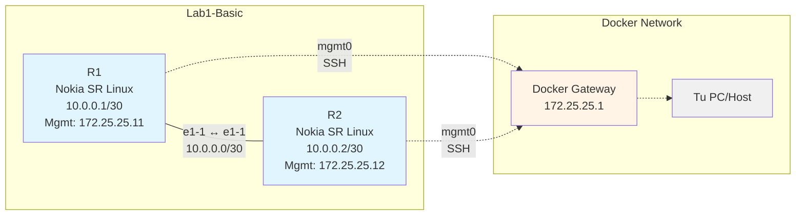
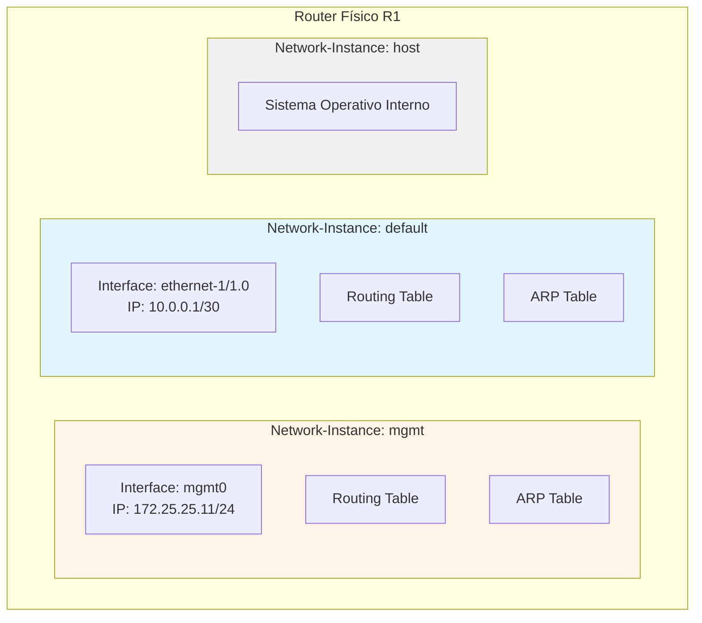
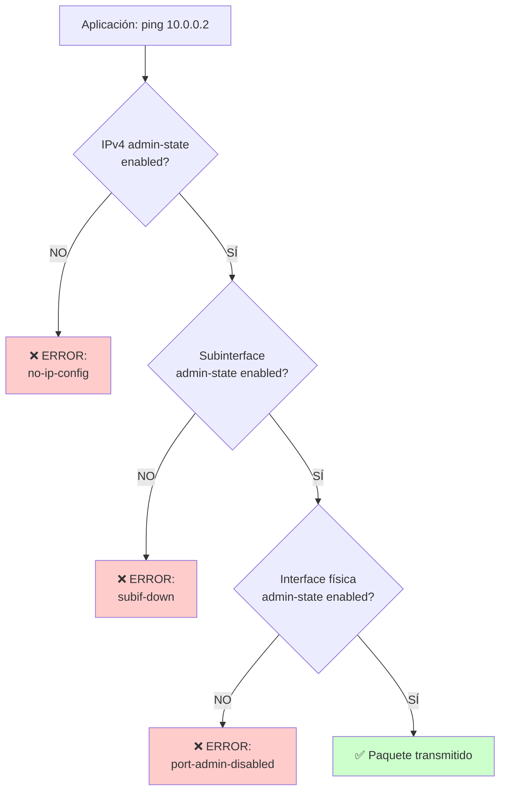

# Guía Completa: Containerlab con Nokia SR Linux

## Tabla de Contenidos
1. [Introducción](#introducción)
2. [Topología del Laboratorio](#topología-del-laboratorio)
3. [Conceptos Fundamentales](#conceptos-fundamentales)
4. [Configuración Paso a Paso](#configuración-paso-a-paso)
5. [Network Instances (VRFs)](#network-instances-vrfs)
6. [Los 3 Niveles de Admin-State](#los-3-niveles-de-admin-state)
7. [Comandos Útiles](#comandos-útiles)
8. [Troubleshooting](#troubleshooting)
9. [Conclusiones](#conclusiones)

---

## Introducción

Este documento resume el aprendizaje de **Containerlab** con routers **Nokia SR Linux**. Containerlab es una herramienta que permite crear topologías de red usando contenedores Docker, ideal para aprender networking sin necesidad de hardware físico.

### Tecnologías utilizadas:
- **Containerlab**: Orquestador de laboratorios de red
- **Nokia SR Linux**: Network OS moderno basado en Linux
- **Docker**: Motor de contenedores

---

## Topología del Laboratorio

### Archivo de configuración (YAML)

```yaml
mgmt:
  ipv4_subnet: 172.25.25.0/24

name: lab1-basic

topology:
  nodes:
    r1:
      kind: nokia_srlinux
      type: ixrd2
      image: ghcr.io/nokia/srlinux:latest
    
    r2:
      kind: nokia_srlinux
      type: ixrd2
      image: ghcr.io/nokia/srlinux:latest
  
  links:
    - endpoints: ["r1:e1-1", "r2:e1-1"]
```

### Diagrama de la topología



### Explicación de la topología

La topología consta de:
- **2 routers SR Linux** (R1 y R2)
- **1 enlace punto a punto** entre ellos (10.0.0.0/30)
- **Red de management** (172.25.25.0/24) para acceso SSH

---

## Conceptos Fundamentales

### ¿Qué es una Network Instance?

Una **Network Instance** en SR Linux es equivalente a un **VRF (Virtual Routing and Forwarding)**: una tabla de routing aislada dentro del router.



### Network Instances por defecto en SR Linux

| Network-Instance | Propósito | Interfaces típicas |
|------------------|-----------|-------------------|
| **mgmt** | Management del router (SSH, APIs) | mgmt0 |
| **default** | Tráfico de datos / producción | ethernet-x/y |
| **host** | Comunicación interna del OS | (interno) |

**Concepto clave**: Cada network-instance tiene su propia tabla de routing, ARP, y configuración de protocolos. Son **completamente aisladas** entre sí.

---

## Los 3 Niveles de Admin-State

**Este es el concepto más importante y la causa principal de errores en SR Linux.**

En SR Linux, necesitas habilitar **3 niveles diferentes** para que una interfaz funcione:

### Nivel 1: Interfaz Física

```bash
set interface ethernet-1/1 admin-state enable
```

**¿Qué hace?**
- Enciende el puerto físico (Layer 1 OSI)
- Activa el transceiver (láser/eléctrico)
- Permite la transmisión de señales en el cable

**Sin esto**: El puerto está físicamente apagado.

---

### Nivel 2: Subinterfaz Lógica

```bash
set interface ethernet-1/1 subinterface 0 admin-state enable
```

**¿Qué hace?**
- Habilita la subinterfaz lógica (Layer 2 OSI)
- Permite el procesamiento de frames Ethernet
- Habilita el data plane para esa subinterfaz

**Sin esto**: El puerto está encendido pero no procesa frames.

**¿Por qué subinterfaces?**
Permite múltiples configuraciones lógicas en un puerto físico:

```
ethernet-1/1 (puerto físico)
├── subinterface 0 → Sin VLAN → IP 10.0.0.1/30
├── subinterface 100 → VLAN 100 → IP 192.168.1.1/24
└── subinterface 200 → VLAN 200 → IP 192.168.2.1/24
```

---

### Nivel 3: Stack de Protocolo (IPv4)

```bash
set interface ethernet-1/1 subinterface 0 ipv4 admin-state enable
```

**¿Qué hace?**
- Habilita el stack de protocolo IPv4 (Layer 3 OSI)
- Activa el procesamiento de paquetes IP
- Habilita ARP
- Permite routing IPv4

**Sin esto**: El puerto funciona en Layer 1 y 2, pero NO procesa IP.

---

### Configuración completa necesaria

```bash
# Configuración COMPLETA para que funcione
interface ethernet-1/1 {
    admin-state enable                    # ← Nivel 1: Puerto físico
    
    subinterface 0 {
        admin-state enable                # ← Nivel 2: Subinterfaz
        
        ipv4 {
            admin-state enable            # ← Nivel 3: Protocolo IPv4
            address 10.0.0.1/30 {
            }
        }
    }
}
```

### Diagrama del flujo de paquetes



---

## Configuración Paso a Paso

### 1. Desplegar el laboratorio

```bash
sudo containerlab deploy -t lab1-basic.yml
```

**Salida esperada:**
```
INFO[0000] Containerlab v0.xx.x started                 
INFO[0000] Creating lab directory: /root/clab-lab1-basic 
INFO[0000] Creating docker network: Name="clab", IPv4Subnet="172.25.25.0/24"
INFO[0000] Creating container: "r1"                     
INFO[0000] Creating container: "r2"                     
INFO[0002] Creating virtual wire: r1:e1-1 <--> r2:e1-1 
+---+--------------------+--------------+------+---------+-----------------+
| # |        Name        | Container ID | Kind |  State  |  IPv4 Address   |
+---+--------------------+--------------+------+---------+-----------------+
| 1 | clab-lab1-basic-r1 | ...          | srl  | running | 172.25.25.11/24 |
| 2 | clab-lab1-basic-r2 | ...          | srl  | running | 172.25.25.12/24 |
+---+--------------------+--------------+------+---------+-----------------+
```

---

### 2. Conectarse a los routers

```bash
# Router 1
ssh admin@clab-lab1-basic-r1
# Password: NokiaSrl1!

# Router 2 (en otra terminal)
ssh admin@clab-lab1-basic-r2
# Password: NokiaSrl1!
```

**Prompt inicial:**
```
--{ running }--[  ]--
A:r1#
```

---

### 3. Configurar R1

```bash
# Entrar a modo configuración
A:r1# enter candidate

# Habilitar interfaz física
A:r1# set interface ethernet-1/1 admin-state enable

# Habilitar subinterfaz
A:r1# set interface ethernet-1/1 subinterface 0 admin-state enable

# Configurar IP
A:r1# set interface ethernet-1/1 subinterface 0 ipv4 address 10.0.0.1/30

# Habilitar IPv4
A:r1# set interface ethernet-1/1 subinterface 0 ipv4 admin-state enable

# Asociar a network-instance default
A:r1# set network-instance default interface ethernet-1/1.0

# Ver cambios antes de aplicar
A:r1# diff

# Aplicar configuración
A:r1# commit now
```

---

### 4. Configurar R2

```bash
A:r2# enter candidate
A:r2# set interface ethernet-1/1 admin-state enable
A:r2# set interface ethernet-1/1 subinterface 0 admin-state enable
A:r2# set interface ethernet-1/1 subinterface 0 ipv4 address 10.0.0.2/30
A:r2# set interface ethernet-1/1 subinterface 0 ipv4 admin-state enable
A:r2# set network-instance default interface ethernet-1/1.0
A:r2# commit now
```

---

### 5. Verificar conectividad

```bash
# Desde R1
A:r1# ping 10.0.0.2 network-instance default
```

**Salida esperada:**
```
Using network instance default
PING 10.0.0.2 (10.0.0.2) 56(84) bytes of data.
64 bytes from 10.0.0.2: icmp_seq=1 ttl=64 time=3.51 ms
64 bytes from 10.0.0.2: icmp_seq=2 ttl=64 time=3.78 ms
64 bytes from 10.0.0.2: icmp_seq=3 ttl=64 time=4.11 ms
```

✅ **¡Conectividad establecida!**

---

## Network Instances (VRFs)

### ¿Por qué necesitas asociar interfaces a network-instances?

Una interfaz con IP configurada pero **sin network-instance asociada** es como:
> *"Un teléfono con número pero sin línea telefónica: tiene número pero no puede llamar."*

### Comandos relacionados

```bash
# Ver todas las network-instances
show network-instance

# Ver interfaces de una network-instance
info network-instance default

# Ver tabla de routing de una network-instance
show network-instance default route-table
```

### Ejemplo de tabla de routing

```bash
A:r1# show network-instance default route-table
```

**Salida:**
```
+----------------------------------+-------+------------+----------------------+
| Prefix                           | ID    | Route Type | Route Owner          |
+==================================+=======+============+======================+
| 10.0.0.0/30                      | 2     | local      | net_inst_mgr         |
| 10.0.0.1/32                      | 2     | host       | net_inst_mgr         |
| 10.0.0.3/32                      | 2     | host       | net_inst_mgr         |
+----------------------------------+-------+------------+----------------------+
```

**Explicación de las rutas:**
- **10.0.0.0/30**: Red completa directamente conectada
- **10.0.0.1/32**: IP local del router (host route)
- **10.0.0.3/32**: Dirección de broadcast de la subnet /30

---

## Comandos Útiles

### Comandos de verificación

```bash
# VER INTERFACES
show interface                                    # Todas las interfaces
show interface ethernet-1/1                       # Interfaz específica
show interface ethernet-1/1 detail                # Detalles completos
show interface ethernet-1/1 statistics            # Estadísticas de tráfico

# VER CONFIGURACIÓN
info                                              # Configuración completa
info interface ethernet-1/1                       # Config de una interfaz
info flat interface ethernet-1/1                  # Config en formato "set"
info network-instance default                     # Config de network-instance

# VER ARP
show arpnd arp-entries                            # Todas las entradas ARP
show network-instance default protocols linux arp # ARP de network-instance

# VER ROUTING
show network-instance default route-table         # Tabla de rutas
show network-instance default protocols           # Protocolos disponibles

# INFORMACIÓN DEL SISTEMA
show version                                      # Versión del sistema
show system information                           # Info completa del sistema
```

---

### Comandos de troubleshooting

```bash
# Verificar estado operacional de interfaz
show interface ethernet-1/1

# Ver razón específica de por qué está down
show network-instance default interfaces ethernet-1/1.0

# Ver estadísticas de errores
show interface ethernet-1/1 statistics

# Hacer ping desde network-instance específica
ping 10.0.0.2 network-instance default

# Ver logs del sistema
show system logging buffer

# Ver configuración aplicada vs candidata
diff
```

---

### Navegación en CLI

```bash
# Autocompletar comando
show int<TAB>

# Ver opciones disponibles
show interface ?

# Ver TODAS las opciones (incluso ocultas)
show interface ??

# Navegar a la raíz
/

# Subir un nivel
..

# Buscar en la salida (pipe)
show interface | grep ethernet
```

---

## Troubleshooting

### Problema 1: Interfaz down con "no-ip-config"

**Síntoma:**
```bash
ethernet-1/1.0 is down, reason no-ip-config
```

**Causa:**
Falta habilitar el stack de protocolo IPv4.

**Solución:**
```bash
A:r1# enter candidate
A:r1# set interface ethernet-1/1 subinterface 0 ipv4 admin-state enable
A:r1# commit now
```

---

### Problema 2: Interfaz down con "subif-down"

**Síntoma:**
```bash
ethernet-1/1.0 is down, reason subif-down
```

**Causa:**
La subinterfaz no está habilitada.

**Solución:**
```bash
A:r1# enter candidate
A:r1# set interface ethernet-1/1 subinterface 0 admin-state enable
A:r1# commit now
```

---

### Problema 3: "Network is unreachable" al hacer ping

**Síntoma:**
```bash
A:r1# ping 10.0.0.2 network-instance default
ping: connect: Network is unreachable
```

**Causa:**
La interfaz no está asociada a la network-instance default.

**Solución:**
```bash
A:r1# enter candidate
A:r1# set network-instance default interface ethernet-1/1.0
A:r1# commit now
```

---

### Problema 4: Ping a network-instance incorrecta

**Síntoma:**
```bash
A:r1# ping 10.0.0.2 network-instance mgmt
From 10.121.209.129 icmp_seq=1 Packet filtered
```

**Causa:**
Estás haciendo ping desde la network-instance "mgmt" que solo conoce la red 172.25.25.0/24.

**Solución:**
```bash
# Usar la network-instance correcta
A:r1# ping 10.0.0.2 network-instance default
```

---

### Checklist completo de configuración

Para que una interfaz funcione en SR Linux, verifica:

- [ ] **Interface física habilitada**: `admin-state enable`
- [ ] **Subinterface habilitada**: `subinterface 0 admin-state enable`
- [ ] **IPv4 habilitado**: `ipv4 admin-state enable`
- [ ] **IP configurada**: `ipv4 address X.X.X.X/YY`
- [ ] **Asociada a network-instance**: `network-instance default interface ethernet-X/Y.Z`
- [ ] **El peer (otro router) está configurado correctamente**

---

## Comparación con otros Vendors

### Configuración equivalente

| Vendor | Configuración básica de interfaz |
|--------|----------------------------------|
| **Cisco IOS** | ```interface GigabitEthernet0/1```<br>```ip address 10.0.0.1 255.255.255.252```<br>```no shutdown``` |
| **Juniper** | ```set interfaces ge-0/0/1 unit 0 family inet address 10.0.0.1/30``` |
| **SR Linux** | ```set interface ethernet-1/1 admin-state enable```<br>```set interface ethernet-1/1 subinterface 0 admin-state enable```<br>```set interface ethernet-1/1 subinterface 0 ipv4 admin-state enable```<br>```set interface ethernet-1/1 subinterface 0 ipv4 address 10.0.0.1/30```<br>```set network-instance default interface ethernet-1/1.0``` |

**SR Linux requiere más pasos**, pero ofrece:
- ✅ Mayor granularidad de control
- ✅ Mejor troubleshooting (sabes exactamente qué capa falla)
- ✅ Soporte nativo de IPv4 + IPv6 simultáneo
- ✅ Modelo de datos YANG estándar

---

## Gestión del Laboratorio con Containerlab

### Comandos de Containerlab

```bash
# Desplegar el lab
sudo containerlab deploy -t lab1-basic.yml

# Ver estado del lab
sudo containerlab inspect -t lab1-basic.yml

# Destruir el lab (borra todo)
sudo containerlab destroy -t lab1-basic.yml

# Ver todos los labs corriendo
sudo containerlab inspect --all

# Ver logs de un contenedor
docker logs clab-lab1-basic-r1

# Entrar directamente al bash del contenedor
docker exec -it clab-lab1-basic-r1 bash
```

---

## Conceptos Avanzados

### 1. Múltiples subinterfaces (VLANs)

```bash
# Subinterfaz sin tag (nativa)
set interface ethernet-1/1 subinterface 0 admin-state enable

# Subinterfaz con VLAN 100
set interface ethernet-1/1 subinterface 100 admin-state enable
set interface ethernet-1/1 subinterface 100 type bridged
set interface ethernet-1/1 subinterface 100 vlan encap single-tagged vlan-id 100
```

---

### 2. IPv4 + IPv6 simultáneo (Dual Stack)

```bash
# IPv4
set interface ethernet-1/1 subinterface 0 ipv4 admin-state enable
set interface ethernet-1/1 subinterface 0 ipv4 address 10.0.0.1/30

# IPv6
set interface ethernet-1/1 subinterface 0 ipv6 admin-state enable
set interface ethernet-1/1 subinterface 0 ipv6 address 2001:db8::1/64
```

---

### 3. Múltiples Network-Instances (VRFs)

```bash
# Crear una nueva network-instance
set network-instance CUSTOMER-A type ip-vrf
set network-instance CUSTOMER-A interface ethernet-1/2.0

# Diferentes clientes, mismas IPs, sin conflicto
# CUSTOMER-A puede usar 10.0.0.0/24
# CUSTOMER-B puede usar 10.0.0.0/24 también
```

---

## Resumen de Aprendizajes Clave

### 1. Los 3 admin-states son OBLIGATORIOS
```
interface admin-state enable
  └─> subinterface admin-state enable
      └─> ipv4 admin-state enable
```

### 2. Las interfaces DEBEN asociarse a network-instances
```bash
set network-instance default interface ethernet-1/1.0
```

### 3. Usa la network-instance correcta para ping
```bash
# ❌ Incorrecto
ping 10.0.0.2 network-instance mgmt

# ✅ Correcto
ping 10.0.0.2 network-instance default
```

### 4. Comandos de troubleshooting esenciales
```bash
show interface ethernet-1/1              # Estado de interfaz
show network-instance default route-table  # Tabla de routing
show arpnd arp-entries                   # Tabla ARP
info interface ethernet-1/1              # Configuración
```

---

## Próximos Pasos

Ahora que dominas lo básico, puedes explorar:

1. **Routing estático**: Agregar rutas estáticas entre redes
2. **Routing dinámico**: Configurar OSPF o BGP
3. **Topologías más complejas**: Agregar switches, más routers
4. **Automatización**: Usar Ansible/Python para configurar SR Linux
5. **Telemetry**: Configurar gNMI/gRPC para monitoreo
6. **NetDevOps**: Integrar con CI/CD pipelines

---

## Recursos Adicionales

- **Documentación oficial SR Linux**: https://documentation.nokia.com/srlinux/
- **Containerlab**: https://containerlab.dev/
- **Nokia SR Linux Learn**: https://learn.srlinux.dev/
- **Repositorio de ejemplos**: https://github.com/srl-labs

---

## Conclusiones

En esta sesión aprendiste:

✅ Cómo desplegar un laboratorio con Containerlab  
✅ El concepto de Network-Instances (VRFs)  
✅ **Los 3 niveles de admin-state** (el concepto MÁS importante)  
✅ Configuración básica de interfaces en SR Linux  
✅ Verificación de conectividad y troubleshooting  
✅ Comandos esenciales de SR Linux  
✅ Diferencias con otros vendors  

**El error más común**: Olvidar habilitar alguno de los 3 admin-states. Siempre verifica los 3 niveles.

---

**¡Felicidades por completar este laboratorio básico! 🎉**

Ahora tienes una base sólida para seguir aprendiendo networking con SR Linux y Containerlab.

---

*Documento creado: 2025-11-15*  
*Versión: 1.0*