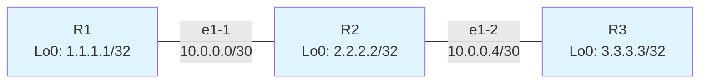
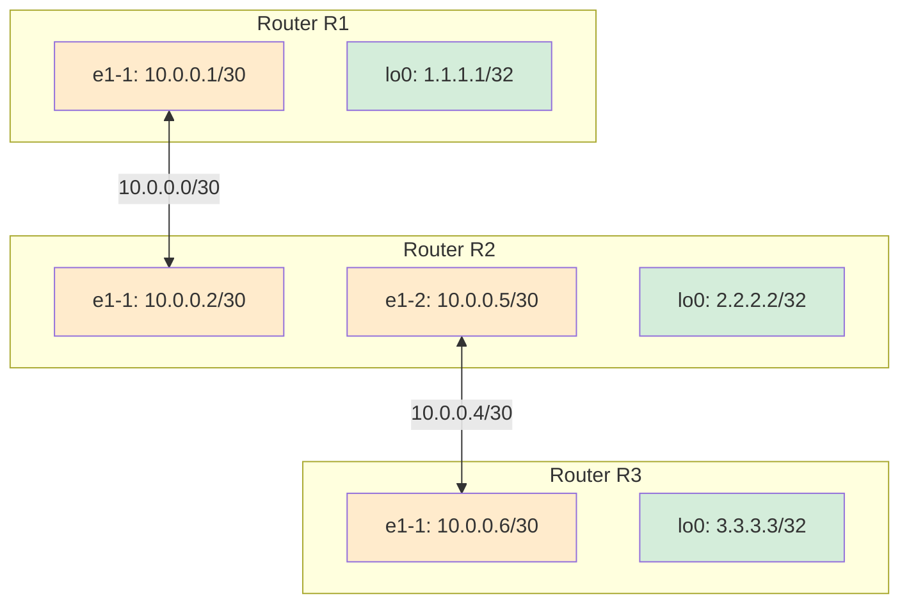
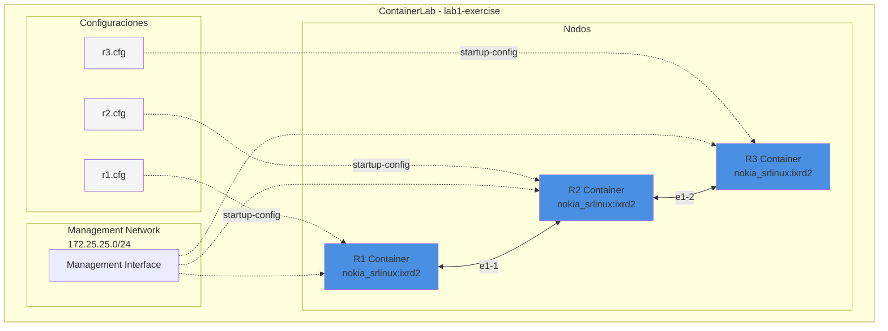
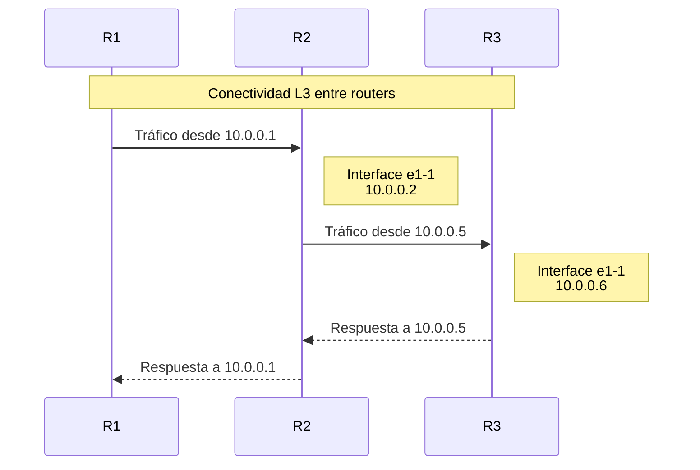

# Laboratorio: Topología Básica R1-R2-R3

## Descripción General

Este laboratorio implementa una topología de red simple de tres routers Nokia SR Linux conectados en serie (R1 ↔ R2 ↔ R3). El propósito es crear un entorno de pruebas básico para practicar configuración de interfaces, direccionamiento IP y conectividad entre routers.

## Información del Laboratorio

- **Nombre del Lab**: `lab1-exercise`
- **Archivo de Topología**: [basic_r1-r2-r3.yml](basic_r1-r2-r3.yml)
- **Plataforma**: ContainerLab
- **Sistema Operativo de Red**: Nokia SR Linux
- **Red de Gestión**: 172.25.25.0/24

## Topología de Red



## Diagrama de Direccionamiento IP



## Nodos de la Topología

### R1 (Router 1)
- **Tipo**: Nokia SR Linux ixrd2
- **Imagen**: `ghcr.io/nokia/srlinux:latest`
- **Configuración**: [configs/r1.cfg](configs/r1.cfg)
- **Interfaces**:
  - `ethernet-1/1`: 10.0.0.1/30 (Link to R2)
  - `lo0`: 1.1.1.1/32 (Loopback)

### R2 (Router 2)
- **Tipo**: Nokia SR Linux ixrd2
- **Imagen**: `ghcr.io/nokia/srlinux:latest`
- **Configuración**: [configs/r2.cfg](configs/r2.cfg)
- **Interfaces**:
  - `ethernet-1/1`: 10.0.0.2/30 (Link to R1)
  - `ethernet-1/2`: 10.0.0.5/30 (Link to R3)
  - `lo0`: 2.2.2.2/32 (Loopback)

### R3 (Router 3)
- **Tipo**: Nokia SR Linux ixrd2
- **Imagen**: `ghcr.io/nokia/srlinux:latest`
- **Configuración**: [configs/r3.cfg](configs/r3.cfg)
- **Interfaces**:
  - `ethernet-1/1`: 10.0.0.6/30 (Link to R2)
  - `lo0`: 3.3.3.3/32 (Loopback)

## Esquema de Direccionamiento IP

### Enlaces Punto a Punto

| Enlace | Subred | Router A | IP Router A | Router B | IP Router B |
|--------|--------|----------|-------------|----------|-------------|
| R1-R2 | 10.0.0.0/30 | R1 | 10.0.0.1 | R2 | 10.0.0.2 |
| R2-R3 | 10.0.0.4/30 | R2 | 10.0.0.5 | R3 | 10.0.0.6 |

### Interfaces Loopback

| Router | Loopback IP |
|--------|-------------|
| R1 | 1.1.1.1/32 |
| R2 | 2.2.2.2/32 |
| R3 | 3.3.3.3/32 |

## Arquitectura ContainerLab



## Detalles de Configuración

### Estructura del Archivo YAML

El archivo [basic_r1-r2-r3.yml](basic_r1-r2-r3.yml) contiene:

#### 1. Configuración de Gestión
```yaml
mgmt:
  ipv4_subnet: 172.25.25.0/24
```
Define la subred para la red de gestión fuera de banda (out-of-band management).

#### 2. Definición de Nodos
Cada nodo especifica:
- `kind`: Tipo de dispositivo (nokia_srlinux)
- `type`: Modelo específico (ixrd2)
- `image`: Imagen de contenedor Docker
- `startup-config`: Archivo de configuración inicial en formato JSON

#### 3. Definición de Enlaces
Los enlaces se definen mediante endpoints que especifican:
- Formato: `["nodo:interface", "nodo:interface"]`
- Ejemplo: `["r1:e1-1", "r2:e1-1"]`

## Características de las Configuraciones

### Formato de Configuración
- Las configuraciones utilizan formato **JSON**
- Se basan en el modelo YANG de Nokia SR Linux
- Configuran:
  - Interfaces físicas (ethernet)
  - Subinterfaces (layer 3)
  - Direccionamiento IPv4
  - Network instances (VRF)

### Network Instance
Todos los routers utilizan la network instance "default":
- Tipo: `default`
- Estado: `enable`
- Interfaces asociadas a la VRF default

## Flujo de Datos



## Comandos Útiles

### Desplegar el Laboratorio
```bash
sudo containerlab deploy -t basic_r1-r2-r3.yml
```

### Destruir el Laboratorio
```bash
sudo containerlab destroy -t basic_r1-r2-r3.yml
```

### Acceder a un Router
```bash
# Acceso SSH (después del despliegue)
ssh admin@clab-lab1-exercise-r1
ssh admin@clab-lab1-exercise-r2
ssh admin@clab-lab1-exercise-r3

# O usando docker exec
docker exec -it clab-lab1-exercise-r1 sr_cli
```

### Verificación de Conectividad
Desde la CLI de SR Linux:
```bash
# Ver configuración de interfaces
show interface brief

# Verificar direcciones IP
show interface ethernet-1/1

# Ping entre routers
ping 10.0.0.2 network-instance default
```

## Objetivos de Aprendizaje

Este laboratorio es ideal para practicar:

1. **Configuración básica de interfaces** en SR Linux
2. **Direccionamiento IPv4** punto a punto
3. **Configuración de loopbacks** para identificación de routers
4. **Verificación de conectividad** entre dispositivos
5. **Uso de ContainerLab** para laboratorios de red
6. **Sintaxis JSON** para configuraciones de SR Linux
7. **Network instances** y VRF básico

## Próximos Pasos

Después de desplegar este laboratorio, puedes:

- Configurar protocolos de enrutamiento dinámico (OSPF, BGP)
- Implementar políticas de routing
- Agregar más routers a la topología
- Configurar servicios L2/L3
- Practicar troubleshooting de red

## Referencias

- [Nokia SR Linux Documentation](https://documentation.nokia.com/srlinux/)
- [ContainerLab Documentation](https://containerlab.dev/)
- [SR Linux YANG Models](https://yang.srlinux.dev/)

---

**Nota**: Este es un laboratorio de práctica. Las contraseñas por defecto y configuraciones deben ajustarse para entornos de producción.
