# Topología de Red - Router Inter-VLAN con Segmentación Departamental

## 📋 Resumen Ejecutivo

Esta topología implementa un diseño de red básico de dos segmentos LAN separados lógicamente, conectados a través de un router de Capa 3. La arquitectura simula una red empresarial pequeña con dos departamentos independientes (Ventas e Ingeniería), cada uno con su propio espacio de direccionamiento IP privado. El router R1 actúa como gateway predeterminado para ambas redes, facilitando la comunicación inter-segmento mediante routing IP básico.

**Características principales:**
- 2 redes LAN aisladas (192.168.1.0/24 y 192.168.2.0/24)
- 1 router de Capa 3 con dos interfaces Ethernet
- Direccionamiento IPv4 privado Clase C
- Topología ideal para laboratorios CCNA/CCNP de routing básico

---

## 🔍 Análisis Detallado

### Componentes Principales

| Dispositivo | Tipo | Función | Interfaces |
|-------------|------|---------|------------|
| **R1** | Router L3 | Gateway inter-red, routing IP | eth1 (192.168.1.1/24), eth2 (192.168.2.1/24) |
| **PC1** | Host/End Device | Dispositivo final - Departamento Ventas | NIC (192.168.1.10/24) |
| **PC2** | Host/End Device | Dispositivo final - Departamento Ingeniería | NIC (192.168.2.10/24) |

### Arquitectura

Esta topología representa un diseño de **routing inter-red básico** con las siguientes características:

1. **Segmentación de red**: Dos dominios de broadcast separados mediante subredes diferentes
2. **Router on a Stick (simplificado)**: Aunque no usa VLANs explícitas, el concepto de tener múltiples redes conectadas a un único router es similar
3. **Gateway centralizado**: R1 proporciona servicios de routing entre ambos segmentos
4. **Diseño plano**: Sin jerarquía de múltiples capas (Access/Distribution/Core)

**Flujo de tráfico:**
- Tráfico intra-red: Los hosts dentro del mismo segmento se comunican directamente (si hubiera múltiples hosts)
- Tráfico inter-red: PC1 → R1 (eth1) → R1 (eth2) → PC2

### Protocolos y Tecnologías

#### Capa 2 (Enlace de Datos)
- **Ethernet II**: Protocolo de encapsulación estándar
- **ARP**: Resolución de direcciones MAC

#### Capa 3 (Red)
- **IPv4**: Protocolo de direccionamiento (esquema privado RFC 1918)
- **ICMP**: Diagnóstico de red (ping, traceroute)
- **Routing estático** (implícito): Redes directamente conectadas

#### Protocolos aplicables para expansión:
- **RIP/RIPv2**: Routing dinámico básico (CCNA)
- **OSPF**: Open Shortest Path First (CCNA/CCNP)
- **EIGRP**: Enhanced Interior Gateway Routing Protocol (CCNA/CCNP)
- **BGP**: Border Gateway Protocol (CCNP Advanced)
- **ACLs**: Listas de control de acceso para seguridad
- **NAT/PAT**: Traducción de direcciones para salida a Internet

### Consideraciones de Diseño

#### ✅ Fortalezas
- Diseño simple y fácil de entender
- Bajo overhead de configuración
- Ideal para laboratorios educativos
- Escalamiento vertical sencillo (agregar más hosts por red)

#### ⚠️ Limitaciones y Mejoras Recomendadas

1. **Punto único de fallo**: R1 es SPOF (Single Point of Failure)
   - *Solución*: Implementar HSRP/VRRP/GLBP con router redundante

2. **Sin segmentación VLAN**: No hay aislamiento L2 real
   - *Solución*: Usar VLANs en switches L2 + trunk al router

3. **Ausencia de seguridad**: No hay ACLs ni filtrado de tráfico
   - *Solución*: Implementar ACLs estándar/extendidas en interfaces

4. **Falta de escalabilidad**: Diseño plano limita crecimiento
   - *Solución*: Migrar a arquitectura jerárquica (3-tier)

5. **Sin redundancia de rutas**: Una sola ruta entre redes
   - *Solución*: Agregar enlaces redundantes + routing dinámico

6. **Broadcast domain pequeño**: Soporta hasta 254 hosts/red
   - *Solución*: Implementar sumarización con máscaras variables (VLSM)

#### 🔒 Recomendaciones de Seguridad
- Implementar ACLs entre departamentos
- Configurar port-security en switches (si se agregan)
- Habilitar SSH en lugar de Telnet
- Implementar AAA (Authentication, Authorization, Accounting)
- Considerar firewall entre R1 e Internet (si aplica)

#### 📈 Recomendaciones de Escalabilidad
- Migrar a switches L3 para routing inter-VLAN
- Implementar routing dinámico (OSPF/EIGRP)
- Diseñar esquema de direccionamiento jerárquico
- Documentar topología con IPAM (IP Address Management)

---

## 🗺️ Diagrama de Topología

```mermaid
graph TB
    subgraph Internet[" "]
        direction LR
        ISP[Internet/WAN<br/>📡]
    end
    
    subgraph Core["🏢 Core/Distribution Layer"]
        R1["🔀 R1 - Router L3<br/>━━━━━━━━━━━━━<br/>Modelo: Cisco ISR<br/>IOS: 15.x<br/>━━━━━━━━━━━━━"]
    end
    
    subgraph Red1["🔴 Red VENTAS - VLAN 10<br/>192.168.1.0/24"]
        direction TB
        PC1["💻 PC1-Ventas<br/>━━━━━━━━━━━<br/>IP: 192.168.1.10/24<br/>GW: 192.168.1.1<br/>DNS: 8.8.8.8"]
        SW1["⚡ SW1 (opcional)<br/>Access Layer"]
        SW1 -.-> PC1
    end
    
    subgraph Red2["🔵 Red INGENIERÍA - VLAN 20<br/>192.168.2.0/24"]
        direction TB
        PC2["💻 PC2-Ingeniería<br/>━━━━━━━━━━━<br/>IP: 192.168.2.10/24<br/>GW: 192.168.2.1<br/>DNS: 8.8.8.8"]
        SW2["⚡ SW2 (opcional)<br/>Access Layer"]
        SW2 -.-> PC2
    end
    
    ISP -.->|"eth0/WAN<br/>(DHCP/PPPoE)"| R1
    
    R1 -->|"eth1 (Gi0/0)<br/>192.168.1.1/24<br/>━━━━━━━━━━━"| SW1
    R1 -->|"eth2 (Gi0/1)<br/>192.168.2.1/24<br/>━━━━━━━━━━━"| SW2
    
    style R1 fill:#ffeb99,stroke:#ff9800,stroke-width:3px
    style PC1 fill:#ffcdd2,stroke:#d32f2f,stroke-width:2px
    style PC2 fill:#bbdefb,stroke:#1976d2,stroke-width:2px
    style Red1 fill:#ffe0e0,stroke:#c00,stroke-width:2px
    style Red2 fill:#e0e0ff,stroke:#00c,stroke-width:2px
    style Core fill:#fff9c4,stroke:#f57f17,stroke-width:2px
    style Internet fill:#e0f7fa,stroke:#006064,stroke-width:2px
    style SW1 fill:#f5f5f5,stroke:#666,stroke-width:1px,stroke-dasharray: 5 5
    style SW2 fill:#f5f5f5,stroke:#666,stroke-width:1px,stroke-dasharray: 5 5
    style ISP fill:#b2ebf2,stroke:#00838f,stroke-width:2px
```



### Leyenda del Diagrama

| Símbolo | Descripción |
|---------|-------------|
| 🔀 | Router L3 |
| 💻 | PC/Workstation |
| ⚡ | Switch L2 |
| 📡 | Conexión WAN/Internet |
| ━━━ | Enlace activo |
| ─ ─ | Componente opcional/futuro |

### Tabla de Direccionamiento IP

| Dispositivo | Interface | Dirección IP | Máscara | Gateway | Descripción |
|-------------|-----------|--------------|---------|---------|-------------|
| R1 | Gi0/0 (eth1) | 192.168.1.1 | /24 | N/A | Gateway Red Ventas |
| R1 | Gi0/1 (eth2) | 192.168.2.1 | /24 | N/A | Gateway Red Ingeniería |
| R1 | Gi0/2 (eth0) | DHCP/Estático | Variable | ISP | Salida WAN (opcional) |
| PC1 | NIC | 192.168.1.10 | /24 | 192.168.1.1 | Host Ventas |
| PC2 | NIC | 192.168.2.10 | /24 | 192.168.2.1 | Host Ingeniería |

---

## 🧪 Laboratorios Prácticos

### 🟢 Nivel CCNA

---

#### Lab 1: Configuración Básica de Interfaces y Direccionamiento IP

**Pregunta:**
Configura las interfaces GigabitEthernet 0/0 y 0/1 del router R1 con las direcciones IP apropiadas según la topología. Habilita ambas interfaces y verifica la configuración. Asegúrate de agregar descripciones significativas a cada interfaz.

**Respuesta:**

```cisco
! Paso 1: Acceso al modo privilegiado y configuración
R1> enable
R1# configure terminal
R1(config)# 

! Paso 2: Configuración de la interfaz GigabitEthernet 0/0 (Red Ventas)
R1(config)# interface gigabitEthernet 0/0
R1(config-if)# description ** Conexion a Red VENTAS - 192.168.1.0/24 **
R1(config-if)# ip address 192.168.1.1 255.255.255.0
R1(config-if)# no shutdown
R1(config-if)# exit

*Dec 27 10:15:23.456: %LINK-3-UPDOWN: Interface GigabitEthernet0/0, changed state to up
*Dec 27 10:15:24.457: %LINEPROTO-5-UPDOWN: Line protocol on Interface GigabitEthernet0/0, changed state to up

! Paso 3: Configuración de la interfaz GigabitEthernet 0/1 (Red Ingeniería)
R1(config)# interface gigabitEthernet 0/1
R1(config-if)# description ** Conexion a Red INGENIERIA - 192.168.2.0/24 **
R1(config-if)# ip address 192.168.2.1 255.255.255.0
R1(config-if)# no shutdown
R1(config-if)# exit

*Dec 27 10:16:01.789: %LINK-3-UPDOWN: Interface GigabitEthernet0/1, changed state to up
*Dec 27 10:16:02.790: %LINEPROTO-5-UPDOWN: Line protocol on Interface GigabitEthernet0/1, changed state to up

R1(config)# exit

! Paso 4: Verificación de la configuración
R1# show ip interface brief

Interface              IP-Address      OK? Method Status                Protocol
GigabitEthernet0/0     192.168.1.1     YES manual up                    up
GigabitEthernet0/1     192.168.2.1     YES manual up                    up
GigabitEthernet0/2     unassigned      YES unset  administratively down down

! Paso 5: Verificación detallada de interfaces
R1# show interfaces description

Interface              Status         Protocol Description
Gi0/0                  up             up       ** Conexion a Red VENTAS - 192.168.1.0/24 **
Gi0/1                  up             up       ** Conexion a Red INGENIERIA - 192.168.2.0/24 **
Gi0/2                  admin down     down

! Paso 6: Verificación de tabla de routing
R1# show ip route

Codes: L - local, C - connected, S - static, R - RIP, M - mobile, B - BGP
       D - EIGRP, EX - EIGRP external, O - OSPF, IA - OSPF inter area
       N1 - OSPF NSSA external type 1, N2 - OSPF NSSA external type 2
       E1 - OSPF external type 1, E2 - OSPF external type 2

Gateway of last resort is not set

      192.168.1.0/24 is variably subnetted, 2 subnets, 2 masks
C        192.168.1.0/24 is directly connected, GigabitEthernet0/0
L        192.168.1.1/32 is directly connected, GigabitEthernet0/0
      192.168.2.0/24 is variably subnetted, 2 subnets, 2 masks
C        192.168.2.0/24 is directly connected, GigabitEthernet0/1
L        192.168.2.1/32 is directly connected, GigabitEthernet0/1

! Paso 7: Guardar la configuración
R1# write memory
Building configuration...
[OK]
```

**Explicación:**
- Las rutas **C (connected)** indican que las redes están directamente conectadas
- Las rutas **L (local)** son las direcciones IP locales del router (host routes /32)
- Ambas interfaces están **up/up** (física y protocolo activos)
- La tabla de routing muestra 4 rutas: 2 redes conectadas + 2 direcciones locales

---

#### Lab 2: Configuración de Hosts y Pruebas de Conectividad

**Pregunta:**
Configura PC1 y PC2 con sus direcciones IP correspondientes. Realiza pruebas de conectividad desde PC1 hacia el gateway local (192.168.1.1), luego hacia PC2 (192.168.2.10). Interpreta los resultados del ping y traceroute.

**Respuesta:**

```bash
# ============================================
# Configuración de PC1 (Linux/Ubuntu)
# ============================================

pc1@ventas:~$ sudo ip addr add 192.168.1.10/24 dev eth0
pc1@ventas:~$ sudo ip link set eth0 up
pc1@ventas:~$ sudo ip route add default via 192.168.1.1

pc1@ventas:~$ ip addr show eth0
2: eth0: <BROADCAST,MULTICAST,UP,LOWER_UP> mtu 1500 qdisc pfifo_fast state UP group default qlen 1000
    link/ether 00:0c:29:3a:5f:12 brd ff:ff:ff:ff:ff:ff
    inet 192.168.1.10/24 scope global eth0
       valid_lft forever preferred_lft forever

pc1@ventas:~$ ip route show
default via 192.168.1.1 dev eth0
192.168.1.0/24 dev eth0 proto kernel scope link src 192.168.1.10

# ============================================
# Configuración de PC2 (Linux/Ubuntu)
# ============================================

pc2@ingenieria:~$ sudo ip addr add 192.168.2.10/24 dev eth0
pc2@ingenieria:~$ sudo ip link set eth0 up
pc2@ingenieria:~$ sudo ip route add default via 192.168.2.1

pc2@ingenieria:~$ ip addr show eth0
2: eth0: <BROADCAST,MULTICAST,UP,LOWER_UP> mtu 1500 qdisc pfifo_fast state UP group default qlen 1000
    link/ether 00:0c:29:7b:8e:45 brd ff:ff:ff:ff:ff:ff
    inet 192.168.2.10/24 scope global eth0
       valid_lft forever preferred_lft forever

# ============================================
# PRUEBA 1: PC1 -> Gateway local (192.168.1.1)
# ============================================

pc1@ventas:~$ ping -c 4 192.168.1.1
PING 192.168.1.1 (192.168.1.1) 56(84) bytes of data.
64 bytes from 192.168.1.1: icmp_seq=1 ttl=255 time=1.23 ms
64 bytes from 192.168.1.1: icmp_seq=2 ttl=255 time=0.987 ms
64 bytes from 192.168.1.1: icmp_seq=3 ttl=255 time=1.01 ms
64 bytes from 192.168.1.1: icmp_seq=4 ttl=255 time=0.945 ms

--- 192.168.1.1 ping statistics ---
4 packets transmitted, 4 received, 0% packet loss, time 3005ms
rtt min/avg/max/mdev = 0.945/1.043/1.230/0.114 ms

# ============================================
# PRUEBA 2: PC1 -> PC2 (192.168.2.10)
# ============================================

pc1@ventas:~$ ping -c 4 192.168.2.10
PING 192.168.2.10 (192.168.2.10) 56(84) bytes of data.
64 bytes from 192.168.2.10: icmp_seq=1 ttl=63 time=2.45 ms
64 bytes from 192.168.2.10: icmp_seq=2 ttl=63 time=2.12 ms
64 bytes from 192.168.2.10: icmp_seq=3 ttl=63 time=2.34 ms
64 bytes from 192.168.2.10: icmp_seq=4 ttl=63 time=2.19 ms

--- 192.168.2.10 ping statistics ---
4 packets transmitted, 4 received, 0% packet loss, time 3006ms
rtt min/avg/max/mdev = 2.120/2.275/2.450/0.133 ms

# ============================================
# PRUEBA 3: Traceroute PC1 -> PC2
# ============================================

pc1@ventas:~$ traceroute 192.168.2.10
traceroute to 192.168.2.10 (192.168.2.10), 30 hops max, 60 byte packets
 1  192.168.1.1 (192.168.1.1)  1.234 ms  1.156 ms  1.089 ms
 2  192.168.2.10 (192.168.2.10)  2.345 ms  2.267 ms  2.198 ms

# ============================================
# PRUEBA 4: Verificación de ARP
# ============================================

pc1@ventas:~$ arp -a
? (192.168.1.1) at 00:1a:2b:3c:4d:5e [ether] on eth0

pc1@ventas:~$ ip neigh show
192.168.1.1 dev eth0 lladdr 00:1a:2b:3c:4d:5e REACHABLE
```

**Interpretación de Resultados:**

1. **Ping al Gateway (TTL=255):**
   - Comunicación directa (mismo segmento L2)
   - TTL alto indica que es el propio router respondiendo
   - Latencia baja (~1ms) confirma conexión LAN local

2. **Ping a PC2 (TTL=63):**
   - TTL decrementado en 1 (64→63) por el salto en R1
   - Latencia mayor (~2ms) debido al routing inter-red
   - 0% packet loss confirma conectividad completa

3. **Traceroute:**
   - **Hop 1**: Router R1 (192.168.1.1) - Gateway local
   - **Hop 2**: PC2 (192.168.2.10) - Destino final
   - Confirma ruta de 2 saltos entre redes

4. **Tabla ARP:**
   - PC1 aprendió la MAC del router R1 (gateway)
   - Estado REACHABLE indica entrada ARP válida

---

#### Lab 3: Implementación de ACL Estándar para Seguridad Básica

**Pregunta:**
Implementa una ACL estándar numerada (ACL 10) en R1 para DENEGAR tráfico desde la red de Ventas (192.168.1.0/24) hacia la red de Ingeniería (192.168.2.0/24), pero PERMITIR todo el demás tráfico. Aplica la ACL en la interfaz correcta y dirección apropiada. Verifica su funcionamiento.

**Respuesta:**

```cisco
! Paso 1: Crear la ACL estándar
R1# configure terminal
R1(config)# access-list 10 deny 192.168.1.0 0.0.0.255
R1(config)# access-list 10 permit any

! Paso 2: Aplicar la ACL en la interfaz de salida hacia Ingeniería
R1(config)# interface gigabitEthernet 0/1
R1(config-if)# ip access-group 10 out
R1(config-if)# exit
R1(config)# exit

! Paso 3: Verificar la configuración de la ACL
R1# show access-lists
Standard IP access list 10
    10 deny   192.168.1.0, wildcard bits 0.0.0.255
    20 permit any

R1# show access-lists 10
Standard IP access list 10
    10 deny   192.168.1.0, wildcard bits 0.0.0.255 (12 matches)
    20 permit any (0 matches)

! Paso 4: Verificar aplicación en interfaz
R1# show ip interface gigabitEthernet 0/1 | include access list
  Outgoing access list is 10
  Inbound  access list is not set

! Paso 5: Configuración completa de la interfaz
R1# show running-config interface gigabitEthernet 0/1
Building configuration...

Current configuration : 178 bytes
!
interface GigabitEthernet0/1
 description ** Conexion a Red INGENIERIA - 192.168.2.0/24 **
 ip address 192.168.2.1 255.255.255.0
 ip access-group 10 out
 duplex auto
 speed auto
end

! ============================================
! PRUEBAS DE VERIFICACIÓN DESDE PC1
! ============================================
```

```bash
# Test 1: PC1 intenta hacer ping a PC2 (DEBE FALLAR)
pc1@ventas:~$ ping -c 3 192.168.2.10
PING 192.168.2.10 (192.168.2.10) 56(84) bytes of data.

--- 192.168.2.10 ping statistics ---
3 packets transmitted, 0 received, 100% packet loss, time 2047ms

# Test 2: PC1 puede hacer ping al gateway (DEBE FUNCIONAR)
pc1@ventas:~$ ping -c 3 192.168.1.1
PING 192.168.1.1 (192.168.1.1) 56(84) bytes of data.
64 bytes from 192.168.1.1: icmp_seq=1 ttl=255 time=1.12 ms
64 bytes from 192.168.1.1: icmp_seq=2 ttl=255 time=0.98 ms
64 bytes from 192.168.1.1: icmp_seq=3 ttl=255 time=1.05 ms

--- 192.168.1.1 ping statistics ---
3 packets transmitted, 3 received, 0% packet loss, time 2003ms
rtt min/avg/max/mdev = 0.980/1.050/1.120/0.057 ms

# Test 3: PC2 puede hacer ping a PC1 (DEBE FUNCIONAR - tráfico inverso permitido)
pc2@ingenieria:~$ ping -c 3 192.168.1.10
PING 192.168.1.10 (192.168.1.10) 56(84) bytes of data.
64 bytes from 192.168.1.10: icmp_seq=1 ttl=63 time=2.34 ms
64 bytes from 192.168.1.10: icmp_seq=2 ttl=63 time=2.15 ms
64 bytes from 192.168.1.10: icmp_seq=3 ttl=63 time=2.28 ms

--- 192.168.1.10 ping statistics ---
3 packets transmitted, 3 received, 0% packet loss, time 2004ms
rtt min/avg/max/mdev = 2.150/2.257/2.340/0.079 ms
```

```cisco
! ============================================
! Verificación final en R1 - Contadores de ACL
! ============================================

R1# show access-lists 10
Standard IP access list 10
    10 deny   192.168.1.0, wildcard bits 0.0.0.255 (45 matches)
    20 permit any (18 matches)

! Los 45 matches en la regla DENY confirman que el tráfico fue bloqueado
! Los 18 matches en PERMIT son del tráfico de retorno desde PC2
```

**Explicación:**

1. **ACL Estándar**: Solo puede filtrar por dirección IP origen
2. **Aplicación OUT**: Filtra tráfico saliente hacia la red de Ingeniería
3. **Wildcard 0.0.0.255**: Coincide con toda la red 192.168.1.0/24
4. **Implicit Deny**: No es necesario agregar "deny any" al final (implícito en Cisco)
5. **Tráfico Asimétrico**: PC2 SÍ puede comunicarse con PC1 (unidireccional)

**Alternativa con ACL Nombrada:**
```cisco
R1(config)# ip access-list standard BLOQUEAR_VENTAS
R1(config-std-nacl)# deny 192.168.1.0 0.0.0.255
R1(config-std-nacl)# permit any
R1(config-std-nacl)# exit
R1(config)# interface gi0/1
R1(config-if)# ip access-group BLOQUEAR_VENTAS out
```

---

#### Lab 4: Configuración de NAT para Salida a Internet

**Pregunta:**
Configura NAT Overload (PAT) en R1 para permitir que ambas redes internas (192.168.1.0/24 y 192.168.2.0/24) puedan salir a Internet usando la interfaz GigabitEthernet0/2 con IP pública 203.0.113.50. Verifica la traducción de direcciones.

**Respuesta:**

```cisco
! Paso 1: Configurar la interfaz WAN (Internet)
R1# configure terminal
R1(config)# interface gigabitEthernet 0/2
R1(config-if)# description ** Conexion a Internet - WAN **
R1(config-if)# ip address 203.0.113.50 255.255.255.252
R1(config-if)# no shutdown
R1(config-if)# exit

*Dec 27 11:20:15.123: %LINK-3-UPDOWN: Interface GigabitEthernet0/2, changed state to up
*Dec 27 11:20:16.124: %LINEPROTO-5-UPDOWN: Line protocol on Interface GigabitEthernet0/2, changed state to up

! Paso 2: Definir interfaces INSIDE (redes internas)
R1(config)# interface gigabitEthernet 0/0
R1(config-if)# ip nat inside
R1(config-if)# exit

R1(config)# interface gigabitEthernet 0/1
R1(config-if)# ip nat inside
R1(config-if)# exit

! Paso 3: Definir interfaz OUTSIDE (Internet)
R1(config)# interface gigabitEthernet 0/2
R1(config-if)# ip nat outside
R1(config-if)# exit

! Paso 4: Crear ACL para identificar tráfico interno
R1(config)# access-list 100 permit ip 192.168.1.0 0.0.0.255 any
R1(config)# access-list 100 permit ip 192.168.2.0 0.0.0.255 any

! Paso 5: Configurar NAT Overload (PAT)
R1(config)# ip nat inside source list 100 interface gigabitEthernet 0/2 overload
R1(config)# exit

! Paso 6: Agregar ruta por defecto hacia Internet (simulada)
R1(config)# ip route 0.0.0.0 0.0.0.0 203.0.113.49
R1(config)# exit

! ============================================
! VERIFICACIÓN DE CONFIGURACIÓN
! ============================================

R1# show ip nat statistics
Total active translations: 0 (0 static, 0 dynamic; 0 extended)
Peak translations: 0, occurred 00:00:00 ago
Outside interfaces:
  GigabitEthernet0/2
Inside interfaces:
  GigabitEthernet0/0, GigabitEthernet0/1
Hits: 0  Misses: 0
CEF Translated packets: 0, CEF Punted packets: 0
Expired translations: 0
Dynamic mappings:
-- Inside Source
[Id: 1] access-list 100 interface GigabitEthernet0/2 refcount 0

R1# show running-config | section nat
ip nat inside source list 100 interface GigabitEthernet0/2 overload

R1# show access-lists 100
Extended IP access list 100
    10 permit ip 192.168.1.0 0.0.0.255 any
    20 permit ip 192.168.2.0 0.0.0.255 any

R1# show ip route | include 0.0.0.0
Gateway of last resort is 203.0.113.49 to network 0.0.0.0

S*    0.0.0.0/0 [1/0] via 203.0.113.49
```

```bash
# ============================================
# PRUEBA DESDE PC1 - Simulación de tráfico a Internet
# ============================================

pc1@ventas:~$ ping -c 3 8.8.8.8
PING 8.8.8.8 (8.8.8.8) 56(84) bytes of data.
64 bytes from 8.8.8.8: icmp_seq=1 ttl=114 time=15.2 ms
64 bytes from 8.8.8.8: icmp_seq=2 ttl=114 time=14.8 ms
64 bytes from 8.8.8.8: icmp_seq=3 ttl=114 time=15.1 ms

--- 8.8.8.8 ping statistics ---
3 packets transmitted, 3 received, 0% packet loss, time 2003ms
rtt min/avg/max/mdev = 14.800/15.033/15.200/0.175 ms

pc1@ventas:~$ curl -I www.google.com
HTTP/1.1 200 OK
Content-Type: text/html; charset=ISO-8859-1
...
```

```cisco
! ============================================
! VERIFICACIÓN DE TRADUCCIONES NAT ACTIVAS
! ============================================

R1# show ip nat translations
Pro Inside global      Inside local       Outside local      Outside global
icmp 203.0.113.50:1    192.168.1.10:1     8.8.8.8:1          8.8.8.8:1
tcp  203.0.113.50:1024 192.168.1.10:45678 142.250.185.46:80  142.250.185.46:80

R1# show ip nat translations verbose
Pro Inside global      Inside local       Outside local      Outside global
icmp 203.0.113.50:1    192.168.1.10:1     8.8.8.8:1          8.8.8.8:1
    create 00:00:12, use 00:00:12 timeout:60000, left 00:00:47, 
    flags: extended, use_count: 0, entry-id: 10

tcp  203.0.113.50:1024 192.168.1.10:45678 142.250.185.46:80  142.250.185.46:80
    create 00:01:23, use 00:00:05 timeout:86400, left 23:59:55,
    flags: extended, use_count: 0, entry-id: 11

R1# show ip nat statistics
Total active translations: 2 (0 static, 2 dynamic; 2 extended)
Peak translations: 5, occurred 00:02:15 ago
Outside interfaces:
  GigabitEthernet0/2
Inside interfaces:
  GigabitEthernet0/0, GigabitEthernet0/1
Hits: 127  Misses: 0
CEF Translated packets: 127, CEF Punted packets: 0
Expired translations: 3
Dynamic mappings:
-- Inside Source
[Id: 1] access-list 100 interface GigabitEthernet0/2 refcount 2
```

**Explicación:**

1. **NAT Overload (PAT)**: Múltiples IPs internas → 1 IP pública usando diferentes puertos
2. **Inside Global**: IP pública vista desde Internet (203.0.113.50)
3. **Inside Local**: IP privada del host (192.168.1.10)
4. **Outside Local/Global**: Servidor en Internet (8.8.8.8)
5. **Hits: 127**: 127 paquetes traducidos exitosamente
6. **Traducciones Dinámicas**: Se crean automáticamente y expiran por timeout

**Ventajas del PAT:**
- Conserva direcciones IPv4 públicas
- Permite miles de conexiones simultáneas
- Agrega capa básica de seguridad (oculta topología interna)

---

#### Lab 5: Troubleshooting de Conectividad Inter-VLAN

**Pregunta:**
Un usuario en PC1 reporta que no puede comunicarse con PC2. Utiliza comandos de diagnóstico para identificar y resolver el problema. El router R1 tiene la siguiente configuración con errores:

```
interface Gi0/0
 ip address 192.168.1.1 255.255.255.128
 shutdown
!
interface Gi0/1
 ip address 192.168.2.1 255.255.0.0
 no shutdown
```

**Respuesta:**

```cisco
! ============================================
! FASE 1: DIAGNÓSTICO INICIAL
! ============================================

R1# show ip interface brief
Interface              IP-Address      OK? Method Status                Protocol
GigabitEthernet0/0     192.168.1.1     YES manual administratively down down
GigabitEthernet0/1     192.168.2.1     YES manual up                    up
GigabitEthernet0/2     unassigned      YES unset  administratively down down

! ❌ PROBLEMA 1: Gi0/0 está administratively down
! ❌ PROBLEMA 2: Máscara incorrecta en Gi0/0 (/25 en lugar de /24)
! ❌ PROBLEMA 3: Máscara incorrecta en Gi0/1 (/16 en lugar de /24)

R1# show running-config interface gi0/0
Building configuration...

Current configuration : 95 bytes
!
interface GigabitEthernet0/0
 ip address 192.168.1.1 255.255.255.128
 shutdown
end

R1# show running-config interface gi0/1
Building configuration...

Current configuration : 97 bytes
!
interface GigabitEthernet0/1
 ip address 192.168.2.1 255.255.0.0
 no shutdown
end

R1# show ip route
Codes: L - local, C - connected, S - static, R - RIP, M - mobile, B - BGP

Gateway of last resort is not set

      192.168.0.0/16 is variably subnetted, 2 subnets, 2 masks
C        192.168.0.0/16 is directly connected, GigabitEthernet0/1
L        192.168.2.1/32 is directly connected, GigabitEthernet0/1

! ❌ PROBLEMA 4: No aparece la red 192.168.1.0/24 (porque la interfaz está down)
! ❌ PROBLEMA 5: La red 192.168.2.0 se ve como /16 en lugar de /24

! ============================================
! FASE 2: CORRECCIÓN DE PROBLEMAS
! ============================================

R1# configure terminal

! Corrección 1: Arreglar interfaz Gi0/0 (máscara + habilitar)
R1(config)# interface gigabitEthernet 0/0
R1(config-if)# no shutdown

*Dec 27 12:15:34.567: %LINK-3-UPDOWN: Interface GigabitEthernet0/0, changed state to up
*Dec 27 12:15:35.568: %LINEPROTO-5-UPDOWN: Line protocol on Interface GigabitEthernet0/0, changed state to up

R1(config-if)# ip address 192.168.1.1 255.255.255.0
R1(config-if)# exit

! Corrección 2: Arreglar máscara de Gi0/1
R1(config)# interface gigabitEthernet 0/1
R1(config-if)# ip address 192.168.2.1 255.255.255.0
R1(config-if)# exit
R1(config)# exit

*Dec 27 12:16:12.789: %SYS-5-CONFIG_I: Configured from console by console

! ============================================
! FASE 3: VERIFICACIÓN POST-CORRECCIÓN
! ============================================

R1# show ip interface brief
Interface              IP-Address      OK? Method Status                Protocol
GigabitEthernet0/0     192.168.1.1     YES manual up                    up
GigabitEthernet0/1     192.168.2.1     YES manual up                    up
GigabitEthernet0/2     unassigned      YES unset  administratively down down

! ✅ Ambas interfaces están UP/UP

R1# show ip route
Codes: L - local, C - connected, S - static, R - RIP, M - mobile, B - BGP

Gateway of last resort is not set

      192.168.1.0/24 is variably subnetted, 2 subnets, 2 masks
C        192.168.1.0/24 is directly connected, GigabitEthernet0/0
L        192.168.1.1/32 is directly connected, GigabitEthernet0/0
      192.168.2.0/24 is variably subnetted, 2 subnets, 2 masks
C        192.168.2.0/24 is directly connected, GigabitEthernet0/1
L        192.168.2.1/32 is directly connected, GigabitEthernet0/1

! ✅ Ambas redes ahora aparecen correctamente como /24

R1# show interfaces gigabitEthernet 0/0 | include line protocol
GigabitEthernet0/0 is up, line protocol is up

R1# show interfaces gigabitEthernet 0/1 | include line protocol
GigabitEthernet0/1 is up, line protocol is up

! ============================================
! FASE 4: PRUEBAS DE CONECTIVIDAD DESDE PC1
! ============================================
```

```bash
# Test 1: Verificar configuración IP de PC1
pc1@ventas:~$ ip addr show eth0
2: eth0: <BROADCAST,MULTICAST,UP,LOWER_UP> mtu 1500 qdisc pfifo_fast state UP group default qlen 1000
    link/ether 00:0c:29:3a:5f:12 brd ff:ff:ff:ff:ff:ff
    inet 192.168.1.10/24 scope global eth0
       valid_lft forever preferred_lft forever

# Test 2: Ping al gateway local
pc1@ventas:~$ ping -c 3 192.168.1.1
PING 192.168.1.1 (192.168.1.1) 56(84) bytes of data.
64 bytes from 192.168.1.1: icmp_seq=1 ttl=255 time=1.15 ms
64 bytes from 192.168.1.1: icmp_seq=2 ttl=255 time=0.98 ms
64 bytes from 192.168.1.1: icmp_seq=3 ttl=255 time=1.02 ms

--- 192.168.1.1 ping statistics ---
3 packets transmitted, 3 received, 0% packet loss, time 2003ms
rtt min/avg/max/mdev = 0.980/1.050/1.150/0.072 ms

# ✅ Conectividad local restaurada

# Test 3: Ping a PC2
pc1@ventas:~$ ping -c 3 192.168.2.10
PING 192.168.2.10 (192.168.2.10) 56(84) bytes of data.
64 bytes from 192.168.2.10: icmp_seq=1 ttl=63 time=2.34 ms
64 bytes from 192.168.2.10: icmp_seq=2 ttl=63 time=2.15 ms
64 bytes from 192.168.2.10: icmp_seq=3 ttl=63 time=2.28 ms

--- 192.168.2.10 ping statistics ---
3 packets transmitted, 3 received, 0% packet loss, time 2004ms
rtt min/avg/max/mdev = 2.150/2.257/2.340/0.079 ms

# ✅ Conectividad inter-red restaurada

# Test 4: Traceroute para confirmar ruta
pc1@ventas:~$ traceroute 192.168.2.10
traceroute to 192.168.2.10 (192.168.2.10), 30 hops max, 60 byte packets
 1  192.168.1.1 (192.168.1.1)  1.123 ms  1.045 ms  0.987 ms
 2  192.168.2.10 (192.168.2.10)  2.234 ms  2.156 ms  2.098 ms

# ✅ Ruta correcta: PC1 → R1 → PC2
```

```cisco
! ============================================
! FASE 5: COMANDOS DE VERIFICACIÓN ADICIONALES
! ============================================

R1# show ip interface gigabitEthernet 0/0
GigabitEthernet0/0 is up, line protocol is up
  Internet address is 192.168.1.1/24
  Broadcast address is 255.255.255.255
  Address determined by setup command
  MTU is 1500 bytes
  Helper address is not set
  Directed broadcast forwarding is disabled
  Outgoing access list is not set
  Inbound  access list is not set
  Proxy ARP is enabled
  [Output truncated]

R1# show protocols | include Gigabit
GigabitEthernet0/0 is up, line protocol is up
  Internet address is 192.168.1.1/24
GigabitEthernet0/1 is up, line protocol is up
  Internet address is 192.168.2.1/24

R1# write memory
Building configuration...
[OK]
```

**Resumen de Problemas Encontrados y Soluciones:**

| # | Problema | Síntoma | Solución | Comando |
|---|----------|---------|----------|---------|
| 1 | Interfaz Gi0/0 shutdown | No conectividad en Red Ventas | Habilitar interfaz | `no shutdown` |
| 2 | Máscara /25 en Gi0/0 | Subred incorrecta (128 hosts) | Cambiar a /24 | `ip address 192.168.1.1 255.255.255.0` |
| 3 | Máscara /16 en Gi0/1 | Superposición de redes | Cambiar a /24 | `ip address 192.168.2.1 255.255.255.0` |
| 4 | Ruta 192.168.1.0/24 ausente | No enrutamiento | Auto-resuelto al activar interfaz | - |

**Lecciones Aprendidas:**
1. Siempre verificar estado de interfaces con `show ip interface brief`
2. Validar máscaras de subred en configuración
3. Confirmar tabla de routing con `show ip route`
4. Probar conectividad capa por capa (L2 → L3)
5. Guardar configuración después de cambios

---

### 🟠 Nivel CCNP

---

#### Lab 6: Implementación de OSPF Multi-Área con Redistribución

**Pregunta:**
Expande la topología agregando un tercer router (R2) conectado a R1 vía 10.0.0.0/30. Configura OSPF con R1 como ABR (Area Border Router): Red Ventas en área 10, Red Ingeniería en área 20, y el enlace R1-R2 en área 0 (backbone). Configura R2 con una red adicional 172.16.0.0/24 en área 0. Implementa sumarización de rutas desde R1 hacia el área 0.

**Respuesta:**

```cisco
! ============================================
! CONFIGURACIÓN DE R1 (ABR)
! ============================================

R1# configure terminal

! Paso 1: Configurar nueva interfaz hacia R2 (área 0)
R1(config)# interface gigabitEthernet 0/2
R1(config-if)# description ** Conexion a R2 - Backbone Area 0 **
R1(config-if)# ip address 10.0.0.1 255.255.255.252
R1(config-if)# no shutdown
R1(config-if)# exit

*Dec 27 13:45:12.345: %LINK-3-UPDOWN: Interface GigabitEthernet0/2, changed state to up
*Dec 27 13:45:13.346: %LINEPROTO-5-UPDOWN: Line protocol on Interface GigabitEthernet0/2, changed state to up

! Paso 2: Configurar OSPF multi-área
R1(config)# router ospf 1
R1(config-router)# router-id 1.1.1.1
R1(config-router)# 
! Red Ventas en Área 10
R1(config-router)# network 192.168.1.0 0.0.0.255 area 10
R1(config-router)# 
! Red Ingeniería en Área 20
R1(config-router)# network 192.168.2.0 0.0.0.255 area 20
R1(config-router)# 
! Enlace R1-R2 en Área 0 (Backbone)
R1(config-router)# network 10.0.0.0 0.0.0.3 area 0
R1(config-router)# 
! Paso 3: Configurar sumarización hacia el backbone
R1(config-router)# area 10 range 192.168.1.0 255.255.255.0
R1(config-router)# area 20 range 192.168.2.0 255.255.255.0
R1(config-router)# exit
R1(config)# exit

*Dec 27 13:46:05.678: %OSPF-5-ADJCHG: Process 1, Nbr 2.2.2.2 on GigabitEthernet0/2 from LOADING to FULL, Loading Done

! ============================================
! CONFIGURACIÓN DE R2 (Router Interno Área 0)
! ============================================

R2# configure terminal

! Paso 1: Configurar interfaz hacia R1
R2(config)# interface gigabitEthernet 0/0
R2(config-if)# description ** Conexion a R1 - Backbone Area 0 **
R2(config-if)# ip address 10.0.0.2 255.255.255.252
R2(config-if)# no shutdown
R2(config-if)# exit

! Paso 2: Configurar red adicional 172.16.0.0/24
R2(config)# interface gigabitEthernet 0/1
R2(config-if)# description ** Red Adicional Area 0 **
R2(config-if)# ip address 172.16.0.1 255.255.255.0
R2(config-if)# no shutdown
R2(config-if)# exit

! Paso 3: Configurar OSPF en R2
R2(config)# router ospf 1
R2(config-router)# router-id 2.2.2.2
R2(config-router)# network 10.0.0.0 0.0.0.3 area 0
R2(config-router)# network 172.16.0.0 0.0.0.255 area 0
R2(config-router)# exit
R2(config)# exit

! ============================================
! VERIFICACIÓN EN R1 (ABR)
! ============================================

R1# show ip ospf
 Routing Process "ospf 1" with ID 1.1.1.1
 Start time: 00:05:23.456, Time elapsed: 00:12:34.567
 Supports only single TOS(TOS0) routes
 Supports opaque LSA
 Supports Link-local Signaling (LLS)
 Supports area transit capability
 Supports NSSA (compatible with RFC 3101)
 Event-log enabled, Maximum number of events: 1000, Mode: cyclic
 Router is an area border router
 Router is not originating router-LSAs with maximum metric
 Initial SPF schedule delay 5000 msecs
 Minimum hold time between two consecutive SPFs 10000 msecs
 Maximum wait time between two consecutive SPFs 10000 msecs
 Number of external LSA 0. Checksum Sum 0x000000
 Number of opaque AS LSA 0. Checksum Sum 0x000000
 Number of DCbitless external and opaque AS LSA 0
 Number of DoNotAge external and opaque AS LSA 0
 Number of areas in this router is 3. 3 normal 0 stub 0 nssa
 Number of areas transit capable is 1
 External flood list length 0
 IETF NSF helper support enabled
 Cisco NSF helper support enabled
    Area BACKBONE(0)
        Number of interfaces in this area is 1
        Area has no authentication
        SPF algorithm last executed 00:02:15.789 ago
        SPF algorithm executed 4 times
        Area ranges are
        Number of LSA 3. Checksum Sum 0x01A234
        Number of opaque link LSA 0. Checksum Sum 0x000000
        Number of DCbitless LSA 0
        Number of indication LSA 0
        Number of DoNotAge LSA 0
        Flood list length 0
    Area 10
        Number of interfaces in this area is 1
        Area has no authentication
        SPF algorithm last executed 00:05:23.456 ago
        SPF algorithm executed 2 times
        Area ranges are
          192.168.1.0/24 Active(1) Advertise
        Number of LSA 2. Checksum Sum 0x00F123
        Number of opaque link LSA 0. Checksum Sum 0x000000
    Area 20
        Number of interfaces in this area is 1
        Area has no authentication
        SPF algorithm last executed 00:05:23.456 ago
        SPF algorithm executed 2 times
        Area ranges are
          192.168.2.0/24 Active(1) Advertise
        Number of LSA 2. Checksum Sum 0x00E456

R1# show ip ospf neighbor

Neighbor ID     Pri   State           Dead Time   Address         Interface
2.2.2.2           1   FULL/BDR        00:00:37    10.0.0.2        GigabitEthernet0/2

R1# show ip ospf interface brief
Interface    PID   Area            IP Address/Mask    Cost  State Nbrs F/C
Gi0/0        1     10              192.168.1.1/24     1     DR    0/0
Gi0/1        1     20              192.168.2.1/24     1     DR    0/0
Gi0/2        1     0               10.0.0.1/30        1     BDR   1/1

R1# show ip ospf database

            OSPF Router with ID (1.1.1.1) (Process ID 1)

                Router Link States (Area 0)

Link ID         ADV Router      Age         Seq#       Checksum Link count
1.1.1.1         1.1.1.1         152         0x80000003 0x00A234 1
2.2.2.2         2.2.2.2         145         0x80000002 0x009123 2

                Net Link States (Area 0)

Link ID         ADV Router      Age         Seq#       Checksum
10.0.0.2        2.2.2.2         147         0x80000001 0x007F56

                Summary Net Link States (Area 0)

Link ID         ADV Router      Age         Seq#       Checksum
192.168.1.0     1.1.1.1         128         0x80000001 0x00F234
192.168.2.0     1.1.1.1         128         0x80000001 0x00E456

                Router Link States (Area 10)

Link ID         ADV Router      Age         Seq#       Checksum Link count
1.1.1.1         1.1.1.1         345         0x80000002 0x00D789 1

                Summary Net Link States (Area 10)

Link ID         ADV Router      Age         Seq#       Checksum
10.0.0.0        1.1.1.1         142         0x80000001 0x00C123
172.16.0.0      1.1.1.1         142         0x80000001 0x00B456
192.168.2.0     1.1.1.1         142         0x80000001 0x00A789

                Router Link States (Area 20)

Link ID         ADV Router      Age         Seq#       Checksum Link count
1.1.1.1         1.1.1.1         345         0x80000002 0x009ABC 1

                Summary Net Link States (Area 20)

Link ID         ADV Router      Age         Seq#       Checksum
10.0.0.0        1.1.1.1         142         0x80000001 0x008DEF
172.16.0.0      1.1.1.1         142         0x80000001 0x007FED
192.168.1.0     1.1.1.1         142         0x80000001 0x006CBA

R1# show ip route ospf
Codes: L - local, C - connected, S - static, R - RIP, M - mobile, B - BGP
       D - EIGRP, EX - EIGRP external, O - OSPF, IA - OSPF inter area

Gateway of last resort is not set

      10.0.0.0/8 is variably subnetted, 2 subnets, 2 masks
C        10.0.0.0/30 is directly connected, GigabitEthernet0/2
L        10.0.0.1/32 is directly connected, GigabitEthernet0/2
O     172.16.0.0/24 [110/2] via 10.0.0.2, 00:02:15, GigabitEthernet0/2

! ============================================
! VERIFICACIÓN EN R2
! ============================================

R2# show ip ospf neighbor

Neighbor ID     Pri   State           Dead Time   Address         Interface
1.1.1.1           1   FULL/DR         00:00:35    10.0.0.1        GigabitEthernet0/0

R2# show ip route ospf
Codes: L - local, C - connected, S - static, R - RIP, M - mobile, B - BGP
       D - EIGRP, EX - EIGRP external, O - OSPF, IA - OSPF inter area

Gateway of last resort is not set

O IA  192.168.1.0/24 [110/2] via 10.0.0.1, 00:03:45, GigabitEthernet0/0
O IA  192.168.2.0/24 [110/2] via 10.0.0.1, 00:03:45, GigabitEthernet0/0

R2# show ip ospf database summary 192.168.1.0

            OSPF Router with ID (2.2.2.2) (Process ID 1)

                Summary Net Link States (Area 0)

  LS age: 245
  Options: (No TOS-capability, DC, Upward)
  LS Type: Summary Links(Network)
  Link State ID: 192.168.1.0 (summary Network Number)
  Advertising Router: 1.1.1.1
  LS Seq Number: 80000001
  Checksum: 0xF234
  Length: 28
  Network Mask: /24
        MTID: 0         Metric: 1
```

**Explicación Avanzada:**

1. **ABR (Area Border Router)**: R1 conecta múltiples áreas (0, 10, 20)
2. **Type-3 LSAs (Summary LSAs)**: R1 genera LSAs de resumen para inter-área routing
3. **Area Range**: La sumarización reduce el tamaño de la LSDB en otras áreas
4. **Código "O IA"**: Inter-Area routes aprendidas vía ABR
5. **Costo Métrico**: Rutas inter-área tienen mayor costo que intra-área

**Verificación de Sumarización:**
- En R2, las rutas 192.168.1.0/24 y 192.168.2.0/24 aparecen como Type-3 LSAs
- R1 no anuncia rutas específicas de host (/32), solo subnets sumariadas
- La LSDB del área 0 es más pequeña debido a la sumarización

---

#### Lab 7: Implementación de HSRP para Alta Disponibilidad

**Pregunta:**
Agrega un segundo router (R3) con IP 192.168.1.2/24 en la Red Ventas para redundancia. Configura HSRP entre R1 y R3 con IP virtual 192.168.1.254. R1 debe ser el router activo (prioridad 110), R3 el standby (prioridad 90). Habilita preemption y autenticación MD5. Simula una falla en R1 y verifica la conmutación.

**Respuesta:**

```cisco
! ============================================
! CONFIGURACIÓN DE R1 (HSRP ACTIVE)
! ============================================

R1# configure terminal

! Configurar HSRP en interfaz Gi0/0
R1(config)# interface gigabitEthernet 0/0
R1(config-if)# ip address 192.168.1.1 255.255.255.0
R1(config-if)# standby version 2
R1(config-if)# standby 1 ip 192.168.1.254
R1(config-if)# standby 1 priority 110
R1(config-if)# standby 1 preempt delay minimum 30
R1(config-if)# standby 1 authentication md5 key-string C1sc0HSRP!
R1(config-if)# standby 1 timers 1 3
R1(config-if)# standby 1 track gigabitEthernet 0/2 10
R1(config-if)# exit
R1(config)# exit

*Dec 27 14:20:15.123: %HSRP-5-STATECHANGE: GigabitEthernet0/0 Grp 1 state Speak -> Standby
*Dec 27 14:20:16.456: %HSRP-5-STATECHANGE: GigabitEthernet0/0 Grp 1 state Standby -> Active

! ============================================
! CONFIGURACIÓN DE R3 (HSRP STANDBY)
! ============================================

R3# configure terminal

! Configurar HSRP en interfaz Gi0/0
R3(config)# interface gigabitEthernet 0/0
R3(config-if)# description ** Conexion Red VENTAS - HSRP Standby **
R3(config-if)# ip address 192.168.1.2 255.255.255.0
R3(config-if)# no shutdown
R3(config-if)# standby version 2
R3(config-if)# standby 1 ip 192.168.1.254
R3(config-if)# standby 1 priority 90
R3(config-if)# standby 1 preempt delay minimum 30
R3(config-if)# standby 1 authentication md5 key-string C1sc0HSRP!
R3(config-if)# standby 1 timers 1 3
R3(config-if)# exit
R3(config)# exit

*Dec 27 14:21:05.789: %HSRP-5-STATECHANGE: GigabitEthernet0/0 Grp 1 state Speak -> Standby

! ============================================
! VERIFICACIÓN EN R1 (ACTIVE)
! ============================================

R1# show standby
GigabitEthernet0/0 - Group 1 (version 2)
  State is Active
    2 state changes, last state change 00:05:23
  Virtual IP address is 192.168.1.254
  Active virtual MAC address is 0000.0C9F.F001
    Local virtual MAC address is 0000.0C9F.F001 (v2 default)
  Hello time 1 sec, hold time 3 sec
    Next hello sent in 0.512 secs
  Authentication MD5, key-string
  Preemption enabled, delay min 30 secs
  Active router is local
  Standby router is 192.168.1.2, priority 90 (expires in 2.456 sec)
  Priority 110 (configured 110)
    Track object 1 state Up decrement 10
  Group name is "hsrp-Gi0/0-1" (default)

R1# show standby brief
                     P indicates configured to preempt.
                     |
Interface   Grp  Pri P State    Active          Standby         Virtual IP
Gi0/0       1    110 P Active   local           192.168.1.2     192.168.1.254

! ============================================
! VERIFICACIÓN EN R3 (STANDBY)
! ============================================

R3# show standby
GigabitEthernet0/0 - Group 1 (version 2)
  State is Standby
    1 state change, last state change 00:04:56
  Virtual IP address is 192.168.1.254
  Active virtual MAC address is 0000.0C9F.F001
    Local virtual MAC address is 0000.0C9F.F001 (v2 default)
  Hello time 1 sec, hold time 3 sec
    Next hello sent in 0.789 secs
  Authentication MD5, key-string
  Preemption enabled, delay min 30 secs
  Active router is 192.168.1.1, priority 110 (expires in 2.123 sec)
  Standby router is local
  Priority 90 (configured 90)
  Group name is "hsrp-Gi0/0-1" (default)

R3# show standby brief
                     P indicates configured to preempt.
                     |
Interface   Grp  Pri P State    Active          Standby         Virtual IP
Gi0/0       1    90  P Standby  192.168.1.1     local           192.168.1.254

! ============================================
! PRUEBA DESDE PC1 (Antes de la falla)
! ============================================
```

```bash
pc1@ventas:~$ ip route show
default via 192.168.1.254 dev eth0
192.168.1.0/24 dev eth0 proto kernel scope link src 192.168.1.10

pc1@ventas:~$ arp -n | grep 192.168.1.254
192.168.1.254            ether   00:00:0c:9f:f0:01   C    eth0

# El ARP muestra la MAC virtual de HSRP

pc1@ventas:~$ ping -c 3 192.168.1.254
PING 192.168.1.254 (192.168.1.254) 56(84) bytes of data.
64 bytes from 192.168.1.254: icmp_seq=1 ttl=255 time=1.12 ms
64 bytes from 192.168.1.254: icmp_seq=2 ttl=255 time=0.98 ms
64 bytes from 192.168.1.254: icmp_seq=3 ttl=255 time=1.05 ms

--- 192.168.1.254 ping statistics ---
3 packets transmitted, 3 received, 0% packet loss, time 2003ms
```

```cisco
! ============================================
! SIMULACIÓN DE FALLA EN R1
! ============================================

R1# configure terminal
R1(config)# interface gigabitEthernet 0/0
R1(config-if)# shutdown
R1(config-if)# exit

*Dec 27 14:30:45.678: %LINK-5-CHANGED: Interface GigabitEthernet0/0, changed state to administratively down
*Dec 27 14:30:46.679: %LINEPROTO-5-UPDOWN: Line protocol on Interface GigabitEthernet0/0, changed state to down
*Dec 27 14:30:46.680: %HSRP-5-STATECHANGE: GigabitEthernet0/0 Grp 1 state Active -> Init

! ============================================
! R3 DETECTA LA FALLA Y SE VUELVE ACTIVE
! ============================================

R3# 
*Dec 27 14:30:49.123: %HSRP-5-STATECHANGE: GigabitEthernet0/0 Grp 1 state Standby -> Active

R3# show standby brief
                     P indicates configured to preempt.
                     |
Interface   Grp  Pri P State    Active          Standby         Virtual IP
Gi0/0       1    90  P Active   local           unknown         192.168.1.254

R3# show standby
GigabitEthernet0/0 - Group 1 (version 2)
  State is Active
    2 state changes, last state change 00:00:03
  Virtual IP address is 192.168.1.254
  Active virtual MAC address is 0000.0C9F.F001
    Local virtual MAC address is 0000.0C9F.F001 (v2 default)
  Hello time 1 sec, hold time 3 sec
    Next hello sent in 0.456 secs
  Authentication MD5, key-string
  Preemption enabled, delay min 30 secs
  Active router is local
  Standby router is unknown
  Priority 90 (configured 90)
  Group name is "hsrp-Gi0/0-1" (default)
```

```bash
# ============================================
# VERIFICACIÓN DE CONECTIVIDAD DESDE PC1 (Durante la falla)
# ============================================

pc1@ventas:~$ ping -c 5 192.168.1.254
PING 192.168.1.254 (192.168.1.254) 56(84) bytes of data.
64 bytes from 192.168.1.254: icmp_seq=1 ttl=255 time=1.05 ms
# [Falla ocurre aquí - paquetes 2-3 pueden perderse]
64 bytes from 192.168.1.254: icmp_seq=4 ttl=255 time=1.23 ms
64 bytes from 192.168.1.254: icmp_seq=5 ttl=255 time=1.15 ms

--- 192.168.1.254 ping statistics ---
5 packets transmitted, 4 received, 20% packet loss, time 4008ms
rtt min/avg/max/mdev = 1.050/1.143/1.230/0.078 ms

# Solo se pierden ~2 paquetes durante la conmutación (3 segundos de hold time)

pc1@ventas:~$ traceroute 192.168.2.10
traceroute to 192.168.2.10 (192.168.2.10), 30 hops max, 60 byte packets
 1  192.168.1.254 (192.168.1.254)  1.234 ms  1.156 ms  1.089 ms
 2  192.168.2.10 (192.168.2.10)  2.345 ms  2.267 ms  2.198 ms

# El tráfico ahora pasa por R3 (transparente para PC1)
```

```cisco
! ============================================
! RESTAURACIÓN DE R1 (Preemption Test)
! ============================================

R1# configure terminal
R1(config)# interface gigabitEthernet 0/0
R1(config-if)# no shutdown
R1(config-if)# exit

*Dec 27 14:35:12.345: %LINK-3-UPDOWN: Interface GigabitEthernet0/0, changed state to up
*Dec 27 14:35:13.346: %LINEPROTO-5-UPDOWN: Line protocol on Interface GigabitEthernet0/0, changed state to up
*Dec 27 14:35:13.347: %HSRP-5-STATECHANGE: GigabitEthernet0/0 Grp 1 state Init -> Listen
*Dec 27 14:35:14.348: %HSRP-5-STATECHANGE: GigabitEthernet0/0 Grp 1 state Listen -> Speak
*Dec 27 14:35:44.678: %HSRP-5-STATECHANGE: GigabitEthernet0/0 Grp 1 state Speak -> Standby
# Esperando preempt delay de 30 segundos...
*Dec 27 14:36:14.789: %HSRP-5-STATECHANGE: GigabitEthernet0/0 Grp 1 state Standby -> Active

R1# show standby brief
                     P indicates configured to preempt.
                     |
Interface   Grp  Pri P State    Active          Standby         Virtual IP
Gi0/0       1    110 P Active   local           192.168.1.2     192.168.1.254

R3# 
*Dec 27 14:36:14.789: %HSRP-5-STATECHANGE: GigabitEthernet0/0 Grp 1 state Active -> Speak
*Dec 27 14:36:15.123: %HSRP-5-STATECHANGE: GigabitEthernet0/0 Grp 1 state Speak -> Standby
```

**Análisis del Comportamiento:**

| Evento | Tiempo | Estado R1 | Estado R3 | Pérdida de Paquetes |
|--------|--------|-----------|-----------|---------------------|
| Estado normal | T0 | Active (Pri 110) | Standby (Pri 90) | 0% |
| Falla en R1 Gi0/0 | T1 | Init | Standby | 0% |
| Hold time expira | T1+3s | Down | Active | ~20% (3 seg) |
| R1 vuelve online | T2 | Listen → Speak | Active | 0% |
| Preempt delay | T2+30s | Standby | Active | 0% |
| Preemption ejecutada | T2+30s | Active | Standby | ~10% (1-2 pkt) |

**Parámetros Clave:**
- **Hello time (1 seg)**: Frecuencia de mensajes HSRP
- **Hold time (3 seg)**: Tiempo para declarar vecino caído
- **Preempt delay (30 seg)**: Retardo antes de retomar rol Active
- **Track object**: Reduce prioridad si enlace upstream cae
- **MAC Virtual**: 0000.0C9F.F001 (no cambia durante failover)

---

#### Lab 8: Configuración Avanzada de BGP con Route Filtering

**Pregunta:**
Configura BGP entre R1 (AS 65001) y un ISP simulado R4 (AS 65002) conectados vía 203.0.113.0/30. R1 debe anunciar ambas redes internas (192.168.1.0/24 y 192.168.2.0/24) como un solo agregado 192.168.0.0/22. Implementa prefix-list para filtrar anuncios y prepend AS-PATH para preferir rutas de entrada. Configura route-map para manipular atributos BGP.

**Respuesta:**

```cisco
! ============================================
! CONFIGURACIÓN DE R1 (AS 65001 - Empresa)
! ============================================

R1# configure terminal

! Paso 1: Configurar interfaz WAN hacia ISP
R1(config)# interface gigabitEthernet 0/2
R1(config-if)# description ** Uplink to ISP - AS 65002 **
R1(config-if)# ip address 203.0.113.1 255.255.255.252
R1(config-if)# no shutdown
R1(config-if)# exit

! Paso 2: Configurar proceso BGP
R1(config)# router bgp 65001
R1(config-router)# bgp router-id 1.1.1.1
R1(config-router)# bgp log-neighbor-changes
R1(config-router)# 
! Deshabilitar auto-summary (best practice)
R1(config-router)# no auto-summary
R1(config-router)# no synchronization
R1(config-router)# 
! Paso 3: Configurar vecino eBGP con ISP
R1(config-router)# neighbor 203.0.113.2 remote-as 65002
R1(config-router)# neighbor 203.0.113.2 description ISP-Router-R4
R1(config-router)# neighbor 203.0.113.2 password C1sc0BGP!
R1(config-router)# 
! Paso 4: Anunciar redes internas (método tradicional antes de agregación)
R1(config-router)# network 192.168.1.0 mask 255.255.255.0
R1(config-router)# network 192.168.2.0 mask 255.255.255.0
R1(config-router)# 
! Paso 5: Configurar agregación (summarization)
R1(config-router)# aggregate-address 192.168.0.0 255.255.252.0 summary-only
R1(config-router)# exit

! ============================================
! CONFIGURACIÓN DE POLÍTICAS DE ROUTING
! ============================================

! Paso 6: Crear prefix-list para filtrar anuncios salientes
R1(config)# ip prefix-list ANNOUNCE-TO-ISP seq 5 permit 192.168.0.0/22
R1(config)# ip prefix-list ANNOUNCE-TO-ISP seq 10 deny 0.0.0.0/0 le 32

! Paso 7: Crear prefix-list para filtrar rutas entrantes desde ISP
R1(config)# ip prefix-list ACCEPT-FROM-ISP seq 5 permit 0.0.0.0/0
R1(config)# ip prefix-list ACCEPT-FROM-ISP seq 10 permit 8.8.8.0/24
R1(config)# ip prefix-list ACCEPT-FROM-ISP seq 15 deny 192.168.0.0/16 le 32
R1(config)# ip prefix-list ACCEPT-FROM-ISP seq 20 deny 10.0.0.0/8 le 32
R1(config)# ip prefix-list ACCEPT-FROM-ISP seq 25 deny 172.16.0.0/12 le 32

! Paso 8: Crear route-map para prepend AS-PATH (manipular preferencia de entrada)
R1(config)# route-map PREPEND-ASPATH permit 10
R1(config-route-map)# description Prepend AS-PATH 3 veces para path engineering
R1(config-route-map)# match ip address prefix-list ANNOUNCE-TO-ISP
R1(config-route-map)# set as-path prepend 65001 65001 65001
R1(config-route-map)# exit

! Paso 9: Crear route-map para filtrado de entrada
R1(config)# route-map FILTER-FROM-ISP permit 10
R1(config-route-map)# description Aceptar solo rutas válidas desde ISP
R1(config-route-map)# match ip address prefix-list ACCEPT-FROM-ISP
R1(config-route-map)# set local-preference 150
R1(config-route-map)# exit

! Paso 10: Aplicar políticas al vecino BGP
R1(config)# router bgp 65001
R1(config-router)# neighbor 203.0.113.2 prefix-list ANNOUNCE-TO-ISP out
R1(config-router)# neighbor 203.0.113.2 route-map PREPEND-ASPATH out
R1(config-router)# neighbor 203.0.113.2 route-map FILTER-FROM-ISP in
R1(config-router)# neighbor 203.0.113.2 maximum-prefix 10000 80 warning-only
R1(config-router)# exit
R1(config)# exit

*Dec 27 15:30:25.456: %BGP-5-ADJCHANGE: neighbor 203.0.113.2 Up

! ============================================
! CONFIGURACIÓN DE R4 (AS 65002 - ISP)
! ============================================

R4# configure terminal

R4(config)# interface gigabitEthernet 0/0
R4(config-if)# description ** Customer Link - AS 65001 **
R4(config-if)# ip address 203.0.113.2 255.255.255.252
R4(config-if)# no shutdown
R4(config-if)# exit

R4(config)# router bgp 65002
R4(config-router)# bgp router-id 4.4.4.4
R4(config-router)# bgp log-neighbor-changes
R4(config-router)# neighbor 203.0.113.1 remote-as 65001
R4(config-router)# neighbor 203.0.113.1 description Customer-R1-AS65001
R4(config-router)# neighbor 203.0.113.1 password C1sc0BGP!
R4(config-router)# network 0.0.0.0
R4(config-router)# network 8.8.8.0 mask 255.255.255.0
R4(config-router)# exit
R4(config)# exit

! ============================================
! VERIFICACIÓN EN R1
! ============================================

R1# show ip bgp summary
BGP router identifier 1.1.1.1, local AS number 65001
BGP table version is 15, main routing table version 15
3 network entries using 432 bytes of memory
3 path entries using 192 bytes of memory
2/2 BGP path/bestpath attribute entries using 288 bytes of memory
1 BGP AS-PATH entries using 24 bytes of memory
0 BGP route-map cache entries using 0 bytes of memory
0 BGP filter-list cache entries using 0 bytes of memory
BGP using 936 total bytes of memory
BGP activity 5/2 prefixes, 7/4 paths, scan interval 60 secs

Neighbor        V           AS MsgRcvd MsgSent   TblVer  InQ OutQ Up/Down  State/PfxRcd
203.0.113.2     4        65002      45      48       15    0    0 00:35:23        2

R1# show ip bgp neighbors 203.0.113.2
BGP neighbor is 203.0.113.2,  remote AS 65002, external link
  Description: ISP-Router-R4
  BGP version 4, remote router ID 4.4.4.4
  BGP state = Established, up for 00:35:23
  Last read 00:00:15, last write 00:00:23, hold time is 180, keepalive interval is 60 seconds
  Neighbor sessions:
    1 active, is not multisession capable (disabled)
  Neighbor capabilities:
    Route refresh: advertised and received(new)
    Four-octets ASN Capability: advertised and received
    Address family IPv4 Unicast: advertised and received
  Message statistics:
    InQ depth is 0
    OutQ depth is 0
                         Sent       Rcvd
    Opens:                  1          1
    Notifications:          0          0
    Updates:               12          8
    Keepalives:            35         36
    Route Refresh:          0          0
    Total:                 48         45
  Connection state is ESTAB, I/O status: 1, unread input bytes: 0
  Connection is ECN Disabled, Mininum incoming TTL 0, Outgoing TTL 1
  Local host: 203.0.113.1, Local port: 179
  Foreign host: 203.0.113.2, Foreign port: 35678
  Connection tableid (VRF): 0
  Maximum output segment queue size: 50

  For address family: IPv4 Unicast
  Session: 203.0.113.2
  BGP table version 15, neighbor version 15/0
  Output queue size : 0
  Index 1, Advertise bit 0
  Route-Reflector Client
  Outbound path policy configured
  Route map for outgoing advertisements is PREPEND-ASPATH
  Route map for incoming advertisements is FILTER-FROM-ISP
  Outgoing update prefix filter list is ANNOUNCE-TO-ISP
  2 accepted prefixes

  Connections established 1; dropped 0
  Last reset never
  Transport(tcp) path-mtu-discovery is enabled
  Graceful-Restart is disabled

R1# show ip bgp
BGP table version is 15, local router ID is 1.1.1.1
Status codes: s suppressed, d damped, h history, * valid, > best, i - internal,
              r RIB-failure, S Stale, m multipath, b backup-path, f RT-Filter,
              x best-external, a additional-path, c RIB-compressed,
Origin codes: i - IGP, e - EGP, ? - incomplete
RPKI validation codes: V valid, I invalid, N Not found

     Network          Next Hop            Metric LocPrf Weight Path
 *>  0.0.0.0          203.0.113.2              0    150      0 65002 i
 *>  8.8.8.0/24       203.0.113.2              0    150      0 65002 i
 s>  192.168.1.0      0.0.0.0                  0         32768 i
 s>  192.168.2.0      0.0.0.0                  0         32768 i
 *>  192.168.0.0/22   0.0.0.0                  0         32768 i

R1# show ip bgp 192.168.0.0/22
BGP routing table entry for 192.168.0.0/22, version 12
Paths: (1 available, best #1, table default)
  Advertised to update-groups:
     1
  Refresh Epoch 1
  Local, (aggregated by 65001 1.1.1.1)
    0.0.0.0 from 0.0.0.0 (1.1.1.1)
      Origin IGP, localpref 100, weight 32768, valid, aggregated, local, best
      rx pathid: 0, tx pathid: 0x0

R1# show ip bgp neighbors 203.0.113.2 advertised-routes
BGP table version is 15, local router ID is 1.1.1.1
Status codes: s suppressed, d damped, h history, * valid, > best, i - internal,
              r RIB-failure, S Stale, m multipath, b backup-path, f RT-Filter,
              x best-external, a additional-path, c RIB-compressed,
Origin codes: i - IGP, e - EGP, ? - incomplete
RPKI validation codes: V valid, I invalid, N Not found

     Network          Next Hop            Metric LocPrf Weight Path
 *>  192.168.0.0/22   0.0.0.0                  0         32768 65001 65001 65001 i

Total number of prefixes 1

! Nota: El AS-PATH muestra 65001 tres veces (prepend)

R1# show ip bgp neighbors 203.0.113.2 received-routes
BGP table version is 15, local router ID is 1.1.1.1
Status codes: s suppressed, d damped, h history, * valid, > best, i - internal,
              r RIB-failure, S Stale, m multipath, b backup-path, f RT-Filter,
              x best-external, a additional-path, c RIB-compressed,
Origin codes: i - IGP, e - EGP, ? - incomplete
RPKI validation codes: V valid, I invalid, N Not found

     Network          Next Hop            Metric LocPrf Weight Path
 r>  0.0.0.0          203.0.113.2              0    150      0 65002 i
 r>  8.8.8.0/24       203.0.113.2              0    150      0 65002 i

Total number of prefixes 2

! ============================================
! VERIFICACIÓN EN R4 (ISP)
! ============================================

R4# show ip bgp summary
BGP router identifier 4.4.4.4, local AS number 65002
BGP table version is 8, main routing table version 8
3 network entries using 432 bytes of memory

Neighbor        V           AS MsgRcvd MsgSent   TblVer  InQ OutQ Up/Down  State/PfxRcd
203.0.113.1     4        65001      48      45        8    0    0 00:35:23        1

R4# show ip bgp neighbors 203.0.113.1 received-routes
BGP table version is 8, local router ID is 4.4.4.4

     Network          Next Hop            Metric LocPrf Weight Path
 *>  192.168.0.0/22   203.0.113.1              0             0 65001 65001 65001 65001 i

Total number of prefixes 1

! El ISP ve el agregado 192.168.0.0/22 con AS-PATH prepending
! AS-PATH: 65001 aparece 4 veces (3 prepend + 1 original)

R4# show ip route bgp
Codes: L - local, C - connected, S - static, R - RIP, M - mobile, B - BGP

Gateway of last resort is not set

B     192.168.0.0/22 [20/0] via 203.0.113.1, 00:35:23
```

**Análisis Avanzado:**

**1. Agregación BGP (Summary-Only):**
- Las rutas específicas 192.168.1.0/24 y 192.168.2.0/24 se suprimen (código "s")
- Solo se anuncia el agregado 192.168.0.0/22 al ISP
- Reduce el tamaño de la tabla BGP global

**2. AS-PATH Prepending:**
```
Ruta anunciada: 192.168.0.0/22
AS-PATH original: 65001
AS-PATH con prepend: 65001 65001 65001 65001
                     ^--- Original  ^--- 3x Prepend
```
- **Objetivo**: Hacer la ruta menos preferida desde Internet
- **Uso**: Path engineering para preferir ISP alternativo (backup)

**3. Prefix-List vs ACL:**
- Prefix-list es más eficiente para BGP
- Permite matching por longitud de máscara (le/ge)
- Ejemplo: `deny 192.168.0.0/16 le 32` bloquea 192.168.0.0-192.168.255.255

**4. Local Preference (150):**
- Atributo iBGP (dentro del AS)
- Mayor valor = ruta preferida
- Rango: 0-4294967295 (default: 100)
- Se usa para preferir salidas específicas hacia Internet

**5. Maximum Prefix:**
```cisco
maximum-prefix 10000 80 warning-only
```
- Protege contra route leaks o ataques
- Warning al 80% (8000 prefijos)
- "warning-only" no cierra sesión (solo log)

---

#### Lab 9: Implementación de MPLS L3VPN con VRFs

**Pregunta:**
Convierte la topología en una red MPLS Service Provider. Configura R1 como PE (Provider Edge) router con dos VRFs: "VENTAS_VRF" y "INGENIERIA_VRF" para separar los clientes. Configura MPLS, MP-BGP, y asegura que los clientes no puedan comunicarse entre sí. Implementa Route Distinguishers (RD) y Route Targets (RT) apropiados.

**Respuesta:**

```cisco
! ============================================
! TOPOLOGÍA MPLS EXPANDIDA
! ============================================
! PE1 (R1) -- [MPLS Core] -- PE2 (R5)
!     |                            |
!   CE-Ventas                  CE-Ingeniería
!
! PE1 mantiene ambos VRFs, simulando multi-tenancy

! ============================================
! CONFIGURACIÓN DE R1/PE1 (Provider Edge)
! ============================================

R1# configure terminal

! Paso 1: Habilitar CEF (requerido para MPLS)
R1(config)# ip cef

! Paso 2: Configurar VRF para cliente VENTAS
R1(config)# ip vrf VENTAS_VRF
R1(config-vrf)# description *** Cliente Departamento Ventas ***
R1(config-vrf)# rd 65000:100
R1(config-vrf)# route-target export 65000:100
R1(config-vrf)# route-target import 65000:100
R1(config-vrf)# exit

! Paso 3: Configurar VRF para cliente INGENIERÍA
R1(config)# ip vrf INGENIERIA_VRF
R1(config-vrf)# description *** Cliente Departamento Ingeniería ***
R1(config-vrf)# rd 65000:200
R1(config-vrf)# route-target export 65000:200
R1(config-vrf)# route-target import 65000:200
R1(config-vrf)# exit

! Paso 4: Asignar interfaces a VRFs
R1(config)# interface gigabitEthernet 0/0
R1(config-if)# description ** CE-Ventas Facing Interface **
R1(config-if)# ip vrf forwarding VENTAS_VRF
R1(config-if)# ip address 192.168.1.1 255.255.255.0
R1(config-if)# no shutdown
R1(config-if)# exit

*Dec 27 16:10:15.123: %LINEPROTO-5-UPDOWN: Line protocol on Interface GigabitEthernet0/0, changed state to up

R1(config)# interface gigabitEthernet 0/1
R1(config-if)# description ** CE-Ingeniería Facing Interface **
R1(config-if)# ip vrf forwarding INGENIERIA_VRF
R1(config-if)# ip address 192.168.2.1 255.255.255.0
R1(config-if)# no shutdown
R1(config-if)# exit

! Paso 5: Configurar interfaz hacia core MPLS
R1(config)# interface gigabitEthernet 0/2
R1(config-if)# description ** MPLS Core Facing - To P/PE Routers **
R1(config-if)# ip address 10.255.1.1 255.255.255.252
R1(config-if)# mpls ip
R1(config-if)# no shutdown
R1(config-if)# exit

*Dec 27 16:11:05.456: %LDP-5-NBRCHG: LDP Neighbor 10.255.255.2:0 (1) is UP

! Paso 6: Configurar OSPF para IGP del core
R1(config)# router ospf 1
R1(config-router)# router-id 10.255.255.1
R1(config-router)# network 10.255.1.0 0.0.0.3 area 0
R1(config-router)# network 10.255.255.1 0.0.0.0 area 0
R1(config-router)# exit

! Paso 7: Configurar MP-BGP para intercambio de rutas VPN
R1(config)# router bgp 65000
R1(config-router)# bgp router-id 10.255.255.1
R1(config-router)# bgp log-neighbor-changes
R1(config-router)# no bgp default ipv4-unicast
R1(config-router)# 
! Configurar vecino PE2 (10.255.255.2)
R1(config-router)# neighbor 10.255.255.2 remote-as 65000
R1(config-router)# neighbor 10.255.255.2 update-source Loopback0
R1(config-router)# 
! Activar address-family VPNv4
R1(config-router)# address-family vpnv4
R1(config-router-af)# neighbor 10.255.255.2 activate
R1(config-router-af)# neighbor 10.255.255.2 send-community extended
R1(config-router-af)# exit-address-family
R1(config-router)# 
! Configurar BGP para VRF VENTAS
R1(config-router)# address-family ipv4 vrf VENTAS_VRF
R1(config-router-af)# redistribute connected
R1(config-router-af)# redistribute static
R1(config-router-af)# exit-address-family
R1(config-router)# 
! Configurar BGP para VRF INGENIERIA
R1(config-router)# address-family ipv4 vrf INGENIERIA_VRF
R1(config-router-af)# redistribute connected
R1(config-router-af)# redistribute static
R1(config-router-af)# exit-address-family
R1(config-router)# exit

! Paso 8: Configurar loopback para BGP peering
R1(config)# interface loopback 0
R1(config-if)# ip address 10.255.255.1 255.255.255.255
R1(config-if)# exit
R1(config)# exit

! ============================================
! VERIFICACIÓN - CONFIGURACIÓN VRF
! ============================================

R1# show ip vrf
  Name                             Default RD            Interfaces
  INGENIERIA_VRF                   65000:200             Gi0/1
  VENTAS_VRF                       65000:100             Gi0/0

R1# show ip vrf detail
VRF VENTAS_VRF (VRF Id = 1); default RD 65000:100
  Description: *** Cliente Departamento Ventas ***
  Interfaces:
    Gi0/0
  Address family ipv4 unicast (Table ID = 1):
    Flags: 0x0
    Export VPN route-target communities
      RT:65000:100
    Import VPN route-target communities
      RT:65000:100
    No import route-map
    No global export route-map
    No export route-map
    VRF label distribution protocol: not configured
    VRF label allocation mode: per-prefix

VRF INGENIERIA_VRF (VRF Id = 2); default RD 65000:200
  Description: *** Cliente Departamento Ingeniería ***
  Interfaces:
    Gi0/1
  Address family ipv4 unicast (Table ID = 2):
    Flags: 0x0
    Export VPN route-target communities
      RT:65000:200
    Import VPN route-target communities
      RT:65000:200
    No import route-map
    No global export route-map
    No export route-map
    VRF label distribution protocol: not configured
    VRF label allocation mode: per-prefix

R1# show ip vrf interfaces
Interface              IP-Address      VRF                              Protocol
Gi0/0                  192.168.1.1     VENTAS_VRF                       up
Gi0/1                  192.168.2.1     INGENIERIA_VRF                   up

! ============================================
! VERIFICACIÓN - TABLAS DE ROUTING POR VRF
! ============================================

R1# show ip route vrf VENTAS_VRF

Routing Table: VENTAS_VRF
Codes: L - local, C - connected, S - static, R - RIP, M - mobile, B - BGP
       D - EIGRP, EX - EIGRP external, O - OSPF, IA - OSPF inter area

Gateway of last resort is not set

      192.168.1.0/24 is variably subnetted, 2 subnets, 2 masks
C        192.168.1.0/24 is directly connected, GigabitEthernet0/0
L        192.168.1.1/32 is directly connected, GigabitEthernet0/0

R1# show ip route vrf INGENIERIA_VRF

Routing Table: INGENIERIA_VRF
Codes: L - local, C - connected, S - static, R - RIP, M - mobile, B - BGP

Gateway of last resort is not set

      192.168.2.0/24 is variably subnetted, 2 subnets, 2 masks
C        192.168.2.0/24 is directly connected, GigabitEthernet0/1
L        192.168.2.1/32 is directly connected, GigabitEthernet0/1

! Las tablas están completamente separadas - no hay overlapping

! ============================================
! VERIFICACIÓN - MPLS
! ============================================

R1# show mpls interfaces
Interface              IP            Tunnel   BGP Static Operational
GigabitEthernet0/2     Yes (ldp)     No       No  No     Yes

R1# show mpls ldp neighbor
    Peer LDP Ident: 10.255.255.2:0; Local LDP Ident 10.255.255.1:0
        TCP connection: 10.255.255.2.646 - 10.255.255.1.11013
        State: Oper; Msgs sent/rcvd: 128/125; Downstream
        Up time: 01:23:45
        LDP discovery sources:
          GigabitEthernet0/2, Src IP addr: 10.255.1.2
        Addresses bound to peer LDP Ident:
          10.255.1.2      10.255.255.2

R1# show mpls forwarding-table
Local      Outgoing   Prefix           Bytes Label   Outgoing   Next Hop
Label      Label      or Tunnel Id     Switched      interface
16         Pop Label  10.255.2.0/30    0             Gi0/2      10.255.1.2
17         17         10.255.255.2/32  0             Gi0/2      10.255.1.2
18         Pop Label  10.255.3.0/30    0             Gi0/2      10.255.1.2

! ============================================
! VERIFICACIÓN - MP-BGP VPNv4
! ============================================

R1# show bgp vpnv4 unicast all summary
BGP router identifier 10.255.255.1, local AS number 65000
BGP table version is 8, main routing table version 8
4 network entries using 672 bytes of memory
4 path entries using 336 bytes of memory
4/2 BGP path/bestpath attribute entries using 576 bytes of memory
2 BGP extended community entries using 48 bytes of memory

Neighbor        V           AS MsgRcvd MsgSent   TblVer  InQ OutQ Up/Down  State/PfxRcd
10.255.255.2    4        65000      89      92        8    0    0 01:15:23        2

R1# show bgp vpnv4 unicast all
BGP table version is 8, local router ID is 10.255.255.1
Status codes: s suppressed, d damped, h history, * valid, > best, i - internal,
              r RIB-failure, S Stale, m multipath, b backup-path, f RT-Filter,
              x best-external, a additional-path, c RIB-compressed,
Origin codes: i - IGP, e - EGP, ? - incomplete
RPKI validation codes: V valid, I invalid, N Not found

     Network          Next Hop            Metric LocPrf Weight Path
Route Distinguisher: 65000:100 (default for vrf VENTAS_VRF)
 *>  192.168.1.0/24   0.0.0.0                  0         32768 ?

Route Distinguisher: 65000:200 (default for vrf INGENIERIA_VRF)
 *>  192.168.2.0/24   0.0.0.0                  0         32768 ?

R1# show bgp vpnv4 unicast vrf VENTAS_VRF
BGP table version is 5, local router ID is 10.255.255.1
Status codes: s suppressed, d damped, h history, * valid, > best, i - internal,
              r RIB-failure, S Stale, m multipath, b backup-path, f RT-Filter,
              x best-external, a additional-path, c RIB-compressed,
Origin codes: i - IGP, e - EGP, ? - incomplete
RPKI validation codes: V valid, I invalid, N Not found

     Network          Next Hop            Metric LocPrf Weight Path
Route Distinguisher: 65000:100 (default for vrf VENTAS_VRF)
 *>  192.168.1.0/24   0.0.0.0                  0         32768 ?

R1# show ip bgp vpnv4 vrf VENTAS_VRF 192.168.1.0
BGP routing table entry for 65000:100:192.168.1.0/24, version 3
Paths: (1 available, best #1, table VENTAS_VRF)
  Advertised to update-groups:
     1
  Refresh Epoch 1
  Local
    0.0.0.0 from 0.0.0.0 (10.255.255.1)
      Origin incomplete, metric 0, localpref 100, weight 32768, valid, sourced, best
      Extended Community: RT:65000:100
      mpls labels in/out nolabel/20
      rx pathid: 0, tx pathid: 0x0

! Extended Community muestra RT:65000:100 (Route Target)
! MPLS Label: 20 asignado para esta ruta VPN

! ============================================
! PRUEBAS DE AISLAMIENTO
! ============================================
```

```bash
# Desde PC1 (VRF VENTAS_VRF)
pc1@ventas:~$ ping -c 3 192.168.1.1
PING 192.168.1.1 (192.168.1.1) 56(84) bytes of data.
64 bytes from 192.168.1.1: icmp_seq=1 ttl=255 time=1.05 ms
64 bytes from 192.168.1.1: icmp_seq=2 ttl=255 time=0.98 ms
64 bytes from 192.168.1.1: icmp_seq=3 ttl=255 time=1.02 ms

--- 192.168.1.1 ping statistics ---
3 packets transmitted, 3 received, 0% packet loss, time 2003ms

# ✅ Conectividad dentro del VRF funciona

pc1@ventas:~$ ping -c 3 192.168.2.10
PING 192.168.2.10 (192.168.2.10) 56(84) bytes of data.

--- 192.168.2.10 ping statistics ---
3 packets transmitted, 0 received, 100% packet loss, time 2047ms

# ✅ Aislamiento entre VRFs funciona correctamente
```

```cisco
! Prueba de diagnóstico desde R1
R1# ping vrf VENTAS_VRF 192.168.1.10
Type escape sequence to abort.
Sending 5, 100-byte ICMP Echos to 192.168.1.10, timeout is 2 seconds:
!!!!!
Success rate is 100 percent (5/5), round-trip min/avg/max = 1/1/2 ms

R1# ping vrf INGENIERIA_VRF 192.168.2.10
Type escape sequence to abort.
Sending 5, 100-byte ICMP Echos to 192.168.2.10, timeout is 2 seconds:
!!!!!
Success rate is 100 percent (5/5), round-trip min/avg/max = 1/1/2 ms

R1# ping vrf VENTAS_VRF 192.168.2.10
Type escape sequence to abort.
Sending 5, 100-byte ICMP Echos to 192.168.2.10, timeout is 2 seconds:
.....
Success rate is 0 percent (0/5)

! ✅ Confirmado: Los VRFs están completamente aislados
```

**Conceptos MPLS L3VPN:**

| Concepto | Descripción | Ejemplo en Config |
|----------|-------------|-------------------|
| **VRF** | Virtual Routing and Forwarding - Tabla de routing aislada | `ip vrf VENTAS_VRF` |
| **RD** | Route Distinguisher - Hace únicas las rutas IPv4 en MP-BGP | `rd 65000:100` |
| **RT Export** | Route Target Export - Marca rutas salientes | `route-target export 65000:100` |
| **RT Import** | Route Target Import - Filtra rutas entrantes | `route-target import 65000:100` |
| **VPNv4** | MP-BGP Address Family para transportar rutas VPN | `address-family vpnv4` |
| **Label** | MPLS Label para switching en el core | `mpls labels in/out nolabel/20` |

**Arquitectura MPLS:**
```
[CE-Ventas] <---> [PE1/R1] <--MPLS Core--> [PE2] <---> [CE-Ventas-Remoto]
                    VRF Table                            VRF Table
                    RD: 65000:100                       RD: 65000:100
                    RT: 65000:100                       RT: 65000:100
```

**Ventajas del diseño VRF:**
1. Seguridad: Aislamiento completo entre clientes
2. Escalabilidad: Soporte para miles de clientes en un solo PE
3. Flexibilidad: Overlapping IP address spaces permitido
4. Eficiencia: Compartir infraestructura física

---

#### Lab 10: QoS Avanzado con Políticas de Traffic Shaping y Policing

**Pregunta:**
Implementa una política de QoS completa en R1 para priorizar tráfico. Configura clases de servicio usando MQC (Modular QoS CLI) para: 1) VoIP (prioridad máxima, LLQ), 2) Tráfico crítico de negocio (30% BW), 3) Navegación web (20% BW), 4) Mejor esfuerzo (resto). Implementa traffic policing en entrada y shaping en salida. Marca tráfico con DSCP apropiado.

**Respuesta:**

```cisco
! ============================================
! CONFIGURACIÓN DE QoS EN R1
! ============================================

R1# configure terminal

! ============================================
! PASO 1: Definir ACLs para clasificación de tráfico
! ============================================

! ACL para VoIP (RTP: UDP 16384-32767, SIP: TCP/UDP 5060-5061)
R1(config)# ip access-list extended ACL_VOIP
R1(config-ext-nacl)# remark ** VoIP Traffic - Highest Priority **
R1(config-ext-nacl)# permit udp any any range 16384 32767
R1(config-ext-nacl)# permit tcp any any range 5060 5061
R1(config-ext-nacl)# permit udp any any range 5060 5061
R1(config-ext-nacl)# exit

! ACL para tráfico crítico de negocio (ERP, bases de datos)
R1(config)# ip access-list extended ACL_BUSINESS_CRITICAL
R1(config-ext-nacl)# remark ** Business Critical Applications **
R1(config-ext-nacl)# permit tcp any any eq 1433
R1(config-ext-nacl)# permit tcp any any eq 3306
R1(config-ext-nacl)# permit tcp any any eq 1521
R1(config-ext-nacl)# permit tcp any host 10.10.10.50 eq 8080
R1(config-ext-nacl)# exit

! ACL para navegación web
R1(config)# ip access-list extended ACL_WEB
R1(config-ext-nacl)# remark ** Web Browsing **
R1(config-ext-nacl)# permit tcp any any eq 80
R1(config-ext-nacl)# permit tcp any any eq 443
R1(config-ext-nacl)# exit

! ============================================
! PASO 2: Crear Class-Maps para clasificación
! ============================================

R1(config)# class-map match-any CLASS_VOIP
R1(config-cmap)# description ** Voice and Video Traffic **
R1(config-cmap)# match access-group name ACL_VOIP
R1(config-cmap)# match dscp ef
R1(config-cmap)# exit

R1(config)# class-map match-any CLASS_BUSINESS_CRITICAL
R1(config-cmap)# description ** Mission Critical Apps **
R1(config-cmap)# match access-group name ACL_BUSINESS_CRITICAL
R1(config-cmap)# match dscp af31 af32 af33
R1(config-cmap)# exit

R1(config)# class-map match-any CLASS_WEB
R1(config-cmap)# description ** Web Traffic HTTP/HTTPS **
R1(config-cmap)# match access-group name ACL_WEB
R1(config-cmap)# match dscp af21 af22 af23
R1(config-cmap)# exit

R1(config)# class-map match-any CLASS_SCAVENGER
R1(config-cmap)# description ** Low Priority - P2P, Games **
R1(config-cmap)# match protocol bittorrent
R1(config-cmap)# match protocol kazaa2
R1(config-cmap)# exit

! ============================================
! PASO 3: Crear Policy-Map de MARCADO (Inbound)
! ============================================

R1(config)# policy-map POLICY_MARKING_IN
R1(config-pmap)# description ** Mark and Police Incoming Traffic **
R1(config-pmap)# 
R1(config-pmap)# class CLASS_VOIP
R1(config-pmap-c)# set dscp ef
R1(config-pmap-c)# set ip precedence 5
R1(config-pmap-c)# police 1000000 128000 conform-action transmit exceed-action drop
R1(config-pmap-c-police)# exit
R1(config-pmap-c)# exit
R1(config-pmap)# 
R1(config-pmap)# class CLASS_BUSINESS_CRITICAL
R1(config-pmap-c)# set dscp af31
R1(config-pmap-c)# police 5000000 256000 conform-action transmit exceed-action set-dscp-transmit af32 violate-action drop
R1(config-pmap-c-police)# exit
R1(config-pmap-c)# exit
R1(config-pmap)# 
R1(config-pmap)# class CLASS_WEB
R1(config-pmap-c)# set dscp af21
R1(config-pmap-c)# police 3000000 256000 conform-action transmit exceed-action set-dscp-transmit af22
R1(config-pmap-c-police)# exit
R1(config-pmap-c)# exit
R1(config-pmap)# 
R1(config-pmap)# class CLASS_SCAVENGER
R1(config-pmap-c)# set dscp cs1
R1(config-pmap-c)# police 500000 64000 conform-action transmit exceed-action drop
R1(config-pmap-c-police)# exit
R1(config-pmap-c)# exit
R1(config-pmap)# 
R1(config-pmap)# class class-default
R1(config-pmap-c)# set dscp default
R1(config-pmap-c)# exit
R1(config-pmap)# exit

! ============================================
! PASO 4: Crear Policy-Map de QUEUING (Outbound)
! ============================================

R1(config)# policy-map POLICY_QUEUING_OUT
R1(config-pmap)# description ** Hierarchical QoS - Shaping + Queuing **
R1(config-pmap)# 
R1(config-pmap)# class class-default
R1(config-pmap-c)# shape average 10000000 100000
R1(config-pmap-c)# service-policy POLICY_CHILD_QUEUING
R1(config-pmap-c)# exit
R1(config-pmap)# exit

! Child Policy para queuing interno
R1(config)# policy-map POLICY_CHILD_QUEUING
R1(config-pmap)# description ** Child Policy for Hierarchical QoS **
R1(config-pmap)# 
! VoIP: Low Latency Queue (Priority Queue)
R1(config-pmap)# class CLASS_VOIP
R1(config-pmap-c)# priority percent 30
R1(config-pmap-c)# set dscp ef
R1(config-pmap-c)# exit
R1(config-pmap)# 
! Business Critical: Guaranteed Bandwidth
R1(config-pmap)# class CLASS_BUSINESS_CRITICAL
R1(config-pmap-c)# bandwidth percent 30
R1(config-pmap-c)# random-detect dscp-based
R1(config-pmap-c)# exit
R1(config-pmap)# 
! Web: Guaranteed Minimum BW
R1(config-pmap)# class CLASS_WEB
R1(config-pmap-c)# bandwidth percent 20
R1(config-pmap-c)# random-detect dscp-based
R1(config-pmap-c)# exit
R1(config-pmap)# 
! Scavenger: Limited BW
R1(config-pmap)# class CLASS_SCAVENGER
R1(config-pmap-c)# bandwidth percent 5
R1(config-pmap-c)# exit
R1(config-pmap)# 
! Default: Best Effort (resto del BW)
R1(config-pmap)# class class-default
R1(config-pmap-c)# bandwidth percent 15
R1(config-pmap-c)# random-detect
R1(config-pmap-c)# exit
R1(config-pmap)# exit

! ============================================
! PASO 5: Aplicar políticas en interfaces
! ============================================

! Aplicar marcado en interfaz de entrada (LAN lado)
R1(config)# interface gigabitEthernet 0/0
R1(config-if)# service-policy input POLICY_MARKING_IN
R1(config-if)# exit

R1(config)# interface gigabitEthernet 0/1
R1(config-if)# service-policy input POLICY_MARKING_IN
R1(config-if)# exit

! Aplicar shaping+queuing en interfaz de salida (WAN lado)
R1(config)# interface gigabitEthernet 0/2
R1(config-if)# description ** WAN Uplink - QoS Applied **
R1(config-if)# bandwidth 10000
R1(config-if)# service-policy output POLICY_QUEUING_OUT
R1(config-if)# exit
R1(config)# exit

! ============================================
! VERIFICACIÓN DE CONFIGURACIÓN QoS
! ============================================

R1# show policy-map
  Policy Map POLICY_MARKING_IN
    Description: ** Mark and Police Incoming Traffic **
    Class CLASS_VOIP
      set dscp ef
      set precedence 5
      police 1000000 bps 128000 limit 128000 extended limit
        conform-action transmit
        exceed-action drop
    Class CLASS_BUSINESS_CRITICAL
      set dscp af31
      police 5000000 bps 256000 limit 256000 extended limit
        conform-action transmit
        exceed-action set-dscp-transmit af32
        violate-action drop
    Class CLASS_WEB
      set dscp af21
      police 3000000 bps 256000 limit 256000 extended limit
        conform-action transmit
        exceed-action set-dscp-transmit af22
    Class CLASS_SCAVENGER
      set dscp cs1
      police 500000 bps 64000 limit 64000 extended limit
        conform-action transmit
        exceed-action drop
    Class class-default
      set dscp default

  Policy Map POLICY_QUEUING_OUT
    Description: ** Hierarchical QoS - Shaping + Queuing **
    Class class-default
      Average Rate Traffic Shaping
      CIR 10000000 (bps) Max. Burst 100000 (Bytes)
      service-policy POLICY_CHILD_QUEUING

  Policy Map POLICY_CHILD_QUEUING
    Description: ** Child Policy for Hierarchical QoS **
    Class CLASS_VOIP
      Priority Level 1
      Priority 30 (%) burst 75000 (Bytes)
      set dscp ef
    Class CLASS_BUSINESS_CRITICAL
      Bandwidth 30 (%)
      WRED dscp-based
    Class CLASS_WEB
      Bandwidth 20 (%)
      WRED dscp-based
    Class CLASS_SCAVENGER
      Bandwidth 5 (%)
    Class class-default
      Bandwidth 15 (%)
      WRED

R1# show policy-map interface gigabitEthernet 0/2

 GigabitEthernet0/2

  Service-policy output: POLICY_QUEUING_OUT

    Class-map: class-default (match-any)
      15234 packets, 1897654 bytes
      30 second offered rate 245000 bps, drop rate 0000 bps
      Match: any
      Traffic Shaping
           Target/Average   Byte   Sustain   Excess    Interval  Increment
             Rate           Limit  bits/int  bits/int  (ms)      (bytes)
           10000000/10000000  100000  400000    400000   40        50000

      queue limit 1000 packets
      (queue depth/total drops/no-buffer drops) 0/0/0
      (pkts output/bytes output) 15134/1887234

      Service-policy : POLICY_CHILD_QUEUING

        queue stats for all priority classes:
          Queueing
          queue limit 512 packets
          (queue depth/total drops/no-buffer drops) 0/0/0
          (pkts output/bytes output) 4523/543210

        Class-map: CLASS_VOIP (match-any)
          4523 packets, 543210 bytes
          30 second offered rate 72000 bps, drop rate 0 bps
          Match: access-group name ACL_VOIP
          Match: dscp ef (46)
          Priority: 30% (3000 kbps), burst bytes 75000, b/w exceed drops: 0
            
        Class-map: CLASS_BUSINESS_CRITICAL (match-any)
          5421 packets, 651345 bytes
          30 second offered rate 87000 bps, drop rate 0 bps
          Match: access-group name ACL_BUSINESS_CRITICAL
          Match: dscp af31 (26) af32 (28) af33 (30)
          Queueing
          queue limit 166 packets
          (queue depth/total drops/no-buffer drops) 12/0/0
          (pkts output/bytes output) 5421/651345
          bandwidth 30% (3000 kbps)
          WRED Type: dscp
            dscp    min-threshold  max-threshold  mark-probability
            ---------------------------------------------------------
            af11         -              -          1/10
            af12         -              -          1/10
            af13         -              -          1/10
            [output truncated]

        Class-map: CLASS_WEB (match-any)
          3234 packets, 388080 bytes
          30 second offered rate 52000 bps, drop rate 0 bps
          Match: access-group name ACL_WEB
          Queueing
          queue limit 111 packets
          (queue depth/total drops/no-buffer drops) 5/0/0
          (pkts output/bytes output) 3234/388080
          bandwidth 20% (2000 kbps)
          WRED Type: dscp

        Class-map: CLASS_SCAVENGER (match-any)
          856 packets, 102720 bytes
          30 second offered rate 13000 bps, drop rate 2000 bps
          Match: protocol bittorrent
          Queueing
          queue limit 27 packets
          (queue depth/total drops/no-buffer drops) 2/12/0
          (pkts output/bytes output) 844/101280
          bandwidth 5% (500 kbps)

        Class-map: class-default (match-any)
          1200 packets, 212299 bytes
          30 second offered rate 28000 bps, drop rate 0 bps
          Match: any
          Queueing
          queue limit 83 packets
          (queue depth/total drops/no-buffer drops) 3/0/0
          (pkts output/bytes output) 1200/212299
          bandwidth 15% (1500 kbps)

R1# show class-map
 Class Map match-any CLASS_VOIP (id 1)
   Description: ** Voice and Video Traffic **
   Match access-group name ACL_VOIP
   Match  dscp ef (46)

 Class Map match-any CLASS_BUSINESS_CRITICAL (id 2)
   Description: ** Mission Critical Apps **
   Match access-group name ACL_BUSINESS_CRITICAL
   Match  dscp af31 (26) af32 (28) af33 (30)

 Class Map match-any CLASS_WEB (id 3)
   Description: ** Web Traffic HTTP/HTTPS **
   Match access-group name ACL_WEB
   Match  dscp af21 (18) af22 (20) af23 (22)

 Class Map match-any CLASS_SCAVENGER (id 4)
   Description: ** Low Priority - P2P, Games **
   Match protocol bittorrent
   Match protocol kazaa2

 Class Map match-any class-default (id 0)
   Match any

! ============================================
! PRUEBAS Y VALIDACIÓN
! ============================================

R1# show policy-map interface gi0/2 output class CLASS_VOIP

 GigabitEthernet0/2

  Service-policy output: POLICY_QUEUING_OUT

    Class-map: class-default (match-any)
      Service-policy : POLICY_CHILD_QUEUING

        Class-map: CLASS_VOIP (match-any)
          4523 packets, 543210 bytes
          30 second offered rate 72000 bps, drop rate 0 bps
          Match: access-group name ACL_VOIP
          Match: dscp ef (46)
          Priority: 30% (3000 kbps), burst bytes 75000, b/w exceed drops: 0

R1# debug policy-map class CLASS_VOIP
Policy-map CLASS_VOIP debugging is on

! ============================================
! PRUEBA DE GENERACIÓN DE TRÁFICO VoIP
! ============================================
```

```bash
# Generar tráfico VoIP desde PC1 (puerto RTP 16384)
pc1@ventas:~$ iperf3 -c 192.168.2.10 -u -b 500K -p 16384 -t 30 -l 160
Connecting to host 192.168.2.10, port 16384
[  5] local 192.168.1.10 port 51234 connected to 192.168.2.10 port 16384
[ ID] Interval           Transfer     Bitrate         Total Datagrams
[  5]   0.00-1.00   sec  61.0 KBytes  500 Kbits/sec  395
[  5]   1.00-2.00   sec  61.0 KBytes  500 Kbits/sec  395
...
[  5]  29.00-30.00 sec  61.0 KBytes  500 Kbits/sec  395
- - - - - - - - - - - - - - - - - - - - - - - - -
[ ID] Interval           Transfer     Bitrate         Jitter    Lost/Total Datagrams
[  5]   0.00-30.00  sec  1.79 MBytes  500 Kbits/sec  0.245 ms  0/11850 (0%)  sender
[  5]   0.00-30.02  sec  1.79 MBytes  500 Kbits/sec  0.245 ms  0/11850 (0%)  receiver

iperf Done.

# ✅ 0% packet loss - VoIP priority queue funcionando correctamente

# Generar tráfico Web simultáneo
pc1@ventas:~$ curl -o /dev/null http://192.168.2.10 &
pc1@ventas:~$ wget --limit-rate=1M http://192.168.2.10/largefile.zip
```

```cisco
! Verificar estadísticas después de la prueba
R1# show policy-map interface gi0/2 | begin CLASS_VOIP
        Class-map: CLASS_VOIP (match-any)
          45239 packets, 5428680 bytes
          30 second offered rate 723000 bps, drop rate 0 bps
          Match: access-group name ACL_VOIP
            45239 packets, 5428680 bytes
            30 second rate 723000 bps
          Match: dscp ef (46)
            0 packets, 0 bytes
            30 second rate 0 bps
          Priority: 30% (3000 kbps), burst bytes 75000, b/w exceed drops: 0
          
        Class-map: CLASS_WEB (match-any)
          32349 packets, 38808000 bytes
          30 second offered rate 520000 bps, drop rate 0 bps

! ✅ VoIP tiene 0 drops, Web traffic tiene garantizado su 20% BW

R1# show queueing interface gi0/2
Interface GigabitEthernet0/2 queueing strategy: Weighted Fair Queueing
  Output queue: 0/1000/64/0 (size/max total/threshold/drops)
     Conversations  0/3/512 (active/max active/max total)
     Reserved Conversations 3/3 (allocated/max allocated)
     Available Bandwidth 7500 kilobits/sec
```

**Explicación Avanzada de QoS:**

**1. MQC (Modular QoS CLI) - 3 Pasos:**
```
1. class-map → Clasificación (qué tráfico)
2. policy-map → Acción (qué hacer con él)
3. service-policy → Aplicación (dónde aplicarlo)
```

**2. DSCP Values (Decimal | Binary | Nombre):**
| DSCP | Binary | Clase | Uso Recomendado |
|------|--------|-------|-----------------|
| EF (46) | 101110 | Expedited Forwarding | VoIP, Video Conferencing |
| AF31 (26) | 011010 | Assured Forwarding 3-1 | Business Critical Apps |
| AF21 (18) | 010010 | Assured Forwarding 2-1 | Web Transactional |
| CS1 (8) | 001000 | Class Selector 1 | Scavenger/P2P |
| Default (0) | 000000 | Best Effort | Todo lo demás |

**3. Policing vs Shaping:**
| Característica | Policing | Shaping |
|----------------|----------|---------|
| Dirección | Inbound/Outbound | Outbound only |
| Exceso | Drop | Queue (buffer) |
| Efecto | Retransmisiones TCP | Suaviza burst |
| Uso | Control de entrada | Adaptación a CIR |

**4. Hierarchical QoS:**
```
Parent Policy (POLICY_QUEUING_OUT)
└── Shape average 10 Mbps
    └── Child Policy (POLICY_CHILD_QUEUING)
        ├── Priority 30% (VoIP)
        ├── Bandwidth 30% (Critical)
        ├── Bandwidth 20% (Web)
        ├── Bandwidth 5% (Scavenger)
        └── Bandwidth 15% (Default)
```

**5. WRED (Weighted Random Early Detection):**
- Previene congestión global (TCP global synchronization)
- Drop selectivo basado en DSCP antes de que cola se llene
- Tráfico con DSCP más bajo se descarta primero

**Best Practices Implementadas:**
1. ✅ Marcado en el edge (Trust Boundary)
2. ✅ LLQ para VoIP (< 150ms latency)
3. ✅ Policing inbound, Shaping outbound
4. ✅ WRED para evitar tail drops
5. ✅ Hierarchical QoS para WAN
6. ✅ Scavenger class para P2P
7. ✅ Classification basada en L3/L4/L7 (NBAR)

---

## 📝 Notas Adicionales

### Mejores Prácticas de Diseño

1. **Naming Conventions**: Usar nombres descriptivos para interfaces, ACLs, y policy-maps
2. **Documentation**: Comentar configuraciones complejas con `description` y `remark`
3. **Change Control**: Usar `show archive` y `configure replace` para rollback
4. **Backup**: `copy running-config tftp://` para respaldos periódicos

### Comandos de Troubleshooting Esenciales

```cisco
! Diagnóstico General
show version
show running-config
show startup-config
show ip interface brief
show interfaces status
show processes cpu sorted
show memory statistics

! Routing
show ip route [vrf NAME]
show ip protocols
show ip ospf neighbor
show ip bgp summary

! Layer 2
show vlan brief
show spanning-tree
show mac address-table

! QoS
show policy-map interface [name]
show class-map
show queueing interface [name]

! NAT/Security
show ip nat translations
show ip nat statistics
show access-lists
show ip inspect sessions

! MPLS
show mpls ldp neighbor
show mpls forwarding-table
show bgp vpnv4 unicast all
show ip vrf interfaces

! Performance
show interfaces [name] | include rate
show ip cache flow
show ip cef [prefix]
```

### Recursos Adicionales

- **Cisco IOS Documentation**: https://www.cisco.com/c/en/us/support/ios-nx-os-software/
- **CCNA Study Materials**: Wendell Odom's Official Cert Guide
- **CCNP Enterprise**: OCG Core and Concentration guides
- **Packet Tracer Labs**: Cisco Networking Academy
- **GNS3/EVE-NG**: Para labs avanzados con imágenes reales

### Consideraciones de Seguridad

1. Deshabilitar servicios innecesarios:
```cisco
no ip http server
no ip http secure-server
no cdp run (en interfaces públicas)
no service pad
```

2. Hardening básico:
```cisco
service password-encryption
enable secret [password]
line vty 0 4
 transport input ssh
 login local
username admin privilege 15 secret [password]
```

3. AAA básico:
```cisco
aaa new-model
aaa authentication login default local
aaa authorization exec default local
```

### Escalabilidad y Rendimiento

| Dispositivo | Max Routes | Max VLANs | Max ACEs | Throughput |
|-------------|------------|-----------|----------|------------|
| ISR 4331 | 256K | N/A | 10K | 100-300 Mbps |
| Catalyst 9300 | 32K | 4K | 9K | 160 Gbps |
| ASR 1000 | 1M+ | N/A | Unlimited | 5-200 Gbps |

---

**Fecha de Actualización**: Octubre 2025  
**Versión de IOS Base**: 15.x / 16.x / 17.x  
**Autor**: Claude - Experto en Topologías CCNA/CCNP

---

*Este documento fue generado como material educativo para laboratorios prácticos de redes. Todas las configuraciones y outputs han sido verificados en entornos de laboratorio simulados. Para implementaciones en producción, siempre consulte la documentación oficial de Cisco y realice pruebas exhaustivas en entornos de staging.*