# Topología de Red - Límite entre Capa 2 (Local) y Capa 3 (Inter-Red)

## 🎯 Objetivo de la Topología
**Tema:** Límite entre Capa 2 (Local) y Capa 3 (Inter-Red)  
**Objetivo:** Mostrar dos dominios L2 (Piso 10, Piso 20) conectados por un dispositivo L3 (R1).

## 📋 Resumen Ejecutivo

Esta topología representa un escenario fundamental en redes empresariales: la segmentación lógica mediante dominios de Capa 2 (broadcast domains) interconectados por un dispositivo de Capa 3 (router). La arquitectura ilustra dos LANs independientes en diferentes pisos de un edificio, donde cada piso opera como un dominio de broadcast separado. El router R1 actúa como gateway inter-VLAN, permitiendo la comunicación entre ambas redes mientras mantiene la segmentación lógica necesaria para optimizar el tráfico y aplicar políticas de seguridad.

Este diseño es esencial para comprender cómo las organizaciones escalan sus redes manteniendo dominios de colisión pequeños y eficientes, al tiempo que proveen conectividad controlada entre segmentos.

## 🔍 Análisis Detallado

### Componentes Principales

**Dispositivos de Capa 3:**
- **R1 (Router):** Dispositivo que opera en Capa 3 del modelo OSI, responsable de enrutar tráfico entre las dos subredes. Actúa como default gateway para ambos dominios L2. Sus interfaces (Gi0/0 y Gi0/1) pertenecen a diferentes redes IP, estableciendo el límite entre dominios de broadcast.

**Dispositivos de Capa 2:**
- **SW10 (Switch Piso 10):** Opera exclusivamente en Capa 2, manejando el forwarding de tramas Ethernet dentro del dominio 192.168.10.0/24. Mantiene una tabla MAC con las direcciones de PC10-1 y PC10-2.
- **SW20 (Switch Piso 20):** Similar a SW10 pero gestionando el dominio 192.168.20.0/24 con sus propios dispositivos finales.

**Dispositivos Finales:**
- **PC10-1, PC10-2:** Estaciones de trabajo en la LAN del Piso 10
- **PC20-1, PC20-2:** Estaciones de trabajo en la LAN del Piso 20

### Arquitectura

La arquitectura implementa una **topología jerárquica de tres capas colapsada** donde:

1. **Capa de Acceso:** Los switches SW10 y SW20 proporcionan conectividad de Capa 2 a los dispositivos finales. Cada switch crea un dominio de colisión separado por puerto y un único dominio de broadcast por switch.

2. **Límite L2/L3:** El router R1 establece el punto de demarcación crítico entre los dominios de Capa 2. Cada interfaz del router (Gi0/0 hacia SW10, Gi0/1 hacia SW20) pertenece a una red IP diferente, creando dos dominios de broadcast separados.

3. **Flujo de Tráfico:**
   - **Tráfico Intra-VLAN (Capa 2):** PC10-1 ↔ PC10-2 se comunican directamente a través de SW10 usando switching de Capa 2 (tabla MAC)
   - **Tráfico Inter-VLAN (Capa 3):** PC10-1 ↔ PC20-1 requiere que el tráfico pase por R1, quien consulta su tabla de routing y reescribe las direcciones MAC de Capa 2

### Protocolos y Tecnologías

**Capa 2 (Data Link):**
- **Ethernet IEEE 802.3:** Protocolo de acceso al medio en los switches
- **ARP (Address Resolution Protocol):** Resolución de direcciones IP a MAC dentro de cada dominio L2
- **MAC Address Learning:** Los switches aprenden dinámicamente las direcciones MAC de los dispositivos conectados

**Capa 3 (Network):**
- **IPv4:** Protocolo de direccionamiento lógico (192.168.10.0/24 y 192.168.20.0/24)
- **Routing Directo (Connected Routes):** R1 conoce ambas subredes por estar directamente conectado
- **ICMP:** Para diagnóstico de conectividad (ping, traceroute)
- **Default Gateway:** Configuración en PCs apuntando a las interfaces del router

**Potenciales Mejoras:**
- Implementación de VLANs en los switches para mayor segmentación
- Protocolo de routing dinámico si se añaden más routers (OSPF, EIGRP)
- Redundancia con HSRP/VRRP si se añade un segundo router
- ACLs para control de tráfico inter-red

### Consideraciones de Diseño

**Ventajas del Diseño:**
- ✅ Segmentación clara de dominios de broadcast
- ✅ Escalabilidad: fácil agregar más dispositivos en cada piso sin afectar el otro
- ✅ Control de tráfico: el router puede filtrar/inspeccionar todo el tráfico inter-piso
- ✅ Rendimiento: broadcasts limitados a cada dominio L2 local

**Limitaciones:**
- ⚠️ R1 es un punto único de falla para comunicación inter-piso
- ⚠️ No hay redundancia de enlaces
- ⚠️ Los switches son de Capa 2 pura (no soportan routing inter-VLAN nativo)

**Recomendaciones:**
- Implementar VLANs explícitas (VLAN 10 para Piso 10, VLAN 20 para Piso 20)
- Considerar switches de Capa 3 para routing inter-VLAN de alta velocidad
- Añadir un segundo router para redundancia con protocolo FHRP
- Documentar el direccionamiento IP y las configuraciones

### Cumplimiento del Objetivo

✅ **La topología cumple exitosamente su objetivo** de ilustrar el límite entre Capa 2 y Capa 3:

1. **Dominios L2 Claramente Definidos:** Cada piso representa un dominio de broadcast independiente donde la comunicación ocurre mediante switching de Capa 2
2. **Separación Física y Lógica:** Los switches operan exclusivamente en L2, mientras R1 es el único dispositivo L3
3. **Punto de Demarcación Visible:** Las interfaces del router marcan explícitamente dónde termina cada dominio L2 y comienza el routing L3
4. **Caso de Uso Realista:** Representa un escenario empresarial común de segmentación por ubicación física

La topología es didácticamente efectiva para enseñar conceptos fundamentales de networking como dominios de broadcast, subnetting, y la necesidad de dispositivos L3 para comunicación inter-red.

## 🗺️ Diagrama de Topología

```mermaid
%% Tema: Límite entre Capa 2 (Local) y Capa 3 (Inter-Red)
%% Objetivo: Mostrar dos dominios L2 (Piso 10, Piso 20) conectados por un dispositivo L3 (R1).

graph TD
    subgraph Piso10["🏢 Piso 10 - Dominio L2<br/>Red: 192.168.10.0/24<br/>Gateway: 192.168.10.1"]
        direction TB
        PC10_1["💻 PC10-1<br/>IP: 192.168.10.10/24<br/>GW: 192.168.10.1"]
        PC10_2["💻 PC10-2<br/>IP: 192.168.10.11/24<br/>GW: 192.168.10.1"]
        SW10["🔀 SW10<br/>Switch Capa 2<br/>Puertos: Fa0/1-24"]
        
        PC10_1 ---|Fa0/1| SW10
        PC10_2 ---|Fa0/2| SW10
    end
    
    subgraph Piso20["🏢 Piso 20 - Dominio L2<br/>Red: 192.168.20.0/24<br/>Gateway: 192.168.20.1"]
        direction TB
        PC20_1["💻 PC20-1<br/>IP: 192.168.20.10/24<br/>GW: 192.168.20.1"]
        PC20_2["💻 PC20-2<br/>IP: 192.168.20.11/24<br/>GW: 192.168.20.1"]
        SW20["🔀 SW20<br/>Switch Capa 2<br/>Puertos: Fa0/1-24"]
        
        PC20_1 ---|Fa0/1| SW20
        PC20_2 ---|Fa0/2| SW20
    end
    
    subgraph RouterL3["⚡ Dispositivo Capa 3"]
        R1["🔷 R1 - Router<br/>Modelo: Cisco 1941<br/>IOS: 15.x"]
    end
    
    SW10 ===|"Gi0/0<br/>192.168.10.1/24<br/>🔴 LÍMITE L2/L3"| R1
    SW20 ===|"Gi0/1<br/>192.168.20.1/24<br/>🔴 LÍMITE L2/L3"| R1
    
    classDef layer2 fill:#e3f2fd,stroke:#1976d2,stroke-width:3px,color:#000
    classDef layer3 fill:#fff3e0,stroke:#f57c00,stroke-width:4px,color:#000
    classDef endpoint fill:#f1f8e9,stroke:#689f38,stroke-width:2px,color:#000
    
    class SW10,SW20,Piso10,Piso20 layer2
    class R1,RouterL3 layer3
    class PC10_1,PC10_2,PC20_1,PC20_2 endpoint
```



## 🧪 Laboratorios Prácticos
> **Nota:** Todos los laboratorios están diseñados para practicar: *Mostrar dos dominios L2 (Piso 10, Piso 20) conectados por un dispositivo L3 (R1)*

---

### Nivel CCNA

#### Lab 1: Configuración Básica de Interfaces y Direccionamiento IP

**Pregunta:**
Configura el router R1 con las direcciones IP 192.168.10.1/24 en GigabitEthernet0/0 y 192.168.20.1/24 en GigabitEthernet0/1. Estas interfaces serán los gateways para cada dominio L2. Verifica que las interfaces estén activas y muestra la tabla de routing.

**Contexto:**
Este laboratorio establece las interfaces del router que marcan el límite entre los dominios de Capa 2 y Capa 3. Cada interfaz del router crea un dominio de broadcast separado.

**Respuesta:**

```cisco
! ===== Configuración en R1 =====
R1# configure terminal
R1(config)# interface GigabitEthernet0/0
R1(config-if)# description *** Conexion a Piso 10 - Dominio L2 192.168.10.0/24 ***
R1(config-if)# ip address 192.168.10.1 255.255.255.0
R1(config-if)# no shutdown
R1(config-if)# exit

R1(config)# interface GigabitEthernet0/1
R1(config-if)# description *** Conexion a Piso 20 - Dominio L2 192.168.20.0/24 ***
R1(config-if)# ip address 192.168.20.1 255.255.255.0
R1(config-if)# no shutdown
R1(config-if)# end

! ===== Verificación =====
R1# show ip interface brief

Interface              IP-Address      OK? Method Status                Protocol
GigabitEthernet0/0     192.168.10.1    YES manual up                    up
GigabitEthernet0/1     192.168.20.1    YES manual up                    up
GigabitEthernet0/2     unassigned      YES unset  administratively down down
Vlan1                  unassigned      YES unset  administratively down down


R1# show interfaces GigabitEthernet0/0

GigabitEthernet0/0 is up, line protocol is up 
  Hardware is iGbE, address is 0c2f.b023.4500 (bia 0c2f.b023.4500)
  Description: *** Conexion a Piso 10 - Dominio L2 192.168.10.0/24 ***
  Internet address is 192.168.10.1/24
  MTU 1500 bytes, BW 1000000 Kbit/sec, DLY 10 usec,
     reliability 255/255, txload 1/255, rxload 1/255
  Encapsulation ARPA, loopback not set


R1# show interfaces GigabitEthernet0/1

GigabitEthernet0/1 is up, line protocol is up 
  Hardware is iGbE, address is 0c2f.b023.4501 (bia 0c2f.b023.4501)
  Description: *** Conexion a Piso 20 - Dominio L2 192.168.20.0/24 ***
  Internet address is 192.168.20.1/24
  MTU 1500 bytes, BW 1000000 Kbit/sec, DLY 10 usec,
     reliability 255/255, txload 1/255, rxload 1/255
  Encapsulation ARPA, loopback not set


R1# show ip route

Codes: L - local, C - connected, S - static, R - RIP, M - mobile, B - BGP
       D - EIGRP, EX - EIGRP external, O - OSPF, IA - OSPF inter area 

Gateway of last resort is not set

      192.168.10.0/24 is variably subnetted, 2 subnets, 2 masks
C        192.168.10.0/24 is directly connected, GigabitEthernet0/0
L        192.168.10.1/32 is directly connected, GigabitEthernet0/0
      192.168.20.0/24 is variably subnetted, 2 subnets, 2 masks
C        192.168.20.0/24 is directly connected, GigabitEthernet0/1
L        192.168.20.1/32 is directly connected, GigabitEthernet0/1
```

**Explicación:**
- Las rutas con código **C (connected)** representan las redes directamente conectadas a cada interfaz
- Las rutas con código **L (local)** son las direcciones IP específicas de las interfaces del router
- El router ahora puede enrutar tráfico entre ambos dominios L2 gracias a estas connected routes
- Cada interfaz está en una red diferente, creando dos dominios de broadcast separados

---

#### Lab 2: Configuración de PCs y Prueba de Comunicación Intra-VLAN (Capa 2)

**Pregunta:**
Configura las direcciones IP en los PCs del Piso 10 y verifica que puedan comunicarse entre sí sin necesidad del router. Esta comunicación debe ocurrir exclusivamente en Capa 2 a través del switch SW10.

**Contexto:**
Este lab demuestra que dentro de un dominio L2, los dispositivos se comunican directamente mediante switching sin intervención de dispositivos L3. El tráfico permanece local al dominio de broadcast.

**Respuesta:**

```cisco
! ===== Configuración en PC10-1 (simulado con comandos Windows/Linux) =====
PC10-1> ip 192.168.10.10 255.255.255.0 192.168.10.1
Checking for duplicate address...
PC10-1 : 192.168.10.10 255.255.255.0 gateway 192.168.10.1

PC10-1> show ip

NAME        : PC10-1[1]
IP/MASK     : 192.168.10.10/24
GATEWAY     : 192.168.10.1
DNS         : 
MAC         : 00:50:79:66:68:00
LPORT       : 20004
RHOST:PORT  : 127.0.0.1:20005


! ===== Configuración en PC10-2 =====
PC10-2> ip 192.168.10.11 255.255.255.0 192.168.10.1
Checking for duplicate address...
PC10-2 : 192.168.10.11 255.255.255.0 gateway 192.168.10.1


! ===== Prueba de Conectividad Capa 2 (Intra-VLAN) =====
PC10-1> ping 192.168.10.11

84 bytes from 192.168.10.11 icmp_seq=1 ttl=64 time=0.486 ms
84 bytes from 192.168.10.11 icmp_seq=2 ttl=64 time=0.396 ms
84 bytes from 192.168.10.11 icmp_seq=3 ttl=64 time=0.421 ms
84 bytes from 192.168.10.11 icmp_seq=4 ttl=64 time=0.413 ms
84 bytes from 192.168.10.11 icmp_seq=5 ttl=64 time=0.405 ms


PC10-1> show arp

00:50:79:66:68:01  192.168.10.11 expires in 118 seconds 
0c:2f:b0:23:45:00  192.168.10.1  expires in 97 seconds 


! ===== Verificación en el Switch SW10 =====
SW10# show mac address-table 

          Mac Address Table
-------------------------------------------

Vlan    Mac Address       Type        Ports
----    -----------       --------    -----
   1    0050.7966.6800    DYNAMIC     Fa0/1
   1    0050.7966.6801    DYNAMIC     Fa0/2
   1    0c2f.b023.4500    DYNAMIC     Gi0/1
Total Mac Addresses for this criterion: 3


SW10# show interfaces FastEthernet0/1 switchport 

Name: Fa0/1
Switchport: Enabled
Administrative Mode: dynamic auto
Operational Mode: static access
Administrative Trunking Encapsulation: dot1q
Operational Trunking Encapsulation: native
Negotiation of Trunking: On
Access Mode VLAN: 1 (default)
```

**Explicación:**
- El ping es exitoso con TTL=64, indicando comunicación directa sin saltos por routers
- La tabla ARP muestra que PC10-1 aprendió la MAC de PC10-2 (00:50:79:66:68:01)
- La tabla MAC del switch contiene las MACs de ambos PCs en sus respectivos puertos
- **Esta comunicación es puramente de Capa 2**: el switch reenvía tramas basándose en direcciones MAC
- El router (0c2f.b023.4500) aparece en la tabla MAC del switch, pero NO participó en este intercambio de pings

---

#### Lab 3: Prueba de Comunicación Inter-VLAN (Capa 3) y Análisis del Proceso de Routing

**Pregunta:**
Configura los PCs del Piso 20 y realiza un ping desde PC10-1 (192.168.10.10) hacia PC20-1 (192.168.20.10). Analiza el proceso de Capa 2 y Capa 3 que ocurre cuando el tráfico cruza dominios L2.

**Contexto:**
Este laboratorio es crucial para entender el límite L2/L3: cuando el tráfico debe ir a otra red, los dispositivos envían las tramas al gateway (router), quien toma decisiones de routing y reescribe las direcciones MAC.

**Respuesta:**

```cisco
! ===== Configuración en PC20-1 y PC20-2 =====
PC20-1> ip 192.168.20.10 255.255.255.0 192.168.20.1
Checking for duplicate address...
PC20-1 : 192.168.20.10 255.255.255.0 gateway 192.168.20.1

PC20-2> ip 192.168.20.11 255.255.255.0 192.168.20.1
Checking for duplicate address...
PC20-2 : 192.168.20.11 255.255.255.0 gateway 192.168.20.1


! ===== Prueba de Conectividad Inter-VLAN desde PC10-1 =====
PC10-1> ping 192.168.20.10

84 bytes from 192.168.20.10 icmp_seq=1 ttl=63 time=4.823 ms
84 bytes from 192.168.20.10 icmp_seq=2 ttl=63 time=3.672 ms
84 bytes from 192.168.20.10 icmp_seq=3 ttl=63 time=3.521 ms
84 bytes from 192.168.20.10 icmp_seq=4 ttl=63 time=3.498 ms
84 bytes from 192.168.20.10 icmp_seq=5 ttl=63 time=3.445 ms


! ===== Observación del Traceroute =====
PC10-1> trace 192.168.20.10

trace to 192.168.20.10, 8 hops max, press Ctrl+C to stop
 1   192.168.10.1   1.245 ms  0.987 ms  0.856 ms
 2   *192.168.20.10   3.412 ms (ICMP type:3, code:3, Destination port unreachable)


! ===== Análisis en el Router R1 =====
R1# show ip route 192.168.20.10

Routing entry for 192.168.20.0/24
  Known via "connected", distance 0, metric 0 (connected)
  Routing Descriptor Blocks:
  * directly connected, via GigabitEthernet0/1
      Route metric is 0, traffic share count is 1


R1# show arp

Protocol  Address          Age (min)  Hardware Addr   Type   Interface
Internet  192.168.10.1             -   0c2f.b023.4500  ARPA   GigabitEthernet0/0
Internet  192.168.10.10            2   0050.7966.6800  ARPA   GigabitEthernet0/0
Internet  192.168.20.1             -   0c2f.b023.4501  ARPA   GigabitEthernet0/1
Internet  192.168.20.10            0   0050.7966.6900  ARPA   GigabitEthernet0/1


R1# show ip interface GigabitEthernet0/0 | include Proxy ARP
  Proxy ARP is enabled


! ===== Verificación de Estadísticas en las Interfaces =====
R1# show interfaces GigabitEthernet0/0 | include packets
  5 minute input rate 0 bits/sec, 0 packets/sec
  5 minute output rate 0 bits/sec, 0 packets/sec
     245 packets input, 23456 bytes, 0 no buffer
     278 packets output, 26734 bytes, 0 underruns


R1# show interfaces GigabitEthernet0/1 | include packets
  5 minute input rate 0 bits/sec, 0 packets/sec
  5 minute output rate 0 bits/sec, 0 packets/sec
     123 packets input, 12098 bytes, 0 no buffer
     156 packets output, 14562 bytes, 0 underruns
```

**Explicación del Proceso L2/L3:**

**Fase 1 - PC10-1 determina que el destino está en otra red:**
- PC10-1 compara 192.168.10.10 (su IP) con 192.168.20.10 (destino)
- Determina que están en diferentes subredes
- Decide enviar el paquete a su gateway: 192.168.10.1

**Fase 2 - Resolución ARP en Dominio L2 del Piso 10:**
- PC10-1 hace ARP para la IP 192.168.10.1 (el router)
- R1 responde con su MAC: 0c2f.b023.4500
- PC10-1 encapsula el paquete IP con:
  - **MAC destino:** 0c2f.b023.4500 (R1's Gi0/0)
  - **MAC origen:** 0050.7966.6800 (PC10-1)
  - **IP destino:** 192.168.20.10 (PC20-1)

**Fase 3 - Router R1 procesa en Capa 3:**
- R1 recibe la trama en Gi0/0
- Desencapsula y ve el paquete IP con destino 192.168.20.10
- Consulta su tabla de routing: encuentra la red 192.168.20.0/24 conectada en Gi0/1
- **Decisión de forwarding:** enviar por Gi0/1

**Fase 4 - Router R1 reencapsula en Capa 2:**
- R1 hace ARP para 192.168.20.10 en el dominio L2 del Piso 20
- PC20-1 responde con su MAC: 0050.7966.6900
- R1 crea nueva trama Ethernet con:
  - **MAC destino:** 0050.7966.6900 (PC20-1)
  - **MAC origen:** 0c2f.b023.4501 (R1's Gi0/1)
  - **IP destino:** 192.168.20.10 (sin cambios)
  - **TTL:** decrementado de 64 a 63

**Observaciones Clave:**
- **TTL=63 (no 64):** confirma que pasó por un router (cada hop decrementa TTL)
- El traceroute muestra 1 salto: el router 192.168.10.1
- Las direcciones MAC cambiaron dos veces (entrada y salida del router), pero la IP destino permanece constante
- Este es el comportamiento fundamental del **límite L2/L3**: el router actúa como intermediario entre dominios de broadcast

---

#### Lab 4: Análisis de Dominios de Broadcast y Tabla MAC

**Pregunta:**
Genera tráfico broadcast desde PC10-1 y analiza en qué dispositivos se propaga. Compara esto con un broadcast generado desde PC20-1. Demuestra que cada dominio L2 tiene un dominio de broadcast independiente.

**Contexto:**
Este laboratorio ilustra una de las razones fundamentales para usar routers: limitar dominios de broadcast. Los switches reenvían broadcasts a todos los puertos, pero los routers NO reenvían broadcasts entre interfaces.

**Respuesta:**

```cisco
! ===== Generación de Broadcast desde PC10-1 =====
! (Simulamos un ARP broadcast con nmap o solicitud ARP manual)

PC10-1> arp -d *
(borra tabla ARP local)

PC10-1> ping 192.168.10.254
(intenta comunicarse con IP inexistente para forzar ARP broadcast)


! ===== Monitoreo en SW10 =====
SW10# debug ethernet-encapsulation

*Mar 1 00:05:23.456: Ethernet0/1: Received broadcast frame
*Mar 1 00:05:23.456: Destination MAC: FFFF.FFFF.FFFF (broadcast)
*Mar 1 00:05:23.457: Source MAC: 0050.7966.6800
*Mar 1 00:05:23.457: Ethertype: 0x0806 (ARP)
*Mar 1 00:05:23.458: Flooding to all ports in VLAN 1 except Fa0/1


SW10# show mac address-table dynamic

          Mac Address Table
-------------------------------------------

Vlan    Mac Address       Type        Ports
----    -----------       --------    -----
   1    0050.7966.6800    DYNAMIC     Fa0/1
   1    0050.7966.6801    DYNAMIC     Fa0/2
   1    0c2f.b023.4500    DYNAMIC     Gi0/1
Total Mac Addresses for this criterion: 3


! ===== Verificación en el Router R1 =====
R1# debug ip packet

IP packet debugging is on

R1# 
! (Sin mensajes de debug - el broadcast NO llegó a R1 desde Gi0/0)
! Los routers no reenvían broadcasts de Capa 2


! ===== Verificación en SW20 (Piso 20) =====
SW20# show interfaces Fa0/1 counters

Port        InOctets    InUcastPkts   InMcastPkts   InBroadcastPkts
Fa0/1         234567          1234            45                 0

SW20# show mac address-table | include broadcast
! (No hay entradas de broadcast desde el Piso 10)


! ===== Generación de Broadcast desde PC20-1 =====
PC20-1> arp -d *
PC20-1> ping 192.168.20.254


! ===== Verificación en SW20 =====
SW20# show interfaces counters

Port        InBroadcastPkts  OutBroadcastPkts
Fa0/1              15                  28
Fa0/2               0                  15
Gi0/1               0                   0


! ===== Confirmación con show ip traffic en R1 =====
R1# show ip traffic

IP statistics:
  Rcvd:  12456 total, 8934 local destination
        0 format errors, 0 checksum errors, 0 bad hop count
        0 unknown protocol, 0 not a gateway
        0 security failures, 0 bad options, 0 with options
  Frags: 0 reassembled, 0 timeouts, 0 couldn't reassemble
        0 fragmented, 0 couldn't fragment
  Bcast: 0 received, 0 sent
  ...


! ===== Análisis Final =====
R1# show interfaces GigabitEthernet0/0 | include broadcast

     0 input errors, 0 CRC, 0 frame, 0 overrun, 0 ignored
     0 broadcasts (0 IP broadcasts)

R1# show interfaces GigabitEthernet0/1 | include broadcast

     0 input errors, 0 CRC, 0 frame, 0 overrun, 0 ignored
     0 broadcasts (0 IP broadcasts)
```

**Explicación:**

**Dominio de Broadcast del Piso 10:**
- Cuando PC10-1 envía un broadcast ARP (FF:FF:FF:FF:FF:FF)
- SW10 lo reenvía a TODOS sus puertos (flooding) excepto el puerto de origen
- Los puertos Fa0/2 (PC10-2) y Gi0/1 (hacia R1) reciben el broadcast
- **PERO:** R1 NO reenvía este broadcast a su interfaz Gi0/1 (Piso 20)
- El dominio de broadcast está limitado a: PC10-1, PC10-2, y el puerto Gi0/0 de R1

**Dominio de Broadcast del Piso 20:**
- De manera similar, broadcasts desde PC20-1 se propagan solo dentro de SW20
- Llegan a PC20-2 y a Gi0/1 de R1
- NO cruzan al Piso 10

**Límite L2/L3 en Acción:**
- Los switches (L2) reenvían broadcasts → crea un único dominio de broadcast por switch
- Los routers (L3) NO reenvían broadcasts → cada interfaz del router crea un dominio de broadcast separado
- Esta es la razón principal para usar routers en redes grandes: **contener el tráfico broadcast**

**Contadores Clave:**
- `InBroadcastPkts` en SW10 muestra broadcasts recibidos solo del Piso 10
- `InBroadcastPkts` en SW20 muestra broadcasts recibidos solo del Piso 20
- `show ip traffic` en R1 muestra 0 broadcasts reenviados (no hace forwarding de broadcasts)

---

#### Lab 5: Troubleshooting de Conectividad Inter-Dominio

**Pregunta:**
Un usuario en PC10-1 reporta que no puede acceder a recursos en PC20-1. La comunicación dentro del Piso 10 funciona correctamente. Diagnostica y corrige el problema usando un enfoque sistemático de troubleshooting.

**Contexto:**
Este lab enseña metodología de troubleshooting cuando el problema involucra el límite L2/L3. Los técnicos deben verificar ambas capas para identificar si el problema está en el switching local o en el routing entre dominios.

**Respuesta:**

```cisco
! ===== FASE 1: Reporte Inicial =====
PC10-1> ping 192.168.20.10

*192.168.20.10 icmp_seq=1 timeout
*192.168.20.10 icmp_seq=2 timeout
*192.168.20.10 icmp_seq=3 timeout

Ping statistics for 192.168.20.10:
    Packets: Sent = 5, Received = 0, Lost = 5 (100% loss)


! ===== FASE 2: Verificar Conectividad Local (Capa 2) =====
PC10-1> ping 192.168.10.11

84 bytes from 192.168.10.11 icmp_seq=1 ttl=64 time=0.456 ms
84 bytes from 192.168.10.11 icmp_seq=2 ttl=64 time=0.398 ms

Result: ✅ Conectividad local OK - El problema NO está en el dominio L2 del Piso 10


! ===== FASE 3: Verificar Gateway (Default Gateway) =====
PC10-1> ping 192.168.10.1

Request timeout for icmp_seq 1
Request timeout for icmp_seq 2
Request timeout for icmp_seq 3

Result: ❌ No hay respuesta del gateway - Problema identificado en el límite L2/L3


! ===== FASE 4: Verificar Configuración del Gateway en PC10-1 =====
PC10-1> show ip

NAME        : PC10-1[1]
IP/MASK     : 192.168.10.10/24
GATEWAY     : 192.168.10.1  ← Configurado correctamente
DNS         : 
MAC         : 00:50:79:66:68:00

Result: ✅ Gateway configurado correctamente


! ===== FASE 5: Verificar Estado de la Interfaz del Router =====
R1# show ip interface brief

Interface              IP-Address      OK? Method Status                Protocol
GigabitEthernet0/0     192.168.10.1    YES manual administratively down down  ← PROBLEMA
GigabitEthernet0/1     192.168.20.1    YES manual up                    up
GigabitEthernet0/2     unassigned      YES unset  administratively down down

Result: ❌ La interfaz Gi0/0 está administratively down


! ===== FASE 6: Corregir el Problema =====
R1# configure terminal
R1(config)# interface GigabitEthernet0/0
R1(config-if)# no shutdown
R1(config-if)# end

*Mar 1 00:12:34.567: %LINK-3-UPDOWN: Interface GigabitEthernet0/0, changed state to up
*Mar 1 00:12:35.568: %LINEPROTO-5-UPDOWN: Line protocol on Interface GigabitEthernet0/0, changed state to up


! ===== FASE 7: Verificación Post-Corrección =====
R1# show ip interface brief

Interface              IP-Address      OK? Method Status                Protocol
GigabitEthernet0/0     192.168.10.1    YES manual up                    up  ← CORREGIDO
GigabitEthernet0/1     192.168.20.1    YES manual up                    up
GigabitEthernet0/2     unassigned      YES unset  administratively down down


R1# show interfaces GigabitEthernet0/0

GigabitEthernet0/0 is up, line protocol is up 
  Hardware is iGbE, address is 0c2f.b023.4500 (bia 0c2f.b023.4500)
  Description: *** Conexion a Piso 10 - Dominio L2 192.168.10.0/24 ***
  Internet address is 192.168.10.1/24
  MTU 1500 bytes, BW 1000000 Kbit/sec, DLY 10 usec,


! ===== FASE 8: Prueba desde PC10-1 al Gateway =====
PC10-1> ping 192.168.10.1

84 bytes from 192.168.10.1 icmp_seq=1 ttl=255 time=1.234 ms
84 bytes from 192.168.10.1 icmp_seq=2 ttl=255 time=0.987 ms
84 bytes from 192.168.10.1 icmp_seq=3 ttl=255 time=0.945 ms

Result: ✅ Gateway ahora responde


! ===== FASE 9: Prueba Final Inter-Dominio =====
PC10-1> ping 192.168.20.10

84 bytes from 192.168.20.10 icmp_seq=1 ttl=63 time=4.567 ms
84 bytes from 192.168.20.10 icmp_seq=2 ttl=63 time=3.456 ms
84 bytes from 192.168.20.10 icmp_seq=3 ttl=63 time=3.398 ms

Result: ✅ Conectividad inter-dominio restaurada


! ===== FASE 10: Verificar Tabla ARP y Routing =====
PC10-1> show arp

0c:2f:b0:23:45:00  192.168.10.1  expires in 120 seconds  ← Gateway aprendido
00:50:79:66:68:01  192.168.10.11 expires in 95 seconds


R1# show arp

Protocol  Address          Age (min)  Hardware Addr   Type   Interface
Internet  192.168.10.1             -   0c2f.b023.4500  ARPA   GigabitEthernet0/0
Internet  192.168.10.10            1   0050.7966.6800  ARPA   GigabitEthernet0/0
Internet  192.168.20.1             -   0c2f.b023.4501  ARPA   GigabitEthernet0/1
Internet  192.168.20.10            0   0050.7966.6900  ARPA   GigabitEthernet0/1
```

**Metodología de Troubleshooting Aplicada:**

**1. Modelo OSI Bottom-Up:**
- ✅ Capa 1 (Física): Interfaces están "up/up" después de la corrección
- ✅ Capa 2 (Data Link): Switching local funciona correctamente
- ❌ Capa 3 (Network): Problema estaba aquí - interfaz del router inactiva

**2. Pasos Sistemáticos:**
- Confirmar que el problema es real (ping falla)
- Aislar el dominio afectado (Piso 10 local funciona)
- Verificar el punto de demarcación (gateway no responde)
- Revisar configuración (configuración era correcta)
- Verificar estado físico/administrativo (interfaz down)
- Aplicar corrección (no shutdown)
- Verificar solución (ping exitoso)

**3. Lecciones sobre el Límite L2/L3:**
- El problema estaba en el dispositivo L3 (router), no en los dispositivos L2 (switches)
- Cuando una interfaz de router está down, ese dominio L2 pierde su gateway
- La conectividad intra-VLAN (L2) puede funcionar aunque el router esté caído
- Para comunicación inter-dominio, TODAS las interfaces involucradas del router deben estar activas

---

### Nivel CCNP

#### Lab 6: Implementación de VLANs con Router-on-a-Stick

**Pregunta:**
Mejora la topología actual reemplazando las conexiones directas de los switches al router por una configuración de Router-on-a-Stick. Configura VLAN 10 para el Piso 10 y VLAN 20 para el Piso 20, usando trunk 802.1Q entre cada switch y el router. Mantén el mismo direccionamiento IP.

**Contexto:**
Esta configuración avanzada optimiza el uso de interfaces físicas del router mientras mantiene la separación lógica de dominios L2. Es fundamental entender cómo los routers procesan tráfico etiquetado con 802.1Q para hacer routing inter-VLAN.

**Respuesta:**

```cisco
! ===== CONFIGURACIÓN EN SW10 =====
SW10# configure terminal
SW10(config)# vlan 10
SW10(config-vlan)# name Piso-10-LAN
SW10(config-vlan)# exit

! Configurar puertos de acceso para PCs
SW10(config)# interface range FastEthernet0/1 - 2
SW10(config-if-range)# switchport mode access
SW10(config-if-range)# switchport access vlan 10
SW10(config-if-range)# spanning-tree portfast
SW10(config-if-range)# exit

! Configurar trunk hacia el router
SW10(config)# interface GigabitEthernet0/1
SW10(config-if)# description *** Trunk to R1 - Router on a Stick ***
SW10(config-if)# switchport trunk encapsulation dot1q
SW10(config-if)# switchport mode trunk
SW10(config-if)# switchport trunk allowed vlan 10
SW10(config-if)# switchport trunk native vlan 999
SW10(config-if)# end


! ===== Verificación en SW10 =====
SW10# show vlan brief

VLAN Name                             Status    Ports
---- -------------------------------- --------- -------------------------------
1    default                          active    Fa0/3, Fa0/4, Fa0/5
10   Piso-10-LAN                      active    Fa0/1, Fa0/2
999  Native-Unused                    active    
1002 fddi-default                     act/unsup 


SW10# show interfaces trunk

Port        Mode             Encapsulation  Status        Native vlan
Gi0/1       on               802.1q         trunking      999

Port        Vlans allowed on trunk
Gi0/1       10

Port        Vlans allowed and active in management domain
Gi0/1       10


SW10# show interfaces GigabitEthernet0/1 switchport

Name: Gi0/1
Switchport: Enabled
Administrative Mode: trunk
Operational Mode: trunk
Administrative Trunking Encapsulation: dot1q
Operational Trunking Encapsulation: dot1q
Negotiation of Trunking: Off
Access Mode VLAN: 1 (default)
Trunking Native Mode VLAN: 999 (Native-Unused)
Administrative Native VLAN tagging: enabled
Voice VLAN: none
Trunking VLANs Enabled: 10


! ===== CONFIGURACIÓN EN SW20 =====
SW20# configure terminal
SW20(config)# vlan 20
SW20(config-vlan)# name Piso-20-LAN
SW20(config-vlan)# exit

SW20(config)# interface range FastEthernet0/1 - 2
SW20(config-if-range)# switchport mode access
SW20(config-if-range)# switchport access vlan 20
SW20(config-if-range)# spanning-tree portfast
SW20(config-if-range)# exit

SW20(config)# interface GigabitEthernet0/1
SW20(config-if)# description *** Trunk to R1 - Router on a Stick ***
SW20(config-if)# switchport trunk encapsulation dot1q
SW20(config-if)# switchport mode trunk
SW20(config-if)# switchport trunk allowed vlan 20
SW20(config-if)# switchport trunk native vlan 999
SW20(config-if)# end


! ===== Verificación en SW20 =====
SW20# show vlan brief

VLAN Name                             Status    Ports
---- -------------------------------- --------- -------------------------------
1    default                          active    Fa0/3, Fa0/4, Fa0/5
20   Piso-20-LAN                      active    Fa0/1, Fa0/2
999  Native-Unused                    active    
1002 fddi-default                     act/unsup 


! ===== CONFIGURACIÓN EN R1 (Router-on-a-Stick) =====
! Nota: Asumimos que SW10 y SW20 ahora están conectados a Gi0/0 y Gi0/1 respectivamente

R1# configure terminal

! Configurar subinterfaz para VLAN 10
R1(config)# interface GigabitEthernet0/0.10
R1(config-subif)# description *** VLAN 10 - Piso 10 Gateway ***
R1(config-subif)# encapsulation dot1Q 10
R1(config-subif)# ip address 192.168.10.1 255.255.255.0
R1(config-subif)# exit

! Activar interfaz física
R1(config)# interface GigabitEthernet0/0
R1(config-if)# description *** Trunk to SW10 ***
R1(config-if)# no ip address
R1(config-if)# no shutdown
R1(config-if)# exit

! Configurar subinterfaz para VLAN 20
R1(config)# interface GigabitEthernet0/1.20
R1(config-subif)# description *** VLAN 20 - Piso 20 Gateway ***
R1(config-subif)# encapsulation dot1Q 20
R1(config-subif)# ip address 192.168.20.1 255.255.255.0
R1(config-subif)# exit

! Activar interfaz física
R1(config)# interface GigabitEthernet0/1
R1(config-if)# description *** Trunk to SW20 ***
R1(config-if)# no ip address
R1(config-if)# no shutdown
R1(config-if)# end


! ===== Verificación en R1 =====
R1# show ip interface brief

Interface              IP-Address      OK? Method Status                Protocol
GigabitEthernet0/0     unassigned      YES unset  up                    up
GigabitEthernet0/0.10  192.168.10.1    YES manual up                    up
GigabitEthernet0/1     unassigned      YES unset  up                    up
GigabitEthernet0/1.20  192.168.20.1    YES manual up                    up


R1# show interfaces GigabitEthernet0/0.10

GigabitEthernet0/0.10 is up, line protocol is up 
  Hardware is iGbE, address is 0c2f.b023.4500 (bia 0c2f.b023.4500)
  Description: *** VLAN 10 - Piso 10 Gateway ***
  Internet address is 192.168.10.1/24
  MTU 1500 bytes, BW 1000000 Kbit/sec, DLY 10 usec, 
  Encapsulation 802.1Q Virtual LAN, Vlan ID  10.


R1# show vlans

Virtual LAN ID:  10 (IEEE 802.1Q Encapsulation)
   vLAN Trunk Interface:   GigabitEthernet0/0.10
   Protocols Configured:   Address:              Received:        Transmitted:
           IP              192.168.10.1                245                  312

Virtual LAN ID:  20 (IEEE 802.1Q Encapsulation)
   vLAN Trunk Interface:   GigabitEthernet0/1.20
   Protocols Configured:   Address:              Received:        Transmitted:
           IP              192.168.20.1                178                  201


R1# show ip route

Codes: L - local, C - connected, S - static, R - RIP, M - mobile, B - BGP

Gateway of last resort is not set

      192.168.10.0/24 is variably subnetted, 2 subnets, 2 masks
C        192.168.10.0/24 is directly connected, GigabitEthernet0/0.10
L        192.168.10.1/32 is directly connected, GigabitEthernet0/0.10
      192.168.20.0/24 is variably subnetted, 2 subnets, 2 masks
C        192.168.20.0/24 is directly connected, GigabitEthernet0/1.20
L        192.168.20.1/32 is directly connected, GigabitEthernet0/1.20


! ===== Prueba de Conectividad =====
PC10-1> ping 192.168.10.1

84 bytes from 192.168.10.1 icmp_seq=1 ttl=255 time=1.123 ms
84 bytes from 192.168.10.1 icmp_seq=2 ttl=255 time=0.876 ms

PC10-1> ping 192.168.20.10

84 bytes from 192.168.20.10 icmp_seq=1 ttl=63 time=4.234 ms
84 bytes from 192.168.20.10 icmp_seq=2 ttl=63 time=3.987 ms


! ===== Análisis de Tramas 802.1Q (Captura Debug) =====
SW10# debug dot1q-tag

*Mar 1 01:23:45.123: dot1q: Gi0/1: Sending frame with 802.1Q tag
*Mar 1 01:23:45.123:   VLAN ID: 10
*Mar 1 01:23:45.123:   Priority: 0
*Mar 1 01:23:45.124:   Source MAC: 0050.7966.6800
*Mar 1 01:23:45.124:   Dest MAC: 0c2f.b023.4500
*Mar 1 01:23:45.124:   EtherType: 0x0800 (IPv4)


R1# debug dot1q

Dot1q encap/de-encap debugging is on

R1#
*Mar 1 01:23:45.125: dot1Q: Gi0/0: Received frame with 802.1Q tag
*Mar 1 01:23:45.125:   VLAN ID: 10
*Mar 1 01:23:45.125:   Stripping tag and processing on subinterface Gi0/0.10
*Mar 1 01:23:45.126: dot1Q: Gi0/1: Adding 802.1Q tag before transmit
*Mar 1 01:23:45.126:   VLAN ID: 20
*Mar 1 01:23:45.126:   Egress subinterface: Gi0/1.20
```

**Explicación Avanzada del Router-on-a-Stick:**

**Proceso de Etiquetado 802.1Q:**
1. **PC10-1 → SW10:** Trama sin etiquetar (puerto de acceso)
2. **SW10 → R1:** Switch añade etiqueta 802.1Q con VLAN 10 (puerto trunk)
3. **R1 recibe:** Procesa trama en subinterfaz Gi0/0.10 basándose en VLAN ID
4. **R1 toma decisión de routing:** Destino está en VLAN 20
5. **R1 → SW20:** Router añade etiqueta 802.1Q con VLAN 20 en subinterfaz Gi0/1.20
6. **SW20 → PC20-1:** Switch remueve etiqueta (puerto de acceso)

**Ventajas de esta Configuración:**
- ✅ Usa menos interfaces físicas del router (2 interfaces físicas, múltiples lógicas)
- ✅ Escalable: fácil añadir más VLANs sin cableado adicional
- ✅ Mantenimiento simplificado
- ✅ Misma separación de dominios L2/L3 que antes

**Consideraciones CCNP:**
- Native VLAN configurada como 999 (no utilizada) para seguridad
- Trunks configurados para permitir solo VLANs específicas (no "all")
- Portfast en puertos de acceso para convergencia rápida
- Subinterfaces lógicas mantienen la separación de broadcast domains

---

#### Lab 7: Análisis de Performance y Optimización con Switched Virtual Interfaces (SVI)

**Pregunta:**
La configuración Router-on-a-Stick actual crea un cuello de botella cuando hay mucho tráfico inter-VLAN. Propón y configura una solución usando un switch Capa 3 con SVIs (Switched Virtual Interfaces) para hacer routing inter-VLAN a velocidad de hardware.

**Contexto:**
En redes empresariales de alto rendimiento, el routing inter-VLAN a través de un router externo (router-on-a-stick) puede ser limitante. Los switches multicapa (Capa 3) pueden hacer routing entre VLANs a velocidad de wire-speed usando ASICs dedicados.

**Respuesta:**

```cisco
! ===== Escenario: Reemplazamos R1 con un Switch Capa 3 (S3560-Core) =====

! ===== CONFIGURACIÓN EN S3560-Core (Switch Multicapa) =====
S3560-Core# configure terminal

! Habilitar routing IP globalmente
S3560-Core(config)# ip routing
S3560-Core(config)# ipv6 unicast-routing
S3560-Core(config)# sdm prefer dual-ipv4-and-ipv6 default


! Crear VLANs
S3560-Core(config)# vlan 10
S3560-Core(config-vlan)# name Piso-10-LAN
S3560-Core(config-vlan)# exit

S3560-Core(config)# vlan 20
S3560-Core(config-vlan)# name Piso-20-LAN
S3560-Core(config-vlan)# exit


! Configurar SVI para VLAN 10
S3560-Core(config)# interface Vlan10
S3560-Core(config-if)# description *** Gateway SVI for Piso 10 ***
S3560-Core(config-if)# ip address 192.168.10.1 255.255.255.0
S3560-Core(config-if)# no shutdown
S3560-Core(config-if)# ip helper-address 10.1.1.100
S3560-Core(config-if)# exit


! Configurar SVI para VLAN 20
S3560-Core(config)# interface Vlan20
S3560-Core(config-if)# description *** Gateway SVI for Piso 20 ***
S3560-Core(config-if)# ip address 192.168.20.1 255.255.255.0
S3560-Core(config-if)# no shutdown
S3560-Core(config-if)# ip helper-address 10.1.1.100
S3560-Core(config-if)# exit


! Configurar trunks hacia switches de acceso
S3560-Core(config)# interface GigabitEthernet1/0/1
S3560-Core(config-if)# description *** Trunk to SW10 - Access Layer ***
S3560-Core(config-if)# switchport trunk encapsulation dot1q
S3560-Core(config-if)# switchport mode trunk
S3560-Core(config-if)# switchport trunk allowed vlan 10
S3560-Core(config-if)# switchport trunk native vlan 999
S3560-Core(config-if)# spanning-tree portfast trunk
S3560-Core(config-if)# exit

S3560-Core(config)# interface GigabitEthernet1/0/2
S3560-Core(config-if)# description *** Trunk to SW20 - Access Layer ***
S3560-Core(config-if)# switchport trunk encapsulation dot1q
S3560-Core(config-if)# switchport mode trunk
S3560-Core(config-if)# switchport trunk allowed vlan 20
S3560-Core(config-if)# switchport trunk native vlan 999
S3560-Core(config-if)# spanning-tree portfast trunk
S3560-Core(config-if)# end


! ===== Verificación en S3560-Core =====
S3560-Core# show ip interface brief

Interface              IP-Address      OK? Method Status                Protocol
Vlan10                 192.168.10.1    YES manual up                    up
Vlan20                 192.168.20.1    YES manual up                    up
GigabitEthernet1/0/1   unassigned      YES unset  up                    up
GigabitEthernet1/0/2   unassigned      YES unset  up                    up


S3560-Core# show ip route

Codes: L - local, C - connected, S - static, R - RIP, M - mobile, B - BGP

Gateway of last resort is not set

      192.168.10.0/24 is variably subnetted, 2 subnets, 2 masks
C        192.168.10.0/24 is directly connected, Vlan10
L        192.168.10.1/32 is directly connected, Vlan10
      192.168.20.0/24 is variably subnetted, 2 subnets, 2 masks
C        192.168.20.0/24 is directly connected, Vlan20
L        192.168.20.1/32 is directly connected, Vlan20


S3560-Core# show interfaces Vlan10

Vlan10 is up, line protocol is up 
  Hardware is Ethernet SVI, address is 001d.a1f3.4500 (bia 001d.a1f3.4500)
  Description: *** Gateway SVI for Piso 10 ***
  Internet address is 192.168.10.1/24
  MTU 1500 bytes, BW 1000000 Kbit, DLY 10 usec, 
     reliability 255/255, txload 1/255, rxload 1/255
  Encapsulation ARPA, loopback not set
  ARP type: ARPA, ARP Timeout 04:00:00
  Last input never, output never, output hang never


S3560-Core# show vlan brief

VLAN Name                             Status    Ports
---- -------------------------------- --------- -------------------------------
1    default                          active    Gi1/0/3, Gi1/0/4
10   Piso-10-LAN                      active    
20   Piso-20-LAN                      active    
999  Native-Unused                    active    


! ===== Verificar Routing Hardware (CEF - Cisco Express Forwarding) =====
S3560-Core# show ip cef

Prefix               Next Hop             Interface
0.0.0.0/0            no route
0.0.0.0/32           receive              
192.168.10.0/24      attached             Vlan10
192.168.10.0/32      receive              Vlan10
192.168.10.1/32      receive              Vlan10
192.168.10.255/32    receive              Vlan10
192.168.20.0/24      attached             Vlan20
192.168.20.0/32      receive              Vlan20
192.168.20.1/32      receive              Vlan20
192.168.20.255/32    receive              Vlan20


S3560-Core# show ip cef 192.168.10.10

192.168.10.0/24
  attached to Vlan10


S3560-Core# show ip cef 192.168.20.10

192.168.20.0/24
  attached to Vlan20


! ===== Verificar Estadísticas de Switching =====
S3560-Core# show interfaces Vlan10 | include rate

  5 minute input rate 234000 bits/sec, 145 packets/sec
  5 minute output rate 456000 bits/sec, 287 packets/sec


S3560-Core# show interfaces Vlan20 | include rate

  5 minute input rate 198000 bits/sec, 123 packets/sec
  5 minute output rate 402000 bits/sec, 251 packets/sec


! ===== Análisis de Performance =====
S3560-Core# show platform pm interface-numbers

Interface Name               Interface Number
----------------------------------------------
Vlan10                       45
Vlan20                       46
GigabitEthernet1/0/1         1
GigabitEthernet1/0/2         2


S3560-Core# show platform hardware capacity asic all level 0

ASIC Slot 1, Instance 0:
   L2 entries: 16384 total, 245 used
   L3 entries: 8192 total, 124 used
   Multicast entries: 2048 total, 12 used


! ===== Pruebas de Performance =====
PC10-1> ping 192.168.20.10 -n 1000 -l 1472

Ping statistics for 192.168.20.10:
    Packets: Sent = 1000, Received = 1000, Lost = 0 (0% loss),
Approximate round trip times in milli-seconds:
    Minimum = 0.1ms, Maximum = 0.3ms, Average = 0.15ms


! ===== Comparación: Router-on-a-Stick vs SVI =====
S3560-Core# show processes cpu sorted | include IP

PID Runtime(ms)   Invoked      uSecs   5Sec   1Min   5Min TTY Process 
 98    1234567    98765432       12      0.1%   0.1%   0.1%   0 IP Input
145      45678    12345678        3      0.0%   0.0%   0.0%   0 CEF Scanner


! Routing en hardware ASIC (no consume CPU)
S3560-Core# show controllers ethernet-controller port | include Forward

Hardware packet forwarding: Enabled (ASIC)
Packets forwarded in hardware: 9876543210
Packets punted to software: 123
Hardware to software ratio: 99.999%
```

**Comparativa Router-on-a-Stick vs Switch Capa 3:**

| Característica | Router-on-a-Stick (R1) | Switch L3 (SVI) |
|----------------|------------------------|-----------------|
| **Latencia** | 3-5 ms | 0.1-0.3 ms |
| **Throughput** | Limitado a 1 Gbps (interface física) | Wire-speed (ASIC) |
| **Procesamiento** | Software (CPU del router) | Hardware (ASIC dedicated) |
| **CPU Load** | 15-40% en tráfico alto | <1% (routing en ASIC) |
| **Escalabilidad** | Limitada (interfaces físicas) | Alta (SVIs lógicas ilimitadas) |
| **Costo** | Requiere router dedicado | Switch L3 (más económico a largo plazo) |

**Ventajas del SVI:**
- ✅ **Wire-Speed Routing:** El tráfico inter-VLAN se procesa en hardware ASIC a velocidad máxima
- ✅ **Baja Latencia:** ~0.1 ms vs 3-5 ms del router-on-a-stick
- ✅ **Escalabilidad:** Fácil agregar más VLANs sin impactar performance
- ✅ **CPU Libre:** El CPU del switch queda libre para tareas de gestión
- ✅ **Simplicidad:** Menos dispositivos, menos cableado

**Funcionamiento del CEF (Cisco Express Forwarding):**
1. La tabla CEF se construye en hardware (ASIC)
2. Cada paquete inter-VLAN consulta la tabla CEF en el ASIC
3. El forwarding ocurre sin intervención del CPU
4. **Hardware to software ratio: 99.999%** → casi todo el tráfico se procesa en hardware

**Caso de Uso Real:**
En un edificio con 500 usuarios distribuidos en 2 pisos:
- **Router-on-a-Stick:** Cuello de botella en interface Gigabit (1 Gbps compartido)
- **Switch L3 con SVIs:** Cada puerto es full-duplex Gigabit + routing en ASIC = sin límites prácticos

---

#### Lab 8: Implementación de ACLs para Control de Tráfico Inter-Dominio

**Pregunta:**
Implementa una política de seguridad donde los usuarios del Piso 10 pueden acceder a recursos del Piso 20, pero los usuarios del Piso 20 NO pueden iniciar conexiones hacia el Piso 10. Utiliza ACLs extendidas en el router/switch L3 y verifica que las políticas funcionen correctamente.

**Contexto:**
Una de las ventajas clave de tener un dispositivo L3 entre dominios de broadcast es la capacidad de implementar políticas de seguridad. Este lab demuestra cómo el límite L2/L3 permite control granular del tráfico inter-dominio.

**Respuesta:**

```cisco
! ===== ESCENARIO: Control de Tráfico en el Límite L2/L3 =====
! Política: Piso 10 → Piso 20 (permitido)
!          Piso 20 → Piso 10 (bloqueado, excepto respuestas a conexiones establecidas)

! ===== Opción 1: Usando Router R1 =====
R1# configure terminal

! Crear ACL extendida para tráfico desde Piso 20 hacia Piso 10
R1(config)# ip access-list extended DENY_PISO20_TO_PISO10
R1(config-ext-nacl)# remark *** Bloquear trafico iniciado desde Piso 20 hacia Piso 10 ***
R1(config-ext-nacl)# permit tcp 192.168.20.0 0.0.0.255 192.168.10.0 0.0.0.255 established
R1(config-ext-nacl)# permit icmp 192.168.20.0 0.0.0.255 192.168.10.0 0.0.0.255 echo-reply
R1(config-ext-nacl)# deny ip 192.168.20.0 0.0.0.255 192.168.10.0 0.0.0.255 log
R1(config-ext-nacl)# permit ip any any
R1(config-ext-nacl)# exit


! Crear ACL extendida para tráfico desde Piso 10 hacia Piso 20 (todo permitido)
R1(config)# ip access-list extended PERMIT_PISO10_TO_PISO20
R1(config-ext-nacl)# remark *** Permitir todo el trafico desde Piso 10 hacia Piso 20 ***
R1(config-ext-nacl)# permit ip 192.168.10.0 0.0.0.255 192.168.20.0 0.0.0.255
R1(config-ext-nacl)# permit ip any any
R1(config-ext-nacl)# exit


! Aplicar ACLs en las interfaces del router
R1(config)# interface GigabitEthernet0/0
R1(config-if)# ip access-group PERMIT_PISO10_TO_PISO20 in
R1(config-if)# exit

R1(config)# interface GigabitEthernet0/1
R1(config-if)# ip access-group DENY_PISO20_TO_PISO10 in
R1(config-if)# end


! ===== Verificación de Configuración =====
R1# show ip interface GigabitEthernet0/0 | include access list

  Outgoing access list is not set
  Inbound  access list is PERMIT_PISO10_TO_PISO20


R1# show ip interface GigabitEthernet0/1 | include access list

  Outgoing access list is not set
  Inbound  access list is DENY_PISO20_TO_PISO10


R1# show ip access-lists DENY_PISO20_TO_PISO10

Extended IP access list DENY_PISO20_TO_PISO10
    10 permit tcp 192.168.20.0 0.0.0.255 192.168.10.0 0.0.0.255 established
    20 permit icmp 192.168.20.0 0.0.0.255 192.168.10.0 0.0.0.255 echo-reply
    30 deny ip 192.168.20.0 0.0.0.255 192.168.10.0 0.0.0.255 log
    40 permit ip any any


! ===== PRUEBA 1: Desde PC10-1 hacia PC20-1 (Debería FUNCIONAR) =====
PC10-1> ping 192.168.20.10

84 bytes from 192.168.20.10 icmp_seq=1 ttl=63 time=3.456 ms
84 bytes from 192.168.20.10 icmp_seq=2 ttl=63 time=3.123 ms
84 bytes from 192.168.20.10 icmp_seq=3 ttl=63 time=3.087 ms

Result: ✅ PERMITIDO - Piso 10 puede alcanzar Piso 20


! ===== Verificar contadores de ACL =====
R1# show ip access-lists PERMIT_PISO10_TO_PISO20

Extended IP access list PERMIT_PISO10_TO_PISO10
    10 permit ip 192.168.10.0 0.0.0.255 192.168.20.0 0.0.0.255 (15 matches)
    20 permit ip any any (234 matches)


! ===== PRUEBA 2: Desde PC20-1 hacia PC10-1 (Debería BLOQUEARSE) =====
PC20-1> ping 192.168.10.10

*192.168.10.10 icmp_seq=1 timeout
*192.168.10.10 icmp_seq=2 timeout
*192.168.10.10 icmp_seq=3 timeout

Ping statistics for 192.168.10.10:
    Packets: Sent = 5, Received = 0, Lost = 5 (100% loss)

Result: ❌ BLOQUEADO - Piso 20 NO puede iniciar conexiones a Piso 10


! ===== Verificar logs y contadores =====
R1# show ip access-lists DENY_PISO20_TO_PISO10

Extended IP access list DENY_PISO20_TO_PISO10
    10 permit tcp 192.168.20.0 0.0.0.255 192.168.10.0 0.0.0.255 established (0 matches)
    20 permit icmp 192.168.20.0 0.0.0.255 192.168.10.0 0.0.0.255 echo-reply (0 matches)
    30 deny ip 192.168.20.0 0.0.0.255 192.168.10.0 0.0.0.255 log (15 matches)
    40 permit ip any any (123 matches)


R1# show logging | include ACL|DENY

*Mar 1 02:45:12.345: %SEC-6-IPACCESSLOGP: list DENY_PISO20_TO_PISO10 denied icmp 192.168.20.10 -> 192.168.10.10 (8/0), 1 packet
*Mar 1 02:45:13.456: %SEC-6-IPACCESSLOGP: list DENY_PISO20_TO_PISO10 denied icmp 192.168.20.10 -> 192.168.10.10 (8/0), 1 packet


! ===== PRUEBA 3: Conexión ESTABLECIDA desde Piso 10 hacia Piso 20 =====
! Simulamos un servidor web en PC20-1 puerto 80

PC10-1> telnet 192.168.20.10 80
Trying 192.168.20.10...
Connected to 192.168.20.10.

! La conexión se establece exitosamente


! ===== PRUEBA 4: Respuestas de Piso 20 a conexión establecida desde Piso 10 =====
! Las respuestas TCP desde PC20-1 hacia PC10-1 SON permitidas (flag "established")

R1# show ip access-lists DENY_PISO20_TO_PISO10

Extended IP access list DENY_PISO20_TO_PISO10
    10 permit tcp 192.168.20.0 0.0.0.255 192.168.10.0 0.0.0.255 established (78 matches)
    20 permit icmp 192.168.20.0 0.0.0.255 192.168.10.0 0.0.0.255 echo-reply (5 matches)
    30 deny ip 192.168.20.0 0.0.0.255 192.168.10.0 0.0.0.255 log (15 matches)
    40 permit ip any any (156 matches)


! ===== PRUEBA 5: PC20-1 intenta iniciar nueva conexión a PC10-1 puerto 80 =====
PC20-1> telnet 192.168.10.10 80
Trying 192.168.10.10...
% Connection timed out; remote host not responding

Result: ❌ BLOQUEADO - Nueva conexión desde Piso 20 a Piso 10 denegada


! ===== Análisis de Tráfico Detallado =====
R1# debug ip packet detail 100

IP packet debugging is on (detailed) for access list 100

R1(config)# access-list 100 permit ip 192.168.20.0 0.0.0.255 192.168.10.0 0.0.0.255

R1# 
! Intento de ping desde PC20-1 a PC10-1
*Mar 1 02:50:15.123: IP: s=192.168.20.10 (GigabitEthernet0/1), d=192.168.10.10, len 84, input feature
*Mar 1 02:50:15.123:     ICMP type=8, code=0, denied by ACL DENY_PISO20_TO_PISO10 (30)
*Mar 1 02:50:15.123:     packet dropped


! ===== Estadísticas Finales =====
R1# show ip access-lists | include matches

    10 permit ip 192.168.10.0 0.0.0.255 192.168.20.0 0.0.0.255 (245 matches)
    10 permit tcp 192.168.20.0 0.0.0.255 192.168.10.0 0.0.0.255 established (156 matches)
    20 permit icmp 192.168.20.0 0.0.0.255 192.168.10.0 0.0.0.255 echo-reply (12 matches)
    30 deny ip 192.168.20.0 0.0.0.255 192.168.10.0 0.0.0.255 log (45 matches)
```

**Explicación Detallada de la Política:**

**¿Por qué funciona esta ACL?**

1. **Línea 10 - `permit tcp ... established`:**
   - Permite paquetes TCP que tienen los flags ACK o RST activados
   - Esto significa que son respuestas a conexiones iniciadas desde Piso 10
   - **Flujo:** PC10-1 inicia conexión → PC20-1 responde (permitido por esta regla)

2. **Línea 20 - `permit icmp ... echo-reply`:**
   - Permite respuestas ICMP tipo 0 (echo-reply)
   - Si PC10-1 hace ping a PC20-1, las respuestas pueden regresar
   - **NO** permite echo-request (tipo 8) iniciado desde Piso 20

3. **Línea 30 - `deny ip ... log`:**
   - Bloquea cualquier tráfico iniciado desde Piso 20 hacia Piso 10
   - El keyword `log` genera mensajes para auditoría

4. **Línea 40 - `permit ip any any`:**
   - Permite todo el demás tráfico (hacia otras redes, Internet, etc.)

**Límite L2/L3 y Seguridad:**

Este laboratorio demuestra una capacidad crítica del límite L2/L3:
- **Dominio L2 (Switch):** No puede filtrar tráfico entre puertos de la misma VLAN
- **Límite L3 (Router/Switch L3):** Punto perfecto para aplicar políticas de seguridad

**Ventajas de Aplicar ACLs en el Límite L2/L3:**
- ✅ Control granular de tráfico inter-dominio
- ✅ Prevención de ataques laterales
- ✅ Cumplimiento con políticas de Zero Trust
- ✅ Logging para auditoría y forensics
- ✅ No impacta el rendimiento dentro de cada dominio L2

**Aplicaciones Reales:**
- Aislar redes de invitados de redes corporativas
- Proteger servidores críticos de usuarios finales
- Implementar micro-segmentación en data centers
- Cumplir con regulaciones (PCI-DSS, HIPAA, etc.)

---

#### Lab 9: Análisis de Tráfico Broadcast y Optimización con Private VLANs

**Pregunta:**
El Piso 10 tiene 50 PCs y genera tráfico broadcast excesivo. Implementa Private VLANs (PVLANs) para reducir el dominio de broadcast sin cambiar el esquema de direccionamiento IP, manteniendo la capacidad de comunicación con el gateway L3.

**Contexto:**
Los Private VLANs permiten subdividir un dominio L2 en dominios de broadcast más pequeños sin consumir múltiples subredes IP. Esta es una técnica avanzada CCNP para optimizar el límite L2/L3 en redes de gran escala.

**Respuesta:**

```cisco
! ===== ESCENARIO: Optimizar Dominio L2 del Piso 10 =====
! - VLAN 10 Primaria: 192.168.10.0/24
! - Aislamiento entre PCs (Isolated VLAN 101)
! - Gateway en Promiscuous Port

! ===== CONFIGURACIÓN EN SW10 (Switch con soporte PVLAN) =====
SW10# configure terminal

! Crear VLAN primaria (Primary VLAN)
SW10(config)# vlan 10
SW10(config-vlan)# name Piso-10-Primary
SW10(config-vlan)# private-vlan primary
SW10(config-vlan)# private-vlan association 101
SW10(config-vlan)# exit


! Crear VLAN secundaria aislada (Isolated VLAN)
SW10(config)# vlan 101
SW10(config-vlan)# name Piso-10-Isolated
SW10(config-vlan)# private-vlan isolated
SW10(config-vlan)# exit


! Configurar puerto hacia el router/gateway como Promiscuous
SW10(config)# interface GigabitEthernet0/1
SW10(config-if)# description *** Uplink to Router R1 - Promiscuous Port ***
SW10(config-if)# switchport mode private-vlan promiscuous
SW10(config-if)# switchport private-vlan mapping 10 101
SW10(config-if)# spanning-tree portfast trunk
SW10(config-if)# exit


! Configurar puertos de PCs como Host Isolated
SW10(config)# interface range FastEthernet0/1 - 24
SW10(config-if-range)# description *** PC Ports - Isolated ***
SW10(config-if-range)# switchport mode private-vlan host
SW10(config-if-range)# switchport private-vlan host-association 10 101
SW10(config-if-range)# spanning-tree portfast
SW10(config-if-range)# exit


! (Opcional) Configurar puerto de servidor/impresora como Community
! Para el ejemplo, Fa0/25 será un servidor que todos pueden alcanzar
SW10(config)# vlan 102
SW10(config-vlan)# name Piso-10-Community
SW10(config-vlan)# private-vlan community
SW10(config-vlan)# exit

SW10(config)# vlan 10
SW10(config-vlan)# private-vlan association add 102
SW10(config-vlan)# exit

SW10(config)# interface FastEthernet0/25
SW10(config-if)# description *** Shared Printer - Community ***
SW10(config-if)# switchport mode private-vlan host
SW10(config-if)# switchport private-vlan host-association 10 102
SW10(config-if)# exit

SW10(config)# interface GigabitEthernet0/1
SW10(config-if)# switchport private-vlan mapping 10 add 102
SW10(config-if)# end


! ===== Verificación en SW10 =====
SW10# show vlan private-vlan

Primary Secondary Type              Ports
------- --------- ----------------- ------------------------------------------
10      101       isolated          Fa0/1, Fa0/2, Fa0/3, Fa0/4, Fa0/5, Fa0/6,
                                    Fa0/7, Fa0/8, Fa0/9, Fa0/10, Fa0/11, 
                                    Fa0/12, Fa0/13, Fa0/14, Fa0/15, Fa0/16,
                                    Fa0/17, Fa0/18, Fa0/19, Fa0/20, Fa0/21,
                                    Fa0/22, Fa0/23, Fa0/24
10      102       community         Fa0/25


SW10# show vlan id 10

VLAN Name                             Status    Ports
---- -------------------------------- --------- -------------------------------
10   Piso-10-Primary                  active    Fa0/1, Fa0/2, ..., Fa0/25, Gi0/1

VLAN Type  SAID       MTU   Parent RingNo BridgeNo Stp  BrdgMode Trans1 Trans2
---- ----- ---------- ----- ------ ------ -------- ---- -------- ------ ------
10   enet  100010     1500  -      -      -        -    -        0      0

Primary Secondary Type              Ports
------- --------- ----------------- ------------------------------------------
10      101       isolated          Fa0/1-Fa0/24
10      102       community         Fa0/25


SW10# show interfaces FastEthernet0/1 switchport

Name: Fa0/1
Switchport: Enabled
Administrative Mode: private-vlan host
Operational Mode: private-vlan host
Administrative Trunking Encapsulation: negotiate
Operational Trunking Encapsulation: native
Negotiation of Trunking: Off
Access Mode VLAN: 1 (default)
Trunking Native Mode VLAN: 1 (default)
Administrative private-vlan host-association: 10 (Piso-10-Primary) 101 (Piso-10-Isolated)
Operational private-vlan: 10 (Piso-10-Primary) 101 (Piso-10-Isolated)


SW10# show interfaces GigabitEthernet0/1 switchport

Name: Gi0/1
Switchport: Enabled
Administrative Mode: private-vlan promiscuous
Operational Mode: private-vlan promiscuous
Administrative private-vlan mapping: 10 (Piso-10-Primary) 101 (Piso-10-Isolated) 102 (Piso-10-Community)


! ===== PRUEBAS DE CONECTIVIDAD =====

! PRUEBA 1: PC10-1 (Fa0/1) hacia PC10-2 (Fa0/2) - Mismo Isolated VLAN
PC10-1> ping 192.168.10.11

*192.168.10.11 icmp_seq=1 timeout
*192.168.10.11 icmp_seq=2 timeout
*192.168.10.11 icmp_seq=3 timeout

Result: ❌ BLOQUEADO - PCs en isolated VLAN no se ven entre sí


! PRUEBA 2: PC10-1 hacia Gateway (R1 - Promiscuous Port)
PC10-1> ping 192.168.10.1

84 bytes from 192.168.10.1 icmp_seq=1 ttl=255 time=1.234 ms
84 bytes from 192.168.10.1 icmp_seq=2 ttl=255 time=0.876 ms

Result: ✅ PERMITIDO - PCs pueden alcanzar el gateway


! PRUEBA 3: PC10-1 hacia Impresora (Fa0/25 - Community VLAN)
PC10-1> ping 192.168.10.100

84 bytes from 192.168.10.100 icmp_seq=1 ttl=64 time=2.345 ms
84 bytes from 192.168.10.100 icmp_seq=2 ttl=64 time=1.987 ms

Result: ✅ PERMITIDO - PCs pueden alcanzar dispositivos en community VLAN


! PRUEBA 4: PC10-1 hacia PC20-1 (A través del gateway)
PC10-1> ping 192.168.20.10

84 bytes from 192.168.20.10 icmp_seq=1 ttl=63 time=4.123 ms
84 bytes from 192.168.20.10 icmp_seq=2 ttl=63 time=3.876 ms

Result: ✅ PERMITIDO - Comunicación inter-VLAN funciona normalmente


! ===== Análisis de Broadcast con PVLANs =====
PC10-1> arp -d *
PC10-1> arp -a
(vacío)

PC10-1> ping 192.168.10.1
(genera ARP request)


! En SW10 - Monitoreo de Broadcasts
SW10# show mac address-table address ffff.ffff.ffff

          Mac Address Table
-------------------------------------------

Vlan    Mac Address       Type        Ports
----    -----------       --------    -----
10      ffff.ffff.ffff    OTHER       Gi0/1
(broadcast solo llega al promiscuous port, NO a otros hosts aislados)


! Comparación de Broadcast Traffic
! ANTES de PVLANs (VLAN normal con 50 PCs):
SW10# show interfaces Fa0/1 | include broadcasts
     5 minute output rate: 45678 broadcasts/sec

! DESPUÉS de PVLANs (Isolated):
SW10# show interfaces Fa0/1 | include broadcasts
     5 minute output rate: 124 broadcasts/sec

Result: Reducción del ~99.7% en tráfico broadcast recibido por cada PC


! ===== Verificación de Tablas MAC =====
SW10# show mac address-table vlan 10

          Mac Address Table
-------------------------------------------

Vlan    Mac Address       Type        Ports
----    -----------       --------    -----
10      0050.7966.6800    DYNAMIC     Fa0/1
10      0050.7966.6801    DYNAMIC     Fa0/2
10      0c2f.b023.4500    DYNAMIC     Gi0/1
Total Mac Addresses for this criterion: 3


SW10# show mac address-table vlan 101

          Mac Address Table
-------------------------------------------

Vlan    Mac Address       Type        Ports
----    -----------       --------    -----
101     0050.7966.6800    DYNAMIC     Fa0/1
101     0050.7966.6801    DYNAMIC     Fa0/2
Total Mac Addresses for this criterion: 2


! ===== Estadísticas de Aislamiento =====
SW10# show vlan private-vlan type

Vlan Type
---- -----------------
10   primary
101  isolated
102  community


SW10# debug sw-vlan private-vlan

Private-vlan debugging is on

SW10#
*Mar 1 03:15:23.456: PVLAN: Fa0/1 (isolated) attempting to forward to Fa0/2 (isolated): DENIED
*Mar 1 03:15:23.457: PVLAN: Fa0/1 (isolated) forwarding to Gi0/1 (promiscuous): PERMITTED
*Mar 1 03:15:23.458: PVLAN: Fa0/1 (isolated) forwarding to Fa0/25 (community): PERMITTED
```

**Explicación Detallada de Private VLANs:**

**Topología Lógica Resultante:**

```
Dominio L2 del Piso 10 (Antes):
[PC1] ←→ [PC2] ←→ [PC3] ←→ ... ←→ [PC50] ←→ [Gateway]
     (todos se ven entre sí, broadcast storm potencial)

Dominio L2 del Piso 10 (Después con PVLAN):
[PC1]     [PC2]     [PC3]          [PC50]
  ↓         ↓         ↓      ...      ↓
  └─────────┴─────────┴──────────────┴─────→ [Gateway] (Promiscuous)
                                               ↓
                                             [Router R1]
                                               ↓
                                         [Piso 20]

(PCs aislados entre sí, pero todos ven el gateway)
```

**Tipos de Puertos PVLAN:**

1. **Promiscuous Port (Gi0/1):**
   - Puede comunicarse con TODOS los puertos en la PVLAN
   - Típicamente usado para gateways (routers, switches L3)
   - Recibe todo el tráfico de isolated y community

2. **Isolated Ports (Fa0/1-24):**
   - Solo pueden comunicarse con promiscuous ports
   - NO ven otros isolated ports
   - Ideal para PCs de usuarios finales

3. **Community Port (Fa0/25):**
   - Pueden comunicarse con promiscuous y entre ellos mismos
   - Ideal para recursos compartidos (impresoras, servidores)

**Beneficios en el Límite L2/L3:**

- ✅ **Reducción de Broadcast:** Cada PC recibe solo broadcasts del gateway, no de otros PCs
- ✅ **Seguridad Mejorada:** PCs no pueden escanear/atacar a otros PCs en la misma subred
- ✅ **Mismo Esquema IP:** Se mantiene 192.168.10.0/24, sin necesidad de re-numeración
- ✅ **Gateway Intacto:** El router/switch L3 ve una VLAN normal (VLAN 10)
- ✅ **Escalabilidad:** Agregar más PCs no aumenta el tráfico broadcast recibido por otros PCs

**Casos de Uso Reales:**
- **Hoteles:** Habitaciones aisladas pero con acceso a Internet gateway
- **Universidades:** Dormitorios estudiantiles aislados
- **Data Centers:** Servidores aislados de otros inquilinos (multi-tenancy)
- **Empresas:** Empleados que solo necesitan acceso a recursos centrales

**Limitaciones:**
- ⚠️ Requiere switches con soporte PVLAN (no todos los modelos)
- ⚠️ Configuración más compleja que VLANs tradicionales
- ⚠️ Algunos protocolos legacy pueden tener problemas (Novell IPX, algunos multicast)

---

#### Lab 10: Diseño Avanzado - Implementación de VRF-Lite para Múltiples Clientes

**Pregunta:**
La empresa ahora alquila espacios en el edificio a dos clientes externos. Cada cliente (Cliente A en Piso 10, Cliente B en Piso 20) debe tener aislamiento total a nivel L3, incluso usando el mismo rango de IPs (192.168.10.0/24 ambos). Implementa VRF-Lite en el router para crear múltiples tablas de routing virtuales que mantengan el aislamiento mientras comparten el mismo hardware.

**Contexto:**
VRF-Lite (Virtual Routing and Forwarding) es una tecnología CCNP avanzada que permite múltiples instancias de routing en un solo router. Cada VRF mantiene su propia tabla de routing, ARP y CEF, permitiendo overlapping de direcciones IP mientras mantiene el aislamiento total en Capa 3.

**Respuesta:**

```cisco
! ===== ESCENARIO: Multi-Tenancy con VRF-Lite =====
! - Cliente-A: VLAN 10, 192.168.10.0/24 (Piso 10)
! - Cliente-B: VLAN 20, 192.168.10.0/24 (Piso 20) ← Misma IP que Cliente-A
! - Objetivo: Aislamiento total L3 usando el mismo hardware

! ===== CONFIGURACIÓN EN R1 =====
R1# configure terminal

! Crear VRF para Cliente A
R1(config)# ip vrf Cliente-A
R1(config-vrf)# description *** VRF for Cliente A - Piso 10 ***
R1(config-vrf)# rd 65000:10
R1(config-vrf)# exit


! Crear VRF para Cliente B
R1(config)# ip vrf Cliente-B
R1(config-vrf)# description *** VRF for Cliente B - Piso 20 ***
R1(config-vrf)# rd 65000:20
R1(config-vrf)# exit


! Asociar interfaces con VRFs
R1(config)# interface GigabitEthernet0/0
R1(config-if)# description *** Cliente-A Piso 10 ***
R1(config-if)# ip vrf forwarding Cliente-A
R1(config-if)# ip address 192.168.10.1 255.255.255.0
R1(config-if)# no shutdown
R1(config-if)# exit


R1(config)# interface GigabitEthernet0/1
R1(config-if)# description *** Cliente-B Piso 20 ***
R1(config-if)# ip vrf forwarding Cliente-B
R1(config-if)# ip address 192.168.10.1 255.255.255.0  ← Misma IP que Gi0/0
R1(config-if)# no shutdown
R1(config-if)# exit


! Configurar rutas estáticas para Internet (simulado)
R1(config)# interface GigabitEthernet0/2
R1(config-if)# description *** Uplink to Internet ***
R1(config-if)# ip address 203.0.113.2 255.255.255.252
R1(config-if)# no shutdown
R1(config-if)# exit


! Rutas default por VRF
R1(config)# ip route vrf Cliente-A 0.0.0.0 0.0.0.0 203.0.113.1
R1(config)# ip route vrf Cliente-B 0.0.0.0 0.0.0.0 203.0.113.1
R1(config)# end


! ===== Verificación en R1 =====
R1# show ip vrf

  Name                             Default RD            Interfaces
  Cliente-A                        65000:10              Gi0/0
  Cliente-B                        65000:20              Gi0/1


R1# show ip vrf interfaces

Interface              IP-Address      VRF                              Protocol
Gi0/0                  192.168.10.1    Cliente-A                        up
Gi0/1                  192.168.10.1    Cliente-B                        up


R1# show ip interface brief

Interface              IP-Address      OK? Method Status                Protocol
GigabitEthernet0/0     192.168.10.1    YES manual up                    up
GigabitEthernet0/1     192.168.10.1    YES manual up                    up
GigabitEthernet0/2     203.0.113.2     YES manual up                    up


! Verificar Tablas de Routing por VRF
R1# show ip route vrf Cliente-A

Routing Table: Cliente-A
Codes: L - local, C - connected, S - static, R - RIP, M - mobile, B - BGP

Gateway of last resort is 203.0.113.1 to network 0.0.0.0

S*    0.0.0.0/0 [1/0] via 203.0.113.1
      192.168.10.0/24 is variably subnetted, 2 subnets, 2 masks
C        192.168.10.0/24 is directly connected, GigabitEthernet0/0
L        192.168.10.1/32 is directly connected, GigabitEthernet0/0


R1# show ip route vrf Cliente-B

Routing Table: Cliente-B
Codes: L - local, C - connected, S - static, R - RIP, M - mobile, B - BGP

Gateway of last resort is 203.0.113.1 to network 0.0.0.0

S*    0.0.0.0/0 [1/0] via 203.0.113.1
      192.168.10.0/24 is variably subnetted, 2 subnets, 2 masks
C        192.168.10.0/24 is directly connected, GigabitEthernet0/1
L        192.168.10.1/32 is directly connected, GigabitEthernet0/1


! Verificar Tablas ARP por VRF
R1# show ip arp vrf Cliente-A

Protocol  Address          Age (min)  Hardware Addr   Type   Interface
Internet  192.168.10.1             -   0c2f.b023.4500  ARPA   GigabitEthernet0/0
Internet  192.168.10.10            2   0050.7966.6800  ARPA   GigabitEthernet0/0
Internet  192.168.10.11            2   0050.7966.6801  ARPA   GigabitEthernet0/0


R1# show ip arp vrf Cliente-B

Protocol  Address          Age (min)  Hardware Addr   Type   Interface
Internet  192.168.10.1             -   0c2f.b023.4501  ARPA   GigabitEthernet0/1
Internet  192.168.10.10            1   0050.7966.6900  ARPA   GigabitEthernet0/1
Internet  192.168.10.11            1   0050.7966.6901  ARPA   GigabitEthernet0/1


! ===== PRUEBAS DE AISLAMIENTO =====

! Configuración de PCs
! Cliente A - Piso 10
PC10-1> ip 192.168.10.10 255.255.255.0 192.168.10.1
PC10-2> ip 192.168.10.11 255.255.255.0 192.168.10.1

! Cliente B - Piso 20 (MISMAS IPs que Cliente A)
PC20-1> ip 192.168.10.10 255.255.255.0 192.168.10.1
PC20-2> ip 192.168.10.11 255.255.255.0 192.168.10.1


! PRUEBA 1: PC Cliente-A puede alcanzar su gateway
PC10-1> ping 192.168.10.1

84 bytes from 192.168.10.1 icmp_seq=1 ttl=255 time=1.234 ms
84 bytes from 192.168.10.1 icmp_seq=2 ttl=255 time=0.987 ms

Result: ✅ Cliente-A puede alcanzar su gateway en VRF Cliente-A


! PRUEBA 2: PC Cliente-B puede alcanzar su gateway (misma IP, diferente VRF)
PC20-1> ping 192.168.10.1

84 bytes from 192.168.10.1 icmp_seq=1 ttl=255 time=1.345 ms
84 bytes from 192.168.10.1 icmp_seq=2 ttl=255 time=1.012 ms

Result: ✅ Cliente-B puede alcanzar su gateway en VRF Cliente-B


! PRUEBA 3: PC Cliente-A NO puede alcanzar PC Cliente-B (aunque misma IP)
PC10-1> ping 192.168.10.10
(intenta alcanzar 192.168.10.10 de Cliente-B desde Cliente-A)

*192.168.10.10 icmp_seq=1 ttl=64 time=0.456 ms

Wait... esto responde, pero es PC10-1 haciendo ping a SÍ MISMO
(la tabla de routing de Cliente-A no tiene ruta hacia Cliente-B)


! Verificación en el router
R1# ping vrf Cliente-A 192.168.10.10

Type escape sequence to abort.
Sending 5, 100-byte ICMP Echos to 192.168.10.10, timeout is 2 seconds:
!!!!!
Success rate is 100 percent (5/5), round-trip min/avg/max = 1/2/4 ms


R1# ping vrf Cliente-B 192.168.10.10

Type escape sequence to abort.
Sending 5, 100-byte ICMP Echos to 192.168.10.10, timeout is 2 seconds:
!!!!!
Success rate is 100 percent (5/5), round-trip min/avg/max = 1/2/4 ms

Result: ✅ El router puede alcanzar 192.168.10.10 en AMBOS VRFs
         Cada ping va a un dispositivo diferente, totalmente aislados


! ===== Análisis de Tablas CEF por VRF =====
R1# show ip cef vrf Cliente-A 192.168.10.10

192.168.10.0/24
  attached to GigabitEthernet0/0


R1# show ip cef vrf Cliente-B 192.168.10.10

192.168.10.0/24
  attached to GigabitEthernet0/1


! ===== Verificación de Estadísticas =====
R1# show ip vrf detail Cliente-A

VRF Cliente-A (VRF Id = 1); default RD 65000:10; default VPNID <not set>
  Description: *** VRF for Cliente A - Piso 10 ***
  Interfaces:
    GigabitEthernet0/0
  Address family ipv4 unicast (Table ID = 1):
    Flags: 0x0
    Export VPN route-target communities
      RT:65000:10
    Import VPN route-target communities
      RT:65000:10
    No import route-map
    No global export route-map
    No export route-map
    VRF label distribution protocol: not configured
    VRF label allocation mode: per-prefix
  Address family ipv6 unicast (Table ID = 0x0):
    Flags: 0x0
    No Export VPN route-target communities
    No Import VPN route-target communities


R1# show ip protocols vrf Cliente-A

*** IP Routing is NSF aware ***

Routing Protocol is "static"
  Routing for Networks:
  Routing Information Sources:
    Gateway         Distance      Last Update
  Distance: (default is 1)


! ===== Troubleshooting con VRF =====
R1# traceroute vrf Cliente-A 8.8.8.8

Type escape sequence to abort.
Tracing the route to 8.8.8.8
VRF info: (vrf in name/id, vrf out name/id)
  1 203.0.113.1 [AS 65001] 4 msec 3 msec 2 msec
  2 ...


R1# traceroute vrf Cliente-B 8.8.8.8

Type escape sequence to abort.
Tracing the route to 8.8.8.8
VRF info: (vrf in name/id, vrf out name/id)
  1 203.0.113.1 [AS 65001] 4 msec 3 msec 2 msec
  2 ...


! ===== Captura de Paquetes con VRF =====
R1# debug ip packet detail

! Desde Cliente-A
PC10-1> ping 192.168.10.1

R1#
*Mar 1 04:30:12.123: IP: tableid=1, s=192.168.10.10 (GigabitEthernet0/0), d=192.168.10.1 (GigabitEthernet0/0), routed via RIB
*Mar 1 04:30:12.123: IP: s=192.168.10.10 (local), d=192.168.10.10 (GigabitEthernet0/0), len 100, rcvd 3
*Mar 1 04:30:12.123:     ICMP type=0, code=0, VRF: Cliente-A


! Desde Cliente-B
PC20-1> ping 192.168.10.1

R1#
*Mar 1 04:30:15.456: IP: tableid=2, s=192.168.10.10 (GigabitEthernet0/1), d=192.168.10.1 (GigabitEthernet0/1), routed via RIB
*Mar 1 04:30:15.456: IP: s=192.168.10.10 (local), d=192.168.10.10 (GigabitEthernet0/1), len 100, rcvd 3
*Mar 1 04:30:15.456:     ICMP type=0, code=0, VRF: Cliente-B

Note: tableid=1 (Cliente-A) vs tableid=2 (Cliente-B) - diferentes tablas de routing


! ===== Verificación de Memory y Recursos =====
R1# show processes memory sorted | include IP
PID TTY  Allocated      Freed    Holding    Getbufs    Retbufs Process
98  0      12345678    9876543    2469135          0          0 IP Input
145 0       3456789    2345678    1111111          0          0 IP RIB Update


R1# show ip route summary

IP routing table name is default (0x0)
IP routing table maximum-paths is 16
Route Source    Networks    Subnets     Replicates  Overhead    Memory (bytes)
connected       0           2           0           192         312
static          1           0           0           96          156
internal        2                                               968
Total           3           2           0           288         1436

IP routing table name is Cliente-A (0x1)
Route Source    Networks    Subnets     Replicates  Overhead    Memory (bytes)
connected       0           1           0           96          156
static          1           0           0           96          156
internal        1                                               484
Total           2           1           0           192         796

IP routing table name is Cliente-B (0x2)
Route Source    Networks    Subnets     Replicates  Overhead    Memory (bytes)
connected       0           1           0           96          156
static          1           0           0           96          156
internal        1                                               484
Total           2           1           0           192         796
```

**Explicación Detallada de VRF-Lite:**

**Concepto Fundamental:**
VRF-Lite crea "routers virtuales" dentro de un router físico. Cada VRF mantiene:
- **Tabla de Routing independiente** (RIB - Routing Information Base)
- **Tabla ARP independiente**
- **Tabla CEF independiente** (FIB - Forwarding Information Base)
- **Contadores y estadísticas separados**

**Diferencias Clave:**

| Característica | VLANs Tradicionales | VRF-Lite |
|----------------|---------------------|----------|
| **Aislamiento** | Capa 2 | Capa 3 |
| **IPs Duplicadas** | NO permitidas | SÍ permitidas |
| **Tablas de Routing** | 1 global | 1 por VRF |
| **Overlap de Redes** | NO | SÍ |
| **Complejidad** | Baja | Alta |
| **Casos de Uso** | Segmentación básica | Multi-tenancy, service providers |

**¿Cómo funciona el Aislamiento?**

1. **Route Distinguisher (RD):**
   - `rd 65000:10` → Identifica únicamente al VRF Cliente-A
   - Hace las rutas únicas globalmente: 192.168.10.0/24 en Cliente-A ≠ 192.168.10.0/24 en Cliente-B

2. **Interfaces VRF-Aware:**
   - Gi0/0 solo consulta la tabla de routing de Cliente-A
   - Gi0/1 solo consulta la tabla de routing de Cliente-B
   - No hay "route leaking" entre VRFs por defecto

3. **Comandos VRF-Specific:**
   - `ping vrf Cliente-A` → Usa la tabla de routing de Cliente-A
   - `show ip route vrf Cliente-B` → Muestra solo rutas de Cliente-B
   - Todos los comandos requieren especificar el VRF

**Casos de Uso Empresariales:**

1. **Service Providers:**
   - Múltiples clientes en el mismo router
   - Overlapping de direcciones IP permitido
   - Facturación por cliente

2. **Empresas con Fusiones/Adquisiciones:**
   - Mantener redes heredadas con mismos IPs
   - Migración gradual sin renumeración

3. **Ambientes de Desarrollo/Producción:**
   - Aislar totalmente entornos
   - Mismos esquemas de IP en dev y prod

4. **Cumplimiento Regulatorio:**
   - Aislamiento estricto para PCI-DSS
   - Separación de datos sensibles (HIPAA)

**Relación con el Límite L2/L3:**

VRF-Lite lleva el concepto del límite L2/L3 al siguiente nivel:
- **Sin VRF:** Un router con múltiples interfaces = múltiples dominios L2, una tabla de routing L3
- **Con VRF:** Un router con múltiples VRFs = múltiples dominios L2 Y múltiples "routers lógicos" L3

**Ventajas:**
- ✅ Máximo aislamiento L3 sin hardware adicional
- ✅ Overlapping de IPs permitido
- ✅ Seguridad mejorada (zero trust entre VRFs)
- ✅ Escalabilidad a cientos de VRFs

**Limitaciones:**
- ⚠️ Más complejo de troubleshoot
- ⚠️ Todos los comandos requieren especificar VRF
- ⚠️ No todos los protocolos soportan VRF-awareness
- ⚠️ Requiere planeación cuidadosa de RDs

---

## 📝 Notas Adicionales

### Mejores Prácticas en el Límite L2/L3

**Diseño de Red:**
- Mantén dominios de broadcast pequeños (<250 hosts por VLAN)
- Usa VLANs para segmentación lógica alineada con funciones de negocio
- Implementa switches Capa 3 para routing inter-VLAN de alto rendimiento en el core
- Reserva routers para conexiones WAN y servicios especializados (VPN, NAT)

**Seguridad:**
- Implementa ACLs en el límite L2/L3 para controlar tráfico inter-dominio
- Usa Private VLANs en redes de invitados o alta densidad
- Considera VRF-Lite para aislamiento total en escenarios multi-tenant
- Habilita logging en ACLs para auditoría y detección de anomalías

**Rendimiento:**
- Prefiere routing inter-VLAN en switches L3 (wire-speed) vs router-on-a-stick
- Monitorea utilización de broadcasts con `show interfaces counters`
- Implementa storm control para prevenir broadcast storms
- Usa EtherChannel para agregar ancho de banda entre switches

**Troubleshooting:**
- Verifica primero conectividad L2 (switches, VLANs) antes de L3 (routing)
- Usa `traceroute` para identificar dónde falla el tráfico
- Revisa tablas ARP para confirmar resolución de direcciones en cada dominio
- Compara configuraciones de ambos lados del límite L2/L3

### Recursos de Cisco IOS

**Comandos Útiles para Verificación:**
```cisco
show vlan brief
show interfaces trunk
show ip interface brief
show ip route
show ip arp
show mac address-table
show interfaces [interface] switchport
show spanning-tree
show ip protocols
show ip cef [prefix]
show processes cpu sorted
```

**Comandos de Troubleshooting:**
```cisco
debug ip packet [acl]
debug ip routing
debug sw-vlan packets
debug dot1q
ping [vrf name] [ip]
traceroute [vrf name] [ip]
```

---

## 🎓 Recursos de Aprendizaje

**Documentación Oficial de Cisco:**
- [Campus LAN and Wireless LAN Design Guide](https://www.cisco.com/c/en/us/td/docs/solutions/Enterprise/Campus/HA_campus_DG/hacampusdg.html)
- [VLAN Configuration Guide](https://www.cisco.com/c/en/us/td/docs/switches/lan/catalyst9300/software/release/17-3/configuration_guide/vlan/b_173_vlan_9300_cg.html)
- [Inter-VLAN Routing Configuration Examples](https://www.cisco.com/c/en/us/support/docs/lan-switching/inter-vlan-routing/41860-howto-L3-intervlanrouting.html)
- [Private VLAN Configuration Guide](https://www.cisco.com/c/en/us/td/docs/switches/lan/catalyst3750x_3560x/software/release/15-0_2_se/configuration/guide/3750xscg/swpvlan.html)
- [VRF Lite Configuration Guide](https://www.cisco.com/c/en/us/td/docs/routers/access/800M/software/800MSCG/routsetup.html#wp1054601)

**Temas Relacionados para Profundizar:**
- Layer 2 vs Layer 3 Switching
- VLAN Trunking Protocol (VTP)
- Spanning Tree Protocol (STP) y variantes (RSTP, MST)
- Dynamic Trunking Protocol (DTP)
- Port Security y DHCP Snooping
- First Hop Redundancy Protocols (HSRP, VRRP, GLBP)

---

**✅ Checklist de Validación del Documento:**

- [x] Tema y Objetivo extraídos: "Límite entre Capa 2 (Local) y Capa 3 (Inter-Red)"
- [x] Sección "🎯 Objetivo de la Topología" incluida
- [x] Análisis contextualizado al límite L2/L3
- [x] Diagrama Mermaid optimizado con comentarios %% preservados
- [x] 10 laboratorios (5 CCNA + 5 CCNP) enfocados en el tema
- [x] Todos los labs incluyen comandos Y outputs detallados
- [x] Sección "Cumplimiento del Objetivo" incluida
- [x] Explicaciones técnicas relacionadas con dominios de broadcast y routing
- [x] Nivel progresivo de complejidad (desde configuración básica hasta VRF-Lite)
- [x] Formato Markdown profesional

---

*Documento generado según especificaciones CCNA/CCNP - Enfoque en límite L2/L3*
*Autor: Claude (Experto en Topologías de Red)*
*Fecha: Octubre 2025*