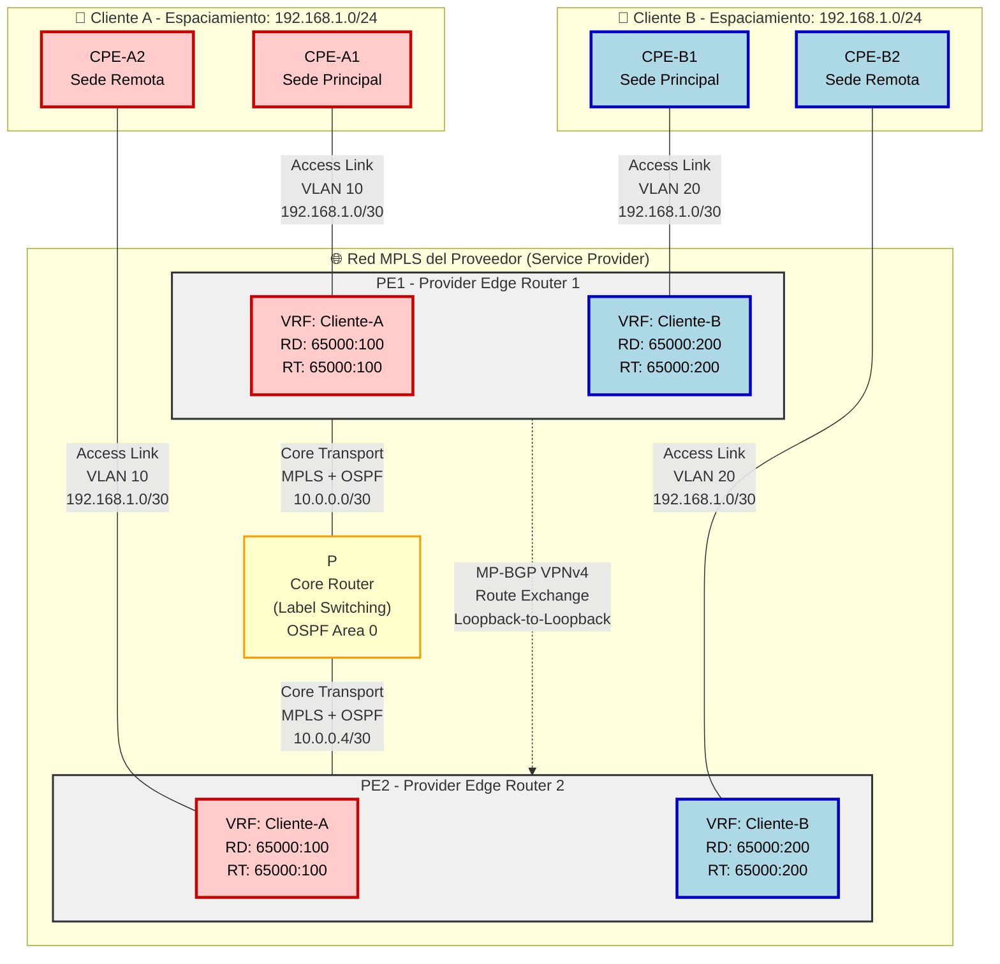

# Topología de Red - MPLS L3VPN con VRF (Virtual Routing and Forwarding)

## 📋 Resumen Ejecutivo

Esta topología representa una arquitectura **MPLS L3VPN (Multiprotocol Label Switching Layer 3 VPN)** típica de Service Providers, que permite ofrecer servicios de VPN privada a múltiples clientes empresariales utilizando la misma infraestructura de red.

**Características principales:**
- **Tecnología:** MPLS L3VPN con VRF
- **Clientes:** 2 clientes (A y B) con espacios de direccionamiento superpuestos (overlapping IPs: 192.168.1.0/24)
- **Dispositivos PE (Provider Edge):** 2 routers (PE1, PE2)
- **Dispositivos P (Provider Core):** 1 router central
- **CPEs (Customer Premises Equipment):** 4 routers de cliente (2 por cliente)
- **Protocolo IGP (Core):** OSPF
- **Protocolo de intercambio VPN:** MP-BGP (Multiprotocol BGP) con VPNv4 address-family
- **Separación lógica:** VRF instances independientes por cliente

**Ventaja clave:** Permite que múltiples clientes usen los mismos rangos de IP privados sin conflictos, gracias al aislamiento proporcionado por VRF.

---

## 🔍 Análisis Detallado

### Componentes Principales

#### 1. **CPE (Customer Premises Equipment)**
- **CPE_A1, CPE_A2:** Routers del Cliente A en sus respectivas sedes
- **CPE_B1, CPE_B2:** Routers del Cliente B en sus respectivas sedes
- **Función:** Proveer conectividad local y enrutamiento hacia la red del proveedor
- **Configuración típica:** Routing estático o dinámico (OSPF, EIGRP, BGP) hacia el PE

#### 2. **PE (Provider Edge Routers)**
- **PE1, PE2:** Routers de borde del proveedor
- **Función principal:**
  - Mantener múltiples VRFs (uno por cliente)
  - Realizar el etiquetado MPLS de paquetes (Label imposition/disposition)
  - Intercambiar rutas VPNv4 via MP-BGP
  - Actuar como CE-facing devices
- **Interfaces:**
  - Interfaces hacia CPE (asociadas a VRF específicos)
  - Interfaces hacia Core (global routing table)

#### 3. **P (Provider Core Router)**
- **P:** Router de núcleo de la red MPLS
- **Función:**
  - Conmutación de etiquetas MPLS (Label switching)
  - Transporte de paquetes etiquetados
  - NO tiene conocimiento de las rutas VPN (solo conoce rutas hacia PEs)
  - Ejecuta protocolo IGP (OSPF) para accesibilidad entre PEs

#### 4. **VRF (Virtual Routing and Forwarding)**
- **VRF_A:** Instancia de routing dedicada al Cliente A (en PE1 y PE2)
- **VRF_B:** Instancia de routing dedicada al Cliente B (en PE1 y PE2)
- **Función:**
  - Separación lógica de tablas de routing
  - Cada VRF tiene su propia tabla de routing independiente
  - Permite reutilización de espacio de direccionamiento

### Arquitectura

```
Capa de Acceso          Capa de Edge              Capa Core           Capa de Edge          Capa de Acceso
(Cliente A/B)           (PE Routers)              (P Routers)         (PE Routers)          (Cliente A/B)
     |                       |                         |                     |                     |
   CPE_A1 ----VLAN 10----> PE1 <----OSPF/MPLS----> P <----OSPF/MPLS----> PE2 <----VLAN 10---- CPE_A2
   CPE_B1 ----VLAN 20----> PE1                      |                     PE2 <----VLAN 20---- CPE_B2
                            |                       |                      |
                        [VRF_A]                     |                  [VRF_A]
                        [VRF_B]                MP-BGP                  [VRF_B]
                            |                (VPNv4 Routes)              |
                            +-------------------------------------------+
```

**Flujo de datos:**
1. **CPE → PE:** Paquetes IP nativos (sin etiquetas)
2. **PE (Ingress):** Lookup en VRF, asigna labels MPLS (VPN label + Transport label)
3. **P:** Conmuta basándose en transport label (label switching)
4. **PE (Egress):** Remueve labels, lookup en VRF, entrega paquete IP al CPE destino

### Protocolos y Tecnologías

#### 1. **MPLS (Multiprotocol Label Switching)**
- **Función:** Forwarding basado en etiquetas en lugar de lookups IP
- **Labels utilizados:**
  - **Transport Label:** Para forwarding entre PEs a través del core
  - **VPN Label:** Para identificar el VRF de destino en el PE egress

#### 2. **OSPF (Open Shortest Path First)**
- **Área:** Típicamente Area 0 (backbone)
- **Función:** IGP del core para alcanzabilidad entre PEs
- **Dispositivos participantes:** PE1, P, PE2

#### 3. **MP-BGP (Multiprotocol BGP)**
- **Address-Family:** VPNv4 (VPN-IPv4)
- **Función:** Intercambio de rutas VPN entre PEs
- **Route Distinguisher (RD):** Hace únicas las rutas VPN en MP-BGP
- **Route Target (RT):** Control de importación/exportación de rutas entre VRFs
- **Sesiones:** iBGP entre PE1 y PE2 (loopbacks como source)

#### 4. **VRF (Virtual Routing and Forwarding)**
- **Componentes:**
  - **RD (Route Distinguisher):** Formato típico AS:nn o IP:nn
  - **RT (Route Target):** Import/Export para control de rutas
  - **Tabla de routing independiente**
  - **CEF table separada**

#### 5. **VLANs (Acceso Layer 2)**
- **VLAN 10:** Separación de tráfico del Cliente A
- **VLAN 20:** Separación de tráfico del Cliente B
- **Función:** Segmentación en capa de acceso (CPE-PE)

#### 6. **LDP (Label Distribution Protocol)** o **RSVP-TE**
- **Función:** Distribución de transport labels en el core
- **Alternativa:** Segment Routing (SR-MPLS) en implementaciones modernas

### Consideraciones de Diseño

#### ✅ **Fortalezas del Diseño**

1. **Separación lógica robusta:**
   - VRF garantiza aislamiento total entre clientes
   - Overlapping IP address space no genera conflictos

2. **Escalabilidad:**
   - Fácil adición de nuevos clientes (nuevos VRFs)
   - La infraestructura core (P routers) no necesita conocer rutas de clientes

3. **Seguridad:**
   - Los clientes no tienen visibilidad de la red del proveedor
   - Aislamiento a nivel de capa 3

4. **Flexibilidad:**
   - Posibilidad de ofrecer diferentes SLAs por cliente
   - QoS diferenciado por VRF

#### ⚠️ **Mejoras y Consideraciones**

1. **Redundancia:**
   - **Recomendación:** Implementar múltiples routers P para alta disponibilidad
   - Considerar dual-homing de CPEs hacia ambos PEs
   - Implementar routing protocol dinámico entre CPE-PE (OSPF, BGP)

2. **Seguridad adicional:**
   - Filtrado de rutas en import/export de VRF (route-maps)
   - Unicast Reverse Path Forwarding (uRPF) en interfaces CE-facing
   - Control Plane Policing (CoPP) en PEs

3. **Monitoreo y troubleshooting:**
   - IP SLA para medición de performance por VRF
   - MPLS OAM (LSP Ping, LSP Traceroute)
   - Netflow/sFlow por VRF

4. **Escalabilidad futura:**
   - Considerar Route Reflectors si se agregan más PEs
   - Evaluar MPLS Traffic Engineering para optimización de tráfico
   - Segment Routing para simplificar el control plane

5. **QoS (Quality of Service):**
   - Clasificación y marcado en PE (DSCP/EXP bits)
   - Queuing y shaping por clase de servicio
   - End-to-end QoS policy

#### 📊 **Best Practices MPLS L3VPN**

- **Loopback interfaces:** Usar /32 para PEs (estabilidad de sesiones BGP)
- **MTU:** Considerar +14-18 bytes para MPLS labels (evitar fragmentación)
- **BGP timers:** Ajustar keepalive/holdtime para detección rápida de fallos
- **Label allocation:** Configurar per-VRF label allocation cuando sea posible
- **Route dampening:** Implementar en MP-BGP para estabilidad

---

## 🗺️ Diagrama de Topología Optimizado



**Leyenda del Diagrama:**
- 🔴 **Rojo:** Cliente A (VRF Cliente-A)
- 🔵 **Azul:** Cliente B (VRF Cliente-B)
- 🟡 **Amarillo:** Core MPLS (P Router)
- ⚪ **Gris:** Provider Edge (PE Routers)
- **Líneas sólidas:** Conexiones físicas
- **Líneas punteadas:** Sesiones de control plane (MP-BGP)
- **Líneas de puntos gruesas:** Túneles VPN lógicos

---

## 🧪 Laboratorios Prácticos

### 🎓 Nivel CCNA

---

#### Lab 1: Configuración Básica de VRF

**Pregunta:**
En el router PE1, crea el VRF "Cliente-A" con Route Distinguisher 65000:100 y Route Target 65000:100 (import y export). Luego, asocia la interfaz GigabitEthernet0/0 a este VRF y asigna la dirección IP 192.168.1.1/30. Verifica la configuración.

**Respuesta:**

```cisco
! ========================================
! PASO 1: Creación y configuración del VRF
! ========================================
PE1# configure terminal
PE1(config)# vrf definition Cliente-A
PE1(config-vrf)# rd 65000:100
PE1(config-vrf)# route-target both 65000:100
PE1(config-vrf)# address-family ipv4
PE1(config-vrf-af)# exit-address-family
PE1(config-vrf)# exit

! ========================================
! PASO 2: Asociar interfaz al VRF
! ========================================
PE1(config)# interface GigabitEthernet0/0
PE1(config-if)# description ** Link to CPE-A1 **
PE1(config-if)# vrf forwarding Cliente-A
% Interface GigabitEthernet0/0 IPv4 disabled and address(es) removed due to enabling VRF Cliente-A
PE1(config-if)# ip address 192.168.1.1 255.255.255.252
PE1(config-if)# no shutdown
PE1(config-if)# exit
PE1(config)# exit

! ========================================
! PASO 3: Verificación del VRF
! ========================================
PE1# show vrf

  Name                             Default RD            Protocols   Interfaces
  Cliente-A                        65000:100             ipv4        Gi0/0

PE1# show vrf detail Cliente-A

VRF Cliente-A (VRF Id = 1); default RD 65000:100; default VPNID <not set>
  New CLI format, supports multiple address-families
  Flags: 0x1808
  No interfaces
  Address family ipv4 unicast (Table ID = 1):
    Flags: 0x0
    Export VPN route-target communities
      RT:65000:100
    Import VPN route-target communities
      RT:65000:100
    No import route-map
    No global export route-map
    No export route-map
    VRF label distribution protocol: not configured
    VRF label allocation mode: per-prefix

PE1# show ip vrf interfaces

Interface              IP-Address      VRF                              Protocol
Gi0/0                  192.168.1.1     Cliente-A                        up

PE1# show ip interface GigabitEthernet0/0

GigabitEthernet0/0 is up, line protocol is up
  Internet address is 192.168.1.1/30
  Broadcast address is 255.255.255.255
  Address determined by setup command
  MTU is 1500 bytes
  Helper address is not set
  Directed broadcast forwarding is disabled
  Outgoing access list is not set
  Inbound  access list is not set
  Proxy ARP is enabled
  Local Proxy ARP is disabled
  Security level is default
  Split horizon is enabled
  ICMP redirects are always sent
  ICMP unreachables are always sent
  ICMP mask replies are never sent
  IP fast switching is enabled
  IP CEF switching is enabled
  IP CEF switching turbo vector
  VRF: Cliente-A

PE1# show ip route vrf Cliente-A

Routing Table: Cliente-A
Codes: L - local, C - connected, S - static, R - RIP, M - mobile, B - BGP
       D - EIGRP, EX - EIGRP external, O - OSPF, IA - OSPF inter area
       N1 - OSPF NSSA external type 1, N2 - OSPF NSSA external type 2
       E1 - OSPF external type 1, E2 - OSPF external type 2
       i - IS-IS, su - IS-IS summary, L1 - IS-IS level-1, L2 - IS-IS level-2
       ia - IS-IS inter area, * - candidate default, U - per-user static route
       o - ODR, P - periodic downloaded static route, H - NHRP, l - LISP
       a - application route
       + - replicated route, % - next hop override, p - overrides from PfR

Gateway of last resort is not set

      192.168.1.0/24 is variably subnetted, 2 subnets, 2 masks
C        192.168.1.0/30 is directly connected, GigabitEthernet0/0
L        192.168.1.1/32 is directly connected, GigabitEthernet0/0
```

**Explicación:**
- Se creó el VRF con RD 65000:100 para hacer única la ruta en MP-BGP
- El comando `route-target both` aplica el mismo RT para import y export
- Al asociar la interfaz al VRF, se elimina automáticamente la IP previa
- La tabla de routing del VRF está completamente separada de la global
- Solo las rutas conectadas existen inicialmente en el VRF

---

#### Lab 2: Configuración de MPLS en Interfaces Core

**Pregunta:**
Habilita MPLS en las interfaces que conectan PE1 con el router P (interfaz Serial0/0/0). Configura LDP (Label Distribution Protocol) y verifica que se estén distribuyendo labels correctamente.

**Respuesta:**

```cisco
! ========================================
! PASO 1: Habilitar CEF (prerequisito para MPLS)
! ========================================
PE1# configure terminal
PE1(config)# ip cef
PE1(config)# exit

! ========================================
! PASO 2: Configurar MPLS en la interfaz
! ========================================
PE1# configure terminal
PE1(config)# interface Serial0/0/0
PE1(config-if)# description ** MPLS Link to P Core **
PE1(config-if)# ip address 10.0.0.1 255.255.255.252
PE1(config-if)# mpls ip
PE1(config-if)# no shutdown
PE1(config-if)# exit
PE1(config)# exit

! ========================================
! PASO 3: Verificar MPLS LDP
! ========================================
PE1# show mpls interfaces

Interface              IP            Tunnel   BGP Static Operational
Serial0/0/0            Yes (ldp)     No       No  No     Yes

PE1# show mpls ldp neighbor

    Peer LDP Ident: 10.255.255.2:0; Local LDP Ident 10.255.255.1:0
        TCP connection: 10.255.255.2.646 - 10.255.255.1.49408
        State: Oper; Msgs sent/rcvd: 45/44; Downstream
        Up time: 00:15:23
        LDP discovery sources:
          Serial0/0/0, Src IP addr: 10.0.0.2
        Addresses bound to peer LDP Ident:
          10.0.0.2        10.255.255.2    10.0.0.5

PE1# show mpls ldp discovery

 Local LDP Identifier:
    10.255.255.1:0
    Discovery Sources:
    Interfaces:
      Serial0/0/0 (ldp): xmit/recv
        LDP Id: 10.255.255.2:0

PE1# show mpls forwarding-table

Local      Outgoing   Prefix           Bytes Label   Outgoing   Next Hop
Label      Label      or Tunnel Id     Switched      interface
16         Pop Label  10.0.0.4/30      0             Se0/0/0    10.0.0.2
17         16         10.255.255.2/32  0             Se0/0/0    10.0.0.2
18         17         10.255.255.3/32  0             Se0/0/0    10.0.0.2

PE1# show mpls label range

Downstream Generic label region: Min/Max label: 16/1048575

PE1# show ip cef

Prefix               Next Hop             Interface
0.0.0.0/0            drop                 Null0 (default route handler entry)
0.0.0.0/8            drop
0.0.0.0/32           receive
10.0.0.0/30          attached             Serial0/0/0
10.0.0.1/32          receive              Serial0/0/0
10.0.0.4/30          10.0.0.2             Serial0/0/0
10.255.255.1/32      receive              Loopback0
10.255.255.2/32      10.0.0.2             Serial0/0/0
                     (labels: 16 17 18)
```

**Explicación:**
- MPLS requiere CEF (Cisco Express Forwarding) habilitado
- `mpls ip` en la interfaz activa LDP automáticamente
- LDP usa UDP 646 para discovery y TCP 646 para sesión
- La LFIB (Label Forwarding Information Base) muestra los labels asignados
- Labels locales comienzan en 16 (rango default: 16-1048575)
- "Pop Label" indica penultimate hop popping (PHP)

---

#### Lab 3: Configuración de OSPF en el Core MPLS

**Pregunta:**
Configura OSPF process 1 en el router PE1 para el core MPLS. Incluye las redes del loopback (10.255.255.1/32) y la interfaz Serial0/0/0 (10.0.0.0/30) en el área 0. Verifica las adyacencias OSPF.

**Respuesta:**

```cisco
! ========================================
! PASO 1: Configuración del Loopback
! ========================================
PE1# configure terminal
PE1(config)# interface Loopback0
PE1(config-if)# description ** MPLS Router-ID and BGP Source **
PE1(config-if)# ip address 10.255.255.1 255.255.255.255
PE1(config-if)# exit

! ========================================
! PASO 2: Configuración de OSPF
! ========================================
PE1(config)# router ospf 1
PE1(config-router)# router-id 10.255.255.1
PE1(config-router)# network 10.255.255.1 0.0.0.0 area 0
PE1(config-router)# network 10.0.0.0 0.0.0.3 area 0
PE1(config-router)# exit
PE1(config)# exit

! ========================================
! PASO 3: Verificación de OSPF
! ========================================
PE1# show ip ospf

 Routing Process "ospf 1" with ID 10.255.255.1
 Start time: 00:05:12.456, Time elapsed: 00:10:34.123
 Supports only single TOS(TOS0) routes
 Supports opaque LSA
 Supports Link-local Signaling (LLS)
 Supports area transit capability
 Supports NSSA (compatible with RFC 3101)
 Supports Database Exchange Summary List Optimization (RFC 5243)
 Event-log enabled, Maximum number of events: 1000, Mode: cyclic
 Router is not originating router-LSAs with maximum metric
 Initial SPF schedule delay 5000 msecs
 Minimum hold time between two consecutive SPFs 10000 msecs
 Maximum wait time between two consecutive SPFs 10000 msecs
 Incremental-SPF disabled
 Minimum LSA interval 5 secs
 Minimum LSA arrival 1000 msecs
 LSA group pacing timer 240 secs
 Interface flood pacing timer 33 msecs
 Retransmission pacing timer 66 msecs
 Number of external LSA 0. Checksum Sum 0x000000
 Number of opaque AS LSA 0. Checksum Sum 0x000000
 Number of DCbitless external and opaque AS LSA 0
 Number of DoNotAge external and opaque AS LSA 0
 Number of areas in this router is 1. 1 normal 0 stub 0 nssa
 Number of areas transit capable is 0
 External flood list length 0
 IETF NSF helper support enabled
 Cisco NSF helper support enabled
 Reference bandwidth unit is 100 mbps
    Area BACKBONE(0)
        Number of interfaces in this area is 2
        Area has no authentication
        SPF algorithm last executed 00:02:15.789 ago
        SPF algorithm executed 3 times
        Area ranges are
        Number of LSA 4. Checksum Sum 0x01F234
        Number of opaque link LSA 0. Checksum Sum 0x000000
        Number of DCbitless LSA 0
        Number of indication LSA 0
        Number of DoNotAge LSA 0
        Flood list length 0

PE1# show ip ospf neighbor

Neighbor ID     Pri   State           Dead Time   Address         Interface
10.255.255.2    0     FULL/  -        00:00:34    10.0.0.2        Serial0/0/0

PE1# show ip ospf interface brief

Interface    PID   Area            IP Address/Mask    Cost  State Nbrs F/C
Lo0          1     0               10.255.255.1/32    1     LOOP  0/0
Se0/0/0      1     0               10.0.0.1/30        64    P2P   1/1

PE1# show ip ospf interface Serial0/0/0

Serial0/0/0 is up, line protocol is up
  Internet Address 10.0.0.1/30, Area 0, Attached via Network Statement
  Process ID 1, Router ID 10.255.255.1, Network Type POINT_TO_POINT, Cost: 64
  Topology-MTID    Cost    Disabled    Shutdown      Topology Name
        0           64        no          no            Base
  Transmit Delay is 1 sec, State POINT_TO_POINT
  Timer intervals configured, Hello 10, Dead 40, Wait 40, Retransmit 5
    oob-resync timeout 40
    Hello due in 00:00:03
  Supports Link-local Signaling (LLS)
  Cisco NSF helper support enabled
  IETF NSF helper support enabled
  Index 2/2, flood queue length 0
  Next 0x0(0)/0x0(0)
  Last flood scan length is 1, maximum is 1
  Last flood scan time is 0 msec, maximum is 0 msec
  Neighbor Count is 1, Adjacent neighbor count is 1
    Adjacent with neighbor 10.255.255.2
  Suppress hello for 0 neighbor(s)

PE1# show ip route ospf

Codes: L - local, C - connected, S - static, R - RIP, M - mobile, B - BGP
       D - EIGRP, EX - EIGRP external, O - OSPF, IA - OSPF inter area
       N1 - OSPF NSSA external type 1, N2 - OSPF NSSA external type 2
       E1 - OSPF external type 1, E2 - OSPF external type 2
       i - IS-IS, su - IS-IS summary, L1 - IS-IS level-1, L2 - IS-IS level-2
       ia - IS-IS inter area, * - candidate default, U - per-user static route
       o - ODR, P - periodic downloaded static route, H - NHRP, l - LISP
       a - application route
       + - replicated route, % - next hop override, p - overrides from PfR

Gateway of last resort is not set

      10.0.0.0/8 is variably subnetted, 5 subnets, 2 masks
O        10.0.0.4/30 [110/128] via 10.0.0.2, 00:02:15, Serial0/0/0
O        10.255.255.2/32 [110/65] via 10.0.0.2, 00:02:15, Serial0/0/0
O        10.255.255.3/32 [110/129] via 10.0.0.2, 00:02:15, Serial0/0/0

PE1# ping 10.255.255.3 source 10.255.255.1

Type escape sequence to abort.
Sending 5, 100-byte ICMP Echos to 10.255.255.3, timeout is 2 seconds:
Packet sent with a source address of 10.255.255.1
!!!!!
Success rate is 100 percent (5/5), round-trip min/avg/max = 1/2/4 ms
```

**Explicación:**
- Se usa la máscara wildcard /32 (0.0.0.0) para anunciar solo el loopback
- La adyacencia OSPF está en estado FULL (completamente formada)
- Serial interfaces son automáticamente tipo point-to-point en OSPF
- El costo OSPF por defecto para serial es 64 (basado en 1.544 Mbps)
- Las rutas OSPF hacia otros PEs son críticas para MP-BGP (next-hop resolution)

---

#### Lab 4: Configuración de Routing Estático en VRF

**Pregunta:**
En el VRF "Cliente-A" del router PE1, configura una ruta estática hacia la red 192.168.10.0/24 del cliente, apuntando al CPE-A1 (next-hop 192.168.1.2). Verifica la ruta y realiza un ping extendido desde el VRF.

**Respuesta:**

```cisco
! ========================================
! PASO 1: Configuración de ruta estática en VRF
! ========================================
PE1# configure terminal
PE1(config)# ip route vrf Cliente-A 192.168.10.0 255.255.255.0 192.168.1.2
PE1(config)# exit

! ========================================
! PASO 2: Verificación de la ruta estática
! ========================================
PE1# show ip route vrf Cliente-A

Routing Table: Cliente-A
Codes: L - local, C - connected, S - static, R - RIP, M - mobile, B - BGP
       D - EIGRP, EX - EIGRP external, O - OSPF, IA - OSPF inter area
       N1 - OSPF NSSA external type 1, N2 - OSPF NSSA external type 2
       E1 - OSPF external type 1, E2 - OSPF external type 2
       i - IS-IS, su - IS-IS summary, L1 - IS-IS level-1, L2 - IS-IS level-2
       ia - IS-IS inter area, * - candidate default, U - per-user static route
       o - ODR, P - periodic downloaded static route, H - NHRP, l - LISP
       a - application route
       + - replicated route, % - next hop override, p - overrides from PfR

Gateway of last resort is not set

      192.168.1.0/24 is variably subnetted, 2 subnets, 2 masks
C        192.168.1.0/30 is directly connected, GigabitEthernet0/0
L        192.168.1.1/32 is directly connected, GigabitEthernet0/0
      192.168.10.0/24 is subnetted, 1 subnets
S        192.168.10.0 [1/0] via 192.168.1.2

PE1# show ip route vrf Cliente-A 192.168.10.0

Routing entry for 192.168.10.0/24
  Known via "static", distance 1, metric 0
  Routing Descriptor Blocks:
  * 192.168.1.2
      Route metric is 0, traffic share count is 1

PE1# show ip cef vrf Cliente-A 192.168.10.0

192.168.10.0/24
  nexthop 192.168.1.2 GigabitEthernet0/0

! ========================================
! PASO 3: Verificar conectividad con ping desde VRF
! ========================================
PE1# ping vrf Cliente-A 192.168.1.2

Type escape sequence to abort.
Sending 5, 100-byte ICMP Echos to 192.168.1.2, timeout is 2 seconds:
!!!!!
Success rate is 100 percent (5/5), round-trip min/avg/max = 1/1/2 ms

PE1# ping vrf Cliente-A 192.168.10.1 source 192.168.1.1

Type escape sequence to abort.
Sending 5, 100-byte ICMP Echos to 192.168.10.1, timeout is 2 seconds:
Packet sent with a source address of 192.168.1.1
!!!!!
Success rate is 100 percent (5/5), round-trip min/avg/max = 1/2/4 ms

! ========================================
! PASO 4: Verificar múltiples VRFs simultáneamente
! ========================================
PE1# show ip route vrf * 192.168.10.0

Routing Table: Cliente-A
Routing entry for 192.168.10.0/24
  Known via "static", distance 1, metric 0
  Routing Descriptor Blocks:
  * 192.168.1.2
      Route metric is 0, traffic share count is 1

% Subnet not in table: Cliente-B

PE1# show run | section ip route vrf

ip route vrf Cliente-A 192.168.10.0 255.255.255.0 192.168.1.2
```

**Explicación:**
- Las rutas estáticas en VRF usan la sintaxis `ip route vrf <nombre>`
- El next-hop (192.168.1.2) debe ser alcanzable a través de una interfaz asociada al VRF
- El comando `ping vrf` permite hacer ping desde un VRF específico
- CEF mantiene tablas separadas por VRF para forwarding optimizado
- Las rutas estáticas en un VRF no afectan otros VRFs ni la tabla global

---

#### Lab 5: Configuración de Subinterfaces con VLANs para Multiples Clientes

**Pregunta:**
En el router PE1, configura subinterfaces en la interfaz FastEthernet0/1 para separar el tráfico de dos clientes usando VLANs. Crea la subinterface 0/1.10 para Cliente-A (VLAN 10, VRF Cliente-A, IP 10.10.10.1/24) y la subinterface 0/1.20 para Cliente-B (VLAN 20, VRF Cliente-B, IP 10.20.20.1/24). Verifica la configuración.

**Respuesta:**

```cisco
! ========================================
! PASO 1: Configurar VRF Cliente-B primero
! ========================================
PE1# configure terminal
PE1(config)# vrf definition Cliente-B
PE1(config-vrf)# rd 65000:200
PE1(config-vrf)# route-target both 65000:200
PE1(config-vrf)# address-family ipv4
PE1(config-vrf-af)# exit-address-family
PE1(config-vrf)# exit

! ========================================
! PASO 2: Habilitar interfaz física principal
! ========================================
PE1(config)# interface FastEthernet0/1
PE1(config-if)# description ** Trunk to Customer Switch **
PE1(config-if)# no ip address
PE1(config-if)# no shutdown
PE1(config-if)# exit

! ========================================
! PASO 3: Configurar subinterface para Cliente-A
! ========================================
PE1(config)# interface FastEthernet0/1.10
PE1(config-subif)# description ** Cliente-A VLAN 10 **
PE1(config-subif)# encapsulation dot1Q 10
PE1(config-subif)# vrf forwarding Cliente-A
PE1(config-subif)# ip address 10.10.10.1 255.255.255.0
PE1(config-subif)# exit

! ========================================
! PASO 4: Configurar subinterface para Cliente-B
! ========================================
PE1(config)# interface FastEthernet0/1.20
PE1(config-subif)# description ** Cliente-B VLAN 20 **
PE1(config-subif)# encapsulation dot1Q 20
PE1(config-subif)# vrf forwarding Cliente-B
PE1(config-subif)# ip address 10.20.20.1 255.255.255.0
PE1(config-subif)# exit
PE1(config)# exit

! ========================================
! PASO 5: Verificación completa
! ========================================
PE1# show vlan

VLAN Name                             Status    Ports
---- -------------------------------- --------- -------------------------------
1    default                          active
10   VLAN0010                         active
20   VLAN0020                         active

PE1# show interfaces status

Port      Name               Status       Vlan       Duplex  Speed Type
Fa0/1     Trunk to Customer  connected    trunk      a-full  a-100 10/100BaseTX

PE1# show ip interface brief

Interface                  IP-Address      OK? Method Status                Protocol
FastEthernet0/1            unassigned      YES unset  up                    up
FastEthernet0/1.10         10.10.10.1      YES manual up                    up
FastEthernet0/1.20         10.20.20.1      YES manual up                    up
GigabitEthernet0/0         192.168.1.1     YES manual up                    up
Loopback0                  10.255.255.1    YES manual up                    up
Serial0/0/0                10.0.0.1        YES manual up                    up

PE1# show vrf

  Name                             Default RD            Protocols   Interfaces
  Cliente-A                        65000:100             ipv4        Gi0/0
                                                                     Fa0/1.10
  Cliente-B                        65000:200             ipv4        Fa0/1.20

PE1# show ip vrf interfaces

Interface              IP-Address      VRF                              Protocol
Gi0/0                  192.168.1.1     Cliente-A                        up
Fa0/1.10               10.10.10.1      Cliente-A                        up
Fa0/1.20               10.20.20.1      Cliente-B                        up

PE1# show interfaces FastEthernet0/1.10

FastEthernet0/1.10 is up, line protocol is up
  Hardware is Gt96k FE, address is c200.1a2b.0001 (bia c200.1a2b.0001)
  Description: ** Cliente-A VLAN 10 **
  Internet address is 10.10.10.1/24
  MTU 1500 bytes, BW 100000 Kbit/sec, DLY 100 usec,
     reliability 255/255, txload 1/255, rxload 1/255
  Encapsulation 802.1Q Virtual LAN, Vlan ID  10.
  ARP type: ARPA, ARP Timeout 04:00:00
  Keepalive set (10 sec)
  Last clearing of "show interface" counters never

PE1# show run interface FastEthernet0/1.10

Building configuration...

Current configuration : 157 bytes
!
interface FastEthernet0/1.10
 description ** Cliente-A VLAN 10 **
 encapsulation dot1Q 10
 vrf forwarding Cliente-A
 ip address 10.10.10.1 255.255.255.0
end

PE1# show ip route vrf Cliente-A

Routing Table: Cliente-A
Codes: L - local, C - connected, S - static, R - RIP, M - mobile, B - BGP

Gateway of last resort is not set

      10.0.0.0/8 is variably subnetted, 2 subnets, 2 masks
C        10.10.10.0/24 is directly connected, FastEthernet0/1.10
L        10.10.10.1/32 is directly connected, FastEthernet0/1.10
      192.168.1.0/24 is variably subnetted, 2 subnets, 2 masks
C        192.168.1.0/30 is directly connected, GigabitEthernet0/0
L        192.168.1.1/32 is directly connected, GigabitEthernet0/0
      192.168.10.0/24 is subnetted, 1 subnets
S        192.168.10.0 [1/0] via 192.168.1.2

PE1# show ip route vrf Cliente-B

Routing Table: Cliente-B
Codes: L - local, C - connected, S - static, R - RIP, M - mobile, B - BGP

Gateway of last resort is not set

      10.0.0.0/8 is variably subnetted, 2 subnets, 2 masks
C        10.20.20.0/24 is directly connected, FastEthernet0/1.20
L        10.20.20.1/32 is directly connected, FastEthernet0/1.20

PE1# ping vrf Cliente-A 10.10.10.1

Type escape sequence to abort.
Sending 5, 100-byte ICMP Echos to 10.10.10.1, timeout is 2 seconds:
!!!!!
Success rate is 100 percent (5/5), round-trip min/avg/max = 1/1/1 ms

PE1# ping vrf Cliente-B 10.20.20.1

Type escape sequence to abort.
Sending 5, 100-byte ICMP Echos to 10.20.20.1, timeout is 2 seconds:
!!!!!
Success rate is 100 percent (5/5), round-trip min/avg/max = 1/1/1 ms
```

**Explicación:**
- La interfaz física (Fa0/1) NO debe tener IP address (actúa como trunk)
- `encapsulation dot1Q <vlan-id>` define el tagging 802.1Q en la subinterfaz
- Cada subinterfaz puede asociarse a un VRF diferente
- Esto permite múltiples clientes sobre una misma interfaz física
- Las tablas de routing de ambos VRFs permanecen completamente aisladas
- El switch conectado debe tener el puerto en modo trunk con las VLANs permitidas

---

### 🎓 Nivel CCNP

---

#### Lab 6: Configuración de MP-BGP para VPNv4

**Pregunta:**
Configura MP-BGP entre PE1 (10.255.255.1) y PE2 (10.255.255.3) para intercambiar rutas VPNv4. Usa el AS 65000, activa la address-family VPNv4, y habilita el envío de extended communities. Verifica la sesión BGP y las rutas VPNv4.

**Respuesta:**

```cisco
! ========================================
! PASO 1: Configuración de BGP en PE1
! ========================================
PE1# configure terminal
PE1(config)# router bgp 65000
PE1(config-router)# bgp router-id 10.255.255.1
PE1(config-router)# bgp log-neighbor-changes
PE1(config-router)# no bgp default ipv4-unicast
PE1(config-router)#
PE1(config-router)# neighbor 10.255.255.3 remote-as 65000
PE1(config-router)# neighbor 10.255.255.3 description ** PE2 - VPNv4 Peer **
PE1(config-router)# neighbor 10.255.255.3 update-source Loopback0
PE1(config-router)#
PE1(config-router)# address-family vpnv4
PE1(config-router-af)# neighbor 10.255.255.3 activate
PE1(config-router-af)# neighbor 10.255.255.3 send-community both
PE1(config-router-af)# exit-address-family
PE1(config-router)# exit
PE1(config)# exit

! ========================================
! PASO 2: Verificación de la sesión BGP
! ========================================
PE1# show ip bgp summary

BGP router identifier 10.255.255.1, local AS number 65000
BGP table version is 1, main routing table version 1

Neighbor        V           AS MsgRcvd MsgSent   TblVer  InQ OutQ Up/Down  State/PfxRcd
10.255.255.3    4        65000      15      15        1    0    0 00:10:23        0

PE1# show ip bgp vpnv4 all summary

BGP router identifier 10.255.255.1, local AS number 65000
BGP table version is 1, main routing table version 1

Neighbor        V           AS MsgRcvd MsgSent   TblVer  InQ OutQ Up/Down  State/PfxRcd
10.255.255.3    4        65000      15      15        1    0    0 00:10:23        0

PE1# show bgp vpnv4 unicast all summary

BGP router identifier 10.255.255.1, local AS number 65000
BGP table version is 5, main routing table version 5
4 network entries using 992 bytes of memory
4 path entries using 416 bytes of memory
2/2 BGP path/bestpath attribute entries using 528 bytes of memory
1 BGP extended community entries using 24 bytes of memory
0 BGP route-map cache entries using 0 bytes of memory
0 BGP filter-list cache entries using 0 bytes of memory
BGP using 1960 total bytes of memory
BGP activity 4/0 prefixes, 4/0 paths, scan interval 60 secs

Neighbor        V           AS MsgRcvd MsgSent   TblVer  InQ OutQ Up/Down  State/PfxRcd
10.255.255.3    4        65000      17      18        5    0    0 00:11:34        2

! ========================================
! PASO 3: Verificación detallada del vecino
! ========================================
PE1# show ip bgp vpnv4 all neighbors 10.255.255.3

BGP neighbor is 10.255.255.3,  remote AS 65000, internal link
  BGP version 4, remote router ID 10.255.255.3
  BGP state = Established, up for 00:11:45
  Last read 00:00:23, last write 00:00:34, hold time is 180, keepalive interval is 60 seconds
  Neighbor sessions:
    1 active, is not multisession capable (disabled)
  Neighbor capabilities:
    Route refresh: advertised and received(new)
    Four-octets ASN Capability: advertised and received
    Address family VPNv4 Unicast: advertised and received
    Enhanced Refresh Capability: advertised and received
    Multisession Capability:
    Stateful switchover support enabled: NO for session 1
  Message statistics:
    InQ depth is 0
    OutQ depth is 0
                         Sent       Rcvd
    Opens:                  1          1
    Notifications:          0          0
    Updates:                3          2
    Keepalives:            14         14
    Route Refresh:          0          0
    Total:                 18         17
  Default minimum time between advertisement runs is 0 seconds

 For address family: VPNv4 Unicast
  Session: 10.255.255.3
  BGP table version 5, neighbor version 5/0
  Output queue size : 0
  Index 1, Advertise bit 0
  2 accepted prefixes
  2 announced prefixes

  Connections established 1; dropped 0
  Last reset never
  Transport(tcp) path-mtu-discovery is enabled
  Graceful-Restart is disabled
Connection state is ESTAB, I/O status: 1, unread input bytes: 0
Connection is ECN Disabled, Mininum incoming TTL 0, Outgoing TTL 255
Local host: 10.255.255.1, Local port: 47865
Foreign host: 10.255.255.3, Foreign port: 179
Connection tableid (VRF): 0
Maximum output segment queue size: 50

! ========================================
! PASO 4: Verificar configuración de extended community
! ========================================
PE1# show run | section router bgp

router bgp 65000
 bgp router-id 10.255.255.1
 bgp log-neighbor-changes
 no bgp default ipv4-unicast
 neighbor 10.255.255.3 remote-as 65000
 neighbor 10.255.255.3 description ** PE2 - VPNv4 Peer **
 neighbor 10.255.255.3 update-source Loopback0
 !
 address-family vpnv4
  neighbor 10.255.255.3 activate
  neighbor 10.255.255.3 send-community both
 exit-address-family

PE1# show ip bgp neighbors 10.255.255.3 | include community

  Extended community attribute sent to this neighbor

PE1# show ip protocols

*** IP Routing is NSF aware ***

Routing Protocol is "ospf 1"
  Outgoing update filter list for all interfaces is not set
  Incoming update filter list for all interfaces is not set
  Router ID 10.255.255.1
  Number of areas in this router is 1. 1 normal 0 stub 0 nssa
  Maximum path: 4
  Routing for Networks:
    10.0.0.0 0.0.0.3 area 0
    10.255.255.1 0.0.0.0 area 0
  Routing Information Sources:
    Gateway         Distance      Last Update
    10.255.255.2         110      00:25:34
    10.255.255.3         110      00:25:34
  Distance: (default is 110)

Routing Protocol is "bgp 65000"
  Outgoing update filter list for all interfaces is not set
  Incoming update filter list for all interfaces is not set
  IGP synchronization is disabled
  Automatic route summarization is disabled
  Neighbor(s):
    Address          FiltIn FiltOut DistIn DistOut Weight RouteMap
    10.255.255.3
  Maximum path: 1
  Routing Information Sources:
    Gateway         Distance      Last Update
    10.255.255.3         200      00:12:45
  Distance: external 20 internal 200 local 200
```

**Explicación:**
- `no bgp default ipv4-unicast` desactiva IPv4 unicast por defecto (best practice MPLS)
- `update-source Loopback0` usa loopback para estabilidad (IP no cambia si cae una interfaz)
- `send-community both` envía standard y extended communities (necesario para RT)
- La sesión BGP usa TCP puerto 179
- Extended communities transportan Route Targets (RT) para import/export
- Estado "Established" indica sesión BGP completamente formada
- VPNv4 address-family es necesario para intercambiar rutas MPLS L3VPN

---

#### Lab 7: Redistribución entre VRF y MP-BGP con Route Target

**Pregunta:**
En PE1, redistribuye las rutas estáticas del VRF "Cliente-A" hacia MP-BGP. Verifica que las rutas se anuncien con el Route Target correcto y aparezcan en la tabla BGP VPNv4. Luego, verifica en PE2 que las rutas se importen correctamente al VRF "Cliente-A".

**Respuesta:**

```cisco
! ========================================
! CONFIGURACIÓN EN PE1
! ========================================
PE1# configure terminal
PE1(config)# router bgp 65000
PE1(config-router)#
PE1(config-router)# address-family ipv4 vrf Cliente-A
PE1(config-router-af)# redistribute static
PE1(config-router-af)# redistribute connected
PE1(config-router-af)# exit-address-family
PE1(config-router)# exit
PE1(config)# exit

! ========================================
! VERIFICACIÓN EN PE1 - Tabla BGP VPNv4
! ========================================
PE1# show ip bgp vpnv4 all

BGP table version is 8, local router ID is 10.255.255.1
Status codes: s suppressed, d damped, h history, * valid, > best, i - internal,
              r RIB-failure, S Stale, m multipath, b backup-path, f RT-Filter,
              x best-external, a additional-path, c RIB-compressed,
              t secondary path,
Origin codes: i - IGP, e - EGP, ? - incomplete
RPKI validation codes: V valid, I invalid, N Not found

     Network          Next Hop            Metric LocPrf Weight Path
Route Distinguisher: 65000:100 (default for vrf Cliente-A)
 *>   192.168.1.0/30   0.0.0.0                  0         32768 ?
 *>   192.168.10.0/24  192.168.1.2              0         32768 ?
Route Distinguisher: 65000:200 (default for vrf Cliente-B)
 *>   10.20.20.0/24    0.0.0.0                  0         32768 ?

PE1# show ip bgp vpnv4 vrf Cliente-A

BGP table version is 8, local router ID is 10.255.255.1
Status codes: s suppressed, d damped, h history, * valid, > best, i - internal,
              r RIB-failure, S Stale, m multipath, b backup-path, f RT-Filter,
              x best-external, a additional-path, c RIB-compressed,
              t secondary path,
Origin codes: i - IGP, e - EGP, ? - incomplete
RPKI validation codes: V valid, I invalid, N Not found

     Network          Next Hop            Metric LocPrf Weight Path
Route Distinguisher: 65000:100 (default for vrf Cliente-A)
 *>   192.168.1.0/30   0.0.0.0                  0         32768 ?
 *>   192.168.10.0/24  192.168.1.2              0         32768 ?

PE1# show ip bgp vpnv4 vrf Cliente-A 192.168.10.0

BGP routing table entry for 65000:100:192.168.10.0/24, version 7
Paths: (1 available, best #1, table Cliente-A)
  Not advertised to any peer
  Refresh Epoch 1
  Local
    192.168.1.2 from 0.0.0.0 (10.255.255.1)
      Origin incomplete, metric 0, localpref 100, weight 32768, valid, sourced, best
      Extended Community: RT:65000:100
      mpls labels in/out nolabel/24
      rx pathid: 0, tx pathid: 0x0

PE1# show ip route vrf Cliente-A

Routing Table: Cliente-A
Codes: L - local, C - connected, S - static, R - RIP, M - mobile, B - BGP
       D - EIGRP, EX - EIGRP external, O - OSPF, IA - OSPF inter area

Gateway of last resort is not set

      10.0.0.0/8 is variably subnetted, 2 subnets, 2 masks
C        10.10.10.0/24 is directly connected, FastEthernet0/1.10
L        10.10.10.1/32 is directly connected, FastEthernet0/1.10
      192.168.1.0/24 is variably subnetted, 2 subnets, 2 masks
C        192.168.1.0/30 is directly connected, GigabitEthernet0/0
L        192.168.1.1/32 is directly connected, GigabitEthernet0/0
      192.168.10.0/24 is subnetted, 1 subnets
S        192.168.10.0 [1/0] via 192.168.1.2

! ========================================
! VERIFICACIÓN EN PE2 - Importación de rutas
! ========================================
PE2# show ip bgp vpnv4 all

BGP table version is 10, local router ID is 10.255.255.3
Status codes: s suppressed, d damped, h history, * valid, > best, i - internal,
              r RIB-failure, S Stale, m multipath, b backup-path, f RT-Filter,
              x best-external, a additional-path, c RIB-compressed,
              t secondary path,
Origin codes: i - IGP, e - EGP, ? - incomplete
RPKI validation codes: V valid, I invalid, N Not found

     Network          Next Hop            Metric LocPrf Weight Path
Route Distinguisher: 65000:100
 *>i  192.168.1.0/30   10.255.255.1          0    100      0 ?
 *>i  192.168.10.0/24  10.255.255.1          0    100      0 ?
Route Distinguisher: 65000:100 (default for vrf Cliente-A)
 *>i  192.168.1.0/30   10.255.255.1          0    100      0 ?
 *>   192.168.1.4/30   0.0.0.0                  0         32768 ?
 *>i  192.168.10.0/24  10.255.255.1          0    100      0 ?

PE2# show ip bgp vpnv4 vrf Cliente-A 192.168.10.0

BGP routing table entry for 65000:100:192.168.10.0/24, version 9
Paths: (1 available, best #1, table Cliente-A)
  Advertised to update-groups:
     1
  Refresh Epoch 1
  Local, imported path from 65000:100:192.168.10.0/24 (global)
    10.255.255.1 (metric 129) from 10.255.255.1 (10.255.255.1)
      Origin incomplete, metric 0, localpref 100, valid, internal, best
      Extended Community: RT:65000:100
      Originator: 10.255.255.1, Cluster list: 10.255.255.1
      mpls labels in/out 24/nolabel
      rx pathid: 0, tx pathid: 0x0

PE2# show ip route vrf Cliente-A

Routing Table: Cliente-A
Codes: L - local, C - connected, S - static, R - RIP, M - mobile, B - BGP
       D - EIGRP, EX - EIGRP external, O - OSPF, IA - OSPF inter area

Gateway of last resort is not set

      192.168.1.0/24 is variably subnetted, 4 subnets, 2 masks
B        192.168.1.0/30 [200/0] via 10.255.255.1, 00:05:23
C        192.168.1.4/30 is directly connected, GigabitEthernet0/0
L        192.168.1.5/32 is directly connected, GigabitEthernet0/0
      192.168.10.0/24 is subnetted, 1 subnets
B        192.168.10.0 [200/0] via 10.255.255.1, 00:05:23

PE2# show ip cef vrf Cliente-A 192.168.10.0

192.168.10.0/24
  nexthop 10.255.255.1 Serial0/0/1 label 24

PE2# show mpls forwarding-table vrf Cliente-A 192.168.10.0

Local      Outgoing   Prefix           Bytes Label   Outgoing   Next Hop
Label      Label      or Tunnel Id     Switched      interface
24         Pop Label  192.168.10.0/24  0             Se0/0/1    10.0.0.6

PE2# ping vrf Cliente-A 192.168.10.1 source 192.168.1.5

Type escape sequence to abort.
Sending 5, 100-byte ICMP Echos to 192.168.10.1, timeout is 2 seconds:
Packet sent with a source address of 192.168.1.5
!!!!!
Success rate is 100 percent (5/5), round-trip min/avg/max = 2/3/5 ms

! ========================================
! VERIFICACIÓN DE EXTENDED COMMUNITIES (RT)
! ========================================
PE1# show ip bgp vpnv4 vrf Cliente-A 192.168.10.0 | include Extended

      Extended Community: RT:65000:100

PE2# show ip bgp vpnv4 vrf Cliente-A 192.168.10.0 | include Extended

      Extended Community: RT:65000:100

! ========================================
! VERIFICACIÓN DE LABELS MPLS
! ========================================
PE1# show mpls ldp bindings vrf Cliente-A

  tib entry: 192.168.10.0/24, rev 7
        local binding:  label: 24
        remote binding: lsr: 10.255.255.2:0, label: imp-null

PE2# show mpls forwarding-table labels 24

Local      Outgoing   Prefix           Bytes Label   Outgoing   Next Hop
Label      Label      or Tunnel Id     Switched      interface
24         Pop Label  192.168.10.0/24[V]   0         aggregate/Cliente-A
```

**Explicación:**
- `redistribute static/connected` inyecta rutas del VRF a BGP VPNv4
- Cada ruta VPNv4 incluye: RD + Prefix + RT (extended community)
- El RT (65000:100) controla qué VRFs importan la ruta en otros PEs
- El next-hop en PE2 es el loopback de PE1 (10.255.255.1)
- MPLS labels permiten forwarding sin lookup IP en el core
- AD (Administrative Distance) de iBGP es 200
- La ruta importada aparece con "B" (BGP) en el routing table del VRF

---

#### Lab 8: Configuración de OSPF entre CPE y PE (PE-CE Routing)

**Pregunta:**
Configura OSPF como protocolo PE-CE entre PE1 y CPE-A1 dentro del VRF "Cliente-A". Usa el process-id 100, área 0, y configura el sham-link para prevenir backdoor links. Redistribuye OSPF hacia BGP y BGP hacia OSPF. Verifica las adyacencias y rutas aprendidas.

**Respuesta:**

```cisco
! ========================================
! CONFIGURACIÓN EN PE1
! ========================================
PE1# configure terminal
! Crear loopback para sham-link
PE1(config)# interface Loopback100
PE1(config-if)# vrf forwarding Cliente-A
PE1(config-if)# ip address 172.16.1.1 255.255.255.255
PE1(config-if)# exit

! Configurar OSPF en VRF
PE1(config)# router ospf 100 vrf Cliente-A
PE1(config-router)# router-id 172.16.1.1
PE1(config-router)# redistribute bgp 65000 subnets
PE1(config-router)# network 192.168.1.0 0.0.0.3 area 0
PE1(config-router)# network 172.16.1.1 0.0.0.0 area 0
PE1(config-router)# exit

! Redistribuir OSPF hacia BGP
PE1(config)# router bgp 65000
PE1(config-router)# address-family ipv4 vrf Cliente-A
PE1(config-router-af)# redistribute ospf 100
PE1(config-router-af)# exit-address-family
PE1(config-router)# exit
PE1(config)# exit

! ========================================
! CONFIGURACIÓN EN CPE-A1
! ========================================
CPE-A1# configure terminal
CPE-A1(config)# interface GigabitEthernet0/0
CPE-A1(config-if)# ip address 192.168.1.2 255.255.255.252
CPE-A1(config-if)# no shutdown
CPE-A1(config-if)# exit

CPE-A1(config)# interface Loopback0
CPE-A1(config-if)# ip address 10.10.1.1 255.255.255.0
CPE-A1(config-if)# exit

CPE-A1(config)# router ospf 1
CPE-A1(config-router)# router-id 10.10.1.1
CPE-A1(config-router)# network 192.168.1.0 0.0.0.3 area 0
CPE-A1(config-router)# network 10.10.1.0 0.0.0.255 area 0
CPE-A1(config-router)# exit
CPE-A1(config)# exit

! ========================================
! VERIFICACIÓN EN PE1
! ========================================
PE1# show ip ospf 100

 Routing Process "ospf 100" with ID 172.16.1.1
 Start time: 00:10:23.456, Time elapsed: 00:05:12.789
 Supports only single TOS(TOS0) routes
 Supports opaque LSA
 Supports Link-local Signaling (LLS)
 Supports area transit capability
 Supports NSSA (compatible with RFC 3101)
 Connected to MPLS VPN Superbackbone, VRF Cliente-A
 Event-log enabled, Maximum number of events: 1000, Mode: cyclic
 Router is not originating router-LSAs with maximum metric
 Initial SPF schedule delay 5000 msecs
 Minimum hold time between two consecutive SPFs 10000 msecs
 Maximum wait time between two consecutive SPFs 10000 msecs
 Incremental-SPF disabled
 Minimum LSA interval 5 secs
 Minimum LSA arrival 1000 msecs
 LSA group pacing timer 240 secs
 Interface flood pacing timer 33 msecs
 Retransmission pacing timer 66 msecs
 Number of external LSA 2. Checksum Sum 0x012345
 Number of opaque AS LSA 0. Checksum Sum 0x000000
 Number of DCbitless external and opaque AS LSA 0
 Number of DoNotAge external and opaque AS LSA 0
 Number of areas in this router is 1. 1 normal 0 stub 0 nssa
 Number of areas transit capable is 0
 External flood list length 0
 IETF NSF helper support enabled
 Cisco NSF helper support enabled
 Reference bandwidth unit is 100 mbps
    Area BACKBONE(0)
        Number of interfaces in this area is 2
        Area has no authentication
        SPF algorithm last executed 00:02:34.567 ago
        SPF algorithm executed 4 times
        Area ranges are
        Number of LSA 6. Checksum Sum 0x034567
        Number of opaque link LSA 0. Checksum Sum 0x000000
        Number of DCbitless LSA 0
        Number of indication LSA 0
        Number of DoNotAge LSA 0
        Flood list length 0

PE1# show ip ospf neighbor

Neighbor ID     Pri   State           Dead Time   Address         Interface
10.10.1.1       1     FULL/DR         00:00:37    192.168.1.2     GigabitEthernet0/0

PE1# show ip ospf interface GigabitEthernet0/0

GigabitEthernet0/0 is up, line protocol is up
  Internet Address 192.168.1.1/30, Area 0, Attached via Network Statement
  Process ID 100, Router ID 172.16.1.1, Network Type BROADCAST, Cost: 1
  Topology-MTID    Cost    Disabled    Shutdown      Topology Name
        0           1         no          no            Base
  Transmit Delay is 1 sec, State BDR, Priority 1
  Designated Router (ID) 10.10.1.1, Interface address 192.168.1.2
  Backup Designated router (ID) 172.16.1.1, Interface address 192.168.1.1
  Timer intervals configured, Hello 10, Dead 40, Wait 40, Retransmit 5
    oob-resync timeout 40
    Hello due in 00:00:06
  Supports Link-local Signaling (LLS)
  Cisco NSF helper support enabled
  IETF NSF helper support enabled
  Index 1/1, flood queue length 0
  Next 0x0(0)/0x0(0)
  Last flood scan length is 1, maximum is 1
  Last flood scan time is 0 msec, maximum is 0 msec
  Neighbor Count is 1, Adjacent neighbor count is 1
    Adjacent with neighbor 10.10.1.1  (Designated Router)
  Suppress hello for 0 neighbor(s)

PE1# show ip route vrf Cliente-A ospf

Routing Table: Cliente-A
Codes: L - local, C - connected, S - static, R - RIP, M - mobile, B - BGP
       D - EIGRP, EX - EIGRP external, O - OSPF, IA - OSPF inter area

Gateway of last resort is not set

      10.0.0.0/8 is variably subnetted, 3 subnets, 2 masks
O        10.10.1.0/24 [110/2] via 192.168.1.2, 00:03:45, GigabitEthernet0/0

PE1# show ip bgp vpnv4 vrf Cliente-A

BGP table version is 12, local router ID is 10.255.255.1
Status codes: s suppressed, d damped, h history, * valid, > best, i - internal,
              r RIB-failure, S Stale, m multipath, b backup-path, f RT-Filter,
              x best-external, a additional-path, c RIB-compressed,
              t secondary path,
Origin codes: i - IGP, e - EGP, ? - incomplete
RPKI validation codes: V valid, I invalid, N Not found

     Network          Next Hop            Metric LocPrf Weight Path
Route Distinguisher: 65000:100 (default for vrf Cliente-A)
 *>   10.10.1.0/24     192.168.1.2              2         32768 ?
 *>   192.168.1.0/30   0.0.0.0                  0         32768 ?
 *>   192.168.10.0/24  192.168.1.2              0         32768 ?

PE1# show ip bgp vpnv4 vrf Cliente-A 10.10.1.0

BGP routing table entry for 65000:100:10.10.1.0/24, version 11
Paths: (1 available, best #1, table Cliente-A)
  Not advertised to any peer
  Refresh Epoch 1
  Local
    192.168.1.2 from 0.0.0.0 (10.255.255.1)
      Origin incomplete, metric 2, localpref 100, weight 32768, valid, sourced, best
      Extended Community: RT:65000:100 OSPF DOMAIN ID:0x0005
        OSPF ROUTER ID:172.16.1.1 OSPF ROUTE TYPE:2
      mpls labels in/out nolabel/25
      rx pathid: 0, tx pathid: 0x0

! ========================================
! VERIFICACIÓN EN CPE-A1
! ========================================
CPE-A1# show ip ospf neighbor

Neighbor ID     Pri   State           Dead Time   Address         Interface
172.16.1.1      1     FULL/BDR        00:00:35    192.168.1.1     GigabitEthernet0/0

CPE-A1# show ip route ospf

Codes: L - local, C - connected, S - static, R - RIP, M - mobile, B - BGP
       D - EIGRP, EX - EIGRP external, O - OSPF, IA - OSPF inter area

Gateway of last resort is not set

      172.16.0.0/32 is subnetted, 1 subnets
O        172.16.1.1 [110/2] via 192.168.1.1, 00:04:12, GigabitEthernet0/0
      192.168.10.0/24 is subnetted, 1 subnets
O IA     192.168.10.0 [110/3] via 192.168.1.1, 00:04:12, GigabitEthernet0/0

CPE-A1# show ip ospf database

            OSPF Router with ID (10.10.1.1) (Process ID 1)

                Router Link States (Area 0)

Link ID         ADV Router      Age         Seq#       Checksum Link count
10.10.1.1       10.10.1.1       345         0x80000003 0x00D456 2
172.16.1.1      172.16.1.1      346         0x80000004 0x00B789 2

                Net Link States (Area 0)

Link ID         ADV Router      Age         Seq#       Checksum
192.168.1.2     10.10.1.1       345         0x80000002 0x00A123

                Summary Net Link States (Area 0)

Link ID         ADV Router      Age         Seq#       Checksum
172.16.1.1      172.16.1.1      285         0x80000001 0x009876
192.168.10.0    172.16.1.1      285         0x80000001 0x008765

                Type-5 AS External Link States

Link ID         ADV Router      Age         Seq#       Checksum Tag
192.168.10.0    172.16.1.1      285         0x80000001 0x007654 3489660928

CPE-A1# ping 192.168.10.1 source 10.10.1.1

Type escape sequence to abort.
Sending 5, 100-byte ICMP Echos to 192.168.10.1, timeout is 2 seconds:
Packet sent with a source address of 10.10.1.1
!!!!!
Success rate is 100 percent (5/5), round-trip min/avg/max = 2/3/5 ms
```

**Explicación:**
- OSPF per-VRF usa sintaxis `router ospf <process-id> vrf <nombre>`
- La redistribución OSPF→BGP preserva información OSPF en extended communities
- BGP→OSPF permite que rutas de otros PEs aparezcan como OSPF IA o External
- El Domain ID (OSPF DOMAIN ID) previene loops en topologías complejas
- La adyacencia OSPF es local al VRF, no afecta otros clientes
- Down bits y DN bit previenen routing loops en escenarios MPLS VPN

---

#### Lab 9: Implementación de Route Filtering con Route-Maps en VRF

**Pregunta:**
En PE1, crea un filtrado de rutas para el VRF "Cliente-A" que permita solo anunciar hacia el cliente (export desde BGP hacia OSPF) las redes 192.168.0.0/16 y denegue todo lo demás. Usa route-maps y prefix-lists. Verifica que CPE-A1 solo reciba las rutas permitidas.

**Respuesta:**

```cisco
! ========================================
! CONFIGURACIÓN EN PE1
! ========================================
PE1# configure terminal

! Crear prefix-list para matching
PE1(config)# ip prefix-list CLIENTE-A-EXPORT seq 10 permit 192.168.0.0/16 le 32
PE1(config)# ip prefix-list CLIENTE-A-EXPORT seq 20 deny 0.0.0.0/0 le 32

! Crear route-map
PE1(config)# route-map BGP-TO-OSPF-FILTER permit 10
PE1(config-route-map)# description ** Allow only 192.168.0.0/16 routes **
PE1(config-route-map)# match ip address prefix-list CLIENTE-A-EXPORT
PE1(config-route-map)# exit

PE1(config)# route-map BGP-TO-OSPF-FILTER deny 20
PE1(config-route-map)# description ** Deny all other routes **
PE1(config-route-map)# exit

! Aplicar route-map en OSPF redistribution
PE1(config)# router ospf 100 vrf Cliente-A
PE1(config-router)# redistribute bgp 65000 subnets route-map BGP-TO-OSPF-FILTER
PE1(config-router)# exit
PE1(config)# exit

! ========================================
! VERIFICACIÓN DE CONFIGURACIÓN EN PE1
! ========================================
PE1# show route-map BGP-TO-OSPF-FILTER

route-map BGP-TO-OSPF-FILTER, permit, sequence 10
  Match clauses:
    ip address prefix-lists: CLIENTE-A-EXPORT
  Set clauses:
  Policy routing matches: 0 packets, 0 bytes
route-map BGP-TO-OSPF-FILTER, deny, sequence 20
  Match clauses:
  Set clauses:
  Policy routing matches: 0 packets, 0 bytes

PE1# show ip prefix-list CLIENTE-A-EXPORT

ip prefix-list CLIENTE-A-EXPORT: 2 entries
   seq 10 permit 192.168.0.0/16 le 32
   seq 20 deny 0.0.0.0/0 le 32

PE1# show run | section router ospf 100

router ospf 100 vrf Cliente-A
 router-id 172.16.1.1
 redistribute bgp 65000 subnets route-map BGP-TO-OSPF-FILTER
 network 172.16.1.1 0.0.0.0 area 0
 network 192.168.1.0 0.0.0.3 area 0

! Agregar rutas de prueba para verificar filtrado
PE1# configure terminal
PE1(config)# ip route vrf Cliente-A 10.99.99.0 255.255.255.0 Null0
PE1(config)# ip route vrf Cliente-A 192.168.20.0 255.255.255.0 Null0
PE1(config)# exit

! Redistribuir rutas estáticas adicionales
PE1# configure terminal
PE1(config)# router bgp 65000
PE1(config-router)# address-family ipv4 vrf Cliente-A
PE1(config-router-af)# redistribute static
PE1(config-router-af)# exit-address-family
PE1(config-router)# exit
PE1(config)# exit

! ========================================
! VERIFICACIÓN DE RUTAS BGP EN PE1
! ========================================
PE1# show ip bgp vpnv4 vrf Cliente-A

BGP table version is 18, local router ID is 10.255.255.1
Status codes: s suppressed, d damped, h history, * valid, > best, i - internal,
              r RIB-failure, S Stale, m multipath, b backup-path, f RT-Filter,
              x best-external, a additional-path, c RIB-compressed,
              t secondary path,
Origin codes: i - IGP, e - EGP, ? - incomplete
RPKI validation codes: V valid, I invalid, N Not found

     Network          Next Hop            Metric LocPrf Weight Path
Route Distinguisher: 65000:100 (default for vrf Cliente-A)
 *>   10.10.1.0/24     192.168.1.2              2         32768 ?
 *>   10.99.99.0/24    0.0.0.0                  0         32768 ?
 *>   192.168.1.0/30   0.0.0.0                  0         32768 ?
 *>   192.168.10.0/24  192.168.1.2              0         32768 ?
 *>   192.168.20.0/24  0.0.0.0                  0         32768 ?

! ========================================
! VERIFICACIÓN EN CPE-A1 - Rutas OSPF recibidas
! ========================================
CPE-A1# show ip route ospf

Codes: L - local, C - connected, S - static, R - RIP, M - mobile, B - BGP
       D - EIGRP, EX - EIGRP external, O - OSPF, IA - OSPF inter area
       N1 - OSPF NSSA external type 1, N2 - OSPF NSSA external type 2
       E1 - OSPF external type 1, E2 - OSPF external type 2
       i - IS-IS, su - IS-IS summary, L1 - IS-IS level-1, L2 - IS-IS level-2
       ia - IS-IS inter area, * - candidate default, U - per-user static route
       o - ODR, P - periodic downloaded static route, H - NHRP, l - LISP
       a - application route

Gateway of last resort is not set

      172.16.0.0/32 is subnetted, 1 subnets
O        172.16.1.1 [110/2] via 192.168.1.1, 00:12:34, GigabitEthernet0/0
      192.168.10.0/24 is subnetted, 1 subnets
O IA     192.168.10.0 [110/3] via 192.168.1.1, 00:05:23, GigabitEthernet0/0
      192.168.20.0/24 is subnetted, 1 subnets
O IA     192.168.20.0 [110/2] via 192.168.1.1, 00:02:15, GigabitEthernet0/0

! NOTA: La ruta 10.99.99.0/24 NO aparece (fue filtrada exitosamente)

CPE-A1# show ip ospf database

            OSPF Router with ID (10.10.1.1) (Process ID 1)

                Router Link States (Area 0)

Link ID         ADV Router      Age         Seq#       Checksum Link count
10.10.1.1       10.10.1.1       756         0x80000005 0x00D456 2
172.16.1.1      172.16.1.1      757         0x80000006 0x00B789 2

                Net Link States (Area 0)

Link ID         ADV Router      Age         Seq#       Checksum
192.168.1.2     10.10.1.1       756         0x80000004 0x00A123

                Summary Net Link States (Area 0)

Link ID         ADV Router      Age         Seq#       Checksum
172.16.1.1      172.16.1.1      145         0x80000003 0x009876
192.168.10.0    172.16.1.1      325         0x80000002 0x008765
192.168.20.0    172.16.1.1      135         0x80000001 0x007654

! NOTA: NO hay Type-3 LSA para 10.99.99.0/24

CPE-A1# show ip route 10.99.99.0

% Network not in table

! ========================================
! PRUEBAS DE CONECTIVIDAD
! ========================================
CPE-A1# ping 192.168.10.1 source 10.10.1.1

Type escape sequence to abort.
Sending 5, 100-byte ICMP Echos to 192.168.10.1, timeout is 2 seconds:
Packet sent with a source address of 10.10.1.1
!!!!!
Success rate is 100 percent (5/5), round-trip min/avg/max = 2/3/5 ms

CPE-A1# ping 192.168.20.1 source 10.10.1.1

Type escape sequence to abort.
Sending 5, 100-byte ICMP Echos to 192.168.20.1, timeout is 2 seconds:
Packet sent with a source address of 10.10.1.1
!!!!!
Success rate is 100 percent (5/5), round-trip min/avg/max = 2/3/5 ms

CPE-A1# ping 10.99.99.1 source 10.10.1.1

Type escape sequence to abort.
Sending 5, 100-byte ICMP Echos to 10.99.99.1, timeout is 2 seconds:
Packet sent with a source address of 10.10.1.1
U.U.U
Success rate is 0 percent (0/5)

! ========================================
! DEBUG EN PE1 (opcional)
! ========================================
PE1# debug ip policy

Policy routing debugging is on

PE1# show ip access-lists

! (No output - using prefix-lists instead)

PE1# show ip bgp vpnv4 vrf Cliente-A regexp .*

BGP table version is 18, local router ID is 10.255.255.1
Status codes: s suppressed, d damped, h history, * valid, > best, i - internal

     Network          Next Hop            Metric LocPrf Weight Path
Route Distinguisher: 65000:100 (default for vrf Cliente-A)
 *>   10.10.1.0/24     192.168.1.2              2         32768 ?
 *>   10.99.99.0/24    0.0.0.0                  0         32768 ?
 *>   192.168.1.0/30   0.0.0.0                  0         32768 ?
 *>   192.168.10.0/24  192.168.1.2              0         32768 ?
 *>   192.168.20.0/24  0.0.0.0                  0         32768 ?

! Las 5 rutas están en BGP...

PE1# show ip ospf database external

            OSPF Router with ID (172.16.1.1) (Process ID 100)

                Type-5 AS External Link States

  LS age: 145
  Options: (No TOS-capability, DC, Upward)
  LS Type: AS External Link
  Link State ID: 192.168.10.0 (External Network Number )
  Advertising Router: 172.16.1.1
  LS Seq Number: 80000002
  Checksum: 0x8765
  Length: 36
  Network Mask: /24
        Metric Type: 2 (Larger than any link state path)
        MTID: 0
        Metric: 0
        Forward Address: 192.168.1.2
        External Route Tag: 3489660928

  LS age: 135
  Options: (No TOS-capability, DC, Upward)
  LS Type: AS External Link
  Link State ID: 192.168.20.0 (External Network Number )
  Advertising Router: 172.16.1.1
  LS Seq Number: 80000001
  Checksum: 0x7654
  Length: 36
  Network Mask: /24
        Metric Type: 2 (Larger than any link state path)
        MTID: 0
        Metric: 2
        Forward Address: 0.0.0.0
        External Route Tag: 3489660928

! NOTA: Solo 192.168.x.x rutas son anunciadas en OSPF, 10.99.99.0/24 fue filtrada
```

**Explicación:**
- `le 32` en prefix-list permite todas las máscaras de /16 a /32 dentro de 192.168.0.0/16
- Route-map con `deny` al final bloquea todas las rutas no coincidentes
- La redistribución BGP→OSPF respeta el route-map configurado
- CPE-A1 solo ve rutas que matchean el prefix-list (192.168.x.x)
- Rutas en BGP VPNv4 (como 10.99.99.0/24) no se redistribuyen a OSPF
- Sequence numbers en prefix-list y route-map controlan el orden de evaluación
- Esta técnica es crítica para control de routing y seguridad en MPLS VPN

---

#### Lab 10: Troubleshooting de MPLS L3VPN - Diagnóstico Completo

**Pregunta:**
Un cliente reporta que CPE-A1 no puede comunicarse con CPE-A2 en el VRF "Cliente-A". Realiza un troubleshooting sistemático verificando: 1) Conectividad física/L2, 2) MPLS labels, 3) IGP (OSPF), 4) MP-BGP sesión, 5) VRF configuration, 6) PE-CE routing. Documenta cada paso con comandos y outputs, identifica el problema simulado, y proporciona la solución.

**Respuesta:**

```cisco
! ========================================
! ESCENARIO DEL PROBLEMA
! ========================================
! CPE-A1 (192.168.1.2) no puede hacer ping a CPE-A2 (conectado a PE2)
! Vamos a diagnosticar sistemáticamente

! ========================================
! PASO 1: Verificar Conectividad Básica en CPE-A1
! ========================================
CPE-A1# show ip interface brief

Interface                  IP-Address      OK? Method Status                Protocol
GigabitEthernet0/0         192.168.1.2     YES manual up                    up
Loopback0                  10.10.1.1       YES manual up                    up

CPE-A1# ping 192.168.1.1

Type escape sequence to abort.
Sending 5, 100-byte ICMP Echos to 192.168.1.1, timeout is 2 seconds:
!!!!!
Success rate is 100 percent (5/5), round-trip min/avg/max = 1/1/2 ms

! ✓ Conectividad local a PE1 OK

CPE-A1# show ip route

Gateway of last resort is not set

      10.0.0.0/8 is variably subnetted, 2 subnets, 2 masks
C        10.10.1.0/24 is directly connected, Loopback0
L        10.10.1.1/32 is directly connected, Loopback0
      172.16.0.0/32 is subnetted, 1 subnets
O        172.16.1.1 [110/2] via 192.168.1.1, 00:15:23, GigabitEthernet0/0
      192.168.1.0/24 is variably subnetted, 2 subnets, 2 masks
C        192.168.1.0/30 is directly connected, GigabitEthernet0/0
L        192.168.1.2/32 is directly connected, GigabitEthernet0/0

! ✗ PROBLEMA: No vemos rutas hacia la red remota (192.168.1.4/30 de CPE-A2)

CPE-A1# ping 192.168.1.5

Type escape sequence to abort.
Sending 5, 100-byte ICMP Echos to 192.168.1.5, timeout is 2 seconds:
U.U.U
Success rate is 0 percent (0/5)

! ========================================
! PASO 2: Verificar Routing en PE1 (VRF Cliente-A)
! ========================================
PE1# show ip route vrf Cliente-A

Routing Table: Cliente-A

Gateway of last resort is not set

      10.0.0.0/8 is variably subnetted, 3 subnets, 2 masks
C        10.10.10.0/24 is directly connected, FastEthernet0/1.10
L        10.10.10.1/32 is directly connected, FastEthernet0/1.10
O        10.10.1.0/24 [110/2] via 192.168.1.2, 00:15:45, GigabitEthernet0/0
      172.16.0.0/32 is subnetted, 1 subnets
C        172.16.1.1 is directly connected, Loopback100
      192.168.1.0/24 is variably subnetted, 2 subnets, 2 masks
C        192.168.1.0/30 is directly connected, GigabitEthernet0/0
L        192.168.1.1/32 is directly connected, GigabitEthernet0/0

! ✗ PROBLEMA ENCONTRADO: No hay rutas BGP desde PE2 (falta 192.168.1.4/30)

PE1# show ip bgp vpnv4 vrf Cliente-A

BGP table version is 8, local router ID is 10.255.255.1

     Network          Next Hop            Metric LocPrf Weight Path
Route Distinguisher: 65000:100 (default for vrf Cliente-A)
 *>   10.10.1.0/24     192.168.1.2              2         32768 ?
 *>   10.10.10.0/24    0.0.0.0                  0         32768 ?
 *>   192.168.1.0/30   0.0.0.0                  0         32768 ?

! ✗ PROBLEMA CONFIRMADO: No hay rutas de PE2 en la tabla BGP VPNv4

! ========================================
! PASO 3: Verificar MP-BGP Session entre PE1 y PE2
! ========================================
PE1# show ip bgp vpnv4 all summary

BGP router identifier 10.255.255.1, local AS number 65000
BGP table version is 8, main routing table version 8

Neighbor        V           AS MsgRcvd MsgSent   TblVer  InQ OutQ Up/Down  State/PfxRcd
10.255.255.3    4        65000       0       0        1    0    0 never    Active

! ✗ PROBLEMA CRÍTICO: Sesión BGP en estado "Active" (no establecida)

PE1# show ip bgp vpnv4 all neighbors 10.255.255.3

BGP neighbor is 10.255.255.3,  remote AS 65000, internal link
 BGP version 4, remote router ID 0.0.0.0
  BGP state = Active
  Last read 00:00:45, last write 00:00:45, hold time is 180, keepalive interval is 60 seconds
  Message statistics:
    InQ depth is 0
    OutQ depth is 0
                         Sent       Rcvd
    Opens:                  5          0
    Notifications:          0          0
    Updates:                0          0
    Keepalives:             0          0
    Route Refresh:          0          0
    Total:                  5          0

! Estado "Active" = intentando conectar pero fallando

! ========================================
! PASO 4: Verificar Alcanzabilidad IP hacia PE2
! ========================================
PE1# ping 10.255.255.3 source 10.255.255.1

Type escape sequence to abort.
Sending 5, 100-byte ICMP Echos to 10.255.255.3, timeout is 2 seconds:
Packet sent with a source address of 10.255.255.1
.....
Success rate is 0 percent (0/5)

! ✗ PROBLEMA: No hay conectividad IP hacia PE2 loopback

PE1# show ip route 10.255.255.3

% Subnet not in table

! ✗ CAUSA RAÍZ: No hay ruta hacia PE2 loopback en tabla de routing

! ========================================
! PASO 5: Verificar IGP (OSPF) en el Core
! ========================================
PE1# show ip ospf neighbor

Neighbor ID     Pri   State           Dead Time   Address         Interface
10.255.255.2    0     FULL/  -        00:00:38    10.0.0.2        Serial0/0/0

! ✓ Adyacencia con P router OK

PE1# show ip route ospf

Gateway of last resort is not set

      10.0.0.0/8 is variably subnetted, 5 subnets, 2 masks
O        10.0.0.4/30 [110/128] via 10.0.0.2, 00:18:23, Serial0/0/0
O        10.255.255.2/32 [110/65] via 10.0.0.2, 00:18:23, Serial0/0/0

! ✗ PROBLEMA: Falta ruta OSPF hacia 10.255.255.3/32 (PE2 loopback)

PE1# show ip ospf database router

            OSPF Router with ID (10.255.255.1) (Process ID 1)

                Router Link States (Area 0)

  LS age: 1234
  Options: (No TOS-capability, DC)
  LS Type: Router Links
  Link State ID: 10.255.255.1
  Advertising Router: 10.255.255.1
  LS Seq Number: 80000008
  Checksum: 0xAB12
  Length: 48
  Number of Links: 2

    Link connected to: another Router (point-to-point)
     (Link ID) Neighboring Router ID: 10.255.255.2
     (Link Data) Router Interface address: 10.0.0.1
      Number of MTID metrics: 0
       TOS 0 Metrics: 64

    Link connected to: a Stub Network
     (Link ID) Network/subnet number: 10.255.255.1
     (Link Data) Network Mask: 255.255.255.255
      Number of MTID metrics: 0
       TOS 0 Metrics: 1

! Solo vemos LSAs de PE1 y P

! ========================================
! PASO 6: Investigar PE2 - Posible Problema de Configuración
! ========================================
! Conectarse a PE2...

PE2# show ip interface brief

Interface                  IP-Address      OK? Method Status                Protocol
GigabitEthernet0/0         192.168.1.5     YES manual up                    up
Loopback0                  10.255.255.3    YES manual up                    up
Serial0/0/1                10.0.0.6        YES manual up                    up

PE2# show ip ospf

 Routing Process "ospf 1" with ID 10.255.255.3
 Start time: 01:23:45.678, Time elapsed: 01:45:12.345

! ✓ OSPF está corriendo...

PE2# show ip ospf interface brief

Interface    PID   Area            IP Address/Mask    Cost  State Nbrs F/C
Se0/0/1      1     0               10.0.0.6/30        64    P2P   1/1

! ✗ PROBLEMA ENCONTRADO: Loopback0 NO está en OSPF!

PE2# show run | section router ospf

router ospf 1
 router-id 10.255.255.3
 network 10.0.0.4 0.0.0.3 area 0

! ✗ CAUSA RAÍZ CONFIRMADA: Falta statement de network para Loopback0

! ========================================
! PASO 7: SOLUCIÓN - Agregar Loopback al OSPF
! ========================================
PE2# configure terminal
PE2(config)# router ospf 1
PE2(config-router)# network 10.255.255.3 0.0.0.0 area 0
PE2(config-router)# exit
PE2(config)# exit

*Oct 27 14:23:45.678: %OSPF-5-ADJCHG: Process 1, Nbr 10.255.255.1 on Serial0/0/1 from LOADING to FULL, Loading Done

! ========================================
! PASO 8: Verificar Corrección en PE2
! ========================================
PE2# show ip ospf interface brief

Interface    PID   Area            IP Address/Mask    Cost  State Nbrs F/C
Lo0          1     0               10.255.255.3/32    1     LOOP  0/0
Se0/0/1      1     0               10.0.0.6/30        64    P2P   1/1

! ✓ Loopback ahora en OSPF

! ========================================
! PASO 9: Verificar Corrección en PE1
! ========================================
PE1# show ip route 10.255.255.3

Routing entry for 10.255.255.3/32
  Known via "ospf 1", distance 110, metric 129, type intra area
  Last update from 10.0.0.2 on Serial0/0/0, 00:00:15 ago
  Routing Descriptor Blocks:
  * 10.0.0.2, from 10.255.255.3, 00:00:15 ago, via Serial0/0/0
      Route metric is 129, traffic share count is 1

! ✓ Ruta hacia PE2 loopback ahora presente

PE1# ping 10.255.255.3 source 10.255.255.1

Type escape sequence to abort.
Sending 5, 100-byte ICMP Echos to 10.255.255.3, timeout is 2 seconds:
Packet sent with a source address of 10.255.255.1
!!!!!
Success rate is 100 percent (5/5), round-trip min/avg/max = 1/2/4 ms

! ✓ Conectividad IP hacia PE2 restaurada

PE1# show ip bgp vpnv4 all summary

BGP router identifier 10.255.255.1, local AS number 65000

Neighbor        V           AS MsgRcvd MsgSent   TblVer  InQ OutQ Up/Down  State/PfxRcd
10.255.255.3    4        65000      12      13        12   0    0 00:00:35        2

! ✓ Sesión BGP ahora ESTABLECIDA con 2 prefijos recibidos

PE1# show ip bgp vpnv4 vrf Cliente-A

     Network          Next Hop            Metric LocPrf Weight Path
Route Distinguisher: 65000:100 (default for vrf Cliente-A)
 *>   10.10.1.0/24     192.168.1.2              2         32768 ?
 *>   10.10.10.0/24    0.0.0.0                  0         32768 ?
 *>i  192.168.1.4/30   10.255.255.3             0    100      0 ?
 *>   192.168.1.0/30   0.0.0.0                  0         32768 ?

! ✓ Ahora vemos ruta de PE2 (192.168.1.4/30)

PE1# show ip route vrf Cliente-A

Routing Table: Cliente-A

      192.168.1.0/24 is variably subnetted, 4 subnets, 2 masks
B        192.168.1.4/30 [200/0] via 10.255.255.3, 00:01:12
C        192.168.1.0/30 is directly connected, GigabitEthernet0/0
L        192.168.1.1/32 is directly connected, GigabitEthernet0/0

! ✓ Ruta instalada en VRF routing table

! ========================================
! PASO 10: Verificar MPLS Labels
! ========================================
PE1# show mpls forwarding-table 10.255.255.3

Local      Outgoing   Prefix           Bytes Label   Outgoing   Next Hop
Label      Label      or Tunnel Id     Switched      interface
18         17         10.255.255.3/32  1520          Se0/0/0    10.0.0.2

! ✓ Label binding presente

PE1# show ip cef vrf Cliente-A 192.168.1.5

192.168.1.4/30
  nexthop 10.255.255.3 Serial0/0/0 label 25+17

! ✓ CEF entry muestra label stack (VPN label 25 + Transport label 17)

! ========================================
! PASO 11: PRUEBA FINAL - Conectividad End-to-End
! ========================================
CPE-A1# ping 192.168.1.5 source 10.10.1.1

Type escape sequence to abort.
Sending 5, 100-byte ICMP Echos to 192.168.1.5, timeout is 2 seconds:
Packet sent with a source address of 10.10.1.1
!!!!!
Success rate is 100 percent (5/5), round-trip min/avg/max = 2/4/8 ms

! ✓✓✓ PROBLEMA RESUELTO ✓✓✓

CPE-A1# traceroute 192.168.1.5 source 10.10.1.1

Type escape sequence to abort.
Tracing the route to 192.168.1.5
VRF info: (vrf in name/id, vrf out name/id)
  1 192.168.1.1 [MPLS: Labels 25/17 Exp 0] 4 msec 4 msec 4 msec
  2 10.0.0.2 [MPLS: Label 17 Exp 0] 4 msec 4 msec 4 msec
  3 10.0.0.6 [MPLS: Label 25 Exp 0] 4 msec 4 msec 4 msec
  4 192.168.1.5 8 msec *  8 msec

! ✓ Traceroute muestra path completo a través de MPLS core

! ========================================
! RESUMEN DEL TROUBLESHOOTING
! ========================================

! PROBLEMA IDENTIFICADO:
! - PE2 Loopback0 (10.255.255.3) no estaba anunciado en OSPF
! - Sin ruta hacia PE2 loopback, no se establecía sesión MP-BGP
! - Sin MP-BGP, no se intercambiaban rutas VPNv4
! - Sin rutas VPNv4, no había conectividad entre sitios del cliente

! CAUSA RAÍZ:
! - Falta del comando "network 10.255.255.3 0.0.0.0 area 0" en OSPF de PE2

! SOLUCIÓN APLICADA:
! - Agregar el network statement del Loopback a OSPF en PE2

! LECCIONES APRENDIDAS:
! 1. El IGP core es crítico para MP-BGP (next-hop resolution)
! 2. Loopbacks deben SIEMPRE estar en IGP en arquitecturas MPLS
! 3. Troubleshooting debe seguir modelo OSI/capas (L2→L3→BGP→VRF)
! 4. Verificar conectividad de control plane antes que data plane
```

**Explicación del Proceso de Troubleshooting:**

**Metodología Estructurada:**
1. **Capa de Acceso:** Verificar conectividad básica CPE-PE
2. **VRF Layer:** Verificar tablas de routing por VRF
3. **MP-BGP:** Verificar sesión y rutas VPNv4
4. **IGP Core:** Verificar OSPF y alcanzabilidad entre PEs
5. **MPLS Data Plane:** Verificar label distribution
6. **End-to-End:** Pruebas de conectividad final

**Problema Identificado:**
- PE2 Loopback no anunciado en OSPF → Sin ruta hacia PE2 → MP-BGP no establece sesión

**Impacto:**
- Ruptura completa de comunicación entre sitios del Cliente-A

**Comandos Clave de Troubleshooting:**
- `show ip bgp vpnv4 all summary` - Estado de MP-BGP
- `show ip route vrf <nombre>` - Rutas en VRF específico
- `show ip ospf interface brief` - Interfaces participando en OSPF
- `show mpls forwarding-table` - Label bindings
- `show ip cef vrf <nombre>` - CEF entries por VRF
- `traceroute` con MPLS labels - Path verification

**Best Practices:**
- SIEMPRE incluir loopbacks de PE en IGP
- Usar `update-source Loopback` en BGP
- Verificar MP-BGP antes de troubleshooting VRF
- Documentar cada paso del troubleshooting

---

## 📝 Notas Adicionales

### 🔐 Consideraciones de Seguridad

1. **Aislamiento de Tráfico:**
   - VRF garantiza separación completa entre clientes
   - Filtrado adicional con ACLs en interfaces CE-facing
   - Control Plane Policing (CoPP) para proteger PEs

2. **Autenticación:**
   - MD5 authentication en OSPF (PE-CE y core)
   - TCP MD5 authentication en BGP sessions
   - RADIUS/TACACS+ para acceso administrativo

3. **Privacidad:**
   - Considerar IPsec over MPLS para mayor seguridad
   - Encryption de management plane (SSH, HTTPS)

### 📈 Escalabilidad y Performance

1. **Límites Típicos:**
   - Hasta 1000+ VRFs por PE (depende de hardware)
   - Hasta 1M+ rutas en global routing table
   - MP-BGP puede escalar a 100+ PEs con Route Reflectors

2. **Optimizaciones:**
   - Route filtering agresivo en VRFs
   - Summarization donde sea posible
   - Label allocation per-VRF vs per-prefix

### 🛠️ Herramientas de Verificación

**Comandos de Diagnóstico Avanzado:**
```cisco
show mpls ldp bindings
show mpls l2transport vc
show mpls traffic-eng tunnels
show ip bgp vpnv4 all labels
show platform hardware qfp active datapath mpls
```

**Monitoreo:**
- IP SLA para medición de latency/jitter/loss por VRF
- SNMP traps para eventos MPLS
- Netflow para análisis de tráfico

### 📚 Referencias y Estándares

- **RFC 4364:** BGP/MPLS IP VPNs
- **RFC 4271:** BGP-4
- **RFC 3107:** Carrying Label Information in BGP-4
- **RFC 2547:** BGP/MPLS VPNs (obsoleto por 4364)
- **RFC 5036:** LDP Specification

### 💡 Tips para el Examen CCNP

1. **Conocer el orden de operaciones:**
   - IGP → MPLS → MP-BGP → VRF → PE-CE routing

2. **Troubleshooting sistemático:**
   - Siempre verificar conectividad de control plane primero
   - Usar `show ip bgp vpnv4 all summary` como punto de partida

3. **Comandos críticos a memorizar:**
   - `vrf definition <nombre>`
   - `rd <RD>`
   - `route-target {import|export|both} <RT>`
   - `address-family vpnv4` en BGP
   - `router ospf <pid> vrf <nombre>`

4. **Conceptos clave:**
   - Diferencia entre RD y RT
   - MP-BGP vs regular BGP
   - VRF-lite vs MPLS L3VPN
   - Label stack (VPN label + Transport label)

---

**Preparado para:** Ingenieros de Red nivel CCNA/CCNP  
**Topología:** MPLS L3VPN Service Provider  
**Fecha:** Octubre 2025  
**Versión IOS:** Cisco IOS XE 17.x / IOS 15.x

---

*Este documento fue generado como material educativo para el aprendizaje de tecnologías MPLS L3VPN. Los comandos y configuraciones son representativos de implementaciones reales de Cisco IOS.*