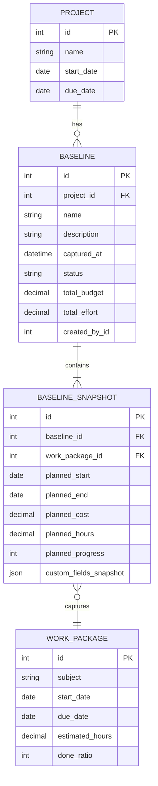
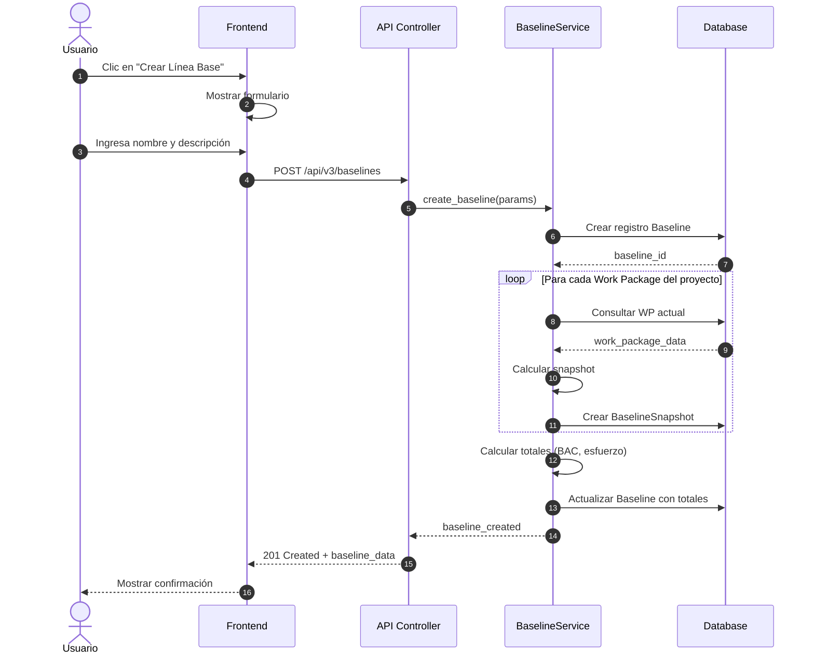
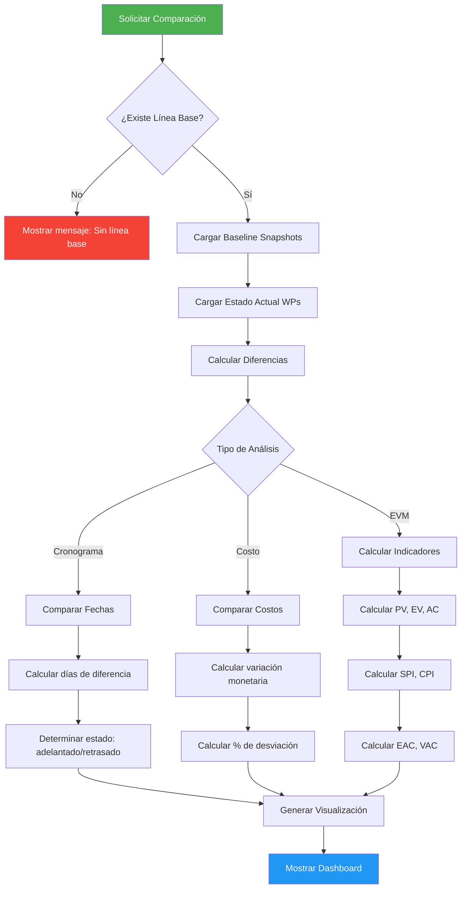
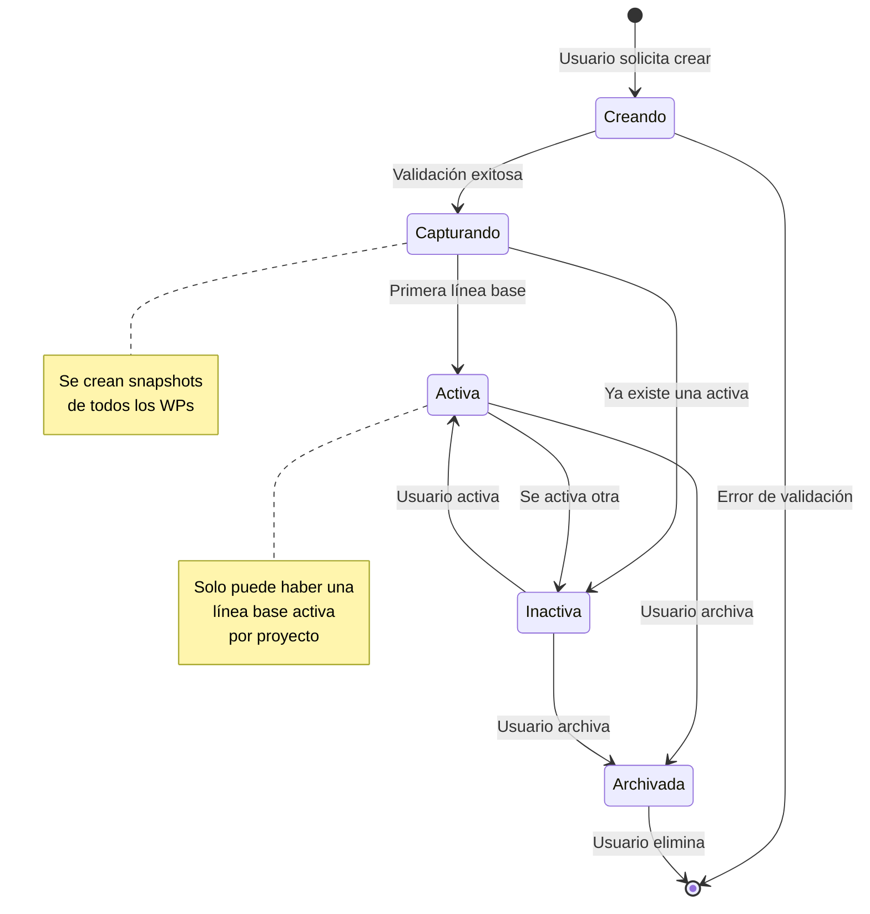
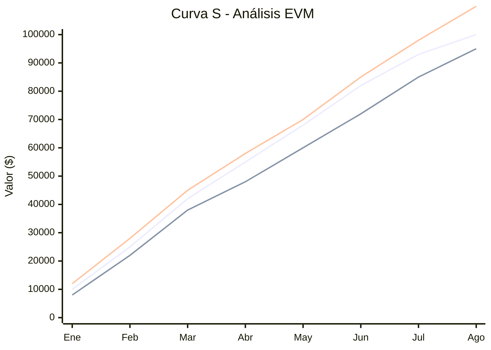

# Plugin de Línea Base Automática para OpenProject

## Descripción General

El **Plugin de Línea Base Automática** permite capturar snapshots del estado de un proyecto en momentos específicos, facilitando el seguimiento del progreso y la comparación entre el plan original y la ejecución real. Este plugin es esencial para la gestión de valor ganado (EVM) y el control de desviaciones en proyectos.

### Características Principales

- Creación automática y manual de líneas base
- Captura de fechas, costos y esfuerzo planificado
- Comparación visual entre línea base y estado actual
- Cálculo automático de indicadores EVM (SPI, CPI, EAC, etc.)
- Historial de múltiples líneas base por proyecto
- Integración con Gantt y Work Packages

---

## Arquitectura del Plugin

```mermaid
graph TB
    subgraph "Frontend Angular"
        A[BaselineComponent] --> B[BaselineService]
        C[ComparisonChart] --> B
        D[EVMDashboard] --> B
    end
    
    subgraph "API REST"
        B --> E[/api/v3/baselines]
        E --> F[BaselinesController]
    end
    
    subgraph "Backend Rails"
        F --> G[Baseline Model]
        F --> H[BaselineSnapshot Model]
        G --> I[(PostgreSQL)]
        H --> I
        J[BaselineCalculator] --> G
        J --> H
        K[SchedulerJob] --> J
    end
    
    subgraph "OpenProject Core"
        L[WorkPackage] -.-> H
        M[Project] -.-> G
        N[CostEntry] -.-> H
    end
    
    style A fill:#4CAF50,color:#fff
    style C fill:#4CAF50,color:#fff
    style D fill:#4CAF50,color:#fff
    style G fill:#2196F3,color:#fff
    style H fill:#2196F3,color:#fff
```

---

## Modelo de Datos

### Diagrama Entidad-Relación



### Migración de Base de Datos

```ruby
# db/migrate/20260120000001_create_baselines.rb

class CreateBaselines < ActiveRecord::Migration[7.0]
  def change
    create_table :baselines do |t|
      t.references :project, null: false, foreign_key: true
      t.string :name, null: false
      t.text :description
      t.datetime :captured_at, null: false
      t.string :status, default: 'active'
      t.decimal :total_budget, precision: 15, scale: 2
      t.decimal :total_effort, precision: 10, scale: 2
      t.references :created_by, foreign_key: { to_table: :users }
      
      t.timestamps
    end
    
    add_index :baselines, [:project_id, :captured_at]
    add_index :baselines, :status
  end
end
```

```ruby
# db/migrate/20260120000002_create_baseline_snapshots.rb

class CreateBaselineSnapshots < ActiveRecord::Migration[7.0]
  def change
    create_table :baseline_snapshots do |t|
      t.references :baseline, null: false, foreign_key: true
      t.references :work_package, null: false, foreign_key: true
      t.date :planned_start
      t.date :planned_end
      t.decimal :planned_cost, precision: 15, scale: 2
      t.decimal :planned_hours, precision: 10, scale: 2
      t.integer :planned_progress, default: 0
      t.jsonb :custom_fields_snapshot, default: {}
      
      t.timestamps
    end
    
    add_index :baseline_snapshots, [:baseline_id, :work_package_id], unique: true
  end
end
```

---

## Cálculos de Valor Ganado (EVM)

El plugin implementa los cálculos estándar de Earned Value Management para medir el rendimiento del proyecto.

### Variables Base

| Variable | Símbolo | Descripción |
|----------|---------|-------------|
| Valor Planificado | $PV$ | Costo presupuestado del trabajo planificado |
| Valor Ganado | $EV$ | Costo presupuestado del trabajo realizado |
| Costo Real | $AC$ | Costo real del trabajo realizado |
| Presupuesto Total | $BAC$ | Budget at Completion |

### Índices de Rendimiento

#### Índice de Rendimiento del Cronograma (SPI)

El SPI mide la eficiencia del cronograma:

$$SPI = \frac{EV}{PV}$$

Donde:
- $SPI > 1.0$ → Adelantado respecto al cronograma
- $SPI = 1.0$ → En cronograma
- $SPI < 1.0$ → Retrasado respecto al cronograma

#### Índice de Rendimiento del Costo (CPI)

El CPI mide la eficiencia del costo:

$$CPI = \frac{EV}{AC}$$

Donde:
- $CPI > 1.0$ → Bajo presupuesto
- $CPI = 1.0$ → En presupuesto
- $CPI < 1.0$ → Sobre presupuesto

### Variaciones

#### Variación del Cronograma (SV)

$$SV = EV - PV$$

#### Variación del Costo (CV)

$$CV = EV - AC$$

### Proyecciones

#### Estimación a la Conclusión (EAC)

Existen múltiples fórmulas según las condiciones del proyecto:

**Caso 1: Variación atípica** (se espera que el rendimiento futuro sea según lo planificado)

$$EAC = AC + (BAC - EV)$$

**Caso 2: Variación típica** (el rendimiento futuro seguirá el patrón actual)

$$EAC = \frac{BAC}{CPI}$$

**Caso 3: Considerando ambos índices**

$$EAC = AC + \frac{BAC - EV}{CPI \times SPI}$$

#### Variación a la Conclusión (VAC)

$$VAC = BAC - EAC$$

#### Índice de Rendimiento para Completar (TCPI)

El TCPI indica el rendimiento requerido para cumplir el objetivo:

**Para cumplir el BAC:**

$$TCPI_{BAC} = \frac{BAC - EV}{BAC - AC}$$

**Para cumplir el EAC:**

$$TCPI_{EAC} = \frac{BAC - EV}{EAC - AC}$$

### Porcentaje de Avance Ponderado

El avance total del proyecto se calcula ponderando cada work package por su costo planificado:

$$\text{Avance Total} = \frac{\sum_{i=1}^{n} (w_i \times p_i)}{\sum_{i=1}^{n} w_i} \times 100\%$$

Donde:
- $w_i$ = peso (costo planificado) del work package $i$
- $p_i$ = porcentaje de avance del work package $i$
- $n$ = número total de work packages

---

## Flujo de Operación

### Creación de Línea Base



### Comparación con Línea Base



---

## Implementación del Plugin

### Estructura de Archivos

```
openproject-baseline/
├── app/
│   ├── controllers/
│   │   └── baselines_controller.rb
│   ├── models/
│   │   ├── baseline.rb
│   │   └── baseline_snapshot.rb
│   ├── services/
│   │   ├── baseline_creator.rb
│   │   ├── baseline_comparator.rb
│   │   └── evm_calculator.rb
│   ├── views/
│   │   ├── baselines/
│   │   │   ├── index.html.erb
│   │   │   ├── show.html.erb
│   │   │   └── _comparison.html.erb
│   │   └── hooks/
│   │       └── baseline/
│   │           └── _project_sidebar.html.erb
│   └── seeders/
│       └── baseline_demo_seeder.rb
├── config/
│   ├── locales/
│   │   ├── en.yml
│   │   └── es.yml
│   └── routes.rb
├── db/
│   └── migrate/
│       ├── 20260120000001_create_baselines.rb
│       └── 20260120000002_create_baseline_snapshots.rb
├── frontend/
│   └── module/
│       ├── main.ts
│       ├── baseline-dashboard/
│       │   ├── baseline-dashboard.component.ts
│       │   ├── baseline-dashboard.component.html
│       │   └── baseline-dashboard.component.sass
│       ├── evm-chart/
│       │   └── evm-chart.component.ts
│       └── services/
│           └── baseline.service.ts
├── lib/
│   └── open_project/
│       └── baseline/
│           ├── engine.rb
│           └── hooks.rb
├── spec/
│   ├── models/
│   │   └── baseline_spec.rb
│   ├── services/
│   │   └── evm_calculator_spec.rb
│   └── controllers/
│       └── baselines_controller_spec.rb
├── openproject-baseline.gemspec
├── Gemfile
└── README.md
```

### Engine Principal

```ruby
# lib/open_project/baseline/engine.rb

module OpenProject::Baseline
  class Engine < ::Rails::Engine
    engine_name :openproject_baseline

    include OpenProject::Plugins::ActsAsOpEngine

    register 'openproject-baseline',
             author_url: 'https://github.com/flou/openproject-baseline',
             bundled: true,
             settings: {
               default: {
                 'auto_baseline_enabled' => true,
                 'auto_baseline_frequency' => 'weekly',
                 'evm_calculation_method' => 'typical'
               }
             } do
      
      # Módulo de proyecto
      project_module :baseline_management, dependencies: :work_package_tracking do
        permission :view_baselines, 
                   { baselines: [:index, :show, :compare] }, 
                   permissible_on: :project
        permission :manage_baselines, 
                   { baselines: [:new, :create, :edit, :update, :destroy, :activate] }, 
                   permissible_on: :project
        permission :create_baselines,
                   { baselines: [:new, :create] },
                   permissible_on: :project
      end
      
      # Menú del proyecto
      menu :project_menu,
           :baselines,
           { controller: '/baselines', action: 'index' },
           after: :work_packages,
           param: :project_id,
           caption: :'baseline.menu_title',
           icon: 'icon2 icon-baseline',
           if: ->(project) { 
             project.module_enabled?(:baseline_management) 
           }
      
      # Submenú
      menu :project_menu,
           :baseline_comparison,
           { controller: '/baselines', action: 'compare' },
           parent: :baselines,
           caption: :'baseline.comparison',
           icon: 'icon2 icon-compare'
      
      menu :project_menu,
           :baseline_evm,
           { controller: '/baselines', action: 'evm_dashboard' },
           parent: :baselines,
           caption: :'baseline.evm_dashboard',
           icon: 'icon2 icon-chart'
    end
    
    # Registrar hooks
    initializer 'openproject_baseline.register_hooks' do
      require_relative 'hooks'
    end
    
    # Job para líneas base automáticas
    initializer 'openproject_baseline.scheduled_jobs' do
      ::Cron::CronJob.register! ::Baseline::AutoBaselineJob
    end
    
    # Notificaciones
    initializer 'openproject_baseline.notifications' do
      OpenProject::Notifications.subscribe 'project_updated' do |project|
        if project.module_enabled?(:baseline_management)
          Rails.logger.info "[Baseline] Proyecto #{project.name} actualizado"
        end
      end
    end

    # Assets
    assets %w(
      baseline/baseline.css
      baseline/baseline.js
    )
  end
end
```

### Modelo Baseline

```ruby
# app/models/baseline.rb

class Baseline < ApplicationRecord
  belongs_to :project
  belongs_to :created_by, class_name: 'User', optional: true
  has_many :baseline_snapshots, dependent: :destroy
  has_many :work_packages, through: :baseline_snapshots
  
  validates :name, presence: true, length: { maximum: 255 }
  validates :captured_at, presence: true
  validates :status, inclusion: { in: %w[active inactive archived] }
  
  scope :active, -> { where(status: 'active') }
  scope :for_project, ->(project_id) { where(project_id: project_id) }
  scope :recent, -> { order(captured_at: :desc) }
  
  before_validation :set_captured_at, on: :create
  
  # Línea base activa del proyecto
  def self.current_for(project)
    active.for_project(project.id).recent.first
  end
  
  # Capturar estado actual del proyecto
  def capture_snapshots!
    project.work_packages.includes(:cost_entries).find_each do |wp|
      baseline_snapshots.create!(
        work_package: wp,
        planned_start: wp.start_date,
        planned_end: wp.due_date,
        planned_cost: calculate_planned_cost(wp),
        planned_hours: wp.estimated_hours || 0,
        planned_progress: wp.done_ratio || 0,
        custom_fields_snapshot: capture_custom_fields(wp)
      )
    end
    
    update_totals!
  end
  
  # Actualizar totales
  def update_totals!
    update!(
      total_budget: baseline_snapshots.sum(:planned_cost),
      total_effort: baseline_snapshots.sum(:planned_hours)
    )
  end
  
  # BAC (Budget at Completion)
  def bac
    total_budget || 0
  end
  
  private
  
  def set_captured_at
    self.captured_at ||= Time.current
  end
  
  def calculate_planned_cost(work_package)
    hourly_rate = work_package.assigned_to&.hourly_rate || 50.0
    (work_package.estimated_hours || 0) * hourly_rate
  end
  
  def capture_custom_fields(work_package)
    work_package.custom_field_values.each_with_object({}) do |cfv, hash|
      hash[cfv.custom_field_id] = cfv.value
    end
  end
end
```

### Servicio de Cálculo EVM

```ruby
# app/services/evm_calculator.rb

class EvmCalculator
  attr_reader :baseline, :project, :reference_date
  
  def initialize(baseline, reference_date: Date.current)
    @baseline = baseline
    @project = baseline.project
    @reference_date = reference_date
  end
  
  # Valor Planificado (PV) - Planned Value
  # Costo presupuestado del trabajo que debería estar completado a la fecha
  def planned_value
    @pv ||= baseline.baseline_snapshots.sum do |snapshot|
      if snapshot.planned_end && snapshot.planned_end <= reference_date
        snapshot.planned_cost || 0
      elsif snapshot.planned_start && snapshot.planned_start <= reference_date
        # Prorrateo lineal para trabajo en progreso
        calculate_prorated_value(snapshot)
      else
        0
      end
    end
  end
  alias_method :pv, :planned_value
  
  # Valor Ganado (EV) - Earned Value
  # Costo presupuestado del trabajo realmente completado
  def earned_value
    @ev ||= baseline.baseline_snapshots.sum do |snapshot|
      wp = snapshot.work_package
      progress = (wp.done_ratio || 0) / 100.0
      (snapshot.planned_cost || 0) * progress
    end
  end
  alias_method :ev, :earned_value
  
  # Costo Real (AC) - Actual Cost
  def actual_cost
    @ac ||= project.work_packages.joins(:cost_entries)
                   .where('cost_entries.spent_on <= ?', reference_date)
                   .sum('cost_entries.costs')
  end
  alias_method :ac, :actual_cost
  
  # Budget at Completion
  def budget_at_completion
    baseline.bac
  end
  alias_method :bac, :budget_at_completion
  
  # Schedule Performance Index
  # SPI = EV / PV
  def schedule_performance_index
    return 0 if pv.zero?
    (ev / pv).round(4)
  end
  alias_method :spi, :schedule_performance_index
  
  # Cost Performance Index
  # CPI = EV / AC
  def cost_performance_index
    return 0 if ac.zero?
    (ev / ac).round(4)
  end
  alias_method :cpi, :cost_performance_index
  
  # Schedule Variance
  # SV = EV - PV
  def schedule_variance
    (ev - pv).round(2)
  end
  alias_method :sv, :schedule_variance
  
  # Cost Variance
  # CV = EV - AC
  def cost_variance
    (ev - ac).round(2)
  end
  alias_method :cv, :cost_variance
  
  # Estimate at Completion (usando método típico)
  # EAC = BAC / CPI
  def estimate_at_completion(method: :typical)
    case method
    when :atypical
      # EAC = AC + (BAC - EV)
      ac + (bac - ev)
    when :typical
      # EAC = BAC / CPI
      return bac if cpi.zero?
      (bac / cpi).round(2)
    when :combined
      # EAC = AC + (BAC - EV) / (CPI * SPI)
      divisor = cpi * spi
      return bac if divisor.zero?
      (ac + (bac - ev) / divisor).round(2)
    else
      raise ArgumentError, "Método desconocido: #{method}"
    end
  end
  alias_method :eac, :estimate_at_completion
  
  # Variance at Completion
  # VAC = BAC - EAC
  def variance_at_completion(method: :typical)
    (bac - eac(method: method)).round(2)
  end
  alias_method :vac, :variance_at_completion
  
  # To Complete Performance Index (para cumplir BAC)
  # TCPI = (BAC - EV) / (BAC - AC)
  def to_complete_performance_index
    divisor = bac - ac
    return Float::INFINITY if divisor <= 0
    ((bac - ev) / divisor).round(4)
  end
  alias_method :tcpi, :to_complete_performance_index
  
  # Porcentaje completado
  def percent_complete
    return 0 if bac.zero?
    ((ev / bac) * 100).round(2)
  end
  
  # Porcentaje gastado
  def percent_spent
    return 0 if bac.zero?
    ((ac / bac) * 100).round(2)
  end
  
  # Resumen completo
  def summary
    {
      reference_date: reference_date,
      bac: bac,
      pv: pv,
      ev: ev,
      ac: ac,
      sv: sv,
      cv: cv,
      spi: spi,
      cpi: cpi,
      eac: eac,
      vac: vac,
      tcpi: tcpi,
      percent_complete: percent_complete,
      percent_spent: percent_spent,
      schedule_status: schedule_status,
      cost_status: cost_status
    }
  end
  
  def schedule_status
    case spi
    when 0..0.9 then :behind
    when 0.9..1.1 then :on_track
    else :ahead
    end
  end
  
  def cost_status
    case cpi
    when 0..0.9 then :over_budget
    when 0.9..1.1 then :on_budget
    else :under_budget
    end
  end
  
  private
  
  def calculate_prorated_value(snapshot)
    return 0 unless snapshot.planned_start && snapshot.planned_end
    
    total_days = (snapshot.planned_end - snapshot.planned_start).to_f
    return 0 if total_days <= 0
    
    elapsed_days = (reference_date - snapshot.planned_start).to_f
    elapsed_days = [elapsed_days, total_days].min
    elapsed_days = [elapsed_days, 0].max
    
    (snapshot.planned_cost || 0) * (elapsed_days / total_days)
  end
end
```

### Controlador de Baselines

```ruby
# app/controllers/baselines_controller.rb

class BaselinesController < ApplicationController
  before_action :find_project
  before_action :authorize
  before_action :find_baseline, only: [:show, :edit, :update, :destroy, :activate]
  
  menu_item :baselines
  
  def index
    @baselines = @project.baselines.recent.includes(:created_by)
    @current_baseline = Baseline.current_for(@project)
  end
  
  def show
    @snapshots = @baseline.baseline_snapshots
                          .includes(:work_package)
                          .order('work_packages.subject')
  end
  
  def new
    @baseline = @project.baselines.build(
      name: default_baseline_name,
      created_by: User.current
    )
  end
  
  def create
    @baseline = @project.baselines.build(baseline_params)
    @baseline.created_by = User.current
    
    if @baseline.save
      @baseline.capture_snapshots!
      
      flash[:notice] = I18n.t('baseline.created_successfully')
      redirect_to project_baseline_path(@project, @baseline)
    else
      render :new
    end
  end
  
  def edit
  end
  
  def update
    if @baseline.update(baseline_params)
      flash[:notice] = I18n.t('baseline.updated_successfully')
      redirect_to project_baseline_path(@project, @baseline)
    else
      render :edit
    end
  end
  
  def destroy
    @baseline.destroy
    flash[:notice] = I18n.t('baseline.deleted_successfully')
    redirect_to project_baselines_path(@project)
  end
  
  def activate
    # Desactivar otras líneas base
    @project.baselines.active.update_all(status: 'inactive')
    
    @baseline.update!(status: 'active')
    flash[:notice] = I18n.t('baseline.activated_successfully')
    redirect_to project_baselines_path(@project)
  end
  
  def compare
    @baseline = Baseline.current_for(@project)
    
    unless @baseline
      flash[:warning] = I18n.t('baseline.no_active_baseline')
      redirect_to project_baselines_path(@project)
      return
    end
    
    @comparator = BaselineComparator.new(@baseline)
    @comparison_data = @comparator.compare_all
  end
  
  def evm_dashboard
    @baseline = Baseline.current_for(@project)
    
    unless @baseline
      flash[:warning] = I18n.t('baseline.no_active_baseline')
      redirect_to project_baselines_path(@project)
      return
    end
    
    @calculator = EvmCalculator.new(@baseline)
    @evm_data = @calculator.summary
    @trend_data = calculate_trend_data
  end
  
  private
  
  def find_project
    @project = Project.find(params[:project_id])
  end
  
  def find_baseline
    @baseline = @project.baselines.find(params[:id])
  end
  
  def baseline_params
    params.require(:baseline).permit(:name, :description)
  end
  
  def default_baseline_name
    "Línea Base #{Date.current.strftime('%Y-%m-%d')}"
  end
  
  def calculate_trend_data
    # Calcular tendencia de los últimos 30 días
    (0..29).map do |days_ago|
      date = Date.current - days_ago.days
      calculator = EvmCalculator.new(@baseline, reference_date: date)
      {
        date: date,
        pv: calculator.pv,
        ev: calculator.ev,
        ac: calculator.ac
      }
    end.reverse
  end
end
```

### Componente Angular - Dashboard EVM

```typescript
// frontend/module/evm-chart/evm-chart.component.ts

import { Component, Input, OnInit, OnChanges, SimpleChanges } from '@angular/core';
import { HttpClient } from '@angular/common/http';

interface EvmData {
  reference_date: string;
  bac: number;
  pv: number;
  ev: number;
  ac: number;
  sv: number;
  cv: number;
  spi: number;
  cpi: number;
  eac: number;
  vac: number;
  tcpi: number;
  percent_complete: number;
  percent_spent: number;
  schedule_status: string;
  cost_status: string;
}

interface TrendDataPoint {
  date: string;
  pv: number;
  ev: number;
  ac: number;
}

@Component({
  selector: 'op-evm-chart',
  template: `
    <div class="evm-dashboard">
      <div class="evm-summary-cards" *ngIf="evmData">
        <div class="evm-card" [class.positive]="evmData.spi >= 1" [class.negative]="evmData.spi < 1">
          <div class="card-title">SPI</div>
          <div class="card-value">{{ evmData.spi | number:'1.2-2' }}</div>
          <div class="card-label">{{ getScheduleLabel() }}</div>
        </div>
        
        <div class="evm-card" [class.positive]="evmData.cpi >= 1" [class.negative]="evmData.cpi < 1">
          <div class="card-title">CPI</div>
          <div class="card-value">{{ evmData.cpi | number:'1.2-2' }}</div>
          <div class="card-label">{{ getCostLabel() }}</div>
        </div>
        
        <div class="evm-card">
          <div class="card-title">EAC</div>
          <div class="card-value">{{ evmData.eac | currency }}</div>
          <div class="card-label">Estimación Final</div>
        </div>
        
        <div class="evm-card" [class.positive]="evmData.vac >= 0" [class.negative]="evmData.vac < 0">
          <div class="card-title">VAC</div>
          <div class="card-value">{{ evmData.vac | currency }}</div>
          <div class="card-label">Variación al Cierre</div>
        </div>
      </div>
      
      <div class="evm-chart-container">
        <canvas #chartCanvas></canvas>
      </div>
      
      <div class="evm-formulas">
        <h4>Fórmulas Aplicadas</h4>
        <div class="formula-item">
          <span class="formula">SPI = EV / PV = {{ evmData?.ev | number }} / {{ evmData?.pv | number }}</span>
        </div>
        <div class="formula-item">
          <span class="formula">CPI = EV / AC = {{ evmData?.ev | number }} / {{ evmData?.ac | number }}</span>
        </div>
      </div>
    </div>
  `,
  styleUrls: ['./evm-chart.component.sass']
})
export class EvmChartComponent implements OnInit, OnChanges {
  @Input() projectId: number;
  @Input() baselineId: number;
  
  evmData: EvmData | null = null;
  trendData: TrendDataPoint[] = [];
  chart: any;
  
  constructor(private http: HttpClient) {}
  
  ngOnInit() {
    this.loadEvmData();
  }
  
  ngOnChanges(changes: SimpleChanges) {
    if (changes.baselineId) {
      this.loadEvmData();
    }
  }
  
  loadEvmData() {
    this.http.get<{evm: EvmData, trend: TrendDataPoint[]}>(
      `/api/v3/projects/${this.projectId}/baselines/${this.baselineId}/evm`
    ).subscribe({
      next: (response) => {
        this.evmData = response.evm;
        this.trendData = response.trend;
        this.renderChart();
      },
      error: (error) => {
        console.error('Error cargando datos EVM:', error);
      }
    });
  }
  
  getScheduleLabel(): string {
    if (!this.evmData) return '';
    if (this.evmData.spi >= 1.1) return 'Adelantado';
    if (this.evmData.spi >= 0.9) return 'En tiempo';
    return 'Retrasado';
  }
  
  getCostLabel(): string {
    if (!this.evmData) return '';
    if (this.evmData.cpi >= 1.1) return 'Bajo presupuesto';
    if (this.evmData.cpi >= 0.9) return 'En presupuesto';
    return 'Sobre presupuesto';
  }
  
  renderChart() {
    // Implementación del gráfico con Chart.js o D3
    // ...
  }
}
```

### Estilos del Dashboard

```sass
// frontend/module/evm-chart/evm-chart.component.sass

.evm-dashboard
  padding: 20px
  
  .evm-summary-cards
    display: grid
    grid-template-columns: repeat(auto-fit, minmax(200px, 1fr))
    gap: 16px
    margin-bottom: 24px
    
    .evm-card
      background: #fff
      border-radius: 8px
      padding: 20px
      box-shadow: 0 2px 4px rgba(0,0,0,0.1)
      text-align: center
      border-left: 4px solid #9e9e9e
      
      &.positive
        border-left-color: #4caf50
        
      &.negative
        border-left-color: #f44336
        
      .card-title
        font-size: 14px
        color: #666
        text-transform: uppercase
        letter-spacing: 1px
        
      .card-value
        font-size: 32px
        font-weight: bold
        margin: 8px 0
        
      .card-label
        font-size: 12px
        color: #888
        
  .evm-chart-container
    background: #fff
    border-radius: 8px
    padding: 20px
    box-shadow: 0 2px 4px rgba(0,0,0,0.1)
    min-height: 400px
    
  .evm-formulas
    margin-top: 24px
    padding: 16px
    background: #f5f5f5
    border-radius: 8px
    
    h4
      margin-bottom: 12px
      
    .formula-item
      font-family: 'Consolas', monospace
      padding: 8px
      background: #fff
      margin-bottom: 8px
      border-radius: 4px
```

---

## Traducciones

```yaml
# config/locales/es.yml

es:
  baseline:
    menu_title: "Líneas Base"
    comparison: "Comparación"
    evm_dashboard: "Dashboard EVM"
    
    # Acciones
    create: "Crear Línea Base"
    edit: "Editar"
    delete: "Eliminar"
    activate: "Activar"
    compare: "Comparar"
    
    # Mensajes
    created_successfully: "Línea base creada exitosamente."
    updated_successfully: "Línea base actualizada exitosamente."
    deleted_successfully: "Línea base eliminada exitosamente."
    activated_successfully: "Línea base activada exitosamente."
    no_active_baseline: "No hay línea base activa para este proyecto."
    
    # Campos
    name: "Nombre"
    description: "Descripción"
    captured_at: "Fecha de captura"
    status: "Estado"
    total_budget: "Presupuesto Total (BAC)"
    total_effort: "Esfuerzo Total (horas)"
    created_by: "Creado por"
    
    # Estados
    status_active: "Activa"
    status_inactive: "Inactiva"
    status_archived: "Archivada"
    
    # EVM
    evm:
      title: "Análisis de Valor Ganado"
      planned_value: "Valor Planificado (PV)"
      earned_value: "Valor Ganado (EV)"
      actual_cost: "Costo Real (AC)"
      schedule_variance: "Variación del Cronograma (SV)"
      cost_variance: "Variación del Costo (CV)"
      spi: "Índice de Rendimiento del Cronograma (SPI)"
      cpi: "Índice de Rendimiento del Costo (CPI)"
      eac: "Estimación a la Conclusión (EAC)"
      vac: "Variación a la Conclusión (VAC)"
      tcpi: "TCPI"
      
      # Estados
      ahead_schedule: "Adelantado"
      on_schedule: "En tiempo"
      behind_schedule: "Retrasado"
      under_budget: "Bajo presupuesto"
      on_budget: "En presupuesto"
      over_budget: "Sobre presupuesto"
    
    # Comparación
    comparison:
      title: "Comparación con Línea Base"
      work_package: "Work Package"
      baseline_start: "Inicio (Base)"
      current_start: "Inicio (Actual)"
      baseline_end: "Fin (Base)"
      current_end: "Fin (Actual)"
      variance_days: "Variación (días)"
      baseline_cost: "Costo (Base)"
      current_cost: "Costo (Actual)"
      variance_cost: "Variación ($)"
      
  # Permisos
  permission_view_baselines: "Ver líneas base"
  permission_manage_baselines: "Gestionar líneas base"
  permission_create_baselines: "Crear líneas base"
  project_module_baseline_management: "Gestión de Líneas Base"
```

---

## Diagrama de Estados



---

## Curva S - Visualización EVM

La Curva S es la representación gráfica tradicional del análisis de valor ganado:



### Interpretación

En este ejemplo:

$$SPI = \frac{EV}{PV} = \frac{95000}{100000} = 0.95$$

$$CPI = \frac{EV}{AC} = \frac{95000}{110000} = 0.86$$

**Conclusión:** El proyecto está **5% retrasado** y **14% sobre presupuesto**.

---

## Tests

```ruby
# spec/services/evm_calculator_spec.rb

require 'rails_helper'

RSpec.describe EvmCalculator do
  let(:project) { create(:project) }
  let(:baseline) { create(:baseline, project: project, total_budget: 100_000) }
  
  before do
    # Crear work packages con diferentes estados de progreso
    create(:baseline_snapshot, 
           baseline: baseline,
           planned_cost: 50_000,
           planned_start: 30.days.ago,
           planned_end: Date.current)
    
    create(:baseline_snapshot,
           baseline: baseline,
           planned_cost: 50_000,
           planned_start: Date.current,
           planned_end: 30.days.from_now)
  end
  
  subject { described_class.new(baseline) }
  
  describe '#planned_value' do
    it 'calcula correctamente el valor planificado' do
      # El primer WP debería estar 100% planificado (ya pasó su fecha fin)
      expect(subject.pv).to be >= 50_000
    end
  end
  
  describe '#schedule_performance_index' do
    context 'cuando el proyecto está en tiempo' do
      it 'retorna un valor cercano a 1.0' do
        allow(subject).to receive(:ev).and_return(50_000)
        allow(subject).to receive(:pv).and_return(50_000)
        
        expect(subject.spi).to eq(1.0)
      end
    end
    
    context 'cuando el proyecto está retrasado' do
      it 'retorna un valor menor a 1.0' do
        allow(subject).to receive(:ev).and_return(40_000)
        allow(subject).to receive(:pv).and_return(50_000)
        
        expect(subject.spi).to eq(0.8)
      end
    end
  end
  
  describe '#estimate_at_completion' do
    before do
      allow(subject).to receive(:bac).and_return(100_000)
      allow(subject).to receive(:cpi).and_return(0.8)
      allow(subject).to receive(:spi).and_return(0.9)
      allow(subject).to receive(:ac).and_return(60_000)
      allow(subject).to receive(:ev).and_return(48_000)
    end
    
    it 'calcula EAC usando método típico' do
      # EAC = BAC / CPI = 100000 / 0.8 = 125000
      expect(subject.eac(method: :typical)).to eq(125_000)
    end
    
    it 'calcula EAC usando método atípico' do
      # EAC = AC + (BAC - EV) = 60000 + (100000 - 48000) = 112000
      expect(subject.eac(method: :atypical)).to eq(112_000)
    end
    
    it 'calcula EAC usando método combinado' do
      # EAC = AC + (BAC - EV) / (CPI * SPI)
      # EAC = 60000 + (100000 - 48000) / (0.8 * 0.9)
      # EAC = 60000 + 52000 / 0.72 = 132222.22
      expect(subject.eac(method: :combined)).to be_within(1).of(132_222.22)
    end
  end
end
```

---

## Resumen de Fórmulas EVM

| Métrica | Fórmula | Interpretación |
|---------|---------|----------------|
| **SPI** | $\frac{EV}{PV}$ | $>1$ adelantado, $<1$ retrasado |
| **CPI** | $\frac{EV}{AC}$ | $>1$ bajo presupuesto, $<1$ sobre presupuesto |
| **SV** | $EV - PV$ | $>0$ adelantado, $<0$ retrasado |
| **CV** | $EV - AC$ | $>0$ ahorro, $<0$ sobrecosto |
| **EAC** | $\frac{BAC}{CPI}$ | Estimación de costo final |
| **VAC** | $BAC - EAC$ | Variación proyectada al cierre |
| **TCPI** | $\frac{BAC - EV}{BAC - AC}$ | Rendimiento requerido para cumplir |

---

## Conclusión

Este plugin de Línea Base Automática proporciona:

1. **Captura automática** del estado del proyecto en cualquier momento
2. **Cálculos EVM completos** para medir rendimiento
3. **Visualización** mediante curvas S y dashboards
4. **Comparación** detallada entre plan y ejecución
5. **Integración nativa** con OpenProject

Es especialmente útil para proyectos como NETCLI donde se requiere control riguroso del cronograma y seguimiento de desviaciones.
