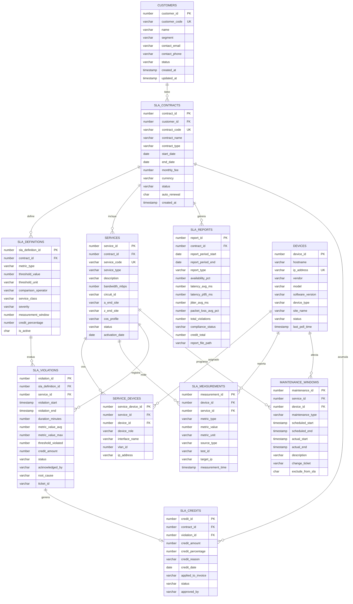
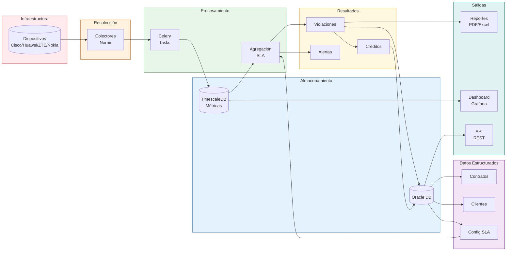

# Profundización Técnica: SLA en Networking

## 1. Métricas Técnicas: Cálculos e Implementación

### 1.1 Latencia: Anatomía y Medición

#### Componentes del RTT (Round Trip Time)

```
RTT_total = T_propagación + T_serialización + T_procesamiento + T_cola

Donde:
- T_propagación = Distancia(km) / Velocidad_luz_medio
  - Fibra óptica: ~200,000 km/s (≈5 μs/km)
  - Cobre: ~200,000 km/s
  - Microondas: ~300,000 km/s

- T_serialización = Tamaño_paquete(bits) / Velocidad_interfaz(bps)
  - Paquete 1500 bytes en 1Gbps = 12 μs
  - Paquete 1500 bytes en 100Mbps = 120 μs

- T_procesamiento = f(complejidad_lookup, carga_CPU)
  - Store-and-forward: 5-50 μs por hop
  - Cut-through: 1-5 μs por hop

- T_cola = f(utilización_enlace, política_QoS)
  - Modelado por teoría de colas (M/M/1)
```

#### Cálculo Práctico: Lima → Miami

```python
# Ejemplo de cálculo de latencia mínima teórica
def calcular_latencia_minima(distancia_km, num_hops, velocidad_enlace_gbps):
    """
    Calcula la latencia mínima teórica para un path de red.
    """
    # Velocidad de la luz en fibra (aprox 2/3 de c)
    velocidad_fibra_km_s = 200000
    
    # Componentes
    t_propagacion_ms = (distancia_km / velocidad_fibra_km_s) * 1000
    
    # Asumiendo paquetes de 64 bytes (ping ICMP típico)
    t_serializacion_ms = (64 * 8) / (velocidad_enlace_gbps * 1e9) * 1000 * num_hops
    
    # Procesamiento típico por hop (switch moderno)
    t_procesamiento_ms = 0.005 * num_hops  # 5 μs por hop
    
    # RTT = 2x (ida y vuelta)
    rtt_minimo = 2 * (t_propagacion_ms + t_serializacion_ms + t_procesamiento_ms)
    
    return {
        'propagacion_ms': t_propagacion_ms * 2,
        'serializacion_ms': t_serializacion_ms * 2,
        'procesamiento_ms': t_procesamiento_ms * 2,
        'rtt_minimo_ms': rtt_minimo
    }

# Lima → Miami: ~6,000 km, ~15 hops típicos, 10Gbps backbone
resultado = calcular_latencia_minima(6000, 15, 10)
# RTT mínimo teórico: ~60ms (propagación domina)
# RTT real observado: 70-90ms (incluye colas y peering)
```

#### Implementación en Equipos Multi-vendor

**Cisco IOS/IOS-XE - IP SLA**

```cisco
! Configuración de sonda ICMP Echo (ping)
ip sla 100
 icmp-echo 8.8.8.8 source-interface GigabitEthernet0/0
 frequency 60
 timeout 5000
 threshold 100
 tag GOOGLE_DNS_LATENCY
ip sla schedule 100 life forever start-time now

! Sonda UDP Jitter (más precisa para VoIP)
ip sla 200
 udp-jitter 10.0.0.1 16384 codec g711alaw
 frequency 30
 owner VOIP_QUALITY_CHECK
ip sla schedule 200 life forever start-time now

! Verificación
show ip sla statistics 100
show ip sla statistics 200 detail
```

**Huawei (NQA - Network Quality Analyzer)**

```huawei
# Equivalente a Cisco IP SLA
nqa test-instance admin icmp-test
 test-type icmp
 destination-address ipv4 8.8.8.8
 source-interface GigabitEthernet0/0/1
 frequency 60
 probe-count 5
 interval milliseconds 1000
 timeout 5
 start now

# Sonda de Jitter UDP
nqa test-instance admin jitter-test
 test-type jitter
 destination-address ipv4 10.0.0.1
 destination-port 5000
 codec-type g711a
 frequency 30
 start now

# Verificación
display nqa results test-instance admin icmp-test
display nqa statistics test-instance admin jitter-test
```

**ZTE (NQA similar a Huawei)**

```zte
# ZTE usa sintaxis similar a Huawei
nqa entry admin zte-latency-test
 test-type icmp-echo
 destination ip 8.8.8.8
 frequency 60
 probe-count 3
 timeout 5000
nqa schedule admin zte-latency-test start-time now lifetime forever

# Para jitter
nqa entry admin zte-jitter-test
 test-type udp-jitter
 destination ip 10.0.0.1
 destination port 50000
 codec-type g711-alaw
 frequency 30
nqa schedule admin zte-jitter-test start-time now lifetime forever

display nqa results admin zte-latency-test
```

**Nokia (SR OS - SAA: Service Assurance Agent)**

```nokia
# Nokia usa OAM (Operations, Administration, Maintenance)
configure
    saa
        test "LATENCY_CHECK" type icmp-ping
            destination-address 8.8.8.8
            source-address 192.168.1.1
            interval 60
            probe-count 5
            timeout 5
        exit
        test "JITTER_CHECK" type saa-jitter
            destination-address 10.0.0.1
            destination-udp-port 5000
            source-address 192.168.1.1
            interval 30
            num-probes 10
        exit
    exit
exit

# También soporta Y.1731 para Ethernet OAM
configure
    eth-cfm
        domain "CUSTOMER_A" level 4
            association "SERVICE_1" bridge-identifier 100
                ccm-interval 1
                remote-mepid 2
            exit
        exit
    exit
exit

show saa test "LATENCY_CHECK" results
show saa test "JITTER_CHECK" results
```

### 1.2 Jitter: Análisis Profundo

#### Modelo Matemático del Jitter

```python
import numpy as np
from typing import List, Tuple

def calcular_jitter_rfc3550(latencias: List[float]) -> dict:
    """
    Calcula jitter según RFC 3550 (RTP).
    J(i) = J(i-1) + (|D(i-1,i)| - J(i-1))/16
    
    Donde D(i-1,i) es la diferencia de tiempos de tránsito
    entre paquetes consecutivos.
    """
    if len(latencias) < 2:
        return {'jitter_medio': 0, 'jitter_max': 0}
    
    # Calcular diferencias entre latencias consecutivas
    diferencias = [abs(latencias[i] - latencias[i-1]) 
                   for i in range(1, len(latencias))]
    
    # Jitter RFC 3550 (media móvil exponencial)
    jitter = 0
    jitter_samples = []
    for d in diferencias:
        jitter = jitter + (d - jitter) / 16
        jitter_samples.append(jitter)
    
    return {
        'jitter_medio_ms': np.mean(jitter_samples),
        'jitter_max_ms': max(diferencias),
        'jitter_p95_ms': np.percentile(diferencias, 95),
        'jitter_std_ms': np.std(diferencias),
        'muestras': len(latencias)
    }

def evaluar_calidad_voip(jitter_ms: float, latencia_ms: float, 
                          packet_loss_pct: float) -> dict:
    """
    Evalúa calidad de VoIP basado en métricas.
    Retorna MOS estimado (Mean Opinion Score, 1-5).
    """
    # Modelo E simplificado (ITU-T G.107)
    R = 93.2  # R-factor base
    
    # Penalización por latencia (Id)
    if latencia_ms < 177.3:
        Id = 0.024 * latencia_ms + 0.11 * (latencia_ms - 177.3) * \
             int(latencia_ms > 177.3)
    else:
        Id = 0.024 * latencia_ms + 0.11 * (latencia_ms - 177.3)
    
    # Penalización por pérdida de paquetes (Ie-eff)
    # Usando codec G.711
    Ie = 0  # G.711 tiene Ie=0
    Bpl = 25.1  # Factor de robustez
    Ie_eff = Ie + (95 - Ie) * packet_loss_pct / (packet_loss_pct + Bpl)
    
    # Penalización por jitter (aproximación)
    # Jitter alto causa pérdidas efectivas en el buffer
    jitter_loss = max(0, (jitter_ms - 30) * 0.5)  # >30ms causa problemas
    
    R_final = R - Id - Ie_eff - jitter_loss
    R_final = max(0, min(100, R_final))
    
    # Convertir R a MOS
    if R_final < 0:
        MOS = 1.0
    elif R_final > 100:
        MOS = 4.5
    else:
        MOS = 1 + 0.035 * R_final + R_final * (R_final - 60) * \
              (100 - R_final) * 7e-6
    
    # Clasificación
    if MOS >= 4.0:
        calidad = "Excelente"
    elif MOS >= 3.6:
        calidad = "Buena"
    elif MOS >= 3.1:
        calidad = "Aceptable"
    elif MOS >= 2.6:
        calidad = "Pobre"
    else:
        calidad = "Inaceptable"
    
    return {
        'R_factor': round(R_final, 2),
        'MOS': round(MOS, 2),
        'calidad': calidad,
        'cumple_sla': MOS >= 3.6
    }

# Ejemplo de uso
latencias_muestra = [45, 47, 44, 52, 46, 48, 55, 44, 46, 47]  # ms
jitter_result = calcular_jitter_rfc3550(latencias_muestra)
calidad = evaluar_calidad_voip(
    jitter_ms=jitter_result['jitter_medio_ms'],
    latencia_ms=np.mean(latencias_muestra),
    packet_loss_pct=0.5
)
```

### 1.3 Pérdida de Paquetes: Impacto en Throughput

#### Modelo Mathis (TCP Throughput)

```python
def calcular_throughput_tcp(mss_bytes: int, rtt_ms: float, 
                             packet_loss_pct: float) -> dict:
    """
    Modelo Mathis para throughput TCP.
    BW ≈ (MSS / RTT) * (1 / sqrt(p))
    
    Donde p es la probabilidad de pérdida.
    """
    if packet_loss_pct <= 0:
        packet_loss_pct = 0.0001  # Evitar división por cero
    
    p = packet_loss_pct / 100
    rtt_s = rtt_ms / 1000
    
    # Throughput en bytes/segundo
    throughput_bps = (mss_bytes / rtt_s) * (1 / np.sqrt(p))
    throughput_mbps = (throughput_bps * 8) / 1_000_000
    
    # Límite teórico sin pérdidas (ventana típica 64KB)
    window_bytes = 65535
    throughput_max_mbps = (window_bytes * 8 / rtt_s) / 1_000_000
    
    eficiencia = (throughput_mbps / throughput_max_mbps) * 100
    
    return {
        'throughput_mbps': round(throughput_mbps, 2),
        'throughput_max_mbps': round(throughput_max_mbps, 2),
        'eficiencia_pct': round(min(eficiencia, 100), 1),
        'degradacion_por_perdida': f"{100 - min(eficiencia, 100):.1f}%"
    }

# Ejemplo: Enlace 100Mbps con diferentes pérdidas
print("Impacto de packet loss en TCP (RTT=50ms, MSS=1460):")
for loss in [0.01, 0.1, 0.5, 1.0, 2.0, 5.0]:
    result = calcular_throughput_tcp(1460, 50, loss)
    print(f"  Loss {loss}%: {result['throughput_mbps']} Mbps "
          f"(eficiencia: {result['eficiencia_pct']}%)")
```

**Output típico:**
```
Impacto de packet loss en TCP (RTT=50ms, MSS=1460):
  Loss 0.01%: 23.36 Mbps (eficiencia: 100%)
  Loss 0.1%: 7.39 Mbps (eficiencia: 70.5%)
  Loss 0.5%: 3.30 Mbps (eficiencia: 31.5%)
  Loss 1.0%: 2.34 Mbps (eficiencia: 22.3%)
  Loss 2.0%: 1.65 Mbps (eficiencia: 15.8%)
  Loss 5.0%: 1.04 Mbps (eficiencia: 10.0%)
```

---

## 2. Arquitectura de Monitoreo SLA

### 2.1 Arquitectura de Referencia

```mermaid
flowchart TB
    subgraph PRESENTACION["CAPA DE PRESENTACIÓN"]
        direction LR
        DASH[("Dashboard\nGrafana")]
        REP[("Reportes\nJasper")]
        ALERT[("Alertas\nPagerDuty")]
        API[("API\nREST/GraphQL")]
    end

    subgraph PROCESAMIENTO["CAPA DE PROCESAMIENTO"]
        direction TB
        subgraph DJANGO["Django REST Framework"]
            direction LR
            SLA_CALC["SLA Calc\nEngine"]
            AGREG["Agregador\nMétricas"]
            DETECT["Detector\nAnomalías"]
            REPORTER["Reporter\nEngine"]
        end
        CELERY[["Celery + RabbitMQ\n(Procesamiento asíncrono)"]]
    end

    subgraph ALMACENAMIENTO["CAPA DE ALMACENAMIENTO"]
        direction LR
        ORACLE[("Oracle DB\nContratos, Clientes\nConfig SLA")]
        TSDB[("InfluxDB/\nTimescaleDB\nMétricas Time-series")]
        REDIS[("Redis\nCache, Real-time")]
    end

    subgraph RECOLECCION["CAPA DE RECOLECCIÓN"]
        direction TB
        subgraph COLECTORES["Colectores (Python/Nornir)"]
            direction LR
            SNMP["SNMP\nPolling"]
            SSH["SSH/\nNetconf"]
            RESTC["API\nREST"]
            STREAM["Streaming\nTelemetry"]
        end
    end

    subgraph INFRA["INFRAESTRUCTURA DE RED"]
        direction LR
        CISCO["Cisco\nRouters"]
        HUAWEI["Huawei\nSwitches"]
        ZTE["ZTE\nOLTs"]
        NOKIA["Nokia\nMPLS"]
    end

    PRESENTACION --> PROCESAMIENTO
    DJANGO --> CELERY
    PROCESAMIENTO <--> ALMACENAMIENTO
    ALMACENAMIENTO <--> RECOLECCION
    RECOLECCION <--> INFRA

    style PRESENTACION fill:#e1f5fe,stroke:#01579b
    style PROCESAMIENTO fill:#f3e5f5,stroke:#4a148c
    style ALMACENAMIENTO fill:#e8f5e9,stroke:#1b5e20
    style RECOLECCION fill:#fff3e0,stroke:#e65100
    style INFRA fill:#fce4ec,stroke:#880e4f
```



### 2.2 Colector Multi-vendor con Nornir

```python
# collectors/sla_collector.py
from nornir import InitNornir
from nornir.core.task import Task, Result
from nornir_netmiko.tasks import netmiko_send_command
from nornir_napalm.plugins.tasks import napalm_get
import re
from datetime import datetime
from typing import Dict, Any
import json

class SLAMetricCollector:
    """
    Colector de métricas SLA multi-vendor.
    Soporta: Cisco, Huawei, ZTE, Nokia
    """
    
    def __init__(self, inventory_path: str = "inventory/"):
        self.nr = InitNornir(
            runner={
                "plugin": "threaded",
                "options": {"num_workers": 20}
            },
            inventory={
                "plugin": "SimpleInventory",
                "options": {
                    "host_file": f"{inventory_path}/hosts.yaml",
                    "group_file": f"{inventory_path}/groups.yaml",
                    "defaults_file": f"{inventory_path}/defaults.yaml"
                }
            }
        )
    
    def collect_cisco_ip_sla(self, task: Task, sla_id: int) -> Result:
        """Recolecta resultados de Cisco IP SLA."""
        cmd = f"show ip sla statistics {sla_id}"
        result = task.run(
            task=netmiko_send_command,
            command_string=cmd,
            use_textfsm=True
        )
        
        # Parseo de resultados
        raw_output = result.result
        metrics = self._parse_cisco_sla(raw_output, sla_id)
        
        return Result(host=task.host, result=metrics)
    
    def collect_huawei_nqa(self, task: Task, test_instance: str) -> Result:
        """Recolecta resultados de Huawei NQA."""
        cmd = f"display nqa results test-instance admin {test_instance}"
        result = task.run(
            task=netmiko_send_command,
            command_string=cmd
        )
        
        metrics = self._parse_huawei_nqa(result.result, test_instance)
        return Result(host=task.host, result=metrics)
    
    def collect_zte_nqa(self, task: Task, entry_name: str) -> Result:
        """Recolecta resultados de ZTE NQA."""
        cmd = f"display nqa results admin {entry_name}"
        result = task.run(
            task=netmiko_send_command,
            command_string=cmd
        )
        
        metrics = self._parse_zte_nqa(result.result, entry_name)
        return Result(host=task.host, result=metrics)
    
    def collect_nokia_saa(self, task: Task, test_name: str) -> Result:
        """Recolecta resultados de Nokia SAA."""
        cmd = f'show saa "{test_name}" results'
        result = task.run(
            task=netmiko_send_command,
            command_string=cmd
        )
        
        metrics = self._parse_nokia_saa(result.result, test_name)
        return Result(host=task.host, result=metrics)
    
    def _parse_cisco_sla(self, output: str, sla_id: int) -> Dict[str, Any]:
        """Parser para output de Cisco IP SLA."""
        metrics = {
            'vendor': 'cisco',
            'test_id': sla_id,
            'timestamp': datetime.utcnow().isoformat(),
            'latency_ms': None,
            'jitter_ms': None,
            'packet_loss_pct': None,
            'status': 'unknown'
        }
        
        # Patrones regex para Cisco
        patterns = {
            'rtt': r'RTT\s+\(ms\):\s+(\d+)',
            'rtt_min': r'Min RTT:\s+(\d+)',
            'rtt_avg': r'Average RTT:\s+(\d+)',
            'rtt_max': r'Max RTT:\s+(\d+)',
            'jitter_sd': r'Source to Destination Jitter\s+\(ms\):\s+(\d+)',
            'jitter_ds': r'Destination to Source Jitter\s+\(ms\):\s+(\d+)',
            'packet_loss': r'Packet Loss\s+\(%\):\s+([\d.]+)',
            'status': r'Return Code:\s+(\w+)'
        }
        
        for key, pattern in patterns.items():
            match = re.search(pattern, output, re.IGNORECASE)
            if match:
                value = match.group(1)
                if key == 'status':
                    metrics['status'] = 'ok' if value.lower() == 'ok' else 'failed'
                elif key in ['rtt', 'rtt_avg']:
                    metrics['latency_ms'] = float(value)
                elif key in ['jitter_sd', 'jitter_ds']:
                    if metrics['jitter_ms'] is None:
                        metrics['jitter_ms'] = float(value)
                elif key == 'packet_loss':
                    metrics['packet_loss_pct'] = float(value)
        
        return metrics
    
    def _parse_huawei_nqa(self, output: str, test_instance: str) -> Dict[str, Any]:
        """Parser para output de Huawei NQA."""
        metrics = {
            'vendor': 'huawei',
            'test_id': test_instance,
            'timestamp': datetime.utcnow().isoformat(),
            'latency_ms': None,
            'jitter_ms': None,
            'packet_loss_pct': None,
            'status': 'unknown'
        }
        
        patterns = {
            'rtt_avg': r'Average\s+RTT:\s*(\d+)',
            'jitter_avg': r'Average\s+of\s+Jitter:\s*(\d+)',
            'packet_loss': r'Packet\s+Loss\s+Ratio:\s*([\d.]+)',
            'status': r'Test\s+Result:\s*(\w+)'
        }
        
        for key, pattern in patterns.items():
            match = re.search(pattern, output, re.IGNORECASE)
            if match:
                value = match.group(1)
                if key == 'status':
                    metrics['status'] = 'ok' if 'success' in value.lower() else 'failed'
                elif key == 'rtt_avg':
                    metrics['latency_ms'] = float(value)
                elif key == 'jitter_avg':
                    metrics['jitter_ms'] = float(value)
                elif key == 'packet_loss':
                    metrics['packet_loss_pct'] = float(value)
        
        return metrics
    
    def _parse_zte_nqa(self, output: str, entry_name: str) -> Dict[str, Any]:
        """Parser para output de ZTE NQA."""
        # Similar estructura a Huawei
        metrics = {
            'vendor': 'zte',
            'test_id': entry_name,
            'timestamp': datetime.utcnow().isoformat(),
            'latency_ms': None,
            'jitter_ms': None,
            'packet_loss_pct': None,
            'status': 'unknown'
        }
        
        # ZTE tiene formato similar a Huawei
        patterns = {
            'rtt': r'RTT:\s*(\d+)\s*ms',
            'jitter': r'Jitter:\s*(\d+)\s*ms',
            'loss': r'Loss\s+Rate:\s*([\d.]+)%',
        }
        
        for key, pattern in patterns.items():
            match = re.search(pattern, output, re.IGNORECASE)
            if match:
                value = match.group(1)
                if key == 'rtt':
                    metrics['latency_ms'] = float(value)
                elif key == 'jitter':
                    metrics['jitter_ms'] = float(value)
                elif key == 'loss':
                    metrics['packet_loss_pct'] = float(value)
        
        metrics['status'] = 'ok' if metrics['latency_ms'] is not None else 'failed'
        return metrics
    
    def _parse_nokia_saa(self, output: str, test_name: str) -> Dict[str, Any]:
        """Parser para output de Nokia SAA."""
        metrics = {
            'vendor': 'nokia',
            'test_id': test_name,
            'timestamp': datetime.utcnow().isoformat(),
            'latency_ms': None,
            'jitter_ms': None,
            'packet_loss_pct': None,
            'status': 'unknown'
        }
        
        patterns = {
            'rtt_avg': r'Avg\s+Rtt:\s*(\d+)',
            'jitter': r'Jitter:\s*(\d+)',
            'loss': r'Probes\s+Lost:\s*(\d+)/(\d+)'
        }
        
        for key, pattern in patterns.items():
            match = re.search(pattern, output, re.IGNORECASE)
            if match:
                if key == 'rtt_avg':
                    metrics['latency_ms'] = float(match.group(1))
                elif key == 'jitter':
                    metrics['jitter_ms'] = float(match.group(1))
                elif key == 'loss':
                    lost = int(match.group(1))
                    total = int(match.group(2))
                    if total > 0:
                        metrics['packet_loss_pct'] = (lost / total) * 100
        
        metrics['status'] = 'ok' if metrics['latency_ms'] is not None else 'failed'
        return metrics
    
    def collect_all_metrics(self, vendor_filter: str = None) -> Dict[str, Any]:
        """
        Recolecta métricas de todos los dispositivos.
        
        Args:
            vendor_filter: Filtrar por vendor específico ('cisco', 'huawei', 'zte', 'nokia')
        
        Returns:
            Diccionario con métricas por dispositivo
        """
        results = {}
        
        # Filtrar por vendor si se especifica
        if vendor_filter:
            devices = self.nr.filter(vendor=vendor_filter)
        else:
            devices = self.nr
        
        for host_name, host in devices.inventory.hosts.items():
            vendor = host.data.get('vendor', 'unknown')
            sla_tests = host.data.get('sla_tests', [])
            
            results[host_name] = {
                'vendor': vendor,
                'ip': str(host.hostname),
                'metrics': []
            }
            
            for test in sla_tests:
                try:
                    if vendor == 'cisco':
                        metric = self._collect_single_cisco(host, test['id'])
                    elif vendor == 'huawei':
                        metric = self._collect_single_huawei(host, test['name'])
                    elif vendor == 'zte':
                        metric = self._collect_single_zte(host, test['name'])
                    elif vendor == 'nokia':
                        metric = self._collect_single_nokia(host, test['name'])
                    else:
                        continue
                    
                    results[host_name]['metrics'].append(metric)
                except Exception as e:
                    results[host_name]['metrics'].append({
                        'test_id': test.get('id') or test.get('name'),
                        'error': str(e),
                        'timestamp': datetime.utcnow().isoformat()
                    })
        
        return results


# Ejemplo de inventory/hosts.yaml
INVENTORY_EXAMPLE = """
---
router_lima_01:
  hostname: 10.0.1.1
  groups:
    - cisco_routers
  data:
    vendor: cisco
    site: lima
    sla_tests:
      - id: 100
        description: "Latencia a Miami"
      - id: 200
        description: "Jitter VoIP"

switch_lima_02:
  hostname: 10.0.1.2
  groups:
    - huawei_switches
  data:
    vendor: huawei
    site: lima
    sla_tests:
      - name: "latency-miami"
        description: "Latencia a Miami"

olt_lima_03:
  hostname: 10.0.1.3
  groups:
    - zte_olts
  data:
    vendor: zte
    site: lima
    sla_tests:
      - name: "backbone-test"
        description: "Test backbone"
"""
```

### 2.3 Procesamiento con Celery

```python
# tasks/sla_tasks.py
from celery import Celery, chain
from datetime import datetime, timedelta
from typing import Dict, List
import json

app = Celery('sla_tasks')
app.config_from_object('django.conf:settings', namespace='CELERY')

@app.task(bind=True, max_retries=3)
def collect_device_metrics(self, device_id: str, tests: List[dict]):
    """
    Tarea de recolección de métricas por dispositivo.
    """
    from collectors.sla_collector import SLAMetricCollector
    
    try:
        collector = SLAMetricCollector()
        metrics = collector.collect_device(device_id, tests)
        
        # Encadenar con almacenamiento
        store_metrics.delay(device_id, metrics)
        
        return metrics
    except Exception as exc:
        self.retry(exc=exc, countdown=60)

@app.task
def store_metrics(device_id: str, metrics: Dict):
    """
    Almacena métricas en TimescaleDB/InfluxDB.
    """
    from services.timeseries_service import TimeSeriesService
    
    ts_service = TimeSeriesService()
    ts_service.write_metrics(device_id, metrics)
    
    # Verificar umbrales SLA
    check_sla_thresholds.delay(device_id, metrics)

@app.task
def check_sla_thresholds(device_id: str, metrics: Dict):
    """
    Verifica si las métricas violan umbrales SLA.
    """
    from services.sla_service import SLAService
    from services.alert_service import AlertService
    
    sla_service = SLAService()
    alert_service = AlertService()
    
    # Obtener configuración SLA del dispositivo
    sla_config = sla_service.get_device_sla(device_id)
    
    violations = []
    for metric_name, value in metrics.items():
        threshold = sla_config.get(f'{metric_name}_threshold')
        if threshold and value > threshold:
            violations.append({
                'metric': metric_name,
                'value': value,
                'threshold': threshold,
                'severity': sla_config.get(f'{metric_name}_severity', 'medium')
            })
    
    if violations:
        alert_service.create_alert(
            device_id=device_id,
            violations=violations,
            timestamp=datetime.utcnow()
        )
        
        # Encadenar con cálculo de impacto SLA
        calculate_sla_impact.delay(device_id, violations)

@app.task
def calculate_sla_impact(device_id: str, violations: List[Dict]):
    """
    Calcula el impacto en el cumplimiento SLA.
    """
    from services.sla_service import SLAService
    
    sla_service = SLAService()
    
    for violation in violations:
        sla_service.register_violation(
            device_id=device_id,
            metric=violation['metric'],
            value=violation['value'],
            threshold=violation['threshold'],
            timestamp=datetime.utcnow()
        )

@app.task
def generate_sla_report(customer_id: str, period: str = 'monthly'):
    """
    Genera reporte de cumplimiento SLA.
    """
    from services.report_service import SLAReportService
    
    report_service = SLAReportService()
    
    if period == 'monthly':
        start_date = datetime.utcnow().replace(day=1, hour=0, minute=0, second=0)
        end_date = datetime.utcnow()
    elif period == 'weekly':
        start_date = datetime.utcnow() - timedelta(days=7)
        end_date = datetime.utcnow()
    
    report = report_service.generate_compliance_report(
        customer_id=customer_id,
        start_date=start_date,
        end_date=end_date
    )
    
    return report

# Celery Beat Schedule (tareas periódicas)
app.conf.beat_schedule = {
    'collect-metrics-every-minute': {
        'task': 'tasks.sla_tasks.collect_all_devices',
        'schedule': 60.0,  # cada 60 segundos
    },
    'generate-daily-reports': {
        'task': 'tasks.sla_tasks.generate_daily_reports',
        'schedule': crontab(hour=6, minute=0),  # 6 AM diario
    },
    'aggregate-hourly-metrics': {
        'task': 'tasks.sla_tasks.aggregate_metrics',
        'schedule': crontab(minute=0),  # cada hora
    },
}
```

---

## 3. Modelo de Datos para Sistema SLA

### 3.1 Diagrama Entidad-Relación



### 3.2 DDL para Oracle

```sql
-- =====================================================
-- MODELO DE DATOS SLA - Oracle Database
-- =====================================================

-- Secuencias
CREATE SEQUENCE seq_customer_id START WITH 1 INCREMENT BY 1;
CREATE SEQUENCE seq_contract_id START WITH 1 INCREMENT BY 1;
CREATE SEQUENCE seq_service_id START WITH 1 INCREMENT BY 1;
CREATE SEQUENCE seq_device_id START WITH 1 INCREMENT BY 1;
CREATE SEQUENCE seq_measurement_id START WITH 1 INCREMENT BY 1;
CREATE SEQUENCE seq_violation_id START WITH 1 INCREMENT BY 1;
CREATE SEQUENCE seq_report_id START WITH 1 INCREMENT BY 1;

-- Tabla de Clientes
CREATE TABLE customers (
    customer_id         NUMBER DEFAULT seq_customer_id.NEXTVAL PRIMARY KEY,
    customer_code       VARCHAR2(50) NOT NULL UNIQUE,
    name                VARCHAR2(200) NOT NULL,
    segment             VARCHAR2(50) CHECK (segment IN ('ENTERPRISE', 'CORPORATE', 'SMB', 'GOVERNMENT')),
    contact_email       VARCHAR2(255),
    contact_phone       VARCHAR2(50),
    billing_address     VARCHAR2(500),
    status              VARCHAR2(20) DEFAULT 'ACTIVE' CHECK (status IN ('ACTIVE', 'INACTIVE', 'SUSPENDED')),
    created_at          TIMESTAMP DEFAULT CURRENT_TIMESTAMP,
    updated_at          TIMESTAMP DEFAULT CURRENT_TIMESTAMP
);

CREATE INDEX idx_customers_code ON customers(customer_code);
CREATE INDEX idx_customers_segment ON customers(segment);

-- Tabla de Contratos SLA
CREATE TABLE sla_contracts (
    contract_id         NUMBER DEFAULT seq_contract_id.NEXTVAL PRIMARY KEY,
    customer_id         NUMBER NOT NULL REFERENCES customers(customer_id),
    contract_code       VARCHAR2(50) NOT NULL UNIQUE,
    contract_name       VARCHAR2(200) NOT NULL,
    contract_type       VARCHAR2(50) CHECK (contract_type IN ('SERVICE_BASED', 'CUSTOMER_BASED', 'MULTI_LEVEL')),
    start_date          DATE NOT NULL,
    end_date            DATE,
    monthly_fee         NUMBER(12,2),
    currency            VARCHAR2(3) DEFAULT 'USD',
    status              VARCHAR2(20) DEFAULT 'ACTIVE' CHECK (status IN ('DRAFT', 'ACTIVE', 'EXPIRED', 'TERMINATED')),
    auto_renewal        CHAR(1) DEFAULT 'N' CHECK (auto_renewal IN ('Y', 'N')),
    created_at          TIMESTAMP DEFAULT CURRENT_TIMESTAMP,
    updated_at          TIMESTAMP DEFAULT CURRENT_TIMESTAMP,
    CONSTRAINT chk_contract_dates CHECK (end_date IS NULL OR end_date > start_date)
);

CREATE INDEX idx_contracts_customer ON sla_contracts(customer_id);
CREATE INDEX idx_contracts_status ON sla_contracts(status);
CREATE INDEX idx_contracts_dates ON sla_contracts(start_date, end_date);

-- Tabla de Definiciones SLA (Umbrales)
CREATE TABLE sla_definitions (
    sla_definition_id   NUMBER GENERATED ALWAYS AS IDENTITY PRIMARY KEY,
    contract_id         NUMBER NOT NULL REFERENCES sla_contracts(contract_id),
    metric_type         VARCHAR2(50) NOT NULL 
                        CHECK (metric_type IN ('AVAILABILITY', 'LATENCY', 'JITTER', 'PACKET_LOSS', 'THROUGHPUT', 'MTTR', 'MTTA')),
    threshold_value     NUMBER(10,4) NOT NULL,
    threshold_unit      VARCHAR2(20) NOT NULL 
                        CHECK (threshold_unit IN ('PERCENT', 'MS', 'MINUTES', 'HOURS', 'MBPS')),
    comparison_operator VARCHAR2(10) DEFAULT '<=' 
                        CHECK (comparison_operator IN ('<', '<=', '>', '>=', '=')),
    service_class       VARCHAR2(50) DEFAULT 'STANDARD' 
                        CHECK (service_class IN ('REAL_TIME', 'BUSINESS_CRITICAL', 'STANDARD', 'BEST_EFFORT')),
    severity            VARCHAR2(20) DEFAULT 'MEDIUM' 
                        CHECK (severity IN ('CRITICAL', 'HIGH', 'MEDIUM', 'LOW')),
    measurement_window  NUMBER DEFAULT 5,  -- minutos
    credit_percentage   NUMBER(5,2) DEFAULT 0,
    description         VARCHAR2(500),
    is_active           CHAR(1) DEFAULT 'Y' CHECK (is_active IN ('Y', 'N')),
    created_at          TIMESTAMP DEFAULT CURRENT_TIMESTAMP
);

CREATE INDEX idx_sla_def_contract ON sla_definitions(contract_id);
CREATE INDEX idx_sla_def_metric ON sla_definitions(metric_type);

-- Tabla de Servicios
CREATE TABLE services (
    service_id          NUMBER DEFAULT seq_service_id.NEXTVAL PRIMARY KEY,
    contract_id         NUMBER NOT NULL REFERENCES sla_contracts(contract_id),
    service_code        VARCHAR2(50) NOT NULL UNIQUE,
    service_type        VARCHAR2(50) NOT NULL 
                        CHECK (service_type IN ('MPLS_VPN', 'INTERNET_DIA', 'SD_WAN', 'ETHERNET', 'DARK_FIBER', 'CLOUD_CONNECT')),
    description         VARCHAR2(500),
    bandwidth_mbps      NUMBER(10,2),
    circuit_id          VARCHAR2(100),
    a_end_site          VARCHAR2(200),
    z_end_site          VARCHAR2(200),
    cos_profile         VARCHAR2(50),
    status              VARCHAR2(20) DEFAULT 'ACTIVE' 
                        CHECK (status IN ('PROVISIONING', 'ACTIVE', 'SUSPENDED', 'TERMINATED')),
    activation_date     DATE,
    created_at          TIMESTAMP DEFAULT CURRENT_TIMESTAMP,
    updated_at          TIMESTAMP DEFAULT CURRENT_TIMESTAMP
);

CREATE INDEX idx_services_contract ON services(contract_id);
CREATE INDEX idx_services_type ON services(service_type);
CREATE INDEX idx_services_status ON services(status);

-- Tabla de Dispositivos
CREATE TABLE devices (
    device_id           NUMBER DEFAULT seq_device_id.NEXTVAL PRIMARY KEY,
    hostname            VARCHAR2(100) NOT NULL,
    ip_address          VARCHAR2(45) NOT NULL,
    vendor              VARCHAR2(50) NOT NULL 
                        CHECK (vendor IN ('CISCO', 'HUAWEI', 'ZTE', 'NOKIA', 'JUNIPER', 'OTHER')),
    model               VARCHAR2(100),
    software_version    VARCHAR2(50),
    device_type         VARCHAR2(50) 
                        CHECK (device_type IN ('ROUTER', 'SWITCH', 'FIREWALL', 'OLT', 'CPE')),
    site_name           VARCHAR2(200),
    site_address        VARCHAR2(500),
    snmp_community      VARCHAR2(100),
    management_vrf      VARCHAR2(50),
    status              VARCHAR2(20) DEFAULT 'ACTIVE' 
                        CHECK (status IN ('ACTIVE', 'MAINTENANCE', 'DECOMMISSIONED')),
    last_poll_time      TIMESTAMP,
    created_at          TIMESTAMP DEFAULT CURRENT_TIMESTAMP,
    updated_at          TIMESTAMP DEFAULT CURRENT_TIMESTAMP,
    CONSTRAINT uk_device_ip UNIQUE (ip_address)
);

CREATE INDEX idx_devices_vendor ON devices(vendor);
CREATE INDEX idx_devices_status ON devices(status);
CREATE INDEX idx_devices_hostname ON devices(hostname);

-- Tabla de relación Servicio-Dispositivo
CREATE TABLE service_devices (
    service_device_id   NUMBER GENERATED ALWAYS AS IDENTITY PRIMARY KEY,
    service_id          NUMBER NOT NULL REFERENCES services(service_id),
    device_id           NUMBER NOT NULL REFERENCES devices(device_id),
    device_role         VARCHAR2(20) NOT NULL 
                        CHECK (device_role IN ('PE', 'CE', 'CPE', 'P', 'AGGREGATION')),
    interface_name      VARCHAR2(100),
    vlan_id             NUMBER(4),
    ip_address          VARCHAR2(45),
    created_at          TIMESTAMP DEFAULT CURRENT_TIMESTAMP,
    CONSTRAINT uk_service_device UNIQUE (service_id, device_id, interface_name)
);

CREATE INDEX idx_svc_dev_service ON service_devices(service_id);
CREATE INDEX idx_svc_dev_device ON service_devices(device_id);

-- Tabla de Mediciones SLA (Particionada por fecha)
CREATE TABLE sla_measurements (
    measurement_id      NUMBER DEFAULT seq_measurement_id.NEXTVAL,
    device_id           NUMBER NOT NULL,
    service_id          NUMBER,
    metric_type         VARCHAR2(50) NOT NULL,
    metric_value        NUMBER(15,4) NOT NULL,
    metric_unit         VARCHAR2(20),
    source_type         VARCHAR2(20) DEFAULT 'SYNTHETIC' 
                        CHECK (source_type IN ('SYNTHETIC', 'PASSIVE', 'SNMP', 'API')),
    test_id             VARCHAR2(100),
    target_ip           VARCHAR2(45),
    measurement_time    TIMESTAMP NOT NULL,
    created_at          TIMESTAMP DEFAULT CURRENT_TIMESTAMP,
    CONSTRAINT pk_sla_measurements PRIMARY KEY (measurement_id, measurement_time)
)
PARTITION BY RANGE (measurement_time)
INTERVAL (NUMTODSINTERVAL(1, 'DAY'))
(
    PARTITION p_initial VALUES LESS THAN (TO_TIMESTAMP('2024-01-01', 'YYYY-MM-DD'))
);

CREATE INDEX idx_meas_device_time ON sla_measurements(device_id, measurement_time) LOCAL;
CREATE INDEX idx_meas_service_time ON sla_measurements(service_id, measurement_time) LOCAL;
CREATE INDEX idx_meas_metric_type ON sla_measurements(metric_type, measurement_time) LOCAL;

-- Tabla de Violaciones SLA
CREATE TABLE sla_violations (
    violation_id        NUMBER DEFAULT seq_violation_id.NEXTVAL PRIMARY KEY,
    sla_definition_id   NUMBER NOT NULL REFERENCES sla_definitions(sla_definition_id),
    service_id          NUMBER NOT NULL REFERENCES services(service_id),
    violation_start     TIMESTAMP NOT NULL,
    violation_end       TIMESTAMP,
    duration_minutes    NUMBER(10,2) GENERATED ALWAYS AS (
                            CASE WHEN violation_end IS NOT NULL 
                            THEN EXTRACT(DAY FROM (violation_end - violation_start)) * 1440 +
                                 EXTRACT(HOUR FROM (violation_end - violation_start)) * 60 +
                                 EXTRACT(MINUTE FROM (violation_end - violation_start))
                            ELSE NULL END
                        ) VIRTUAL,
    metric_value_avg    NUMBER(15,4),
    metric_value_max    NUMBER(15,4),
    threshold_violated  NUMBER(15,4),
    credit_amount       NUMBER(12,2) DEFAULT 0,
    status              VARCHAR2(20) DEFAULT 'OPEN' 
                        CHECK (status IN ('OPEN', 'ACKNOWLEDGED', 'RESOLVED', 'DISPUTED', 'EXCLUDED')),
    acknowledged_by     VARCHAR2(100),
    acknowledged_at     TIMESTAMP,
    root_cause          VARCHAR2(1000),
    exclusion_reason    VARCHAR2(500),
    ticket_id           VARCHAR2(50),
    created_at          TIMESTAMP DEFAULT CURRENT_TIMESTAMP,
    updated_at          TIMESTAMP DEFAULT CURRENT_TIMESTAMP
);

CREATE INDEX idx_violations_service ON sla_violations(service_id);
CREATE INDEX idx_violations_status ON sla_violations(status);
CREATE INDEX idx_violations_dates ON sla_violations(violation_start, violation_end);

-- Tabla de Reportes SLA
CREATE TABLE sla_reports (
    report_id           NUMBER DEFAULT seq_report_id.NEXTVAL PRIMARY KEY,
    contract_id         NUMBER NOT NULL REFERENCES sla_contracts(contract_id),
    report_period_start DATE NOT NULL,
    report_period_end   DATE NOT NULL,
    report_type         VARCHAR2(50) DEFAULT 'MONTHLY' 
                        CHECK (report_type IN ('DAILY', 'WEEKLY', 'MONTHLY', 'QUARTERLY', 'ANNUAL', 'AD_HOC')),
    -- Métricas agregadas
    availability_pct    NUMBER(6,3),
    latency_avg_ms      NUMBER(10,2),
    latency_p95_ms      NUMBER(10,2),
    jitter_avg_ms       NUMBER(10,2),
    packet_loss_avg_pct NUMBER(6,4),
    throughput_avg_mbps NUMBER(10,2),
    -- Cumplimiento
    total_violations    NUMBER DEFAULT 0,
    critical_violations NUMBER DEFAULT 0,
    compliance_status   VARCHAR2(20) 
                        CHECK (compliance_status IN ('COMPLIANT', 'NON_COMPLIANT', 'PARTIAL')),
    credit_total        NUMBER(12,2) DEFAULT 0,
    -- Metadatos
    generated_at        TIMESTAMP DEFAULT CURRENT_TIMESTAMP,
    generated_by        VARCHAR2(100),
    report_file_path    VARCHAR2(500),
    report_format       VARCHAR2(20) DEFAULT 'PDF' 
                        CHECK (report_format IN ('PDF', 'EXCEL', 'HTML', 'JSON')),
    sent_to_customer    CHAR(1) DEFAULT 'N' CHECK (sent_to_customer IN ('Y', 'N')),
    sent_at             TIMESTAMP
);

CREATE INDEX idx_reports_contract ON sla_reports(contract_id);
CREATE INDEX idx_reports_period ON sla_reports(report_period_start, report_period_end);

-- Tabla de Créditos
CREATE TABLE sla_credits (
    credit_id           NUMBER GENERATED ALWAYS AS IDENTITY PRIMARY KEY,
    contract_id         NUMBER NOT NULL REFERENCES sla_contracts(contract_id),
    violation_id        NUMBER REFERENCES sla_violations(violation_id),
    credit_amount       NUMBER(12,2) NOT NULL,
    credit_percentage   NUMBER(5,2),
    credit_reason       VARCHAR2(500),
    credit_date         DATE DEFAULT SYSDATE,
    applied_to_invoice  VARCHAR2(50),
    status              VARCHAR2(20) DEFAULT 'PENDING' 
                        CHECK (status IN ('PENDING', 'APPROVED', 'APPLIED', 'REJECTED', 'EXPIRED')),
    approved_by         VARCHAR2(100),
    approved_at         TIMESTAMP,
    notes               VARCHAR2(1000),
    created_at          TIMESTAMP DEFAULT CURRENT_TIMESTAMP
);

CREATE INDEX idx_credits_contract ON sla_credits(contract_id);
CREATE INDEX idx_credits_status ON sla_credits(status);

-- Tabla de Ventanas de Mantenimiento
CREATE TABLE maintenance_windows (
    maintenance_id      NUMBER GENERATED ALWAYS AS IDENTITY PRIMARY KEY,
    service_id          NUMBER REFERENCES services(service_id),
    device_id           NUMBER REFERENCES devices(device_id),
    maintenance_type    VARCHAR2(50) 
                        CHECK (maintenance_type IN ('SCHEDULED', 'EMERGENCY', 'UPGRADE', 'FIRMWARE')),
    scheduled_start     TIMESTAMP NOT NULL,
    scheduled_end       TIMESTAMP NOT NULL,
    actual_start        TIMESTAMP,
    actual_end          TIMESTAMP,
    description         VARCHAR2(1000),
    change_ticket       VARCHAR2(50),
    notification_sent   CHAR(1) DEFAULT 'N' CHECK (notification_sent IN ('Y', 'N')),
    notification_date   TIMESTAMP,
    exclude_from_sla    CHAR(1) DEFAULT 'Y' CHECK (exclude_from_sla IN ('Y', 'N')),
    created_by          VARCHAR2(100),
    created_at          TIMESTAMP DEFAULT CURRENT_TIMESTAMP,
    CONSTRAINT chk_maint_dates CHECK (scheduled_end > scheduled_start)
);

CREATE INDEX idx_maint_service ON maintenance_windows(service_id);
CREATE INDEX idx_maint_device ON maintenance_windows(device_id);
CREATE INDEX idx_maint_dates ON maintenance_windows(scheduled_start, scheduled_end);

-- =====================================================
-- VISTAS
-- =====================================================

-- Vista de Cumplimiento SLA Actual por Servicio
CREATE OR REPLACE VIEW v_sla_compliance_current AS
SELECT 
    c.customer_code,
    c.name AS customer_name,
    s.service_code,
    s.service_type,
    sc.contract_code,
    -- Disponibilidad últimas 24h
    (SELECT 
        ROUND(100 - (COUNT(CASE WHEN v2.status = 'OPEN' THEN 1 END) * 5.0 / 1440), 3)
     FROM sla_violations v2 
     WHERE v2.service_id = s.service_id 
     AND v2.violation_start >= SYSTIMESTAMP - INTERVAL '1' DAY
    ) AS availability_24h_pct,
    -- Latencia promedio última hora
    (SELECT ROUND(AVG(m.metric_value), 2)
     FROM sla_measurements m
     WHERE m.service_id = s.service_id
     AND m.metric_type = 'LATENCY'
     AND m.measurement_time >= SYSTIMESTAMP - INTERVAL '1' HOUR
    ) AS latency_1h_avg_ms,
    -- Violaciones abiertas
    (SELECT COUNT(*) FROM sla_violations v3 
     WHERE v3.service_id = s.service_id AND v3.status = 'OPEN'
    ) AS open_violations,
    s.status AS service_status
FROM services s
JOIN sla_contracts sc ON s.contract_id = sc.contract_id
JOIN customers c ON sc.customer_id = c.customer_id
WHERE s.status = 'ACTIVE';

-- Vista de Resumen de Violaciones por Contrato
CREATE OR REPLACE VIEW v_contract_violations_summary AS
SELECT 
    sc.contract_id,
    sc.contract_code,
    c.name AS customer_name,
    COUNT(v.violation_id) AS total_violations,
    SUM(CASE WHEN v.status = 'OPEN' THEN 1 ELSE 0 END) AS open_violations,
    SUM(v.duration_minutes) AS total_downtime_minutes,
    SUM(v.credit_amount) AS total_credits,
    MIN(v.violation_start) AS first_violation,
    MAX(v.violation_start) AS last_violation
FROM sla_contracts sc
JOIN customers c ON sc.customer_id = c.customer_id
LEFT JOIN services s ON sc.contract_id = s.contract_id
LEFT JOIN sla_violations v ON s.service_id = v.service_id
WHERE sc.status = 'ACTIVE'
GROUP BY sc.contract_id, sc.contract_code, c.name;

-- =====================================================
-- FUNCIONES Y PROCEDIMIENTOS
-- =====================================================

-- Función para calcular disponibilidad
CREATE OR REPLACE FUNCTION fn_calculate_availability(
    p_service_id IN NUMBER,
    p_start_date IN TIMESTAMP,
    p_end_date IN TIMESTAMP
) RETURN NUMBER IS
    v_total_minutes NUMBER;
    v_downtime_minutes NUMBER;
    v_maintenance_minutes NUMBER;
    v_availability NUMBER;
BEGIN
    -- Minutos totales del período
    v_total_minutes := EXTRACT(DAY FROM (p_end_date - p_start_date)) * 1440 +
                       EXTRACT(HOUR FROM (p_end_date - p_start_date)) * 60 +
                       EXTRACT(MINUTE FROM (p_end_date - p_start_date));
    
    -- Minutos de caída (violaciones de disponibilidad)
    SELECT NVL(SUM(
        CASE 
            WHEN v.violation_end IS NULL THEN
                EXTRACT(DAY FROM (LEAST(p_end_date, SYSTIMESTAMP) - v.violation_start)) * 1440 +
                EXTRACT(HOUR FROM (LEAST(p_end_date, SYSTIMESTAMP) - v.violation_start)) * 60 +
                EXTRACT(MINUTE FROM (LEAST(p_end_date, SYSTIMESTAMP) - v.violation_start))
            ELSE v.duration_minutes
        END
    ), 0)
    INTO v_downtime_minutes
    FROM sla_violations v
    JOIN sla_definitions sd ON v.sla_definition_id = sd.sla_definition_id
    WHERE v.service_id = p_service_id
    AND sd.metric_type = 'AVAILABILITY'
    AND v.violation_start BETWEEN p_start_date AND p_end_date
    AND v.status != 'EXCLUDED';
    
    -- Minutos de mantenimiento programado (excluidos del SLA)
    SELECT NVL(SUM(
        EXTRACT(DAY FROM (NVL(mw.actual_end, mw.scheduled_end) - 
                         NVL(mw.actual_start, mw.scheduled_start))) * 1440 +
        EXTRACT(HOUR FROM (NVL(mw.actual_end, mw.scheduled_end) - 
                          NVL(mw.actual_start, mw.scheduled_start))) * 60 +
        EXTRACT(MINUTE FROM (NVL(mw.actual_end, mw.scheduled_end) - 
                            NVL(mw.actual_start, mw.scheduled_start)))
    ), 0)
    INTO v_maintenance_minutes
    FROM maintenance_windows mw
    WHERE mw.service_id = p_service_id
    AND mw.exclude_from_sla = 'Y'
    AND mw.scheduled_start BETWEEN p_start_date AND p_end_date;
    
    -- Calcular disponibilidad
    v_availability := ROUND(
        ((v_total_minutes - v_maintenance_minutes - v_downtime_minutes) / 
         (v_total_minutes - v_maintenance_minutes)) * 100,
        4
    );
    
    RETURN GREATEST(0, LEAST(100, v_availability));
END;
/

-- Procedimiento para generar reporte mensual
CREATE OR REPLACE PROCEDURE sp_generate_monthly_report(
    p_contract_id IN NUMBER,
    p_year IN NUMBER,
    p_month IN NUMBER,
    p_report_id OUT NUMBER
) AS
    v_start_date TIMESTAMP;
    v_end_date TIMESTAMP;
    v_availability NUMBER;
    v_latency_avg NUMBER;
    v_latency_p95 NUMBER;
    v_jitter_avg NUMBER;
    v_packet_loss NUMBER;
    v_violations NUMBER;
    v_critical_violations NUMBER;
    v_compliance VARCHAR2(20);
    v_credit_total NUMBER;
BEGIN
    -- Calcular fechas del período
    v_start_date := TO_TIMESTAMP(p_year || '-' || LPAD(p_month, 2, '0') || '-01', 'YYYY-MM-DD');
    v_end_date := ADD_MONTHS(v_start_date, 1);
    
    -- Calcular métricas agregadas por servicio del contrato
    SELECT 
        AVG(availability) AS availability,
        AVG(latency_avg) AS latency_avg,
        PERCENTILE_CONT(0.95) WITHIN GROUP (ORDER BY latency_p95) AS latency_p95,
        AVG(jitter_avg) AS jitter_avg,
        AVG(packet_loss) AS packet_loss
    INTO v_availability, v_latency_avg, v_latency_p95, v_jitter_avg, v_packet_loss
    FROM (
        SELECT 
            s.service_id,
            fn_calculate_availability(s.service_id, v_start_date, v_end_date) AS availability,
            (SELECT AVG(m.metric_value) FROM sla_measurements m 
             WHERE m.service_id = s.service_id AND m.metric_type = 'LATENCY'
             AND m.measurement_time BETWEEN v_start_date AND v_end_date) AS latency_avg,
            (SELECT PERCENTILE_CONT(0.95) WITHIN GROUP (ORDER BY m.metric_value) 
             FROM sla_measurements m 
             WHERE m.service_id = s.service_id AND m.metric_type = 'LATENCY'
             AND m.measurement_time BETWEEN v_start_date AND v_end_date) AS latency_p95,
            (SELECT AVG(m.metric_value) FROM sla_measurements m 
             WHERE m.service_id = s.service_id AND m.metric_type = 'JITTER'
             AND m.measurement_time BETWEEN v_start_date AND v_end_date) AS jitter_avg,
            (SELECT AVG(m.metric_value) FROM sla_measurements m 
             WHERE m.service_id = s.service_id AND m.metric_type = 'PACKET_LOSS'
             AND m.measurement_time BETWEEN v_start_date AND v_end_date) AS packet_loss
        FROM services s
        WHERE s.contract_id = p_contract_id
        AND s.status = 'ACTIVE'
    );
    
    -- Contar violaciones
    SELECT COUNT(*), SUM(CASE WHEN sd.severity = 'CRITICAL' THEN 1 ELSE 0 END)
    INTO v_violations, v_critical_violations
    FROM sla_violations v
    JOIN sla_definitions sd ON v.sla_definition_id = sd.sla_definition_id
    JOIN services s ON v.service_id = s.service_id
    WHERE s.contract_id = p_contract_id
    AND v.violation_start BETWEEN v_start_date AND v_end_date;
    
    -- Calcular créditos
    SELECT NVL(SUM(credit_amount), 0)
    INTO v_credit_total
    FROM sla_credits
    WHERE contract_id = p_contract_id
    AND credit_date BETWEEN v_start_date AND v_end_date
    AND status IN ('APPROVED', 'APPLIED');
    
    -- Determinar cumplimiento
    IF v_critical_violations > 0 OR v_availability < 99.0 THEN
        v_compliance := 'NON_COMPLIANT';
    ELSIF v_violations > 0 OR v_availability < 99.9 THEN
        v_compliance := 'PARTIAL';
    ELSE
        v_compliance := 'COMPLIANT';
    END IF;
    
    -- Insertar reporte
    INSERT INTO sla_reports (
        contract_id, report_period_start, report_period_end, report_type,
        availability_pct, latency_avg_ms, latency_p95_ms, jitter_avg_ms, packet_loss_avg_pct,
        total_violations, critical_violations, compliance_status, credit_total,
        generated_by
    ) VALUES (
        p_contract_id, v_start_date, v_end_date, 'MONTHLY',
        v_availability, v_latency_avg, v_latency_p95, v_jitter_avg, v_packet_loss,
        v_violations, v_critical_violations, v_compliance, v_credit_total,
        USER
    ) RETURNING report_id INTO p_report_id;
    
    COMMIT;
END;
/

-- =====================================================
-- TRIGGERS
-- =====================================================

-- Trigger para actualizar timestamp
CREATE OR REPLACE TRIGGER trg_customers_update
BEFORE UPDATE ON customers
FOR EACH ROW
BEGIN
    :NEW.updated_at := CURRENT_TIMESTAMP;
END;
/

CREATE OR REPLACE TRIGGER trg_contracts_update
BEFORE UPDATE ON sla_contracts
FOR EACH ROW
BEGIN
    :NEW.updated_at := CURRENT_TIMESTAMP;
END;
/

-- Trigger para detectar violaciones automáticamente
CREATE OR REPLACE TRIGGER trg_check_sla_violation
AFTER INSERT ON sla_measurements
FOR EACH ROW
DECLARE
    v_threshold NUMBER;
    v_operator VARCHAR2(10);
    v_sla_def_id NUMBER;
    v_violation_exists NUMBER;
    v_is_violation BOOLEAN := FALSE;
BEGIN
    -- Buscar definición SLA aplicable
    BEGIN
        SELECT sd.sla_definition_id, sd.threshold_value, sd.comparison_operator
        INTO v_sla_def_id, v_threshold, v_operator
        FROM sla_definitions sd
        JOIN services s ON sd.contract_id = s.contract_id
        WHERE s.service_id = :NEW.service_id
        AND sd.metric_type = :NEW.metric_type
        AND sd.is_active = 'Y'
        AND ROWNUM = 1;
    EXCEPTION
        WHEN NO_DATA_FOUND THEN
            RETURN; -- No hay SLA definido para esta métrica
    END;
    
    -- Evaluar si es violación
    CASE v_operator
        WHEN '<' THEN v_is_violation := :NEW.metric_value >= v_threshold;
        WHEN '<=' THEN v_is_violation := :NEW.metric_value > v_threshold;
        WHEN '>' THEN v_is_violation := :NEW.metric_value <= v_threshold;
        WHEN '>=' THEN v_is_violation := :NEW.metric_value < v_threshold;
        ELSE v_is_violation := FALSE;
    END CASE;
    
    IF v_is_violation THEN
        -- Verificar si ya existe violación abierta
        SELECT COUNT(*)
        INTO v_violation_exists
        FROM sla_violations
        WHERE sla_definition_id = v_sla_def_id
        AND service_id = :NEW.service_id
        AND status = 'OPEN';
        
        IF v_violation_exists = 0 THEN
            -- Crear nueva violación
            INSERT INTO sla_violations (
                sla_definition_id, service_id, violation_start,
                metric_value_avg, threshold_violated, status
            ) VALUES (
                v_sla_def_id, :NEW.service_id, :NEW.measurement_time,
                :NEW.metric_value, v_threshold, 'OPEN'
            );
        END IF;
    END IF;
END;
/
```

### 3.3 Modelos Django ORM

```python
# models/sla_models.py
from django.db import models
from django.core.validators import MinValueValidator, MaxValueValidator
from decimal import Decimal

class Customer(models.Model):
    """Modelo de Cliente."""
    
    class Segment(models.TextChoices):
        ENTERPRISE = 'ENTERPRISE', 'Enterprise'
        CORPORATE = 'CORPORATE', 'Corporate'
        SMB = 'SMB', 'SMB'
        GOVERNMENT = 'GOVERNMENT', 'Government'
    
    customer_code = models.CharField(max_length=50, unique=True, db_index=True)
    name = models.CharField(max_length=200)
    segment = models.CharField(max_length=50, choices=Segment.choices)
    contact_email = models.EmailField(blank=True, null=True)
    contact_phone = models.CharField(max_length=50, blank=True, null=True)
    billing_address = models.TextField(blank=True, null=True)
    status = models.CharField(max_length=20, default='ACTIVE')
    created_at = models.DateTimeField(auto_now_add=True)
    updated_at = models.DateTimeField(auto_now=True)
    
    class Meta:
        db_table = 'customers'
        ordering = ['name']
    
    def __str__(self):
        return f"{self.customer_code} - {self.name}"


class SLAContract(models.Model):
    """Modelo de Contrato SLA."""
    
    class ContractType(models.TextChoices):
        SERVICE_BASED = 'SERVICE_BASED', 'Basado en Servicio'
        CUSTOMER_BASED = 'CUSTOMER_BASED', 'Basado en Cliente'
        MULTI_LEVEL = 'MULTI_LEVEL', 'Multinivel'
    
    class Status(models.TextChoices):
        DRAFT = 'DRAFT', 'Borrador'
        ACTIVE = 'ACTIVE', 'Activo'
        EXPIRED = 'EXPIRED', 'Expirado'
        TERMINATED = 'TERMINATED', 'Terminado'
    
    customer = models.ForeignKey(
        Customer, 
        on_delete=models.PROTECT, 
        related_name='contracts'
    )
    contract_code = models.CharField(max_length=50, unique=True)
    contract_name = models.CharField(max_length=200)
    contract_type = models.CharField(
        max_length=50, 
        choices=ContractType.choices,
        default=ContractType.SERVICE_BASED
    )
    start_date = models.DateField()
    end_date = models.DateField(null=True, blank=True)
    monthly_fee = models.DecimalField(
        max_digits=12, 
        decimal_places=2, 
        null=True, 
        blank=True
    )
    currency = models.CharField(max_length=3, default='USD')
    status = models.CharField(
        max_length=20, 
        choices=Status.choices, 
        default=Status.DRAFT
    )
    auto_renewal = models.BooleanField(default=False)
    created_at = models.DateTimeField(auto_now_add=True)
    updated_at = models.DateTimeField(auto_now=True)
    
    class Meta:
        db_table = 'sla_contracts'
        ordering = ['-start_date']
    
    def __str__(self):
        return f"{self.contract_code} - {self.customer.name}"


class SLADefinition(models.Model):
    """Definición de umbrales SLA por métrica."""
    
    class MetricType(models.TextChoices):
        AVAILABILITY = 'AVAILABILITY', 'Disponibilidad'
        LATENCY = 'LATENCY', 'Latencia'
        JITTER = 'JITTER', 'Jitter'
        PACKET_LOSS = 'PACKET_LOSS', 'Pérdida de Paquetes'
        THROUGHPUT = 'THROUGHPUT', 'Throughput'
        MTTR = 'MTTR', 'MTTR'
        MTTA = 'MTTA', 'MTTA'
    
    class ThresholdUnit(models.TextChoices):
        PERCENT = 'PERCENT', '%'
        MS = 'MS', 'ms'
        MINUTES = 'MINUTES', 'minutos'
        HOURS = 'HOURS', 'horas'
        MBPS = 'MBPS', 'Mbps'
    
    class Severity(models.TextChoices):
        CRITICAL = 'CRITICAL', 'Crítica'
        HIGH = 'HIGH', 'Alta'
        MEDIUM = 'MEDIUM', 'Media'
        LOW = 'LOW', 'Baja'
    
    contract = models.ForeignKey(
        SLAContract, 
        on_delete=models.CASCADE, 
        related_name='sla_definitions'
    )
    metric_type = models.CharField(max_length=50, choices=MetricType.choices)
    threshold_value = models.DecimalField(max_digits=10, decimal_places=4)
    threshold_unit = models.CharField(max_length=20, choices=ThresholdUnit.choices)
    comparison_operator = models.CharField(max_length=10, default='<=')
    service_class = models.CharField(max_length=50, default='STANDARD')
    severity = models.CharField(
        max_length=20, 
        choices=Severity.choices, 
        default=Severity.MEDIUM
    )
    measurement_window = models.IntegerField(default=5)  # minutos
    credit_percentage = models.DecimalField(
        max_digits=5, 
        decimal_places=2, 
        default=Decimal('0.00')
    )
    description = models.TextField(blank=True, null=True)
    is_active = models.BooleanField(default=True)
    created_at = models.DateTimeField(auto_now_add=True)
    
    class Meta:
        db_table = 'sla_definitions'
        unique_together = ['contract', 'metric_type', 'service_class']
    
    def __str__(self):
        return f"{self.contract.contract_code} - {self.metric_type} {self.comparison_operator} {self.threshold_value}"
    
    def evaluate(self, value: float) -> bool:
        """Evalúa si un valor viola el umbral."""
        threshold = float(self.threshold_value)
        operators = {
            '<': lambda v, t: v >= t,
            '<=': lambda v, t: v > t,
            '>': lambda v, t: v <= t,
            '>=': lambda v, t: v < t,
        }
        return operators.get(self.comparison_operator, lambda v, t: False)(value, threshold)


class Service(models.Model):
    """Modelo de Servicio de Red."""
    
    class ServiceType(models.TextChoices):
        MPLS_VPN = 'MPLS_VPN', 'MPLS VPN'
        INTERNET_DIA = 'INTERNET_DIA', 'Internet DIA'
        SD_WAN = 'SD_WAN', 'SD-WAN'
        ETHERNET = 'ETHERNET', 'Ethernet'
        DARK_FIBER = 'DARK_FIBER', 'Fibra Oscura'
        CLOUD_CONNECT = 'CLOUD_CONNECT', 'Cloud Connect'
    
    contract = models.ForeignKey(
        SLAContract, 
        on_delete=models.PROTECT, 
        related_name='services'
    )
    service_code = models.CharField(max_length=50, unique=True)
    service_type = models.CharField(max_length=50, choices=ServiceType.choices)
    description = models.TextField(blank=True, null=True)
    bandwidth_mbps = models.DecimalField(
        max_digits=10, 
        decimal_places=2, 
        null=True
    )
    circuit_id = models.CharField(max_length=100, blank=True, null=True)
    a_end_site = models.CharField(max_length=200, blank=True, null=True)
    z_end_site = models.CharField(max_length=200, blank=True, null=True)
    cos_profile = models.CharField(max_length=50, blank=True, null=True)
    status = models.CharField(max_length=20, default='ACTIVE')
    activation_date = models.DateField(null=True, blank=True)
    created_at = models.DateTimeField(auto_now_add=True)
    updated_at = models.DateTimeField(auto_now=True)
    
    class Meta:
        db_table = 'services'
    
    def __str__(self):
        return f"{self.service_code} - {self.service_type}"


class Device(models.Model):
    """Modelo de Dispositivo de Red."""
    
    class Vendor(models.TextChoices):
        CISCO = 'CISCO', 'Cisco'
        HUAWEI = 'HUAWEI', 'Huawei'
        ZTE = 'ZTE', 'ZTE'
        NOKIA = 'NOKIA', 'Nokia'
        JUNIPER = 'JUNIPER', 'Juniper'
        OTHER = 'OTHER', 'Otro'
    
    hostname = models.CharField(max_length=100)
    ip_address = models.GenericIPAddressField(unique=True)
    vendor = models.CharField(max_length=50, choices=Vendor.choices)
    model = models.CharField(max_length=100, blank=True, null=True)
    software_version = models.CharField(max_length=50, blank=True, null=True)
    device_type = models.CharField(max_length=50)
    site_name = models.CharField(max_length=200, blank=True, null=True)
    site_address = models.TextField(blank=True, null=True)
    status = models.CharField(max_length=20, default='ACTIVE')
    last_poll_time = models.DateTimeField(null=True, blank=True)
    created_at = models.DateTimeField(auto_now_add=True)
    updated_at = models.DateTimeField(auto_now=True)
    
    class Meta:
        db_table = 'devices'
    
    def __str__(self):
        return f"{self.hostname} ({self.ip_address})"


class SLAMeasurement(models.Model):
    """Mediciones de métricas SLA (Time Series)."""
    
    class SourceType(models.TextChoices):
        SYNTHETIC = 'SYNTHETIC', 'Sintético'
        PASSIVE = 'PASSIVE', 'Pasivo'
        SNMP = 'SNMP', 'SNMP'
        API = 'API', 'API'
    
    device = models.ForeignKey(
        Device, 
        on_delete=models.CASCADE, 
        related_name='measurements'
    )
    service = models.ForeignKey(
        Service, 
        on_delete=models.CASCADE, 
        related_name='measurements',
        null=True
    )
    metric_type = models.CharField(max_length=50)
    metric_value = models.DecimalField(max_digits=15, decimal_places=4)
    metric_unit = models.CharField(max_length=20, blank=True, null=True)
    source_type = models.CharField(
        max_length=20, 
        choices=SourceType.choices, 
        default=SourceType.SYNTHETIC
    )
    test_id = models.CharField(max_length=100, blank=True, null=True)
    target_ip = models.GenericIPAddressField(null=True, blank=True)
    measurement_time = models.DateTimeField(db_index=True)
    created_at = models.DateTimeField(auto_now_add=True)
    
    class Meta:
        db_table = 'sla_measurements'
        indexes = [
            models.Index(fields=['device', 'measurement_time']),
            models.Index(fields=['service', 'measurement_time']),
            models.Index(fields=['metric_type', 'measurement_time']),
        ]


class SLAViolation(models.Model):
    """Registro de violaciones SLA."""
    
    class Status(models.TextChoices):
        OPEN = 'OPEN', 'Abierta'
        ACKNOWLEDGED = 'ACKNOWLEDGED', 'Reconocida'
        RESOLVED = 'RESOLVED', 'Resuelta'
        DISPUTED = 'DISPUTED', 'Disputada'
        EXCLUDED = 'EXCLUDED', 'Excluida'
    
    sla_definition = models.ForeignKey(
        SLADefinition, 
        on_delete=models.PROTECT, 
        related_name='violations'
    )
    service = models.ForeignKey(
        Service, 
        on_delete=models.PROTECT, 
        related_name='violations'
    )
    violation_start = models.DateTimeField()
    violation_end = models.DateTimeField(null=True, blank=True)
    metric_value_avg = models.DecimalField(
        max_digits=15, 
        decimal_places=4, 
        null=True
    )
    metric_value_max = models.DecimalField(
        max_digits=15, 
        decimal_places=4, 
        null=True
    )
    threshold_violated = models.DecimalField(max_digits=15, decimal_places=4)
    credit_amount = models.DecimalField(
        max_digits=12, 
        decimal_places=2, 
        default=Decimal('0.00')
    )
    status = models.CharField(
        max_length=20, 
        choices=Status.choices, 
        default=Status.OPEN
    )
    acknowledged_by = models.CharField(max_length=100, blank=True, null=True)
    acknowledged_at = models.DateTimeField(null=True, blank=True)
    root_cause = models.TextField(blank=True, null=True)
    exclusion_reason = models.TextField(blank=True, null=True)
    ticket_id = models.CharField(max_length=50, blank=True, null=True)
    created_at = models.DateTimeField(auto_now_add=True)
    updated_at = models.DateTimeField(auto_now=True)
    
    class Meta:
        db_table = 'sla_violations'
        indexes = [
            models.Index(fields=['service', 'violation_start']),
            models.Index(fields=['status']),
        ]
    
    @property
    def duration_minutes(self):
        """Calcula duración en minutos."""
        if self.violation_end:
            delta = self.violation_end - self.violation_start
            return delta.total_seconds() / 60
        return None


class SLAReport(models.Model):
    """Reportes de cumplimiento SLA."""
    
    class ReportType(models.TextChoices):
        DAILY = 'DAILY', 'Diario'
        WEEKLY = 'WEEKLY', 'Semanal'
        MONTHLY = 'MONTHLY', 'Mensual'
        QUARTERLY = 'QUARTERLY', 'Trimestral'
        ANNUAL = 'ANNUAL', 'Anual'
        AD_HOC = 'AD_HOC', 'Ad Hoc'
    
    class ComplianceStatus(models.TextChoices):
        COMPLIANT = 'COMPLIANT', 'Cumple'
        NON_COMPLIANT = 'NON_COMPLIANT', 'No Cumple'
        PARTIAL = 'PARTIAL', 'Parcial'
    
    contract = models.ForeignKey(
        SLAContract, 
        on_delete=models.PROTECT, 
        related_name='reports'
    )
    report_period_start = models.DateField()
    report_period_end = models.DateField()
    report_type = models.CharField(
        max_length=50, 
        choices=ReportType.choices, 
        default=ReportType.MONTHLY
    )
    # Métricas agregadas
    availability_pct = models.DecimalField(
        max_digits=6, 
        decimal_places=3, 
        null=True
    )
    latency_avg_ms = models.DecimalField(
        max_digits=10, 
        decimal_places=2, 
        null=True
    )
    latency_p95_ms = models.DecimalField(
        max_digits=10, 
        decimal_places=2, 
        null=True
    )
    jitter_avg_ms = models.DecimalField(
        max_digits=10, 
        decimal_places=2, 
        null=True
    )
    packet_loss_avg_pct = models.DecimalField(
        max_digits=6, 
        decimal_places=4, 
        null=True
    )
    throughput_avg_mbps = models.DecimalField(
        max_digits=10, 
        decimal_places=2, 
        null=True
    )
    # Cumplimiento
    total_violations = models.IntegerField(default=0)
    critical_violations = models.IntegerField(default=0)
    compliance_status = models.CharField(
        max_length=20, 
        choices=ComplianceStatus.choices,
        null=True
    )
    credit_total = models.DecimalField(
        max_digits=12, 
        decimal_places=2, 
        default=Decimal('0.00')
    )
    # Metadatos
    generated_at = models.DateTimeField(auto_now_add=True)
    generated_by = models.CharField(max_length=100, blank=True, null=True)
    report_file_path = models.CharField(max_length=500, blank=True, null=True)
    report_format = models.CharField(max_length=20, default='PDF')
    sent_to_customer = models.BooleanField(default=False)
    sent_at = models.DateTimeField(null=True, blank=True)
    
    class Meta:
        db_table = 'sla_reports'
        indexes = [
            models.Index(fields=['contract', 'report_period_start']),
        ]
```

### 3.4 Queries Útiles

```python
# services/sla_queries.py
from django.db.models import Avg, Max, Min, Count, Sum, F, Q
from django.db.models.functions import TruncHour, TruncDay
from datetime import datetime, timedelta
from decimal import Decimal

class SLAQueryService:
    """Servicio de consultas SLA optimizadas."""
    
    @staticmethod
    def get_service_availability(service_id: int, start_date: datetime, 
                                  end_date: datetime) -> dict:
        """
        Calcula disponibilidad de un servicio en un período.
        
        Returns:
            dict con availability_pct, downtime_minutes, maintenance_minutes
        """
        from models.sla_models import SLAViolation, MaintenanceWindow, SLADefinition
        
        # Tiempo total del período en minutos
        total_minutes = (end_date - start_date).total_seconds() / 60
        
        # Tiempo de caída (violaciones de disponibilidad)
        downtime = SLAViolation.objects.filter(
            service_id=service_id,
            sla_definition__metric_type='AVAILABILITY',
            violation_start__gte=start_date,
            violation_start__lte=end_date
        ).exclude(
            status='EXCLUDED'
        ).aggregate(
            total_downtime=Sum(
                F('violation_end') - F('violation_start'),
                output_field=models.DurationField()
            )
        )
        
        downtime_minutes = 0
        if downtime['total_downtime']:
            downtime_minutes = downtime['total_downtime'].total_seconds() / 60
        
        # Tiempo de mantenimiento programado
        maintenance = MaintenanceWindow.objects.filter(
            service_id=service_id,
            exclude_from_sla=True,
            scheduled_start__gte=start_date,
            scheduled_start__lte=end_date
        ).aggregate(
            total_maintenance=Sum(
                F('scheduled_end') - F('scheduled_start'),
                output_field=models.DurationField()
            )
        )
        
        maintenance_minutes = 0
        if maintenance['total_maintenance']:
            maintenance_minutes = maintenance['total_maintenance'].total_seconds() / 60
        
        # Calcular disponibilidad
        effective_total = total_minutes - maintenance_minutes
        if effective_total > 0:
            availability = ((effective_total - downtime_minutes) / effective_total) * 100
        else:
            availability = 100.0
        
        return {
            'availability_pct': round(max(0, min(100, availability)), 4),
            'downtime_minutes': round(downtime_minutes, 2),
            'maintenance_minutes': round(maintenance_minutes, 2),
            'total_minutes': round(total_minutes, 2)
        }
    
    @staticmethod
    def get_latency_statistics(service_id: int, start_date: datetime,
                               end_date: datetime) -> dict:
        """
        Obtiene estadísticas de latencia para un servicio.
        """
        from models.sla_models import SLAMeasurement
        
        stats = SLAMeasurement.objects.filter(
            service_id=service_id,
            metric_type='LATENCY',
            measurement_time__gte=start_date,
            measurement_time__lte=end_date
        ).aggregate(
            avg=Avg('metric_value'),
            min=Min('metric_value'),
            max=Max('metric_value'),
            count=Count('id')
        )
        
        # Calcular percentil 95 (aproximación con Django)
        # Para precisión, usar raw SQL o pandas
        measurements = SLAMeasurement.objects.filter(
            service_id=service_id,
            metric_type='LATENCY',
            measurement_time__gte=start_date,
            measurement_time__lte=end_date
        ).values_list('metric_value', flat=True).order_by('metric_value')
        
        p95 = None
        if measurements:
            import numpy as np
            p95 = float(np.percentile(list(measurements), 95))
        
        return {
            'latency_avg_ms': round(float(stats['avg'] or 0), 2),
            'latency_min_ms': round(float(stats['min'] or 0), 2),
            'latency_max_ms': round(float(stats['max'] or 0), 2),
            'latency_p95_ms': round(p95, 2) if p95 else None,
            'sample_count': stats['count']
        }
    
    @staticmethod
    def get_hourly_metrics(service_id: int, metric_type: str,
                           hours: int = 24) -> list:
        """
        Obtiene métricas agregadas por hora.
        """
        from models.sla_models import SLAMeasurement
        
        start_time = datetime.utcnow() - timedelta(hours=hours)
        
        return list(SLAMeasurement.objects.filter(
            service_id=service_id,
            metric_type=metric_type,
            measurement_time__gte=start_time
        ).annotate(
            hour=TruncHour('measurement_time')
        ).values('hour').annotate(
            avg_value=Avg('metric_value'),
            max_value=Max('metric_value'),
            min_value=Min('metric_value'),
            sample_count=Count('id')
        ).order_by('hour'))
    
    @staticmethod
    def get_contract_compliance_summary(contract_id: int, 
                                        year: int, month: int) -> dict:
        """
        Obtiene resumen de cumplimiento de un contrato para un mes.
        """
        from models.sla_models import (
            SLAContract, Service, SLAViolation, SLADefinition
        )
        
        start_date = datetime(year, month, 1)
        if month == 12:
            end_date = datetime(year + 1, 1, 1)
        else:
            end_date = datetime(year, month + 1, 1)
        
        contract = SLAContract.objects.get(pk=contract_id)
        services = Service.objects.filter(contract=contract, status='ACTIVE')
        
        summary = {
            'contract_code': contract.contract_code,
            'customer_name': contract.customer.name,
            'period': f"{year}-{month:02d}",
            'services': []
        }
        
        for service in services:
            # Disponibilidad
            avail = SLAQueryService.get_service_availability(
                service.id, start_date, end_date
            )
            
            # Latencia
            latency = SLAQueryService.get_latency_statistics(
                service.id, start_date, end_date
            )
            
            # Violaciones
            violations = SLAViolation.objects.filter(
                service=service,
                violation_start__gte=start_date,
                violation_start__lt=end_date
            ).exclude(status='EXCLUDED')
            
            violation_summary = violations.aggregate(
                total=Count('id'),
                critical=Count('id', filter=Q(sla_definition__severity='CRITICAL')),
                total_credits=Sum('credit_amount')
            )
            
            # Determinar cumplimiento
            sla_defs = SLADefinition.objects.filter(
                contract=contract, is_active=True
            )
            
            compliance = 'COMPLIANT'
            for sla_def in sla_defs:
                if sla_def.metric_type == 'AVAILABILITY':
                    if avail['availability_pct'] < float(sla_def.threshold_value):
                        compliance = 'NON_COMPLIANT'
                        break
                elif sla_def.metric_type == 'LATENCY':
                    if latency['latency_avg_ms'] and \
                       latency['latency_avg_ms'] > float(sla_def.threshold_value):
                        compliance = 'NON_COMPLIANT'
                        break
            
            if compliance == 'COMPLIANT' and violation_summary['total'] > 0:
                compliance = 'PARTIAL'
            
            summary['services'].append({
                'service_code': service.service_code,
                'service_type': service.service_type,
                'availability_pct': avail['availability_pct'],
                'latency_avg_ms': latency['latency_avg_ms'],
                'latency_p95_ms': latency['latency_p95_ms'],
                'violations_total': violation_summary['total'] or 0,
                'violations_critical': violation_summary['critical'] or 0,
                'credits': float(violation_summary['total_credits'] or 0),
                'compliance': compliance
            })
        
        # Resumen global del contrato
        all_compliant = all(s['compliance'] == 'COMPLIANT' for s in summary['services'])
        any_non_compliant = any(s['compliance'] == 'NON_COMPLIANT' for s in summary['services'])
        
        if any_non_compliant:
            summary['overall_compliance'] = 'NON_COMPLIANT'
        elif all_compliant:
            summary['overall_compliance'] = 'COMPLIANT'
        else:
            summary['overall_compliance'] = 'PARTIAL'
        
        summary['total_credits'] = sum(s['credits'] for s in summary['services'])
        
        return summary
    
    @staticmethod
    def get_top_offending_services(limit: int = 10, days: int = 30) -> list:
        """
        Obtiene los servicios con más violaciones en los últimos N días.
        """
        from models.sla_models import SLAViolation, Service
        
        start_date = datetime.utcnow() - timedelta(days=days)
        
        return list(SLAViolation.objects.filter(
            violation_start__gte=start_date
        ).exclude(
            status='EXCLUDED'
        ).values(
            'service__service_code',
            'service__contract__customer__name'
        ).annotate(
            violation_count=Count('id'),
            total_downtime=Sum(F('violation_end') - F('violation_start')),
            total_credits=Sum('credit_amount')
        ).order_by('-violation_count')[:limit])
```

---

## Resumen de Integración

### Stack Tecnológico Recomendado

| Componente | Tecnología | Propósito |
|------------|------------|-----------|
| Backend API | Django REST Framework | Endpoints, autenticación, lógica de negocio |
| Base de datos relacional | Oracle Database | Contratos, clientes, configuración SLA |
| Base de datos time-series | TimescaleDB / InfluxDB | Métricas de alta frecuencia |
| Cache | Redis | Métricas en tiempo real, sesiones |
| Cola de tareas | Celery + RabbitMQ | Recolección asíncrona, reportes |
| Recolección | Nornir + Netmiko | Acceso multi-vendor |
| Visualización | Grafana | Dashboards operativos |
| Reportes | Jasper / WeasyPrint | PDF de cumplimiento SLA |

### Flujo de Datos


