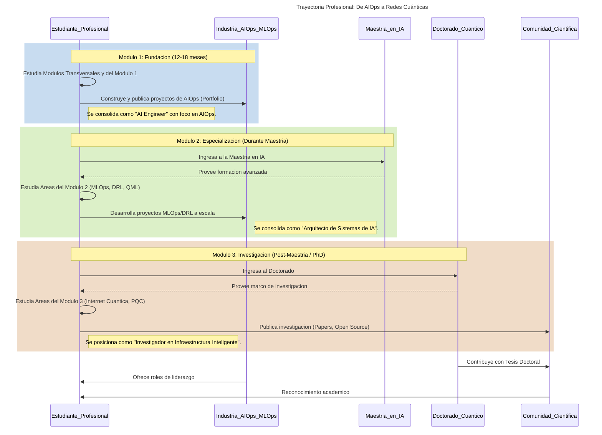

# Plan de Carrera y Guía de Estudio: De AIOps a Redes Cuánticas (Versión Mejorada con IA)

## Visión General

Este plan está diseñado para un profesional con una **base en Física y experiencia en Automatización de Redes**, que busca una trayectoria profesional dual:

*   **A corto plazo (2-3 años):** Consolidarse como un experto en **AIOps (IA para Operaciones de TI)**, cursando una Maestría en Inteligencia Artificial.
*   **A largo plazo (5+ años):** Realizar un Doctorado en Computación Cuántica para investigar y desarrollar la próxima generación de **Redes Cuánticas Inteligentes**.

El plan integra una profunda formación en **Inteligencia Artificial**, desarrollo de software full-stack, MLOps y ciberseguridad, reconociendo que tanto la infraestructura actual como la cuántica del futuro dependerán de sistemas de control y gestión autónomos y seguros.

## Diagrama de Secuencia de la Trayectoria

***

## Evaluación Estratégica y Puntos de Mejora

Este plan ha sido revisado para incorporar una evaluación estratégica que refuerza su visión y profundidad. Las adiciones clave se centran en tres áreas transversales para fortalecer el perfil de **"arquitecto de sistemas inteligentes inspirados en principios físicos"**.

*   **Visión Estratégica:** La ruta de AIOps a redes cuánticas es visionaria y coherente, conectando la ingeniería aplicada actual con la investigación de frontera.
*   **Profundidad Técnica:** El plan ya une de forma excepcional la infraestructura como código, la IA moderna y la física computacional. Las mejoras se enfocan en fortalecer la base matemática y las capacidades de computación a gran escala.
*   **Desarrollo Formativo:** Se añade un enfoque explícito en la investigación reproducible y la divulgación científica para posicionar el perfil tanto en el ámbito industrial (deep tech) como académico (investigación).

***

## Módulos Transversales (Habilidades Clave a Desarrollar en Paralelo)

### Área: Matemática Aplicada Avanzada
*   **Objetivo:** Fortalecer la base matemática para modelar y optimizar sistemas complejos en IA y física.
*   **Conceptos Clave:**
    *   **Optimización Convexa y No Convexa:** Fundamental para el entrenamiento de modelos de Deep Learning y problemas de control.
    *   **Cálculo de Variaciones:** Clave para la física teórica y el control óptimo.
    *   **Álgebra Tensorial y Cálculo Matricial Automático:** El lenguaje de la mecánica cuántica, las redes neuronales y el QML.
    *   **Estadística Bayesiana y Teoría de la Información:** Para modelar la incertidumbre, inferencia causal y entender los límites de la compresión y el aprendizaje.
*   **Recursos:**
    *   📚 **Libro:** "Convex Optimization" (Boyd & Vandenberghe)
    *   📚 **Libro:** "Information Theory, Inference, and Learning Algorithms" (David MacKay)

### Área: Computación de Alto Rendimiento (HPC)
*   **Objetivo:** Adquirir la capacidad de ejecutar simulaciones y entrenamientos a gran escala, un requisito para la física computacional y el Machine Learning avanzado.
*   **Conceptos Clave:**
    *   **Paralelismo a nivel de CPU/GPU:** **OpenMP** para memoria compartida, **MPI** para memoria distribuida, **CUDA** para programación de GPUs.
    *   **Frameworks de Paralelismo Modernos:** **Dask** y **Ray** para escalar flujos de trabajo de Python y ML.
*   **Recursos:**
    *   💻 **Curso:** "Introduction to Parallel Computing" (Blaise Barney, LLNL)
    *   🌐 **Documentación:** Oficial de CUDA, Ray y Dask.

### Área: Metodología de Investigación Reproducible
*   **Objetivo:** Adoptar un flujo de trabajo científico riguroso que garantice que los experimentos y resultados sean verificables, reproducibles y publicables.
*   **Conceptos Clave:**
    *   **Contenerización de Entornos:** Uso de **Docker** para encapsular dependencias y garantizar la reproducibilidad del entorno de ejecución.
    *   **Control de Versiones (Código, Datos y Modelos):** **Git** para el código, **DVC** para los datos, **MLflow** para el tracking de experimentos y versionado de modelos.
    *   **Notebooks como Experimentos:** Uso de **Jupyter Notebooks** o **JupyterLab** de forma estructurada para la exploración y presentación de resultados.
*   **Recursos:**
    *   🌐 **Tutorial:** "The Turing Way: A handbook for reproducible, ethical and collaborative research".

***

## Módulo 1: Ingeniero de IA y Físico Computacional (Duración: 10 Meses)

**Objetivo:** Construir un perfil de "AI Engineer" con especialización en AIOps y una sólida base en física computacional, preparado para la maestría.

### Área: Infraestructura como Código

*   **Conceptos Clave:**
    *   **Linux Avanzado:** Sistema de Archivos (FHS), gestión de procesos, redes (`ip`, `ss`, `iptables`/`nftables`), `cgroups` y `namespaces` (fundamentos de contenedores), scripting avanzado en Bash, `systemd`.
    *   **Networking (Cisco):** Modelo OSI vs. TCP/IP, Subnetting, VLANs, OSPF, BGP (básico), conceptos de RESTCONF/NETCONF.
    *   **Protocolos y Servicios:** DNS (`A`, `CNAME`, `MX`), DHCP, HTTP/2 & HTTP/3, `WireGuard` (VPN moderna).
*   **Recursos:**
    *   📚 **Libro:** "UNIX and Linux System Administration Handbook"
    *   💻 **Curso:** Cursos de "CCNA" en Cisco Networking Academy
    *   🌐 **Sitio Web:** Cisco DevNet

***

### Área: Desarrollo Full-Stack y Automatización

*   **Conceptos Clave:**
    *   **Python Backend:** APIs RESTful con **Django Rest Framework (DRF)** o **FastAPI**, **ORM** (Django ORM, `SQLAlchemy`), `pytest`, tareas asíncronas con **Celery**.
    *   **Frontend (Angular):** Componentes y servicios, **Angular Material**, `HttpClient`, programación reactiva con **RxJS**.
    *   **Automatización e IaC:** Playbooks de **Ansible**, sintaxis HCL de **Terraform**, creación de imágenes con **Packer**.
*   **Recursos:**
    *   📚 **Libro:** "Two Scoops of Django 3.x"
    *   🌐 **Documentación:** Oficial de DRF y Angular Material.
    *   💻 **Tutorial:** Guías de "GitHub Actions".

> **Nota de Simplificación y Enfoque:** Para acelerar y enfocarse en el "camino crítico" hacia AIOps, considera las siguientes simplificaciones:
> *   **Backend:** Prioriza **FastAPI** por su modernidad, simplicidad y alto rendimiento.
> *   **Frontend:** Considera **React** como una alternativa a Angular, ya que tiene una mayor demanda en el ecosistema de aplicaciones de ML.
> *   **IaC:** Difiere el aprendizaje de **Packer**. Concéntrate en Terraform y Ansible, que son más que suficientes para empezar.

***

### Área: Fundamentos de IA Avanzada

*   **Conceptos Clave:**
    *   **Deep Learning:**
        *   Arquitecturas: **Mecanismo de Atención**, Transformers, CNNs, RNNs, **Redes Generativas Adversariales (GANs)**.
        *   Paradigmas: Aprendizaje Supervisado, No Supervisado y **Auto-Supervisado**.
        *   Frameworks: **PyTorch**, **TensorFlow/Keras**, ecosistema de **Hugging Face** (`datasets`, `transformers`, `tokenizers`).
    *   **Procesamiento del Lenguaje Natural (NLP):**
        *   Modelos: Embeddings, LMs (BERT, GPT), **Sentence-BERT** para similaridad semántica.
        *   Aplicaciones: Análisis de logs, Q&A, **resumen de texto**, clasificación de intención.
    *   **Visión por Computadora (Computer Vision):**
        *   Tareas: Clasificación, detección de objetos, **seguimiento de objetos**, **segmentación semántica**.
        *   Técnicas: Transfer Learning, Data Augmentation.
*   **Recursos:**
    *   📚 **Libro:** "Deep Learning" (Goodfellow, Bengio, Courville)
    *   💻 **Curso:** "Deep Learning Specialization" por Andrew Ng (Coursera)
    *   💻 **Curso:** "CS231n: CNNs for Visual Recognition" (Stanford)
    *   💻 **Curso:** "CS224n: NLP with Deep Learning" (Stanford)

***

### Área: AIOps y Ciberseguridad Inteligente

*   **Conceptos Clave:**
    *   **Observabilidad y Monitoreo:** Stack de **Prometheus** y **Grafana**, **Elastic Stack** (ELK) para análisis de logs centralizado.
    *   **AIOps - Detección y Predicción:**
        *   Modelos: LSTMs, Autoencoders, **Redes Neuronales de Grafos (GNNs)** para análisis de dependencias.
        *   **Análisis de Causa Raíz (RCA):** Inferencia causal, grafos de dependencias.
        *   **IA Explicable (XAI):** SHAP, LIME, y su aplicación en la interpretación de alertas.
    *   **Seguridad de Red con IA:**
        *   Tácticas: **MITRE ATT&CK Framework**, análisis de logs con NLP, NTA con Deep Learning.
        *   Conceptos: SIEM, SOAR, **Aprendizaje Federado** para análisis de amenazas sin compartir datos sensibles.
*   **Recursos:**
    *   📚 **Libro:** "Hands-On Machine Learning for Cybersecurity"
    *   📚 **Libro:** "Interpretable Machine Learning" (Molnar)
    *   🌐 **Sitio Web:** OWASP Top Ten

***

### Área: Física Computacional

*   **Conceptos Clave:**
    *   **Métodos Numéricos:** **Métodos de Monte Carlo**, **Dinámica Molecular**, análisis con **Transformada de Fourier**, Álgebra Lineal Numérica (descomposición SVD, Eigenvalores).
    *   **Física Estadística:** Colectivo microcanónico/canónico, función de partición, Algoritmo de Metropolis-Hastings.
    *   **Mecánica Cuántica:** Notación Bra-Ket, producto tensorial, Ecuación de Schrödinger, simuladores cuánticos básicos.
*   **Recursos:**
    *   📚 **Libro:** "Statistical Mechanics: Algorithms and Computations"
    *   📚 **Libro:** "Introduction to Quantum Mechanics" (Griffiths)

***

### Área Transversal: Física Computacional Aplicada a la Ciencia de Redes

*   **Objetivo:** Utilizar los métodos de la física estadística y la computación para modelar, analizar y predecir el comportamiento de redes complejas (de comunicación, sociales, biológicas).
*   **Conceptos Clave:**
    *   **Modelos de Redes Complejas:** Generadores para Erdős-Rényi (ER), Watts-Strogatz (Pequeño Mundo), Barabási-Albert (Libres de Escala).
    *   **Procesos Dinámicos en Redes:** Modelos de epidemias (SI, SIS, SIR), percolación de nodos/enlaces, modelos de sincronización (Kuramoto), fallos en cascada.
    *   **Mecánica Estadística de Redes:** Entropía de grafos, transiciones de fase (ej. formación del componente gigante), criticalidad.
    *   **Teoría de Grafos Espectral:** Propiedades del Laplaciano del grafo, relación de autovalores con conectividad, particionamiento y difusión.
    *   **Detección de Comunidades:** Algoritmos basados en modularidad, uso de modelos de espines (ej. Hamiltoniano de Potts).
*   **Recursos:**
    *   📚 **Libro:** "Network Science" (Albert-László Barabási)
    *   📚 **Libro:** "Networks: An Introduction" (Mark Newman)
    *   💻 **Librerías:** `NetworkX` (Python), `igraph` (Python, R).

### Proyectos y Retos del Módulo 1

1.  **Plataforma de Monitoreo con Detección de Anomalías:** Extiende el proyecto de monitoreo. Implementa un servicio en Python con **PyTorch/TensorFlow** que consuma las métricas de red y entrene un modelo (ej. LSTM Autoencoder) para detectar anomalías en tiempo real. Visualiza las anomalías en el dashboard de **Angular**. (**Áreas:** Desarrollo Full-Stack, AIOps, Fundamentos de IA).
2.  **Sistema de Detección de Intrusiones con NLP (NIDS):** Enfócate en logs de sistema/firewall. Utiliza un modelo basado en **Transformers (ej. BERT)** para "entender" los logs normales y detectar actividades sospechosas o ataques multi-paso. (**Áreas:** Ciberseguridad Inteligente, Fundamentos de IA - NLP).
3.  **Simulación de Ruido en un Sistema de Qubits:** Implementa un modelo simple de decoherencia (ej. "bit-flip noise") que afecte a un sistema de 2 qubits. Visualiza cómo la fidelidad del estado cuántico decae con el tiempo. (**Área:** Física Computacional).
4.  **Firewall Dinámico Automatizado con Ansible:** Crea un playbook de Ansible que actualice reglas de `iptables` en un host Linux basándose en una lista de IPs maliciosas (simulando un feed de inteligencia de amenazas). El playbook debe ejecutarse periódicamente. (**Áreas:** Infraestructura como Código, Ciberseguridad Inteligente).
5.  **Dashboard de Topología de Red:** Desarrolla una app web (Angular/Django) que use `netmiko` o `scrapli` para obtener datos de la sandbox de Cisco y visualice la topología de red con una librería como `vis.js`. (**Áreas:** Desarrollo Full-Stack, Infraestructura como Código).
6.  **Chatbot Básico de Soporte de Red:** Con un framework como RASA o simplemente scikit-learn/PyTorch, crea un chatbot que responda a preguntas básicas de troubleshooting de red, entrenado con un pequeño documento de FAQs. (**Áreas:** Fundamentos de IA - NLP, Desarrollo Full-Stack).
7.  **Clasificador de Tráfico de Red con Deep Learning:** Usando un dataset público (ej. NSL-KDD), entrena un modelo de Deep Learning (CNN o MLP) en **PyTorch/TensorFlow** para clasificar diferentes tipos de tráfico de red (HTTP, FTP, ataque, etc.). (**Áreas:** Fundamentos de IA, Ciberseguridad Inteligente).
8.  **Simulador del Algoritmo de Metropolis-Hastings:** Implementa el algoritmo desde cero en Python para muestrear una distribución de probabilidad 2D. Visualiza el paseo aleatorio y compara la distribución resultante con la teórica. (**Área:** Física Computacional).
9.  **API de IA Explicable (XAI) para AIOps:** Crea un microservicio (Flask/FastAPI) que reciba un punto de datos y use **SHAP** o **LIME** para devolver una explicación de por qué el modelo del proyecto #1 lo marcó como anomalía. Consume esta API desde el frontend. (**Áreas:** AIOps, Desarrollo Full-Stack).
10. **Análisis de Sentimientos sobre Noticias de Ciberseguridad:** Crea un script que use una API de noticias (ej. NewsAPI) para obtener los últimos artículos sobre ciberseguridad y aplique un modelo de NLP para clasificar el sentimiento (positivo, negativo, neutral) de cada titular. (**Áreas:** Fundamentos de IA - NLP, Ciberseguridad Inteligente).
11. **Aprovisionamiento de un Honeypot con Terraform y Ansible:** Despliega una máquina virtual en un proveedor cloud con Terraform y configúrala con Ansible para que actúe como un honeypot (ej. Cowrie), registrando todos los intentos de acceso. (**Áreas:** Infraestructura como Código, Ciberseguridad Inteligente).
12. **API Asíncrona de Alto Rendimiento con FastAPI:** Desarrolla un microservicio con FastAPI que gestione tareas de larga duración (ej. scraping de datos de red) de forma asíncrona utilizando Celery y RabbitMQ, y que notifique al cliente a través de WebSockets. (**Área:** Desarrollo Full-Stack y Automatización).
13. **Generador de Configuraciones de Red con GANs:** Entrena una Red Generativa Adversarial (GAN) sobre un dataset de configuraciones de red válidas. Usa el generador para crear nuevas configuraciones sintéticas y realistas. (**Áreas:** Fundamentos de IA Avanzada, Automatización).
14. **Dashboard de Observabilidad con ELK Stack:** Configura un pipeline de ingesta de logs (Filebeat), almacenamiento y búsqueda (Elasticsearch) y visualización (Kibana) para centralizar y analizar logs de múltiples servicios y dispositivos de red. (**Áreas:** AIOps y Ciberseguridad Inteligente, Infraestructura como Código).
15. **Simulador de un Gas de Lennard-Jones:** Escribe un programa en Python que simule la dinámica molecular de un conjunto de partículas interactuando a través del potencial de Lennard-Jones. Calcula y visualiza propiedades termodinámicas como la temperatura y la presión. (**Área:** Física Computacional).
16. **Segmentación Semántica de Daños en Infraestructura:** Utiliza un modelo pre-entrenado (ej. U-Net) y haz fine-tuning sobre imágenes de infraestructura de red (postes, cables) para segmentar y detectar daños físicos. (**Áreas:** Fundamentos de IA - Computer Vision, AIOps).
17. **Buscador Semántico para Documentación Técnica:** Utiliza Sentence-BERT para convertir la documentación técnica de un proyecto (ej. RFCs, manuales de Cisco) en vectores. Crea una API que reciba una consulta en lenguaje natural y devuelva los párrafos más relevantes. (**Áreas:** Fundamentos de IA - NLP, Desarrollo Full-Stack).
18. **Análisis de Causa Raíz con Redes Neuronales de Grafos (GNNs):** Modela tu infraestructura como un grafo de dependencias. Entrena una GNN para predecir el impacto de la caída de un nodo (ej. un switch) en el resto de la red, identificando la causa más probable de una interrupción. (**Áreas:** AIOps, Fundamentos de IA Avanzada).
19. **Creación de un Paquete Python para Análisis de Series Temporales:** Desarrolla, documenta y publica en PyPI un pequeño paquete que implemente un par de técnicas de análisis de series temporales (ej. detección de estacionalidad, suavizado exponencial) para métricas de red. (**Área:** Desarrollo Full-Stack y Automatización).
20. **Sistema de Alertas de Seguridad Basado en MITRE ATT&CK:** Crea un conjunto de reglas en un motor de SIEM (o un script de Python) que correlacione eventos de logs de diferentes fuentes (firewall, sistema operativo) para detectar tácticas y técnicas del framework ATT&CK, como "movimiento lateral" o "exfiltración de datos". (**Área:** Ciberseguridad Inteligente).

***

#### Proyectos de Especialización: Física Aplicada a Redes

21. **Simulación de Propagación de Epidemias en Redes Libres de Escala:** Implementa un modelo de red libre de escala (Barabási-Albert) con `NetworkX`. Simula la propagación de un "virus" (ej. un exploit o malware) usando un modelo SIR (Susceptible-Infectado-Recuperado). Analiza y visualiza cómo la topología de la red, especialmente la presencia de hubs, acelera la propagación en comparación con una red aleatoria. (**Áreas:** Física Computacional Aplicada a Redes, Ciberseguridad Inteligente).
22. **Análisis de Robustez y Fallos en Cascada en Redes de Infraestructura:** Modela una red de routers de internet como un grafo. Simula dos escenarios: (1) eliminación de nodos al azar (fallos) y (2) eliminación de los nodos más conectados (ataques dirigidos). Mide la fragmentación de la red en cada caso. Extiende el modelo para simular una cascada de fallos, donde la caída de un nodo sobrecarga a sus vecinos. (**Áreas:** Física Computacional Aplicada a Redes, AIOps).
23. **Detección de Comunidades en Redes Sociales con el Hamiltoniano de Potts:** Toma un dataset de una red social (ej. de Stanford SNAP). Implementa un algoritmo de optimización, como Recocido Simulado (Simulated Annealing), para minimizar el Hamiltoniano de Potts en el grafo. Este método, análogo a los sistemas de espines en física, permite descubrir la estructura de comunidades de la red. Visualiza las comunidades encontradas. (**Áreas:** Física Computacional Aplicada a Redes, Fundamentos de IA).
24. **Estudio de Transiciones de Fase en Redes de Percolación:** Simula un proceso de percolación en una red 2D (una malla o "lattice"). Ocupa gradualmente los nodos con una probabilidad `p`. Identifica el valor crítico `pc` en el que aparece por primera vez un "componente gigante" que conecta un extremo de la red con el otro (una transición de fase). Compara el `pc` obtenido con el valor teórico. (**Áreas:** Física Computacional Aplicada a Redes).
25. **Idea de Tesis (Maestría/PhD): Control de Redes Complejas mediante DRL Guiado por Principios Físicos:**
    *   **Título Propuesta:** "Control Autónomo de Redes de Comunicación mediante Aprendizaje por Refuerzo Profundo Informado por la Mecánica Estadística de Procesos Dinámicos".
    *   **Descripción:** La tesis propondría un marco híbrido para controlar sistemas de red complejos (ej. enrutamiento de tráfico, contención de congestión). En lugar de usar DRL "caja negra", el agente de RL sería "informado" por un modelo físico subyacente de la red. Por ejemplo, la función de recompensa del agente podría incluir términos derivados de la entropía del grafo (para mantener la diversidad de rutas) o de la proximidad a una transición de fase crítica (para evitar un colapso en cascada). El objetivo es crear un sistema de control que no solo sea reactivo, sino que entienda la "física" de la red para anticipar y prevenir fallos sistémicos, haciéndolo más robusto y eficiente que los enfoques puramente basados en datos. (**Áreas:** Física Computacional Aplicada a Redes, DRL, AIOps, Tesis en IA).

***

## Módulo 2: Arquitecto de Sistemas de IA (Durante la Maestría)

**Objetivo:** Diseñar, construir y desplegar sistemas de IA complejos, seguros y escalables, aplicando principios de MLOps y preparando el terreno para la investigación en QML.

### Área: Ingeniería de IA a Escala (MLOps)

*   **Conceptos Clave:**
    *   **Gestión del Ciclo de Vida de ML:** Versionado de datos (**DVC**), tracking de experimentos (**MLflow**), **Feature Stores** (**Feast**).
    *   **Contenerización y Orquestación:** **Docker**, **Kubernetes**, **Kustomize** para gestión de configuraciones.
    *   **Pipelines de CI/CD para ML (GitOps):** **GitHub Actions**, **Kubeflow**, **ArgoCD** para despliegue continuo.
    *   **Servicio y Monitoreo de Modelos:** **NVIDIA Triton Inference Server**, **KServe**, detección de "model/data drift".
*   **Recursos:**
    *   📚 **Libro:** "Designing Machine Learning Systems" (Chip Huyen)
    *   💻 **Curso:** "Machine Learning Engineering for Production (MLOps) Specialization" (Coursera)
    *   🌐 **Documentación:** Oficial de Kubeflow y MLflow.

***

### Área: Sistemas Distribuidos y Aprendizaje por Refuerzo Profundo (DRL)

*   **Conceptos Clave:**
    *   **Arquitecturas de Microservicios:** **Service Mesh** (Istio, Linkerd), **Arquitecturas Orientadas a Eventos** (Kafka, RabbitMQ), Tracing Distribuido (**OpenTelemetry**).
    *   **DRL Avanzado:**
        *   Paradigmas: **Aprendizaje por Refuerzo Multi-Agente (MARL)**, **Offline Reinforcement Learning**.
        *   Algoritmos: Q-Learning, PPO/A2C, SAC.
        *   Aplicaciones: Optimización de enrutamiento, control de congestión, ciberseguridad activa.
*   **Recursos:**
    *   📚 **Libro:** "Reinforcement Learning: An Introduction" (Sutton & Barto)
    *   📚 **Libro:** "Designing Data-Intensive Applications" (Kleppmann)

***

### Área: Tesis en IA y Sistemas Híbridos Clásico-Cuánticos

*   **Conceptos Clave:**
    *   **Quantum Machine Learning (QML):**
        *   Algoritmos: VQC, QSVM, **Redes Generativas Adversariales Cuánticas (QGANs)**.
        *   Optimización: **Descenso de Gradiente Natural Cuántico**, optimizadores clásicos.
        *   Simulación: **Métodos de Redes Tensoriales** (MPS, PEPS).
    *   **Computación Cuántica en la era NISQ (Noisy Intermediate-Scale Quantum):**
        *   Hardware: Qubits superconductores, iones atrapados.
        *   **Mitigación de Errores Cuánticos:** Zero-noise extrapolation, corrección de errores básicos.
        *   **Programación Cuántica Diferenciable:** Integración de circuitos como capas en redes de PyTorch/TensorFlow.
*   **Recursos:**
    *   💻 **Plataforma:** **PennyLane** Demos (clave para QML y programación diferenciable).
    *   📖 **Review Article:** Busca "Quantum Optimal Control" y "Variational Quantum Algorithms" en arXiv.org.

***

### Proyectos y Retos del Módulo 2

1.  **Orquestador de Red Auto-Sanable con DRL y MLOps:** Empaqueta el agente de DRL con **Docker** y crea un pipeline de **CI/CD con GitHub Actions y Kubernetes (usando Kind/Minikube)** que lo despliegue como un microservicio. El agente debe exponer una API para recibir el estado de la red y devolver acciones. (**Áreas:** MLOps, DRL).
2.  **QML para Clasificación de Datos de Red:** Utiliza **PennyLane** para implementar un Circuito Cuántico Variacional (VQC) que clasifique un subconjunto de datos de tráfico de red (ej. distinguir entre dos tipos de tráfico). Compara su rendimiento con un clasificador clásico. (**Áreas:** Tesis en IA y Sistemas Híbridos, DRL).
3.  **Propuesta de Tesis (Control Cuántico):** Diseña un sistema de **control óptimo basado en DRL** para mejorar la fidelidad de una compuerta de 2 qubits en un procesador cuántico simulado, considerando el ruido. (**Áreas:** Tesis en IA y Sistemas Híbridos, DRL).
4.  **Pipeline de CI/CD para el Chatbot:** Toma el chatbot del Módulo 1. Crea un pipeline con **GitHub Actions y MLflow** que automáticamente re-entrene, versione y despliegue el modelo cuando el dataset de FAQs cambie. (**Área:** MLOps).
5.  **Descomposición a Microservicios con gRPC:** Descompón el backend de Django del Módulo 1 en microservicios más pequeños (ej. `device-poller`, `user-auth`). Haz que se comuniquen internamente con **gRPC** y expón una API Gateway unificada al frontend. (**Área:** Sistemas Distribuidos).
6.  **Agente de DRL para Control de Congestión:** En un entorno de simulación de red simple (ej. `gym-network`), entrena un agente de DRL (**PPO** o **SAC**) para que aprenda un algoritmo de control de congestión, optimizando throughput y minimizando latencia. (**Área:** DRL).
7.  **Despliegue de un Modelo de Visión en Kubernetes:** Toma un modelo pre-entrenado (ej. ResNet50), crea un servicio de inferencia con FastAPI, empaquétalo con **Docker** y despliégalo en un clúster de **Kubernetes** local. Realiza un test de carga simple. (**Área:** MLOps).
8.  **Optimización con Programación Cuántica Diferenciable:** Resuelve un problema de optimización simple (ej. Max-Cut en un grafo pequeño) usando un VQC. Define el Hamiltoniano del problema y usa gradient descent para entrenar los parámetros del circuito y encontrar la solución. (**Área:** Tesis en IA y Sistemas Híbridos).
9.  **Monitoreo de "Model Drift" para el Detector de Anomalías:** Implementa un script que se ejecute periódicamente, compare la distribución estadística de los datos de red en vivo con la de los datos de entrenamiento y lance una alerta si detecta un "drift" significativo. (**Área:** MLOps).
10. **Implementación de un Kernel Cuántico (QSVM):** Usa **Qiskit** o **PennyLane** para implementar el algoritmo QSVM. Usa el kernel cuántico para clasificar un dataset no linealmente separable (ej. `make_moons` de scikit-learn) y compara el resultado con un SVM clásico. (**Área:** Tesis en IA y Sistemas Híbridos).
11. **Despliegue de un Feature Store Centralizado:** Implementa un Feature Store con **Feast**. Define, registra y sirve features (ej. métricas de red promediadas) para que puedan ser consumidas de forma consistente por diferentes modelos durante el entrenamiento y la inferencia. (**Área:** Ingeniería de IA a Escala (MLOps)).
12. **Orquestación de Microservicios con Istio Service Mesh:** Despliega varios microservicios en Kubernetes e instala Istio para gestionar el tráfico. Implementa patrones avanzados como A/B testing para un modelo de IA, y visualiza la topología y las métricas con Kiali. (**Área:** Sistemas Distribuidos).
13. **Pipeline de GitOps para Modelos de ML con ArgoCD:** Crea un repositorio de Git para las configuraciones de despliegue de un modelo (ej. los YAML de Kubernetes). Configura ArgoCD para que observe este repositorio y sincronice automáticamente los cambios en el clúster, implementando un flujo de GitOps completo. (**Área:** Ingeniería de IA a Escala (MLOps)).
14. **Simulación de Coordinación de Agentes con MARL:** Desarrolla un entorno simple (ej. con PettingZoo) donde múltiples agentes de DRL deban coordinarse para una tarea, como balancear la carga entre varios servidores de red. (**Área:** Sistemas Distribuidos y DRL).
15. **Generador de Estados Cuánticos con QGANs:** Implementa una Red Generativa Adversarial Cuántica en **PennyLane** o **Qiskit** para aprender y generar una distribución de estados cuánticos simples (ej. estados de Bell). (**Área:** Tesis en IA y Sistemas Híbridos).
16. **Servicio de Inferencia de Alto Rendimiento con Triton:** Empaqueta varios modelos (ej. un clasificador de tráfico de red y un detector de objetos) y sírvelos simultáneamente usando **NVIDIA Triton Inference Server**. Mide la latencia y el throughput bajo carga. (**Área:** Ingeniería de IA a Escala (MLOps)).
17. **Pipeline de Detección de Anomalías en Streaming con Kafka:** Desarrolla un sistema donde las métricas de red se publican en un topic de Kafka. Un consumidor procesa estos eventos en tiempo real, aplica un modelo de detección de anomalías y dispara alertas si es necesario. (**Área:** Sistemas Distribuidos).
18. **Aplicación de Mitigación de Errores en un Algoritmo Cuántico:** Ejecuta un VQC en un simulador con ruido y en hardware cuántico real (ej. a través de IBMQ). Implementa una técnica como "Zero-Noise Extrapolation" para mejorar la precisión de los resultados. (**Área:** Tesis en IA y Sistemas Híbridos).
19. **Entrenamiento de un Agente a partir de Logs con Offline RL:** Recolecta un dataset de logs de interacciones de un sistema existente (ej. un firewall manual). Utiliza un algoritmo de Offline RL (como CQL) para entrenar una política de automatización sin necesidad de interactuar directamente con el entorno en vivo. (**Área:** Sistemas Distribuidos y DRL).
20. **Observabilidad de un Sistema Distribuido con OpenTelemetry:** Instrumenta una aplicación de microservicios con **OpenTelemetry** para generar trazas, métricas y logs. Envía los datos a un backend como Jaeger o Prometheus y analiza el comportamiento de una petición a través de todo el sistema. (**Área:** Sistemas Distribuidos).

***

## Módulo 3: Investigador en Infraestructura Inteligente (Post-Maestría)

**Objetivo:** Liderar la investigación en la intersección de la IA, las redes clásicas y las redes cuánticas.

### Área: Arquitectura y Control Inteligente de la Internet Cuántica

*   **Conceptos Clave:**
    *   **Protocolos y Arquitecturas:** Pila de protocolos de red cuántica, **Computación Cuántica Distribuida**, **Blind Quantum Computing**, **Quantum Network Coding**.
    *   **Componentes Físicos:** Repetidores Cuánticos, Memorias Cuánticas, Transductores.
    *   **Gestión Inteligente con IA:**
        *   **Enrutamiento de Entrelazamiento:** DRL para optimización de rutas.
        *   **Asignación de Recursos:** Planificación y scheduling para memorias y repetidores.
*   **Recursos:**
    *   📖 **Review Article:** "Quantum internet: A vision for the road ahead" (Science, 2018)
    *   🌐 **Grupo de Investigación:** Publicaciones de QuTech (Delft) y Chicago Quantum Exchange (CQE).

***

### Área: Fronteras de la IA y la Computación

*   **Conceptos Clave:**
    *   **Modelos de IA Avanzados:** **IA Generativa** (Transformers, LLaMA), **Modelos Multimodales**, **World Models**.
    *   **Paradigmas de Razonamiento:** **IA Neuro-Simbólica**, **Inferencia Causal** y su intersección con ML.
    *   **Impacto y Gobernanza:** **IA para la Ciencia** (descubrimiento de fármacos/materiales), Ética y Gobernanza de la IA, sesgos y equidad.
*   **Recursos:**
    *   🌐 **Blogs:** OpenAI, DeepMind, AI2.
    *   📖 **Paper Clave:** "On the Dangers of Stochastic Parrots" (Bender et al.)
    *   📚 **Libro:** "The Alignment Problem" (Brian Christian)

***

### Área: Seguridad en la Era Post-Cuántica y de la IA

*   **Conceptos Clave:**
    *   **Criptografía Cuántica y Post-Cuántica (PQC):** Familias de PQC (retículos, códigos), **Cifrado Homomórfico**.
    *   **Privacidad y Robustez:** **Privacidad Diferencial**, **Adversarial Machine Learning** (ataques y defensas).
    *   **Seguridad y Verificación:** **IA para descubrimiento de vulnerabilidades**, **Verificación Formal** de sistemas de IA, seguridad física de sistemas cuánticos.
*   **Recursos:**
    *   🌐 **Sitio Web:** NIST Post-Quantum Cryptography Project.
    *   🌐 **Sitio Web:** "Adversarial Machine Learning Threat Matrix" (MITRE ATLAS).

***

### Proyectos y Retos del Módulo 3

1.  **Diseño de un Protocolo de Enrutamiento de Entrelazamiento con DRL:** Redacta un borrador de RFC para un protocolo que use un agente de DRL para tomar decisiones de enrutamiento dinámicas en una red cuántica simulada. (**Área:** Arquitectura y Control Inteligente de la Internet Cuántica).
2.  **Análisis de Ataques Adversariales a un Sistema AIOps:** Investiga y simula cómo un atacante podría "engañar" a los modelos de detección de anomalías (del Módulo 1) con ataques de evasión sutiles. Propón contramedidas. (**Área:** Seguridad en la Era Post-Cuántica y de la IA).
3.  **Propuesta de PhD:** Redacta tu propuesta final, combinando DRL para la optimización del plano cuántico, AIOps para la monitorización del plano de control clásico, y defensas contra ataques tanto clásicos (adversariales) como cuánticos. (**Áreas:** Todas).
4.  **Fine-Tuning de un LLM para Generar Configuraciones de Red:** Haz fine-tuning de un LLM open-source (ej. LLaMA 2 7B) sobre un dataset de configuraciones de Cisco/Juniper. El objetivo es generar configuraciones válidas a partir de prompts en lenguaje natural (ej. "configura OSPF en la interfaz Gig0/1"). (**Área:** Fronteras de la IA y la Computación).
5.  **Simulación de QKD con Seguridad Post-Cuántica:** Implementa una simulación del protocolo BB84 donde la comunicación clásica para el "sifting" y la corrección de errores esté protegida usando un algoritmo PQC como **CRYSTALS-Kyber**. (**Área:** Seguridad en la Era Post-Cuántica y de la IA).
6.  **Generador de "Honey-logs" con IA Generativa:** Entrena un modelo generativo (ej. un VAE o un GAN simple) sobre logs de sistema normales. Usa el modelo para generar logs falsos pero realistas ("honey-logs") para detectar intrusos. (**Áreas:** Fronteras de la IA, Seguridad).
7.  **Análisis de Sesgos y Equidad en Modelos de IA:** Entrena un modelo simple para una tarea sensible (ej. predicción de reincidencia). Usa una librería como **Fairlearn** para medir sesgos demográficos y aplica técnicas de mitigación. Escribe un informe sobre los resultados y las implicaciones éticas. (**Área:** Fronteras de la IA y la Computación).
8.  **Sistema Híbrido Neuro-Simbólico para Troubleshooting:** Crea una base de conocimiento lógica (un grafo) de problemas de red. Usa un modelo de NLP para interpretar la descripción de un problema por un usuario y un razonador lógico para navegar el grafo y sugerir una solución. (**Área:** Fronteras de la IA y la Computación).
9.  **Defensa contra Ataques Adversariales (Adversarial Training):** Toma un modelo de clasificación (ej. el de tráfico de red del Módulo 1). Usa una librería como **ART (Adversarial Robustness Toolbox)** para generar ejemplos adversariales y re-entrena el modelo con ellos para aumentar su robustez. (**Área:** Seguridad en la Era Post-Cuántica y de la IA).
10. **White Paper sobre Gobernanza de IA en Redes Autónomas:** Escribe un artículo de investigación (5-10 páginas) discutiendo los retos de gobernanza para redes gestionadas por IA. Cubre temas como la rendición de cuentas (accountability), la transparencia y el potencial de fallos en cascada. (**Área:** Fronteras de la IA y la Computación).
11. **Simulador de un Protocolo de Blind Quantum Computing:** Implementa una simulación de un protocolo simple de computación cuántica ciega, donde un cliente con capacidades cuánticas limitadas delega una computación a un servidor cuántico sin revelar su input, output o el algoritmo. (**Áreas:** Arquitectura y Control Inteligente de la Internet Cuántica, Seguridad).
12. **Investigación sobre Inferencia Causal en AIOps:** Utiliza librerías como `CausalML` o `DoWhy` para analizar datos de incidentes de red. Ve más allá de la correlación para construir un modelo causal que identifique las verdaderas causas raíz de las interrupciones. (**Áreas:** Fronteras de la IA, AIOps).
13. **Inferencia Privada con Cifrado Homomórfico:** Entrena un modelo de ML simple. Luego, implementa un servicio donde un cliente pueda enviar sus datos cifrados (usando una librería como TenSEAL), el servidor realice la inferencia sobre los datos cifrados y devuelva un resultado cifrado, garantizando la privacidad. (**Área:** Seguridad en la Era Post-Cuántica y de la IA).
14. **Fine-Tuning de un Modelo Multimodal para Describir Topologías de Red:** Haz fine-tuning de un modelo visual-lingüístico (como LLaVA) con un dataset de imágenes de topologías de red y sus descripciones. El objetivo es que el modelo pueda generar una descripción textual a partir de una imagen de topología. (**Área:** Fronteras de la IA y la Computación).
15. **Diseño de un Algoritmo de Quantum Network Coding:** Investiga y diseña (a nivel teórico o en simulación) un protocolo de codificación de red para un repetidor cuántico que mejore el throughput de distribución de entrelazamiento en una red con múltiples flujos de datos. (**Área:** Arquitectura y Control Inteligente de la Internet Cuántica).
16. **Uso de LLMs para Descubrimiento de Vulnerabilidades en Código de Red:** Utiliza un LLM para analizar código fuente de proyectos de red de código abierto en busca de posibles vulnerabilidades de seguridad, aplicando técnicas de prompt engineering para guiar la búsqueda. (**Áreas:** Seguridad en la Era Post-Cuántica y de la IA, Fronteras de la IA).
17. **Desarrollo de un World Model para un Entorno de Red Simulado:** Entrena un modelo generativo que aprenda la dinámica de un entorno de red simulado. Usa este "World Model" para que un agente de DRL pueda planificar y "entrenar en el sueño", mejorando drásticamente la eficiencia del aprendizaje. (**Área:** Fronteras de la IA y la Computación).
18. **Análisis Formal de un Protocolo de Red con Herramientas Asistidas:** Utiliza un asistente de pruebas como TLA+ o Coq para modelar un protocolo de red simple (ej. un protocolo de consenso) y verificar formalmente sus propiedades de seguridad y corrección. (**Área:** Seguridad en la Era Post-Cuántica y de la IA).
19. **Propuesta de un Protocolo de Scheduling para Repetidores Cuánticos:** Diseña y simula un algoritmo que gestione las memorias cuánticas y los intentos de entrelazamiento en un repetidor cuántico para maximizar la fidelidad y el ratio de éxito, considerando múltiples usuarios y prioridades. (**Área:** Arquitectura y Control Inteligente de la Internet Cuántica).
20. **Estudio Comparativo de Algoritmos PQC en Dispositivos de Borde:** Implementa y mide el rendimiento (latencia, uso de memoria) de varios algoritmos candidatos de PQC (ej. Kyber, Dilithium) en un dispositivo con recursos limitados como un Raspberry Pi, para evaluar su viabilidad en escenarios de IoT. (**Área:** Seguridad en la Era Post-Cuántica y de la IA). y los intentos de entrelazamiento en un repetidor cuántico para maximizar la fidelidad y el ratio de éxito, considerando múltiples usuarios y prioridades. (**Área:** Arquitectura y Control Inteligente de la Internet Cuántica).
20. **Estudio Comparativo de Algoritmos PQC en Dispositivos de Borde:** Implementa y mide el rendimiento (latencia, uso de memoria) de varios algoritmos candidatos de PQC (ej. Kyber, Dilithium) en un dispositivo con recursos limitados como un Raspberry Pi, para evaluar su viabilidad en escenarios de IoT. (**Área:** Seguridad en la Era Post-Cuántica y de la IA).